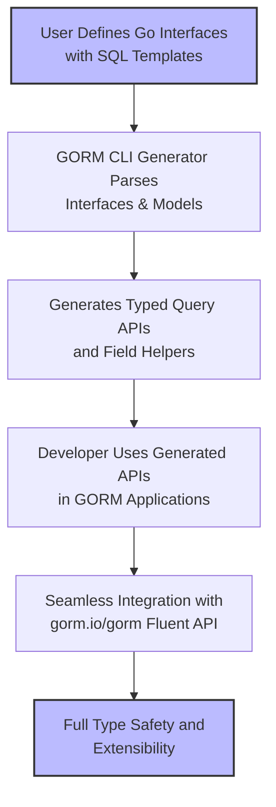

# Integration with GORM Workflows

This guide elaborates on how the APIs generated by GORM CLI integrate naturally and fluently into existing GORM data access patterns. It explains how generated interfaces and field helpers use idiomatic `gorm.io/gorm` constructs, how developers can seamlessly swap or extend code using the GORM CLI command-line, and what to expect from generated API signatures.

---

## Why Integration Matters

GORM CLI is designed to augment your GORM data layer, not replace it. The generated code fits organically into the familiar GORM idioms, enabling you to write queries and data operations that are both type-safe and expressive without sacrificing flexibility.

- **Maintain Your Developer Experience:** Use the fluent GORM API style while gaining compile-time type safety.
- **Extendability:** Easily replace hand-written queries with generated ones, or extend generated code with your custom logic.
- **Consistency:** Generated APIs leverage the same `gorm.io/gorm` query builder and context passing idioms you are already accustomed to.


## How Generated APIs Align with GORM Patterns

### Core Concept: The `gorm.G[T](db)` Primitive

At the heart of generated code lies the generic query builder:

```go
func Query[T any](db *gorm.DB, opts ...clause.Expression) QueryInterface[T]
```

- This returns a specialized interface to query or mutate your models of type `T`.
- It wraps the standard `*gorm.DB` instance, preserving chaining, context passing, and query building semantics.

### Example:

```go
userQuery := generated.Query[User](db)
user, err := userQuery.GetByID(ctx, 123)
```

Here, `GetByID` is a generated method based on an interface you defined with an SQL template, ensuring type safety and clear parameter binding.

### Integration with Standard `gorm.DB` Methods

Generated types embed or wrap `gorm.Interface[T]` allowing direct access to common GORM query methods:

```go
users, err := generated.Query[User](db).
    Where(generated.User.Age.Gt(18)).
    Find(ctx)
```

- You can still use filtering, `Where`, `Select`, `Order`, `Preload`, and other GORM features.
- The generated `User` struct offers typed and compile-time safe field helpers for predicates and setters.


## Generated API Signatures and Idioms

### Method Signatures

Generated query methods:

- Always include a `context.Context` parameter (auto-injected if missing).
- Return either results directly and an error, or fluent interfaces when chaining conditions.

Example:

```go
GetByID(ctx context.Context, id int) (User, error)
FilterByNameAndAge(ctx context.Context, name string, age int) QueryInterface[User]
UpdateUser(ctx context.Context, user User, id int) error
```

### Usage Notes

- Methods that query data return structs or slices with error.
- Methods that add conditions return the interface for chaining.
- Update and create methods support `Set(...)` usage, compatible with generated field helpers.


## Extending and Swapping Generated APIs Using GORM CLI

### Generation Command

The generation is performed via the CLI tool with commands like:

```bash
gorm gen -i ./path/to/interfaces -o ./generated
```

- `-i` points to your source interfaces annotated with SQL templates.
- `-o` specifies the output path for generated files.

This setup allows you to regenerate and override query interfaces without manual rewriting.

### Swapping Hand-Written Code

- Replace custom DAO methods with generated, type-safe methods:
  - Copy the interface definition.
  - Generate fresh implementation.
  - Update call sites to use generated APIs seamlessly.

### Extending Functionality

- You can add new methods to your query interfaces with SQL templates in Go comments.
- Regenerate to produce updated APIs.
- Combine generated interfaces with standard `gorm.DB` for advanced scenarios.


## Leveraging `gorm.io/gorm` Idioms in Generated Code

The generator emits code that directly calls or wraps `gorm.DB` methods:

- **Chaining:** Continues to return fluent interfaces for easy chaining.
- **Setters:** Generated fields provide `Set()`, `Incr()`, and expression setters compatible with `gorm.DB` updates.
- **Associations:** Provides helpers (`Create`, `Update`, `Unlink`, `Delete`, `CreateInBatch`) that mirror native GORM association semantics.

Example:

```go
gorm.G[User](db).
  Where(generated.User.Name.Eq("alice")).
  Set(
    generated.User.Age.Incr(1),
  ).
  Update(ctx)
```

This matches existing GORM patterns while being more type-safe and discoverable.


## Practical Tips

- **Use Context Everywhere:** Generated methods enforce `context.Context` in signatures to support cancellation and deadlines.
- **Combine Generated and Native GORM Queries:** You can use the typed fields for predicates together with hand-written clauses.
- **Leverage Batch Operations for Associations:** Use generated helpers like `CreateInBatch` for efficient inserts.
- **Keep Interface Definitions Organized:** Modifying or adding interface methods is the most sustainable way to extend functionality.


## Common Pitfalls and Troubleshooting

<AccordionGroup title="Common Integration Pitfalls and How to Avoid Them">
<Accordion title="Missing Context in Method Signatures">
Generated methods automatically add `context.Context` if omitted in interfaces. Calling methods without context will result in compilation errors. Always use a valid `ctx`.
</Accordion>
<Accordion title="Incorrect Output Directory or Package Imports">
Make sure your `-o` output path matches your Go module structure to avoid import path conflicts.
</Accordion>
<Accordion title="Mixing Manual and Generated Code Unsafely">
Avoid making manual edits directly to generated files. Instead, extend via interface changes and regeneration.
</Accordion>
</AccordionGroup>


## How This Fits Into the Overall Workflow

This guide complements the following foundational steps:

- **Defining Models and Query Interfaces:** Write your Go structs and SQL-templated interfaces.
- **Configuring Generation:** Use `genconfig.Config` to customize output, mappings, and filters.
- **Generating Code:** Use the CLI `gorm gen` command.
- **Using Generated APIs:** Integrate generated query methods and field helpers in your app.

Refer to the [Using the Generated APIs in Your Application guide](/guides/core-workflows/using-generated-apis) for detailed code consumption examples.


## Summary Diagram




## Further Reading and References

- [Using the Generated APIs in Your Application](/guides/core-workflows/using-generated-apis)
- [Field Helpers and Association Semantics](/gorm-cli-concepts/type-safety-data-models/field-helpers-and-associations)
- [Customizing Code Generation with genconfig](/guides/advanced-usage/customizing-generation)
- [Writing and Using SQL Templates](/guides/advanced-usage/template-dsl-guide)

These resources offer deeper insights on how to write interfaces, manage associations, customize output, and write SQL templates.

---

<Check>
By adhering to these integration principles, you will achieve a robust, type-safe, and idiomatic GORM experience augmented by the GORM CLI-generated code.
</Check>

---

## Example Integration Code Snippet

```go
// Obtain a query interface for User
userQuery := generated.Query[User](db)

// Fetch user by ID
user, err := userQuery.GetByID(ctx, 42)
if err != nil {
    log.Fatalf("Failed to get user: %v", err)
}

// Update user's pets by unlinking one named "fido"
err = gorm.G[User](db).
    Where(generated.User.ID.Eq(user.ID)).
    Set(generated.User.Pets.Where(generated.Pet.Name.Eq("fido")).Unlink()).
    Update(ctx)

if err != nil {
    log.Fatalf("Failed to update pets: %v", err)
}

// Query users with age greater than 30
users, err := generated.Query[User](db).
    Where(generated.User.Age.Gt(30)).
    Find(ctx)

if err != nil {
    log.Fatalf("Query failed: %v", err)
}

fmt.Printf("Found %d users over 30\n", len(users))
```

This snippet demonstrates how to obtain the generated query interface, retrieve data, update associations, and execute filtered queries all using GORM CLI generated, idiomatic GORM APIs.
