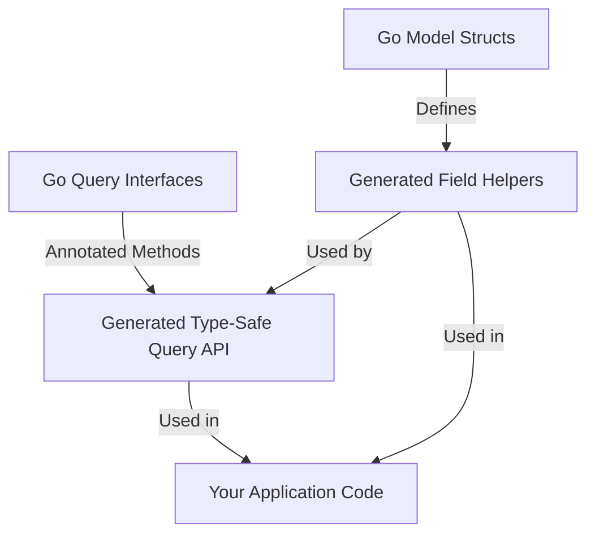

# Models and Query Interfaces

Discover the dual foundation of GORM CLI: Go structs as data models and Go interfaces enriched with SQL templates as queries. Learn how these abstractions empower type safety, code discovery, and compile-time guarantees in your database layer. This guide explains how source code maps to the generated API layers, enabling you to maximize productivity and reliability.

---

## Introduction

GORM CLI's code generation hinges on two core abstractions:

- **Models**: Go `struct` types that represent your data schema, annotated with GORM tags and enriched with additional generator hints.
- **Query Interfaces**: Go interfaces that define methods annotated with SQL templates, enabling type-safe, templated queries.

Together, they create a robust, discoverable, and type-safe API surface that minimizes runtime errors and accelerates database operations.

## 1. Data Models: Go Structs as the Schema Foundation

### What Are Models?

Your Go structs, defined with conventional GORM conventions and tags, serve as the source of truth for your data schema. Each struct field represents a database column or an association, including complex relations such as `has one`, `has many`, `belongs to`, and `many to many`.

### Example: Comprehensive User Model

```go
package models

import (
  "database/sql"
  "time"

  "gorm.io/gorm"
)

// User model with varied associations
// - Has one Account
// - Has many Pets
// - Has many polymorphic Toys
// - Belongs to Company and Manager
// - Has many team members
// - Many-to-many Languages and Friends
// - Additional JSON mapped Profile
//
type User struct {
  gorm.Model
  Name      string
  Age       int
  Birthday  *time.Time
  Score     sql.NullInt64
  LastLogin sql.NullTime
  Account   Account         // Has one
  Pets      []*Pet          // Has many
  Toys      []Toy           `gorm:"polymorphic:Owner"` // Polymorphic has many
  CompanyID *int
  Company   Company         // Belongs to
  ManagerID *uint
  Manager   *User           // Belongs to (self-referencing)
  Team      []User          `gorm:"foreignkey:ManagerID"` // Has many in single table
  Languages []Language      `gorm:"many2many:UserSpeak"` // Many-to-many
  Friends   []*User         `gorm:"many2many:user_friends"` // Many-to-many single table
  Role      string
  IsAdult   bool            `gorm:"column:is_adult"`
  Profile   string          `gen:"json"` // Uses custom JSON field helper
}

// Supporting models

type Account struct {
  gorm.Model
  UserID       sql.NullInt64
  Number       string
  RewardPoints sql.NullInt64
  LastUsedAt   sql.NullTime
}

type Pet struct {
  gorm.Model
  UserID *uint
  Name   string
  Toy    Toy `gorm:"polymorphic:Owner;"`
}

type Toy struct {
  gorm.Model
  Name      string
  OwnerID   uint
  OwnerType string
}

type Company struct {
  ID   int
  Name string
}

type Language struct {
  Code string `gorm:"primarykey"`
  Name string
}
```

### Associations and Their Impact

Each association defines how related rows connect, influencing how field helpers and association operations are generated:

| Association Type   | Description                                     | Effect on Generated API                 |
|--------------------|------------------------------------------------|---------------------------------------|
| `has one`          | One related record linked by foreign key       | Single struct field helper            |
| `has many`         | Multiple related records                        | Slice of pointers or structs          |
| `belongs to`       | Parent record linked by foreign key            | Single pointer to parent model        |
| `many2many`        | Join table for many-to-many relation            | Specialized slice with association helpers |
| Polymorphic (`polymorphic` tag) | Relations using owner type and ID for polymorphism | Polymorphic association helpers         |

### Field Tags and Metadata

- GORM tags (e.g., `gorm:"column:is_adult"`) define database column names or behaviors.
- Generator tags (e.g., `gen:"json"`) map fields to custom helpers, enabling extended functionality such as JSON query support.

### Benefits for Users

- These structs serve as the definitive schema,
- Provide compile-time type safety in generated code,
- Enable rich, fluent, and discoverable APIs for querying and updating data.

---

## 2. Query Interfaces: Go Interfaces with SQL Templates

### Purpose

Query Interfaces define how you want to query your database in a type-safe and declarative manner. Methods in these interfaces are annotated via comments that contain raw SQL or special template directives, making queries dynamic, composable, and strongly typed.

### Example Interface

```go
package examples

import (
  "time"
  "gorm.io/cli/gorm/examples/models"
)

type Query[T any] interface {
  // SELECT * FROM @@table WHERE id=@id
  GetByID(id int) (T, error)

  // SELECT * FROM @@table WHERE @@column=@value
  FilterWithColumn(column string, value string) (T, error)

  // SELECT * FROM users
  // {{if user.ID > 0}}
  //   WHERE id=@user.ID
  // {{else if user.Name != ""}}
  //   WHERE name=@user.Name
  // {{end}}
  QueryWith(user models.User) (T, error)

  // UPDATE @@table
  //  {{set}}
  //    {{if user.Name != ""}} name=@user.Name, {{end}}
  //    {{if user.Age > 0}} age=@user.Age, {{end}}
  //    {{if user.Age >= 18}} is_adult=1 {{else}} is_adult=0 {{end}}
  //  {{end}}
  // WHERE id=@id
  UpdateInfo(user models.User, id int) error

  // Filter users with compound conditions
  // {{where}}
  //   {{for _, user := range users}}
  //     {{if user.Name != "" && user.Age > 0}}
  //       (name = @user.Name AND age=@user.Age AND role LIKE concat("%",@user.Role,"%")) OR
  //     {{end}}
  //   {{end}}
  // {{end}}
  Filter(users []models.User) ([]T, error)

  // Simple where condition
  FilterByNameAndAge(name string, age int)

  // Date range filtering
  // {{where}}
  //   {{if !start.IsZero()}}
  //     created_at > @start
  //   {{end}}
  //   {{if !end.IsZero()}}
  //     AND created_at < @end
  //   {{end}}
  // {{end}}
  FilterWithTime(start, end time.Time) ([]T, error)
}
```

### How SQL Templates Work

- SQL is embedded in the method comment using directives:
  - `@@table` substitutes the database table name from the target model.
  - `@@column` enables dynamic column name binding.
  - `@param` binds method parameters safely.
  - `{{where}}` and `{{set}}` directives define conditional SQL blocks.
  - Go-like templating (`{{if}}`, `{{for}}`) supports complex logic.

### User Benefit

- Define queries declaratively and robustly,
- Get generated implementation with compile-time type checks,
- Avoid boilerplate code for query construction and SQL binding.

### Automatic Context Injection

If the context parameter (`ctx context.Context`) is not specified, the generator automatically injects it to ensure proper context passing for DB calls.

---

## 3. Mapping from Source Code to Generated API

GORM CLI parses your Go source files and produces two corresponding outputs:

| Source Concept     | Generated API Component                                  |
|--------------------|----------------------------------------------------------|
| Go Model Structs   | Strongly typed field helpers for predicates, setters, and association operations |
| Go Query Interfaces | Concrete implementations of query interfaces with typed methods wrapping SQL templates |

### Model-to-Field Helper Mapping

- For each struct, a generated variable exposes fields as helpers, e.g., `generated.User.Name`, `generated.User.Pets`.
- Fields are categorized as:
  - Basic fields (ints, strings, booleans, sql.Null types, time.Time, custom tagged fields)
  - Association fields as struct or slice helpers, supporting operations like Create, Update, Unlink, and Delete with compile-time guarantees.

### Interface-to-Query API Mapping

- Each interface produces:
  - An interface typed generic over model type `T`.
  - A struct implementing this interface, embedding a fluent GORM query builder.
  - Methods implementing the declared SQL templates, returning typed results and errors.

### Example of Generated Query Interface Snippet

```go
func Query[T any](db *gorm.DB, opts ...clause.Expression) _QueryInterface[T] {
  return _QueryImpl[T]{Interface: gorm.G[T](db, opts...) }
}

type _QueryInterface[T any] interface {
  gorm.Interface[T]
  GetByID(ctx context.Context, id int) (T, error)
  // ... other methods
}

type _QueryImpl[T any] struct {
  gorm.Interface[T]
}

func (e _QueryImpl[T]) GetByID(ctx context.Context, id int) (T, error) {
  // Generated method body executing SQL template
}
```

---

## 4. Advantages of This Dual Foundation

### Type Safety & Discoverability

- Compile-time checks prevent query and schema mismatches.
- IDE autocomplete for generated models and methods accelerates development.

### Fluent API Design

- Methods returning fluent builders allow composing complex queries.
- Field helpers enable expressive predicates and updates.

### Association Operations

- Association helpers respect relation types and semantics.
- Operations like Create, Update, Unlink, and Delete come with type guarantees.

### Flexible and Extensible

- SQL templates support dynamic querying.
- Custom field helpers via tags (`gen:"json"`) extend default capability.

### Real-World Application

Imagine building an application where users want to query, update, and manage complex relations like pets, companies, and friends seamlessly. GORM CLI's `User` model and `Query` interface generate APIs where you can write:

```go
// Fetch user by ID
user, err := generated.Query[models.User](db).GetByID(ctx, 123)

// Update user info
err = generated.Query[models.User](db).UpdateInfo(ctx, models.User{Name: "jinzhu", Age: 30}, 123)

// Create a pet for user
err = gorm.G[models.User](db).
  Set(
    generated.User.Pets.Create(generated.Pet.Name.Set("fido")),
  ).
  Where(generated.User.ID.Eq(123)).
  Update(ctx)
```

These operations are done with confidence, knowing the API respects your models' structure and SQL annotations.

---

## 5. Behind the Scenes: Processing Workflow

Although users do not need to know internal implementation, understanding the flow clarifies correct usage:

1. **Parsing Go Files:** GORM CLI parses source files via Go's AST to identify models (`structs`) and query definitions (`interfaces`).
2. **Applying Configuration:** Filters from `genconfig.Config` control which interfaces and structs are processed or excluded.
3. **Building Metadata** for fields and methods, including association detection, custom tags, and SQL extraction.
4. **Generating Code:** Templates render generated code files with all methods, helpers, and declarations.
5. **Writing Output** to configured directory preserving package structure.

This process guarantees correctness and integrates tightly with your Go modules and dependencies.

---

## 6. Practical Tips and Best Practices

- **Keep Models and Interfaces Together or Nearby:** Placing both in the same package or directory simplifies the generator’s job.
- **Annotate Interfaces Thoroughly:** Provide clear SQL templates in method docs for precision.
- **Use genconfig.Config for Fine Control:** Exclude unused interfaces/structs to reduce clutter.
- **Leverage Custom Field Helpers:** Use `gen:"json"` or similar to customize field behavior.
- **Test Generated APIs Early:** Compile-time errors catch mismatches or unsupported cases.

---

## 7. Troubleshooting Common Issues

- **No Code Generation on Interfaces or Models:** Check inclusion/exclusion lists in your `genconfig.Config`.
- **Methods with Incorrect Signatures:** Ensure your interfaces' methods have valid return types and at most two return values, with the last being `error`.
- **SQL Templates Not Parsing:** Verify syntax and directives in method comments match GORM CLI DSL.
- **Missing Context in Methods:** The generator injects `context.Context` automatically, but avoid conflicting signatures.

---

## 8. Visualizing the Relationship



This flow underscores how your source code is transformed into usable APIs that seamlessly integrate.

---

## Summary

This page explains the cornerstone concepts behind GORM CLI's generation: Go structs model your database schema, while Go interfaces annotated with SQL templates define query behavior. By combining these, GORM CLI produces type-safe, fluent API layers for building and executing database operations with confidence and ease. Understanding this foundation is critical for effective usage and unlocking the full power of generated code.

---

## Related Documentation

- [How GORM CLI Generates Code](./system-workflow) — In-depth process overview
- [Using Field Helpers for Queries and Updates](../../core-usage-patterns/using-field-helpers) — Leveraging generated model fields
- [Template-Based Queries: Writing and Using SQL Templates](../../core-usage-patterns/template-based-queries) — How to write query interfaces
- [Configuring Code Generation: genconfig.Config](../../customization-advanced/generator-configuration) — Customizing generation
- [Using Generated APIs](../../getting-started/onboarding-core/using-generated-apis) — Practical consumption of generated code

---

> Explore how your Go code transforms into powerful, type-safe database APIs and start building with confidence today.

<Check>
Ensure your source models and query interfaces are well-defined and properly annotated to generate the most robust and expressive APIs.
</Check>