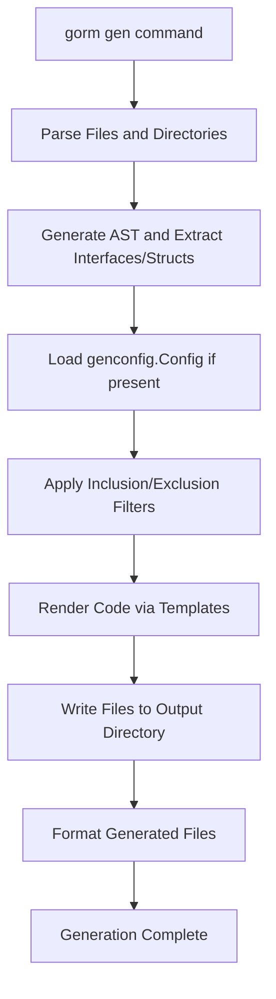

# How GORM CLI Generates Code

GORM CLI transforms your Go project’s data access layer by generating type-safe, fluent APIs for query operations and field helpers from your own query interfaces and model structs. This documentation unpacks the entire workflow behind the code generation process, highlighting how GORM CLI uses user-defined inputs, configuration, and templating to produce clean, reliable Go code that seamlessly integrates with `gorm.io/gorm`.

---

## Introduction

At its core, GORM CLI compiles two complementary code artifacts:

- **Query APIs:** Generated from Go interfaces that include raw SQL with template annotations for dynamic, type-safe query methods.
- **Field Helpers:** Generated from your model struct definitions to provide strongly typed fields for predicates and updates, including complex relationship handling.

Together, these artifacts remove boilerplate and runtime errors by offering compile-time validation and fluent API discovery.

This page walks you through the main command entry point, processing logic, template rendering, and configuration application that make this generation possible.

---

## 1. Entry Point: The `gorm gen` Command

The generation process begins with the `gorm gen` CLI command.

- The command expects an input path (`-i`) pointing to your Go files defining query interfaces with SQL template annotations.
- An output directory (`-o`) specifies where generated Go files will be saved.
- The CLI validates execution and captures errors for immediate feedback.

### Example CLI Invocation
```bash
gorm gen -i ./examples -o ./generated
```

Upon execution, the command initializes a `Generator` instance that orchestrates the read, parse, and generate cycle.

---

## 2. Parsing and Analyzing User Inputs

### File and Directory Processing

- The generator processes each Go source file found at the input path.
- It reads files recursively if a directory is provided, preserving package and directory structures in output.

### AST-Based Parsing

- The core uses Go’s Abstract Syntax Tree (AST) parser to traverse the code.
- It extracts:
  - **Interfaces:** Their names, methods, parameters, and crucially, raw SQL templates embedded as method comments.
  - **Structs:** Model structs and their fields, including embedded fields and struct tags, to identify database columns.

This AST walk also collects import paths and any package-level configurations.

### Extracting SQL Annotations

- SQL annotations residing in method comments are parsed and validated.
- These include placeholders like `@@table`, `@param` bindings, and DSL elements (`{{where}}`, `{{set}}`).

Errors and missing returns are flagged early to prevent runtime surprises.

---

## 3. Applying Generation Configuration

GORM CLI supports flexible configuration through the `genconfig.Config` struct that can be declared at the package level.

This configuration enables you to:

- Override output paths per package or file.
- Map Go types or struct tag names to custom field helper types.
- Include or exclude specific interfaces or structs using shell-style patterns.
- Choose between package-level and file-level configuration scopes.

Configurations are applied after input parsing to refine which interfaces and structs participate in code generation.

---

## 4. Code Generation Logic

With parsed interfaces, structs, and configurations ready, the generator proceeds to code rendering:

### Interface-driven Query API Generation

- Each interface generates a corresponding Go interface and implementation.
- Methods in the interface are implemented by injecting SQL templates dynamically, ensuring compile-time type safety.
- The generator adds context parameters if missing, returning precise return types and errors.

### Model-driven Field Helper Generation

- Struct fields become strongly typed field helpers with methods for predicates (`Eq`, `Like`, `Between`) and setters (`Set`, `Incr`, `SetExpr`).
- Associations (`has many`, `belongs to`, `many2many`) are mapped to specialized helper types supporting operations like `Create`, `Update`, `Unlink`, and `Delete`.

### Use of Templates

- A robust text/template engine renders the code files based on the extracted metadata.
- Standard imports for GORM, clauses, and field helpers are injected.
- Files maintain import correctness and formatting via Go ‘imports’ processing.

### Preservation of Directory Structure

- Generated files preserve relative directory structure from input to output path, facilitating seamless project integration.

---

## 5. Generated Code Example

### Interface Example

A method with SQL template

```go
// SELECT * FROM @@table WHERE id=@id
GetByID(id int) (T, error)
```

results in

```go
func (e _Query[T]) GetByID(ctx context.Context, id int) (T, error) {
  // SQL template is parsed and injected
  return e.Exec(ctx, "SELECT * FROM users WHERE id=?", id)
}
```

### Field Helper Example

For struct field

```go
Name string
```

GORM CLI generates:

```go
var User = struct {
  Name field.String
}{
  Name: field.String{}.WithColumn("name"),
}
```

Users can then build queries:

```go
db.Where(User.Name.Eq("Alice")).Find(&users)
```

Associations like `Pets []Pet` generate additional helpers with fluent operations like `Create`, `Unlink`.

---

## 6. Workflow Summary Diagram



---

## 7. Best Practices & Tips

- **Define clear interfaces:** Structure your query interfaces with concise SQL templates to maximize type safety and clarity.
- **Model your structs carefully:** Use appropriate struct tags and embed associations to empower field helper generation.
- **Use configuration to control generation:** Employ `genconfig.Config` to scope generation and map custom types.
- **Keep input and output organized:** Maintain source directory layout to preserve package integrity in generated code.
- **Validate templates early:** Syntax errors in SQL templates will halt generation—test and iterate your interface comments.

---

## 8. Troubleshooting Common Issues

- **Empty output:** Verify correct input path and presence of exported interfaces or structs.
- **Parsing errors:** Check your interface method comments for valid SQL templates and placeholder usage.
- **Conflicting configurations:** Review include/exclude patterns for overlaps or unintended filtering.
- **Generated code formatting:** If formatting issues arise, ensure `goimports` is installed and correctly configured.

---

## 9. Next Steps

Continue your journey by exploring:

- [Using Generated APIs](../../getting-started/onboarding-core/using-generated-apis): Learn how to invoke query APIs and use field helpers in your app logic.
- [Configuring Code Generation](../../guides/customization-advanced/generator-configuration): Deep dive into customizing generation via `genconfig.Config`.
- [SQL Template DSL](../../gorm-cli-concepts/customization-and-templates/template-dsl): Master the templating language for powerful query methods.

---

This page complements the high-level [Architecture Overview](../architecture-features-integration/architecture-overview) and [Feature Tour](../architecture-features-integration/feature-tour) to provide a grounded understanding of the GORM CLI generation process.


---

# References & Code Links

- [GORM CLI Repository on GitHub](https://github.com/go-gorm/cli)
- `main.go`: Entry point registering the `gen` command
- `internal/gen/gen.go`: Command definition and CLI flags
- `internal/gen/generator.go`: Core processing, AST parsing, configuration, and generation logic
- `internal/gen/template.go`: Code generation templates
- Example interfaces and models used to drive generator input


---

For comprehensive mastery, pair this guide with detailed configuration and usage guides throughout the documentation.


---

_This documentation was crafted to empower Go developers to harness GORM CLI’s generation capabilities with confidence and clarity._
