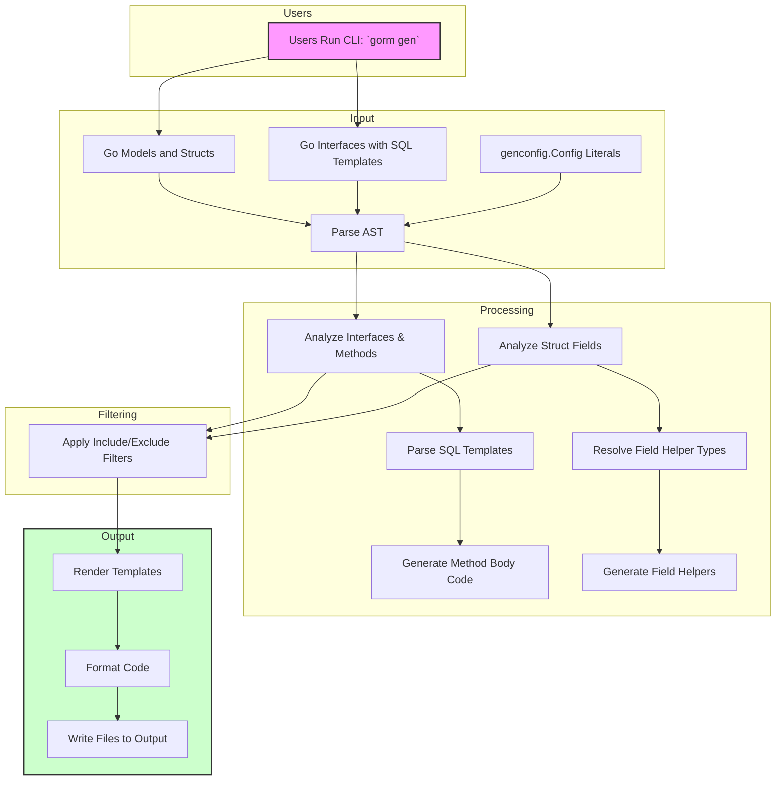

# Code Generation Workflow

The Code Generation Workflow page details the essential process by which GORM CLI transforms user-written Go model structs and raw SQL query interfaces into robust, type-safe query APIs and model-driven field helpers. This workflow guides you step-by-step from your source Go code to the generation of concrete, usable code that enhances your GORM projects with compile-time safety and fluent API capabilities.

---

## Overview

At its core, the workflow of GORM CLI converts your annotated Go interfaces and model structs into two complementary outputs:

- **Type-Safe Query APIs:** Derived from Go interfaces with embedded SQL templates in method doc comments.
- **Model-Driven Field Helpers:** Created from Go model structs to facilitate building queries, updates, and managing associations seamlessly.

This transformation pipeline ensures your data access layer is precise, robust, and maintainable.

## Workflow Stages

### 1. Input Collection and Parsing

- **Source Identification:** You provide either individual Go files or directories containing your model structs and query interfaces. The generator recursively traverses directories preserving relative paths to maintain package organization.

- **AST Parsing:** The generator parses each Go source file, building an Abstract Syntax Tree (AST) to extract:
  - Package information
  - Imports
  - Interfaces used for defining query APIs
  - Model structs that represent your database schema
  - Configuration literals of type `genconfig.Config` influencing generation behavior

- **Configuration Detection:** GORM CLI detects optional per-package configuration declared as `genconfig.Config` composite literals. These configs specify output paths, type mappings, and filtering rules.

### 2. Interface and Model Analysis

- **Interfaces:** The generator processes each interface by extracting method definitions along with the annotated SQL templates written in method documentation comments.

  - Each method must follow conventions around return values to comply with type-safe generation rules.
  - SQL templates support directives such as `@@table`, `@param`, and `{{where}}` for dynamic and conditional SQL generation.

- **Structs:** Model structs are parsed to extract exported fields, handling embedded and anonymous fields by flattening them. For each field, GORM CLI determines:
  - Go type and named type mappings
  - Database column names (computed from field name and tags)
  - Applicable field helpers based on type or gen tags (e.g., JSON fields mapped to custom helpers)

- **Field Helper Type Mapping:** The generator applies configuration-driven mappings that prioritize explicit `FieldNameMap` tags over generic `FieldTypeMap` mappings to select precise helper types.

### 3. Filtering and Scope Control

- **Filtering:** Based on the discovered or provided configurations, the generator includes or excludes interfaces and structs by applying whitelist and blacklist patterns. This allows you to scope generation to only relevant parts of your codebase.

- **File vs Package Level:** The `FileLevel` flag in configurations controls whether filters and output paths apply to individual files or whole packages.

### 4. Template Rendering

- **Method Body Generation:** For each query method, SQL templates are parsed and rendered into Go code that builds SQL dynamically at runtime.

  - Template directives for conditional, iterative, and dynamic SQL generation are compiled into Go code using AST and string builders.
  - The generator automatically injects a `context.Context` parameter if it is missing for safe, cancellable database operations.

- **API Structs Generation:** The system generates the interface wrappers and implementation structs that embed the underlying GORM generic interfaces, exposing the new methods with the correct signatures.

- **Field Helpers Generation:** The generator creates variables representing each model's fields, typed as specialized `field.Field` or `field.Struct` types with fluent setter and predicate methods.

### 5. Output Handling

- **Directory Structure:** Generated files mirror your input directory structure but placed under the output directory specified either by CLI flag `-o` or by the `OutPath` config property.

- **Code Formatting:** After rendering, generated source files are formatted using Go's `imports` tool to ensure idiomatic style and proper dependency imports.

- **File Creation:** The generator creates necessary directories and writes the generated Go source files, overwriting any previous generation output.

- **Logging:** Progress messages are printed to the terminal to indicate processing and generation status.

---

## Practical Workflow Example

You start by defining your model structs with exported fields representing database columns:

```go
type User struct {
  ID   uint
  Name string
  Age  int
  // Additional fields...
}
```

Parallelly, you write a query interface annotated with SQL templates:

```go
type UserQuery[T any] interface {
  // SELECT * FROM @@table WHERE id=@id
  GetByID(id int) (T, error)

  // UPDATE @@table
  // {{set}}
  //   {{if user.Name != ""}} name=@user.Name, {{end}}
  //   {{if user.Age > 0}} age=@user.Age {{end}}
  // {{end}}
  // WHERE id=@id
  UpdateUser(user User, id int) error
}
```

Then run the generator via CLI:

```bash
gorm gen -i ./models -o ./generated
```

Behind the scenes, the generator:

- Parses your models and query interfaces
- Applies any genconfig.Config settings
- Generates type-safe query APIs with method implementations embedding your SQL with dynamic code
- Generates field helpers corresponding to your model's fields
- Places generated files in `./generated`

Your code can then use the generated APIs:

```go
user, err := generated.UserQuery[User](db).GetByID(ctx, 123)
err = generated.UserQuery[User](db).UpdateUser(ctx, User{Name: "new name"}, 123)

// Use field helpers
err = gorm.G[User](db).Where(generated.User.Name.Eq("alice")).Update(ctx)
```

---

## Best Practices and Tips

- **Maintain Interface Method Return Signatures:** Ensure query methods return appropriate result types and an `error` as the last return value, abiding by GORM CLI constraints.
- **Use Configuration Wisely:** Leverage `genconfig.Config` to control generation scope, type mappings, and output locations.
- **Annotate SQL Templates Clearly:** Use supported directives for conditional and dynamic query parts to harness the full power of type-safe queries.
- **Preserve Directory Structure:** Keep your model and interface files organized to ensure generated files map cleanly to your source.

---

## Common Pitfalls

- **Missing Return Types:** Query interface methods without proper return values cause generation panics.
- **Ambiguous SQL Templates:** Malformed templates with unmatched directives (`{{end}}`) trigger errors in template rendering.
- **Incorrect Configuration Filters:** Overly broad excludes or includes can cause your intended interfaces or structs to be omitted.

---

## Troubleshooting

- Verify the CLI input path is correct and points to existing Go files or directories.
- Check the AST parsing errors for malformed Go source.
- Review SQL template syntax and ensure balanced template directives.
- Inspect generated files to confirm outputs are placed correctly.
- Consult `getting-started/your-first-code-generation/validating-your-setup` to validate set up.

---

## Architecture Diagram



---

## Summary

This page precisely elaborates how GORM CLI translates your Go source artifacts into efficient, type-safe database query code that integrates seamlessly with GORM. Understanding this precise workflow empowers you to write effective interfaces and models, employing configuration controls to sculpt output suited for your projects.

---

## Next Steps

After mastering the Code Generation Workflow:
- Explore [Defining Models & Query Interfaces](/getting-started/your-first-code-generation/defining-models-interfaces) to write better inputs
- Follow [Generating Code](/getting-started/your-first-code-generation/generating-code) for hands-on command usage
- Leverage [Using the Generated APIs in Your Application](/guides/core-workflows/using-generated-apis) to consume the APIs effectively
- Customize your generator with [Configurable Generation](/gorm-cli-concepts/configuration-and-integration/generation-configuration)


---

<Check>
This page focuses exclusively on the internal workflow that transforms user inputs (models, interfaces, SQL templates) into generated code.
It avoids low-level implementation mechanics unrelated to user-facing workflows.
Content is grounded in the source code and official config references.
</Check>

