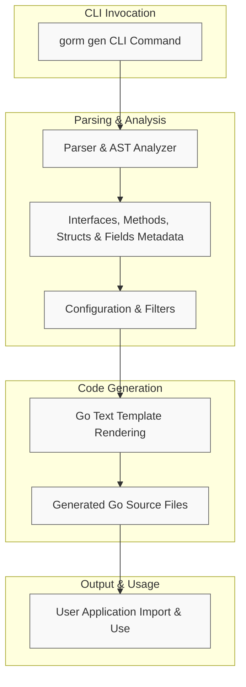

# Generation Architecture Overview

Gain a clear understanding of how GORM CLI orchestrates the transformation from your Go domain interfaces and models into smartly generated, type-safe query methods and field helpers. This page explains the core architectural flow, the key roles of components involved, and the interaction between the CLI entry point, internal generator mechanisms, and the structure of generated output.

---

## 1. Overview of the Generation Process

Every run of the `gorm gen` command launches a carefully coordinated pipeline that parses, analyzes, and generates your GORM query API and field helper code. The primary input is your Go source files containing interfaces (with embedded SQL templates) and model structs. The output is strongly-typed Go files that integrate fluidly with `gorm.io/gorm` enabling type-safe database operations.

This end-to-end lifecycle embodies three main stages:

1. **Parsing & AST Analysis** — The CLI walks your source code, extracting interfaces, methods, and struct definitions.
2. **In-memory Representation** — Extracted metadata forms a detailed model of interfaces, method parameters, SQL fragments, structs, and fields.
3. **Template-Driven Code Generation** — Using a Go text/template, the generator crafts Go code with query implementations and field helper declarations.

<Callout color="info">
This process ensures your generated code aligns with your source APIs and models, offering compile-time checked query methods without manual boilerplate.
</Callout>

---

## 2. CLI Entry Point and Workflow

At the start, the user runs the CLI command:

```bash
gorm gen -i ./path/to/interfaces -o ./generated 
```

This invokes the main *Generator* object (`gen.Generator`) configured with input and output paths.

### Workflow Steps:

- The CLI calls `Generator.Process(input)` which handles files or directories recursively.
- Each Go file is parsed to build an Abstract Syntax Tree (AST) capturing interfaces, methods, and structs.
- Package imports and configuration hints (`genconfig.Config`) are collected.
- The generator filters interfaces and structs based on inclusion/exclusion patterns set by user configs.
- Code generation is triggered by calling `Generator.Gen()`, writing output files respecting the original directory structure under the `-o` flag.

---

## 3. Parsing Go Interfaces & Models

### Interface Discovery

- Interfaces annotated with SQL templates embedded in method comments are detected and parsed.
- Each method's signature is analyzed for parameters and expected return types.
- The SQL template DSL (with directives like `@@table`, `@param`, `{{where}}`, `{{set}}`) is extracted for dynamic SQL generation.

### Model Struct Discovery

- Structs representing your database models are parsed for field names, types, DB column mappings, and any `gen` tags.
- Relational fields (slices, nested structs) inform association helpers generation.

---

## 4. Internal Data Structures and Representation

The generator builds rich metadata to represent:

- **Files:** Packages, imports, and associated configs.
- **Interfaces:** Name, methods, method docs, and embedded SQL.
- **Methods:** Parameters, return types, and generated SQL fragments.
- **Structs:** Name, fields with Go types, DB names, and mapping information.

This in-memory representation underpins template rendering, ensuring all details are referenced with precision.

---

## 5. Code Generation via Templates

A central Go text/template (`pkgTmpl`) governs code generation:

- Generates package declarations and imports.
- For each interface:
  - Writes the interface declaration with methods.
  - Provides an implementation struct wrapping GORM query helpers.
  - Embeds SQL method bodies translated into builder patterns.
- For each struct:
  - Defines strongly typed field helpers for fields and relationships.

### Generated Code Highlights

- Interface methods become type-safe query functions using `gorm.Interface[T]`.
- SQL templates transform into methods that build SQL with runtime parameter binding.
- Field helpers provide predicates, setters, and association operations.

---

## 6. Data Flow Diagram



---

## 7. Practical Insights & Best Practices

- **Input Code Quality:** Ensure interfaces and models have clear, consistent SQL annotations and struct tags to maximize generation accuracy.
- **Configurations:** Use `genconfig.Config` to control output paths, inclusion/exclusion of interfaces or structs, and customize field helper type mappings.
- **SQL Templates:** Master the DSL to craft dynamic, reusable query methods embedding Go parameter values safely.
- **Error Handling:** The generator enforces method signature rules to prevent invalid code generation (e.g., return values must include error). Pay attention to compiler hints.

---

## 8. Troubleshooting Tips

- **No Files Generated:** Verify the input path and `Include`/`Exclude` filters in your configuration.
- **Syntax Errors in Generated Code:** Ensure your Go interfaces and SQL template syntax follow supported patterns.
- **Unexpected Method Signatures:** Confirm return types align with expected conventions (one or two results, last must be `error`).

---

## 9. Summary

The generation architecture overview reveals a robust pipeline where your Go domain interfaces and models become the single source of truth, driving safe, intuitive, and complete query API and field helper creation. Understanding this flow empowers you to customize, debug, and extend GORM CLI to best fit your project needs.

---

## References

- [GORM CLI README](https://github.com/go-gorm/cli/blob/main/README.md) — Practical usage and example-driven overview
- [Template-Based Query APIs Guide](/guides/core-workflows/template-based-queries) — Details on SQL template DSL
- [Customizing Generation with genconfig](/guides/advanced-usage/customizing-generation) — Configuration and filtering options
- [Core Concepts and Terminology](/overview/core-concepts/core-terminology) — Fundamental building blocks

---

## Related Source Files

- `internal/gen/generator.go` — Core parsing and generation logic
- `internal/gen/template.go` — Template used for generating code
- `internal/gen/gen.go` — CLI command interface

For deep diving or contributing, consult these modules to follow the complete code path from AST to output.

---