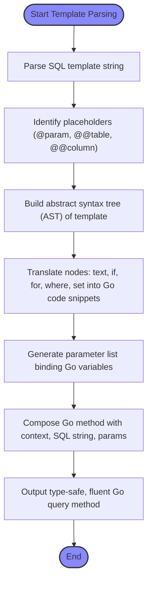

# Template DSL Foundations

GORM CLI empowers you to write expressive, concise, and dynamic SQL queries by embedding a domain-specific language (DSL) inside Go interface method comments. This DSL is purpose-built for SQL template composition, allowing parameters, conditional logic, and iteration to seamlessly blend with raw SQL snippets. The generator parses and interprets these templates to create type-safe, efficient, and fluent query APIs.

---

## Understanding the Template DSL

At its core, the template DSL enables dynamically constructing SQL statements by combining static text, parameter bindings, and control flow directives. You write your SQL in Go comments, enriched with placeholders and template blocks, letting you define complex conditional logic without verbose code.

### What Can You Achieve?

- Embed safe, parameterized SQL with automatic binding to Go method inputs
- Declare conditional SQL fragments, included only when relevant
- Loop over slices or collections to generate repeated SQL parts
- Dynamically set column names or tables
- Generate fluent APIs that auto-inject `context.Context`

This approach reduces boilerplate, enforces safety, and keeps your SQL logic close to your Go interface definitions.

---

## Core DSL Elements

### 1. **Placeholders** — Binding Go Variables to SQL

Placeholders let you safely inject Go values as SQL parameters:

- `@@table` — Inserts the model's database table name.
- `@@column` — Dynamic column placeholder, replaced by a `clause.Column{Name:?}`.
- `@param` — Binds Go method parameters or struct fields to SQL placeholders.

> Example:
> ```sql
> SELECT * FROM @@table WHERE id=@id AND name=@user.Name
> ```

The generator ensures these are passed as bound parameters, preventing SQL injection and mismatches.

### 2. **Template Blocks** — Conditional and Iterative SQL Fragments

These blocks control whether and how SQL fragments appear, based on runtime conditions.

- `{{where}}...{{end}}` — Emits a `WHERE` clause if any content inside is non-empty.
- `{{set}}...{{end}}` — Emits a `SET` clause used typically in `UPDATE` statements.
- `{{if condition}}...{{else if condition}}...{{else}}...{{end}}` — Conditionally renders SQL fragments.
- `{{for var := range collection}}...{{end}}` — Iterates over collections, emitting repeated SQL snippets.

> Example of conditional filtering:
> ```sql
> SELECT * FROM @@table
> {{where}}
>   {{if user.Name != ""}} name=@user.Name {{end}}
>   {{if user.Age > 0}} AND age=@user.Age {{end}}
> {{end}}
> ```

This will only generate `WHERE` with filters for `Name` and/or `Age` if those fields are set.

### 3. **Escaping**

To write literal `@` characters without triggering parameter binding, escape with `\@`. For example, `"\@name"` will output as `'@name'` in the SQL string.

---

## How the Generator Interprets Templates

Once you define these templates in method comments, the generator:

- Parses the SQL template, building an abstract syntax tree (AST) representation.
- Translates placeholders into parameter slices for Go code.
- Converts conditional and looped blocks into idiomatic Go control structures.
- Builds method implementations that execute parameterized SQL against GORM's `DB` interface.

This results in:

- Type-safe query methods requiring no manual SQL string concatenation.
- Fluent syntax integrating with `gorm.G[T]` for composable queries.
- Automatic injection of `context.Context` if missing.

---

## Practical DSL Usage Patterns

### Safe Parameter Binding

Avoid manually concatenating variables into SQL. Use `@param` placeholders for Go method parameters or struct fields.

```sql
SELECT * FROM @@table WHERE id=@id AND status=@status
```

Here, `@id` and `@status` become SQL parameters with values from method params.

### Dynamic Columns

When column names aren’t fixed, use `@@column` to inject safely:

```sql
SELECT * FROM @@table WHERE @@column=@value
```

This binds `column` as a `clause.Column` and `value` as the parameter.

### Conditional WHERE Clauses

Compose flexible filtering by mixing variables and conditionals:

```sql
SELECT * FROM @@table
{{where}}
  {{if name != ""}} name=@name {{end}}
  {{if age > 0}} AND age=@age {{end}}
{{end}}
```

This only outputs `WHERE` if any condition matches, trimming dangling connectors like `AND`/`OR`.

### Dynamic UPDATE with SET

Build partial update statements with `{{set}}` for dynamic `SET`:

```sql
UPDATE @@table
{{set}}
  {{if user.Name != ""}} name=@user.Name, {{end}}
  {{if user.Email != ""}} email=@user.Email {{end}}
{{end}}
WHERE id=@id
```

The generator ensures trailing commas are handled.

### Iteration Over Collections

Loop through slices to build complex queries, like filters for multiple items:

```sql
SELECT * FROM @@table
{{where}}
  {{for _, tag := range tags}}
    {{if tag != ""}} tags LIKE concat('%',@tag,'%') OR {{end}}
  {{end}}
{{end}}
```

This lets you dynamically build SQL fragment lists.

---

## Tips and Best Practices

- **Always use placeholders (`@`) to bind parameters** — ensures security and correctness.
- **Use `{{where}}` and `{{set}}` blocks to conditionally compose SQL** without leaving stray clauses or syntax errors.
- **Escape `@` when needed** to write literal strings.
- **Keep interface method comments clean and descriptive**, separating SQL logic from Go code.
- **Prefer using Go struct fields with `@user.Field` bindings** for simpler and safer parameter passing.
- **Avoid complex SQL logic in templates; keep it readable and maintainable**.

---

## Common Pitfalls and Troubleshooting

- **Unclosed blocks (`{{if}}`, `{{for}}`, `{{where}}`, `{{set}}`)** cause parsing errors.
- **Mismatch between placeholders and method parameters** leads to errors during generation.
- **Trailing or leading connectors (`AND`, `OR`) left unchecked in `{{where}}` templates** are cleaned by regex trimming automatically, but avoid complex nested logical operators.
- **Incorrect escaping of `@` symbols** results in unexpected SQL output.
- **Templates referencing non-existent fields or parameters** cause failures; ensure method signature and placeholders match exactly.

If you encounter errors like `missing }}`, `unknown directive`, or parameter count mismatches, review your SQL comment for proper DSL syntax and naming consistency.

---

## Visualization: SQL Template Processing Flow



---

## Summary

The Template DSL Foundations provide the essential knowledge to define rich, dynamic, and safe SQL templates inside Go interfaces. By mastering placeholders, conditional blocks, and iterative constructs, you unlock powerful, maintainable, and type-safe querying capabilities tailored by GORM CLI.

To advance your understanding, see related documentation on writing SQL templates in practice and integrating generated APIs.

---

## Related Documentation

- [Writing and Using SQL Templates (template-dsl-guide)](/guides/advanced-usage/template-dsl-guide)
- [Using the Generated APIs in Your Application](/guides/core-workflows/using-generated-apis)
- [Defining Models and Query Interfaces](/getting-started/your-first-code-generation/defining-models-interfaces)
- [Code Generation Workflow](/gorm-cli-concepts/core-architecture/code-generation-workflow)

---

## Next Steps

- Practice writing interface methods with SQL template comments using this DSL.
- Run the GORM CLI generator to verify output and iterate your templates.
- Explore advanced template features in the Template DSL Guide.
- Use generated methods with GORM’s fluent API to build complete query solutions.

<Tip>
Leveraging this template DSL not only reduces boilerplate but ensures your SQL queries are robustly tested and safe at compile-time, integrating tightly with Go generics and GORM APIs.
</Tip>
