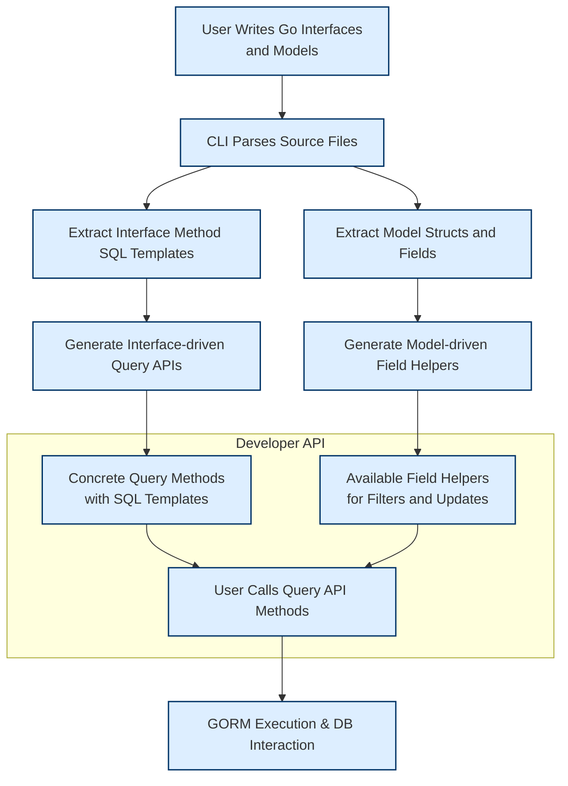

# Two Generators, One Workflow

Dive deep into the coordinated dual-generation process of GORM CLI, where interface-driven query API generation and model-driven field helper generation combine to deliver a powerful and fluent developer experience. This guide explains how these two generators work in harmony within a single workflow to provide compile-time safety and intuitive APIs for both reading and writing database data.

---

## Introduction to the Dual Generators

GORM CLI generates two distinct but complementary pieces of code from your Go project sources:

- **Interface-driven Query APIs:**  These APIs derive from Go interfaces annotated with SQL templates in method comments. They provide strongly typed, fluent, and safe query methods automatically implemented by the CLI.

- **Model-driven Field Helpers:**  These are generated from your Go structs (models) and offer type-safe helpers for accessing and manipulating fields and associations. These are the building blocks for expressive filters, updates, and joined queries.

Together, these generators empower a developer workflow that ensures type safety, discoverability, and agility in database operations, covering both reads and writes.

<Info>
This page focuses exclusively on the details of how these two generators collaborate in a unified workflow, showing the rules, their outputs, and their interplay.
</Info>

---

## Why Two Generators?

Imagine you want to run queries and updates on your database models with maximum safety and fluency. GORM CLI embraces the philosophy of separation of concerns:

- Query APIs are best defined at the interface level where you articulate your data access methods with exact SQL semantics.
- Field helpers focus on the data model’s fields, giving you reusable predicates, setters, and association operations.

By splitting generation along these lines, GORM CLI generates robust, clear code that fits naturally into Go idioms and GORM integration.

---

## Generator 1: Interface-Driven Query API Generation

### What it Does

- Parses Go interfaces annotated with SQL templates in method comments.
- Generates concrete Go implementations with type-safe methods.
- Creates methods that execute queries or chain filters with full compile-time checks.

### How It Works

Users define an interface like this:

```go
// Query interface with SQL templates
// Uses placeholders like @@table and @param

type Query[T any] interface {
  // SELECT * FROM @@table WHERE id=@id
  GetByID(id int) (T, error)

  // Use where directives for complex conditions
  FilterByNameAndAge(name string, age int)
}
```

From such interfaces, GORM CLI:

- Extracts SQL templates with directives and dynamic placeholders
- Parses the SQL template DSL (e.g., `{{where}}`, `{{set}}`, `@param`)
- Generates concrete methods with embedded SQL generation code and parameter binding
- Injects context parameters and error handling automatically

### Resulting API:

- Fluent methods like `.GetByID(ctx, id)` executing concrete queries
- Methods supporting complex filter chaining, e.g., `.FilterByNameAndAge("jinzhu", 25).Find(ctx)`

<Callout title="Tip">
Define your SQL templates carefully to leverage dynamic binding capabilities (`@@table`, `{{where}}`, `{{if}}` conditions) to keep queries concise and flexible.
</Callout>

---

## Generator 2: Model-Driven Field Helper Generation

### What it Does

- Analyzes Go structs (models) to generate strongly-typed field helpers.
- Creates predicate helpers to filter by fields (`Eq`, `Like`, `Between`, `IsNull`, etc.).
- Generates setters for updates and creations, supporting complex expressions.
- Provides association helpers for has-one, has-many, belongs-to, and many-to-many relations.

### How It Works

Given a model struct:

```go
// Example User model
// Contains fields and associations

type User struct {
  ID       uint
  Name     string
  Age      int
  Pets     []*Pet
  Languages []Language `gorm:"many2many:UserSpeak"`
  Profile  string `gen:"json"`
}
```

GORM CLI generates a corresponding set of field helpers:

```go
var User = struct {
  ID        field.Number[uint]
  Name      field.String
  Age       field.Number[int]
  Pets      field.Slice[models.Pet]
  Languages field.Slice[models.Language]
  Profile   JSON
}{
  ID:  field.Number[uint]{}.WithColumn("id"),
  ...
}
```

Each helper offers expressive methods:

- Predicates for querying:
  - `User.Name.Eq("alice") // name = 'alice'`
  - `User.Age.Between(18, 65)`
- Setters for updates or creations:
  - `User.Name.Set("bob")`
  - `User.Age.Incr(1)`
- Association operations:
  - `User.Pets.Create(...)`
  - `User.Languages.CreateInBatch(...)`

### Association Handling

- Supports all common association types with clear semantics:
  - **Belongs To:** Unlink clears FK, Delete removes row.
  - **Has One / Has Many:** Unlink sets FK to NULL, Delete removes child rows.
  - **Many2Many:** Unlink/Delete remove join table rows only.

---

## Coordinated Workflow

The two generators work together seamlessly during a single run of the CLI to produce code that complements each other:

1. **Source Input:** User writes:
   - Query interfaces defining method signatures + SQL templates.
   - Model structs with fields and associations (including tags).

2. **AST and Metadata Extraction:** CLI parses all source files to identify:
   - Interfaces and their SQL templates.
   - Structs and their field types.

3. **Field Helper Generation:** From models, generates field helpers used for filtering, setting, and association management.

4. **Query API Generation:** From interfaces, generates concrete query implementations that internally use field helpers and fluent predicates.

5. **Generated Code Output:** Outputs typed, discoverable, and safe APIs for both read and write operations.

---

## User Benefits

- **Fluent developer experience:** Interplay allows chaining queries with predicates from generated field helpers alongside templated SQL methods.
- **Type safety guaranteed:** Compile-time checked parameters and fields prevent SQL injection and invalid database access.
- **Unified Read/Write API:** Field helpers support not only where clauses but updating/inserting and association operations, used by generated query APIs or directly in GORM chains.
- **Extensible and Configurable:** Developers can customize field types and naming via configuration without breaking the workflow.

---

## Practical Examples

### Using Query API on generated code:

```go
// Fetch user by ID
user, err := generated.Query[User](db).GetByID(ctx, 123)

// Find users with age > 18
users, err := generated.Query[User](db).
  FilterByNameAndAge("jinzhu", 25).
  Find(ctx)

// Update with a templated method
err = generated.Query[User](db).UpdateUser(ctx, User{Name: "jinzhu", Age: 20}, 1)
```

### Using Field Helpers directly with GORM:

```go
// Find users older than 18
users, err := gorm.G[User](db).
  Where(generated.User.Age.Gt(18)).
  Find(ctx)

// Create user with pets in batch
err := gorm.G[User](db).
  Set(
    generated.User.Name.Set("polyglot"),
    generated.User.Languages.CreateInBatch([]models.Language{{Code: "EN"}, {Code: "FR"}}),
  ).
  Create(ctx)

// Unlink user's pets where name='fido'
err := gorm.G[User](db).
  Where(generated.User.ID.Eq(1)).
  Set(generated.User.Pets.Where(generated.Pet.Name.Eq("fido")).Unlink()).
  Update(ctx)
```

---

## Best Practices and Tips

- Define query interfaces close to your models for simplicity and code locality.
- Leverage the templated SQL DSL to keep queries flexible and safe using `@@table`, `{{where}}`, and `@param` directives.
- Use generated field helpers to build composable, fluent queries rather than crafting raw SQL.
- Use config (`genconfig.Config`) to tailor output paths and map custom field helper types for specialized columns like JSON.
- Familiarize with association semantics to effectively manage related data with unlink, delete, create, and batch operations.

---

## Troubleshooting Common Issues

<AccordionGroup title="Common Issues with Two Generators Workflow">
<Accordion title="Generated code missing query methods or field helpers">
Check that your interfaces and structs are included in the generation through your configuration (`IncludeInterfaces`, `IncludeStructs`). Make sure the package-level `genconfig.Config` is correctly declared.
</Accordion>
<Accordion title="SQL templates causing generation errors">
Validate that your SQL templates follow the proper DSL syntax with directives properly closed. Unmatched `{{end}}` or wrong usage of `{{where}}` can cause compilation issues.
</Accordion>
<Accordion title="Field helpers missing for some model fields">
Ensure your model fields have appropriate Go types or are mapped in the configuration (`FieldTypeMap`, `FieldNameMap`). Check that custom types implement supported interfaces if necessary.
</Accordion>
</AccordionGroup>

---

## How This Fits Into the Broader GORM CLI Documentation

- **Related Conceptual Pages:**
  - [Generation Architecture Overview](../generation-architecture)
  - [Field Helper Design and Typing](../../data-models-schemas/field-helper-strategy)
  - [Template SQL DSL Fundamentals](../../extensibility-integration/template-dsl-concepts)

- **Related Guides:**
  - [Working with Field Helpers and Predicates](/guides/core-workflows/field-helpers-and-predicates)
  - [Template-Based Query APIs](/guides/core-workflows/template-based-queries)
  - [Managing Associations in Generated Code](/guides/core-workflows/associations-in-depth)

- **Next Steps:**
  - Explore writing your first query interface and generating code ([First Generation Workflow](/guides/getting-started/first-generation-workflow))
  - Learn about configuration and advanced customizations ([Customizing Generation](/guides/advanced-usage/customizing-generation))

---

## Visual Workflow Diagram



---

## Summary

GORM CLI's twin generator workflow harnesses the strengths of interface-driven query API generation and model-driven field helper generation. Together, they form a unified, fluent, and type-safe developer experience that covers both complex query building and seamless manipulation of model fields and associations. This synergy assures compile-time correctness and clean, maintainable database interaction code.
