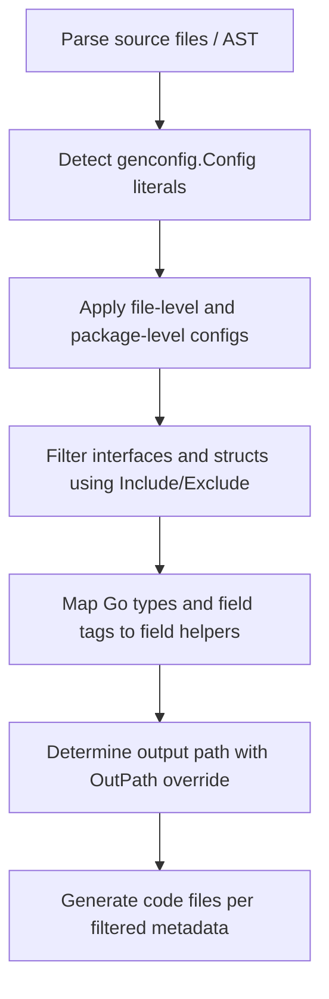

# Generation Configuration Patterns

Understand how GORM CLI's code generation process can be precisely tailored using `genconfig.Config`. This guide demonstrates how configuration files define generation behavior per package or file, influencing output paths, field mappings, and selective inclusion or exclusion of interfaces and structs. You'll learn practical examples of customizing field type mappings, scoping generation by name patterns, and controlling generation scope with file-level or package-level flags.

---

## Why Configure Generation?

The GORM CLI generator transforms your annotated Go interfaces and structs into type-safe, fluent query APIs and field helpers. By default, it processes entire packages and generates code to default locations with standard helpers. However, real projects require customization to:

- Override where generated files are placed
- Map specific Go types or struct tags to custom field helpers
- Focus generation on particular interfaces or structs to reduce generated codeelephant
- Apply generation only to specific files instead of whole packages

The `genconfig.Config` struct encapsulates these customization options in a single declarative configuration.


## Location and Automatic Discovery

Place a variable of type `genconfig.Config` anywhere at the package level in your source files. The generator automatically scans all files, finds these literals, and applies their settings during generation. For example:

```go
// file: examples/config.go
package examples

import (
    "gorm.io/cli/gorm/genconfig"
    "database/sql"
    "gorm.io/cli/gorm/field"
)

var _ = genconfig.Config{
    OutPath: "examples/output",
    FieldTypeMap: map[any]any{
        sql.NullTime{}: field.Time{},
    },
}
```

The placement allows targeted configuration per package or even per file when using file-level flags.

---

## Key Configurable Fields in `genconfig.Config`

| Field Name          | Purpose                                                                                  |
|---------------------|------------------------------------------------------------------------------------------|
| `OutPath`           | Overrides default output directory for generated code in the same package                |
| `FieldTypeMap`      | Maps specific Go type instances (e.g., `sql.NullTime{}`) to custom field helper types    |
| `FieldNameMap`      | Maps field tag names (from `gen:"tag"`) to custom field helpers, preferred over type mapping |
| `FileLevel`         | When true, applies config only to the file declaring it, not the entire package          |
| `IncludeInterfaces` | List of interface patterns or types to whitelist for generation                          |
| `ExcludeInterfaces` | List of interface patterns or types to blacklist from generation                         |
| `IncludeStructs`    | List of struct name patterns or types to whitelist                                      |
| `ExcludeStructs`    | List of struct name patterns or types to blacklist                                      |


## Using `OutPath` for Output Control

Customize where generated files are written relative to the current working directory.

```go
var _ = genconfig.Config{
    OutPath: "gencode/custom_output",
}
```

This is powerful for segregating generated files by layer or service.


## Custom Field Type and Tag Mapping

Sometimes your project uses specific Go types or custom struct tags that need specialized generated field helpers. Use `FieldTypeMap` and `FieldNameMap`.

### Mapping by Go Type

Map Go types to wrapper helpers so codegen generates proper accessors and SQL expressions.

```go
var _ = genconfig.Config{
    FieldTypeMap: map[any]any{
        sql.NullTime{}: field.Time{},
    },
}
```

Here, any field of type `sql.NullTime` will generate a `field.Time` helper, providing methods like `.Gt()` or `.Between()`.

### Mapping by Field Tag (Name)

Map based on struct tag values (`gen:"json"`, `gen:"date"`, etc.):

```go
var _ = genconfig.Config{
    FieldNameMap: map[string]any{
        "json": JSON{},
        "date": field.Time{},
    },
}
```

This mapping takes precedence over `FieldTypeMap`. It enables selective customization based on field tags in your models.


## Selective Generation via Whitelisting and Blacklisting

Control exactly which interfaces and structs are included or excluded from code generation.

- `IncludeInterfaces` / `ExcludeInterfaces`
- `IncludeStructs` / `ExcludeStructs`

These fields accept:

- Shell-style string glob patterns such as `"Query*"`, `"User*"`, `"*Repo"`
- Fully qualified names, e.g., `models.User{}` or `pkg.Query(nil)`

### How Filtering Works

1. If `Include*` list is non-empty, only those matching items are generated.
2. Otherwise, the `Exclude*` list is applied to filter out unwanted items.

### Example: Including Only Query Interfaces Starting With "Query"

```go
var _ = genconfig.Config{
    IncludeInterfaces: []any{"Query*"},
}
```

### Example: Excluding Specific Interfaces and Structs

```go
var _ = genconfig.Config{
    ExcludeInterfaces: []any{"I3"},
    ExcludeStructs: []any{"S3"},
}
```


## File-Level vs Package-Level Scope

By default, the generation configuration applies to the entire package containing the `genconfig.Config` declaration. Setting `FileLevel: true` constrains the scope to only the file containing the config.

- This is useful to have different generation settings within one package for different files.
- When `FileLevel` is false or omitted, the configuration applies across the entire package directory.

Example:

```go
var _ = genconfig.Config{
    FileLevel: true,
    IncludeInterfaces: []any{"I1"},
}
```

Only interfaces in this precise file matching "I1" will be generated.


## Practical Examples

### 1. Selective Generation in a Nested Directory

```go
package nested

import "gorm.io/cli/gorm/genconfig"

var _ = genconfig.Config{
    FileLevel: false,
    ExcludeInterfaces: []any{"I3"},
    ExcludeStructs: []any{"S3"},
}
```

This excludes interface `I3` and struct `S3` from generation across the nested package.


### 2. Pattern-Based Interface Inclusion

```go
package pattern

import "gorm.io/cli/gorm/genconfig"

var _ = genconfig.Config{
    IncludeInterfaces: []any{"Query*"},
}
```

Only interfaces with names starting with `Query` are included.


### 3. Mapping Custom JSON Field Helper via FieldNameMap

```go
package examples

import "gorm.io/cli/gorm/genconfig"

var _ = genconfig.Config{
    OutPath: "examples/output",
    FieldNameMap: map[string]any{
        "json": JSON{},
    },
}
```

Fields tagged with `gen:"json"` in this package will be generated using the custom `JSON` helper.


## How Configuration Affects Generation Flow

1. The generator walks source directories and parses Go AST.
2. It detects all `genconfig.Config` literals and collects these configs.
3. For each source file, it applies matching configs (considering file-level and package-level scopes) and merges their filters and mappings.
4. The generator filters interfaces and structs based on include/exclude lists.
5. Field helpers are selected by checking `FieldNameMap` first, then falling back to `FieldTypeMap` and internal defaults.
6. All files are generated to the configured `OutPath` with directory structure preserved.


## Tips and Best Practices

- **Use Include lists sparingly** when you want tightly focused generation; otherwise use Exclude lists to remove only the unwanted types.
- **Place configs at the package level** for broad customization, or enable `FileLevel` for fine-grained control.
- When mapping types or tags, ensure your custom helpers implement expected fluent API methods for seamless integration.
- Avoid overlapping or conflicting patterns in Include/Exclude; carefully verify your glob patterns.
- Keep `OutPath` relative and consistent to avoid confusing file placements.


## Common Pitfalls

- Forgetting to set `FileLevel` when you want per-file configs can cause unintended package-wide behavior.
- Using conflicting Include/Exclude configurations may result in zero generated files.
- Mapping field types incorrectly may generate invalid field helpers or compilation errors.


## Summary Diagram of Configuration Influence on Generation




## Additional Resources

- [Basic Configuration](https://docs.example.com/getting-started/onboarding-core/basic-configuration) — Intro to minimal config
- [Selective Generation](https://docs.example.com/guides/customization-advanced/selective-generation) — Deeper dive into interface/struct filters
- [Handling JSON Fields and Custom Field Helpers](https://docs.example.com/guides/customization-advanced/json-field-helpers) — Using custom helpers
- [SQL Template DSL](https://docs.example.com/gorm-cli-concepts/customization-and-templates/template-dsl) — Writing SQL templates for query generation


---

By mastering `genconfig.Config`, you gain full control over how GORM CLI generates code for your project. Customizing output paths, field helper types, and selectively including or excluding interfaces and structs aligns generated code precisely with your project's architecture and coding style, empowering you to produce clean, maintainable, and targeted type-safe database APIs.
