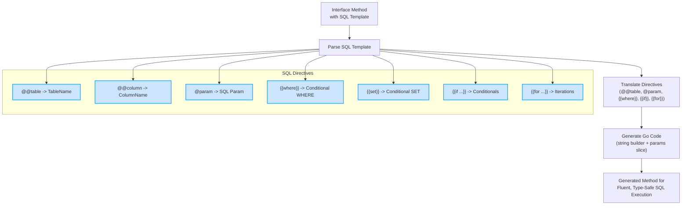

# SQL Template DSL

GORM CLI empowers Go developers with a powerful yet intuitive SQL template mini-language embedded directly in interface method comments. This feature transforms raw SQL fragments annotated with special directives into fully type-safe, parameterized, and fluent Go query methods automatically.

This page guides you through the core directives and syntax of the SQL Template DSL, explaining how to write dynamic SQL in your Go interfaces. You will learn the special placeholders, conditional blocks, iteration constructs, and how to leverage them safely for robust query generation.

---

## Why Use SQL Template DSL?

While GORM provides an expressive ORM, complex or performance-critical queries often benefit from custom raw SQL. GORM CLI’s SQL Template DSL blends the best of both worlds: raw SQL expressiveness with compile-time, type-safe Go API generation.

By writing SQL templates in Go interface method comments with simple directives, you get:

- Automatic binding of Go function parameters to SQL parameters
- Dynamic construction of WHERE or SET clauses with conditional logic
- Reusable, type-safe, and idiomatic Go query methods

---

## Core Directives and Syntax

Below is the essential syntax you will use in SQL template comments to control query generation.

### `@@table`

- **Purpose:** Resolves to the actual table name of the model struct related to the query.
- **Use case:** Replace hardcoded table names for flexibility and correctness.

```sql
-- SELECT * FROM @@table WHERE id=@id
```
Generates SQL referencing the correct table name automatically.

### `@@column`

- **Purpose:** Dynamically bind a column name to a query parameter.
- **Use case:** Use when column names vary depending on arguments.

```sql
-- SELECT * FROM @@table WHERE @@column=@value
```
Here, `@@column` is replaced by the column identified in Go parameter `column`.

### `@param`

- **Purpose:** Bind Go method parameters directly into SQL as parameters, preventing SQL injection.
- **Use case:** Refer to parameters in WHERE or SET clauses.

```sql
-- WHERE name=@name
```
Maps Go parameter `name` safely into the query.

### `{{where}}` and `{{set}}` Blocks

- **Purpose:** Construct dynamic `WHERE` or `SET` clauses conditionally.
- **Behavior:** Content inside these blocks is conditionally appended to the SQL.

```sql
-- {{where}}
--   {{if age > 18}} age > @age {{end}}
-- {{end}}
```
Only appends a WHERE if the condition is true.

Similarly, `{{set}}` is used for `UPDATE` SET clause generation, enabling conditional fields.

### Control Flow Directives

| Directive      | Description                                      |
|----------------|------------------------------------------------|
| `{{if condition}}` ... `{{end}}` | Include SQL fragment if condition is true |
| `{{else if condition}}`          | Else-if chain for conditionals              |
| `{{else}}`                      | Else block                                  |
| `{{for range_expression}}` ... `{{end}}` | Loop over a slice or map for repeated SQL blocks |

#### Example: Conditional WHERE with If-Else

```sql
-- SELECT * FROM @@table
-- {{where}}
--   {{if user.ID > 0}}
--     id=@user.ID
--   {{else if user.Name != ""}}
--     name=@user.Name
--   {{end}}
-- {{end}}
```
This produces a WHERE clause only if conditions hold.

#### Example: Iteration with For

```sql
-- SELECT * FROM @@table
-- {{where}}
--   {{for _, u := range users}}
--     {{if u.Name != "" && u.Age > 0}}
--       (name = @u.Name AND age=@u.Age) OR
--     {{end}}
--   {{end}}
-- {{end}}
```
Loops over a slice of `users`, generating WHERE conditions per element.

---

## Putting It All Together: Full Example

Here is how you might write a full interface method with rich SQL templating:

```go
// Query users with dynamic conditions
// SELECT * FROM @@table
// {{where}}
//   {{if !start.IsZero()}}
//     created_at > @start
//   {{end}}
//   {{if !end.IsZero()}}
//     AND created_at < @end
//   {{end}}
// {{end}}
FilterWithTime(start, end time.Time) ([]T, error)
```

This results in a strongly typed method that dynamically applies time range filters.

---

## How the Template Translates

Under the hood, the SQL template is parsed and transformed as follows:

- Placeholders like `@@table` become calls to fetch the model’s runtime table name.
- `@param` placeholders translate to parameter slices, safe from injection.
- `{{where}}` and `{{set}}` blocks render only when their inner SQL (after evaluating conditionals) is non-empty.
- `{{if}}` branches become conditional Go code checking parameters.
- `{{for}}` blocks generate Go loops to iterate collections for expanded SQL.

This process outputs Go code that builds SQL strings and associated parameter slices safely.

---

## Practical Tips & Best Practices

- **Always bind parameters with `@` prefix** to prevent SQL injection.
- Use `@@table` for table names to support schema or naming changes.
- Leverage `{{where}}` blocks to build queries dynamically without manual SQL concatenation outside templates.
- Use conditional `{{if}}` blocks inside templates to include optional filters only when meaningful.
- Employ `{{for}}` loops to handle slice parameters for IN clauses or multiple OR conditions.
- Avoid embedding raw strings inside templates; prefer bound parameters.

---

## Common Pitfalls

<Warning>
- Forgetting `{{end}}` for `{{if}}` or `{{for}}` blocks results in parsing errors.
- Using unescaped `@` in SQL strings may be mistaken for param placeholders; escape with `\@`.
- Overly complex logic inside templates can be hard to maintain; keep templates focused and readable.
- Do not assume direct mapping from structs without adapting SQL and parameters appropriately.
</Warning>

---

## Troubleshooting SQL Templates

If you encounter generation errors or unexpected SQL, verify:

- Your control directives (`{{if}}`, `{{for}}`, `{{else}}`, `{{end}}`) are balanced and correctly nested.
- Placeholders match exactly with method parameters.
- No illegal syntax or mismatched quotes exist in SQL fragments.
- Debug intermediate generated Go code (the SQL builder snippet) to identify logic mistakes.

For detailed troubleshooting guidance, see [Troubleshooting Common Setup Issues](/getting-started/onboarding-core/troubleshooting-setup).

---

## Summary

GORM CLI’s SQL Template DSL is a concise yet powerful way to write dynamic, type-safe SQL queries embedded in Go interfaces. Master the special directives `@@table`, `@param`, and the control blocks like `{{where}}`, `{{if}}`, and `{{for}}` to build safe, expressive, and reusable query methods effortlessly.

Next, explore the [Using Generated APIs](/getting-started/onboarding-core/using-generated-apis) guide to see how these generated methods are used in your Go application.

---

## Additional References

- [Overview: Core Terminology and Concepts](/overview/introduction-core-concepts/core-terminology)
- [Core Architecture Overview: System Workflow](/gorm-cli-concepts/core-architecture-overview/system-workflow)
- [Template-Based Queries: Writing and Using SQL Templates](/guides/core-usage-patterns/template-based-queries)
- [Field Helpers and Strong Typing](/gorm-cli-concepts/type-safety-field-helpers/field-helper-architecture)

---

## Diagram: SQL Template DSL Flow


