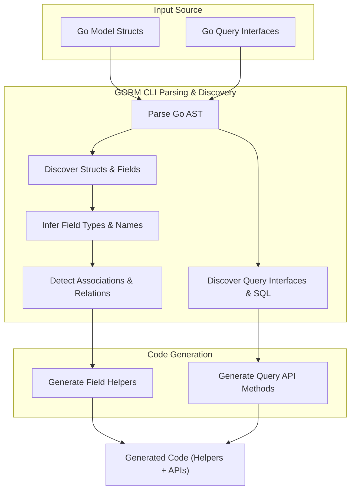

# Model Discovery and Schema Inference

GORM CLI makes generating type-safe query APIs and model-driven field helpers effortless by accurately discovering your model structs and interfaces to infer database schemas and relational mappings. This page guides you through the core concepts and rules that determine how your Go structs and their fields are interpreted during generation, enabling you to understand and control the resulting generated code.

---

## Overview

When you run the GORM CLI generator on your codebase, it performs a thorough static analysis of your Go source files to detect model struct definitions and their associated interfaces. This process enables automated generation of strongly typed helpers and query APIs that mirror your database schema and relationships as defined in Go.

Understanding the discovery and inference mechanisms helps you shape your models for accurate code generation and avoid surprises in your field helpers or associations.

---

## How GORM CLI Discovers Models

### 1. Parsing Go Source Files

- GORM CLI parses all Go files provided via the `-i` input path.
- It walks through the Abstract Syntax Tree (AST) to locate:
  - **Struct Types:** These represent your data models.
  - **Interfaces:** These represent query operations with embedded SQL templates.
- Each struct is examined in detail for fields, embedding, struct tags, and types.

### 2. Struct Embedding and Flattening

- Anonymous fields (embedding) are recursively expanded.
- Embedded struct fields are inlined as if declared in the parent, ensuring all relevant fields are visible at the top level.
- This process guarantees inherited fields like those from `gorm.Model` are included correctly.

### 3. Field Analysis and Database Naming

- For each named field in a struct:
  - Field names are converted to database column names according to GORM conventions (e.g., `CreatedAt` -> `created_at`).
  - The `gorm` struct tags are inspected for customizations (`column`, relationships, polymorphic, etc.).
  - A special `gen:"tag"` struct tag can specify field helper mappings (e.g., `json`).

---

## Schema Inference Rules

### 1. Field Inclusion

- Fields must be **exported** Go struct fields for inclusion.
- Anonymous unexported fields are ignored.
- Fields can be excluded via configuration filters (`IncludeStructs`, `ExcludeStructs`).
- Basic data types supported include:
  - `int`, `float` variants, `string`, `bool`, `time.Time`, `[]byte`
  - Named types implementing `Scanner` and `Valuer` interfaces or using GORM serializers are also supported.

### 2. Field Type Mapping

- Field helpers are generated according to the field Go type:

  | Go Type                            | Generated Helper Type           |
  |----------------------------------|--------------------------------|
  | `string`                         | `field.String`                  |
  | `bool`                           | `field.Bool`                    |
  | `[]byte`                        | `field.Bytes`                   |
  | `time.Time`, `sql.NullTime`     | `field.Time`                    |
  | Numeric (`int`, `uint`, `float`)| `field.Number[GoType]`          |
  | Other named types implementing `Scanner`, `Valuer` or custom mappings | `field.Field[GoType]`           |
  | Structs (associations)           | `field.Struct[GoType]`          |
  | Slice of structs                 | `field.Slice[ElementType]`      |

- Custom field helper mappings can be declared via `genconfig.Config` by mapping Go types or `gen` struct tags to specific helper implementations.

### 3. Value Representation

- Primitive and basic fields generate helpers using the database column name.
- Association fields generate helpers named by Go struct field name using `.WithName()`.

---

## Inferring Associations

GORM CLI detects and classifies associations to generate the corresponding association helpers. Supported association types include:

| Association Type | Detection Criteria                                      | Generated Helper                            |
|------------------|---------------------------------------------------------|---------------------------------------------|
| **Has One**       | Struct field of another model type                      | `field.Struct[ModelType]`                   |
| **Has Many**      | Slice of pointers or structs of another model           | `field.Slice[ModelType]`                     |
| **Belongs To**   | Pointer or struct field referencing another model       | `field.Struct[ModelType]`                     |
| **Many To Many**  | Slice of structs with `gorm:"many2many:<join_table>"` tag | `field.Slice[ModelType]`                     |
| **Polymorphic**  | Has `gorm:"polymorphic:<Owner>"` tag                    | Specialized association helpers preserved   |

The generator uses the field type and GORM struct tags to identify these relationships.

### Parent Operation Semantics

- **Create(ctx):** Inserts new parent rows; applies association creation / link operations afterward.
- **Update(ctx):** Updates existing matched parents and applies modifications to associations.

### Association Operations

The generated helpers support atomic, type-safe operations such as:

- `Create` and `CreateInBatch` to insert and associate child rows.
- `Update` for conditional modifications.
- `Unlink` to clear associations without deleting data.
- `Delete` for removing related rows or join records.

---

## Practical Example: User Model

Given the following model with mixed basic fields and various associations:

```go
type User struct {
  gorm.Model
  Name      string
  Age       int
  Birthday  *time.Time
  Score     sql.NullInt64
  Account   Account           // Has one
  Pets      []*Pet            // Has many
  Languages []Language        `gorm:"many2many:UserSpeak"` // Many to many
  Profile   string            `gen:"json"` // Uses custom JSON helper
}
```

GORM CLI generates helpers like:

- `User.Name` as `field.String` with the `name` column.
- `User.Age` as `field.Number[int]` with the `age` column.
- `User.Account` as `field.Struct[Account]` association.
- `User.Pets` as `field.Slice[Pet]` association.
- `User.Languages` as `field.Slice[Language]` with many-to-many linkage.
- `User.Profile` using the custom JSON field helper.

Each helper enables fluent filtering, updates, creation, and association management with compile-time safety.

---

## Tips and Best Practices

- **Define Models Clearly:** Use idiomatic GORM struct definitions and tags.
- **Use `gen` Tags for Custom Helpers:** Map fields like JSON or specialized types via `gen:"json"` or config for precise helper generation.
- **Control Inclusion via Config:** Use `genconfig.Config` to selectively include/exclude interfaces and structs.
- **Use Embedded Structs Judiciously:** Embedded fields are flattened, so design for clarity.
- **Avoid Private Fields:** Only exported fields generate helpers.

---

## Troubleshooting Common Issues

<AccordionGroup title="Common Discovery Issues">
<Accordion title="Field Missing from Generated Helpers">
Make sure the field is exported (capitalized), and not excluded by your inclusion/exclusion filters in `genconfig.Config`.
Check for typos in struct tags and ensure no package-level configs are filtering it out.
</Accordion>
<Accordion title="Association Helpers Not Generated Correctly">
Verify the field type matches your model struct or slice of models.
Check struct tags for correct foreign key or many-to-many configuration.
Ensure polymorphic tags have the correct syntax.
</Accordion>
<Accordion title="Custom Field Helper Not Applied">
Confirm the `gen:"tag"` usage on the field and the corresponding mapping in `FieldNameMap` of your generation config.
Verify the custom helper type is correctly referenced and accessible.
</Accordion>
</AccordionGroup>

---

## Summary

The model discovery and schema inference process is the foundation for GORM CLI's power. By understanding how your Go structs are translated into field helpers and associations, you gain confidence in the generated APIs and can customize the process to fit your project needs precisely. This knowledge empowers you to build safe, expressive, and maintainable database code effortlessly.

---

## Further Reading and Related Pages

- [Field Helper Design and Typing](/gorm-cli-concepts/data-models-schemas/field-helper-strategy) — Deep dive into generated field helper types.
- [Modeling Associations and Relationships](/gorm-cli-concepts/data-models-schemas/association-modeling) — Learn how associations are modeled and manipulated.
- [Customizing Generation with genconfig](/guides/advanced-usage/customizing-generation) — Tailor your generated code with advanced configuration.
- [Working with JSON Fields](/guides/advanced-usage/working-with-json-fields) — Handle JSON fields with custom helpers.

---

## Illustrative Mermaid Diagram



This diagram depicts the process flow from your source code to the generated, type-safe helpers and query APIs provided by GORM CLI.

---

## Example CLI Usage Flow

1. Define model structs and interfaces in your Go codebase.
2. Run the generator specifying input and output paths:

```bash
gorm gen -i ./examples -o ./generated
```

3. Use the generated helpers in your application:

```go
// Filter users by age using generated helpers
users, err := gorm.G[User](db).
    Where(generated.User.Age.Gt(18)).
    Find(ctx)
```

---

For full examples and in-depth explanations, explore the linked guides on field helpers, associations, and query API generation in the documentation.

---