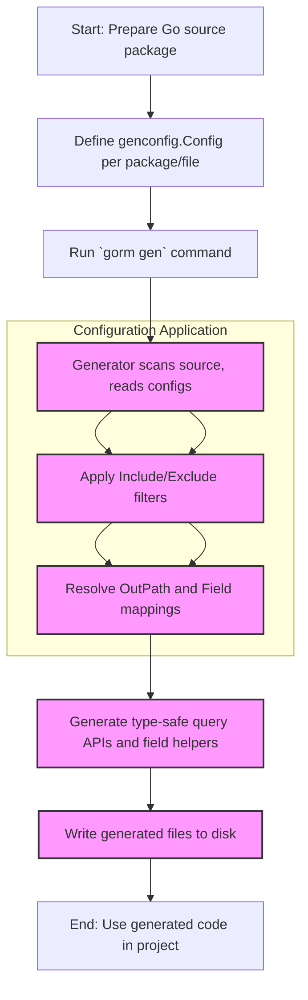

# Generator Configuration (`genconfig.Config`)

GORM CLI provides a powerful and flexible configuration system through the `genconfig.Config` type. This configuration governs how code generation behaves on a per-package or per-file basis, enabling you to customize output locations, tailor field helper mappings, and control the scope of generation precisely to match your project conventions and workflows.

---

## Why Customize Generation?

As projects grow in complexity, generation customization becomes essential to maintain clarity, enforce coding standards, optimize output layout, and integrate specialized data types smoothly. With `genconfig.Config`, you can reliably influence:

- **Where** generated code files are placed
- **Which** interfaces and structs are included or excluded
- **How** fields are mapped to generated typed helpers
- **Whether** configuration applies globally per package or specifically per file

---

## Core Concepts of `genconfig.Config`

At its heart, `genconfig.Config` is a declarative Go struct that you define at the package level inside your source code. The generator automatically detects and applies these configs without additional CLI flags.

### Key Configuration Fields

| Field Name           | Purpose                                                                                      |
|---------------------|----------------------------------------------------------------------------------------------|
| `OutPath`           | Override default output directory for generated files within the package                      |
| `FieldTypeMap`      | Map Go types (concrete instances) to custom typed field helpers for replacement              |
| `FieldNameMap`      | Map field tags (e.g., `gen:"json"`) to custom field helpers                                |
| `FileLevel`         | If true, config applies only to the file where declared; otherwise applies to entire package |
| `IncludeInterfaces` | Optional whitelist of interface names/types to generate query code for                        |
| `ExcludeInterfaces` | Optional blacklist of interface names/types to skip                                         |
| `IncludeStructs`    | Optional whitelist of struct names/types for field helper generation                         |
| `ExcludeStructs`    | Optional blacklist of struct names/types to skip                                           |


### Example: Basic Config Declaration

```go
package examples

import (
    "database/sql"
    "gorm.io/cli/gorm/field"
    "gorm.io/cli/gorm/genconfig"
)

var _ = genconfig.Config{
    OutPath: "examples/output",
    FieldTypeMap: map[any]any{
        sql.NullTime{}: field.Time{},    // Map sql.NullTime to field.Time helper
    },
    FieldNameMap: map[string]any{
        "date": field.Time{},           // Fields tagged with `gen:"date"` use Time helper
        "json": JSON{},                 // Custom JSON field helper
    },
    FileLevel: false,                    // Applies to the entire package subtree
    IncludeInterfaces: []any{"Query*"},
    ExcludeInterfaces: []any{"*Deprecated*"},
    IncludeStructs: []any{"User", "Account*"},
    ExcludeStructs: []any{"*DTO"},
}
```


---

## Detailed Configuration Behavior

### OutPath: Controlling Output Location

By default, generated code is placed in `./g`. Setting `OutPath` lets you specify a different directory relative to your package or module root.

- This is useful when you want generated files in a specific folder, e.g., `examples/output` or `internal/generated`.
- When multiple configs exist in a package subtree, configs declared in files closer (deeper) in the hierarchy override output paths for those files.

### FieldTypeMap and FieldNameMap: Custom Field Mappings

The generator converts struct fields into typed helpers (`field.String`, `field.Number[int]`, etc.) based on their Go types.

- **FieldTypeMap** lets you replace the helper type globally for specific Go types (using concrete instances as keys).
- **FieldNameMap** allows you to override helper types when a struct field is tagged with a specific `gen` tag name.

This enables:

- Supporting domain-specific field wrappers
- Adding support for complex types like JSON or custom serializers

Example:

```go
FieldTypeMap: map[any]any{sql.NullTime{}: field.Time{}},
FieldNameMap: map[string]any{"json": JSON{}},
```

### FileLevel: Scope of the Configuration

- `false` (default) means the config applies recursively to all files in the package subtree where the config is declared.
- `true` restricts the config to the file where declared only.

Use `FileLevel: true` for highly specific customization or experimental overrides without impacting sibling files.

### Filtering Inclusion and Exclusion

These lists enable very precise control over which interfaces and structs have generation applied.

- `IncludeInterfaces` and `IncludeStructs` are whitelists.
- `ExcludeInterfaces` and `ExcludeStructs` are blacklists.

They accept:

- String patterns with shell-style wildcards eg. `User*`, `Query*`, `*Repo`
- Explicit type literals eg. `models.User{}`, or interface type conversions: `pkg.Query(nil)`

**Priority rules:**
- Whitelisting takes precedence over blacklisting.
- If `Include*` lists are non-empty, only matching types are generated, ignoring excludes.

Practical uses:
- Excluding deprecated interfaces
- Generating only interface variants prefixed with `Query`
- Ignoring DTO or temporary structs

### Example Blacklist Usage

```go
var _ = genconfig.Config{
    ExcludeInterfaces: []any{"*Deprecated*"},
    ExcludeStructs:    []any{"*Temp"},
}
```

---

## How Configuration Is Applied in Generation

1. **Discovery:** On processing your Go source, the generator scans for any package-level variables of type `genconfig.Config`.
2. **Aggregation:** All discovered configs are sorted and applied starting from the root down to deepest files, merging applicable configs.
3. **Filtering:** Interfaces and structs are filtered via Include/Exclude config lists.
4. **Mapping:** Field helper types are mapped using `FieldTypeMap` and `FieldNameMap` with priority.
5. **Output:** Generated files are written respecting the resolved output path, preserving directory structure under that path.

---

## Real-World Usage Scenarios

### Scenario 1: Override Output Location Per Package

If your project organizes generated code in a sibling directory:

```go
var _ = genconfig.Config{
    OutPath: "generated",
}
```

After running generation, generated Go files will appear under `generated/` rather than default `g/`.

### Scenario 2: Custom JSON Field Helper

To generate dialect-aware JSON queries, define a helper type and map it via `FieldNameMap`:

```go
var _ = genconfig.Config{
    FieldNameMap: map[string]any{"json": JSON{}},
}

// On models:
// Profile string `gen:"json"`
```

This will replace default string field helpers with your JSON helper for fields tagged `gen:"json"`.

### Scenario 3: Selective Interface Generation

Only generate code for interfaces whose names start with "Query":

```go
var _ = genconfig.Config{
    IncludeInterfaces: []any{"Query*"},
}
```

This filters unrelated or deprecated interfaces without manual code changes.

---

## Best Practices & Tips

- **Keep configs close:** Declare configuration literals within the package where they apply to make intentions visible and manageable.
- **Combine whitelist and blacklist carefully:** Use `Include*` when you want explicit precise control; `Exclude*` when you want broad generation with exceptions.
- **Leverage `FileLevel` for special cases:** Use it for overrides in specific files that differ from package-wide behavior.
- **Use typed instances in maps:** Helps the generator extract import paths and any extra methods needed for your custom field types.
- **Test generated output:** When customizing field mappings, verify generated code compiles and produces expected runtime SQL behavior.

---

## Troubleshooting Common Issues

<AccordionGroup title="Common Problems and Solutions">
<Accordion title="My custom field mapping doesn't take effect">
Check if:
- Your field uses the correct `gen` struct tag that matches `FieldNameMap` keys.
- The type instances in `FieldTypeMap` and `FieldNameMap` are declared correctly (e.g., `sql.NullTime{}` not `sql.NullTime`).
- The config is applied at the right scope (verify `FileLevel` and package directory).
- You properly rerun generation after changing configs.
</Accordion>
<Accordion title="Output files are not generated where I expected">
- Confirm `OutPath` is set correctly and is not overridden by nested configs.
- Check that generated files are placed preserving relative paths inside `OutPath`.
- Remove stale configs or files that might interfere.
- Use verbose logs to trace config application (available in generator diagnostics).
</Accordion>
<Accordion title="Interfaces or structs I want generated are missing">
- Verify `IncludeInterfaces`/`IncludeStructs` patterns correctly match names (use wildcards).
- If using excludes, ensure they do not inadvertently match desired types.
- Confirm that struct names and interface names match exactly, including package prefixing if applicable.
</Accordion>
</AccordionGroup>

---

## Configuration Example Walkthrough

```go
package examples

import (
    "gorm.io/cli/gorm/genconfig"
    "gorm.io/cli/gorm/field"
    "database/sql"
)

// Configure generation for the examples package
var _ = genconfig.Config{
    // Place all generated code inside "examples/output" instead of default folder
    OutPath: "examples/output",

    // Map SQL nullable time type to GORM field.Time helper
    FieldTypeMap: map[any]any{
        sql.NullTime{}: field.Time{},
    },

    // Map `gen:"date"` tag in struct fields to the Time helper
    FieldNameMap: map[string]any{
        "date": field.Time{},
        "json": JSON{}, // Custom JSON helper used for fields tagged with gen:"json"
    },

    // Make this apply to whole package directory recursively
    FileLevel: false,

    // Only generate for query interfaces starting with "Query"
    IncludeInterfaces: []any{"Query*"},

    // Skip deprecated interfaces matching pattern
    ExcludeInterfaces: []any{"*Deprecated*"},

    // Generate field helpers only for User and Account* structs
    IncludeStructs: []any{"User", "Account*"},
    // Skip DTO structs entirely
    ExcludeStructs: []any{"*DTO"},
}
```

This example customizes output directory, selectively generates interfaces and structs, and adds typed field mappings, enabling granular control suitable for medium to large projects.

---

## How Configuration Fits Into the Overall Workflow



---

## Related Documentation

- [Customizing Generation with genconfig](../guides/advanced-usage/customizing-generation)
- [Field Helper Design and Typing](../gorm-cli-concepts/data-models-schemas/field-helper-strategy)
- [Generation Architecture Overview](../gorm-cli-concepts/core-architecture/generation-architecture)
- [Working with JSON Columns and Custom Helpers](../guides/advanced-usage/working-with-json-fields)

---

This detailed guide equips you to fully harness `genconfig.Config`, enabling generation customization that aligns closely with your team's coding style, project architecture, and data handling requirements. By mastering these configuration settings, you can integrate GORM CLI smoothly and efficiently into complex Go backends.
