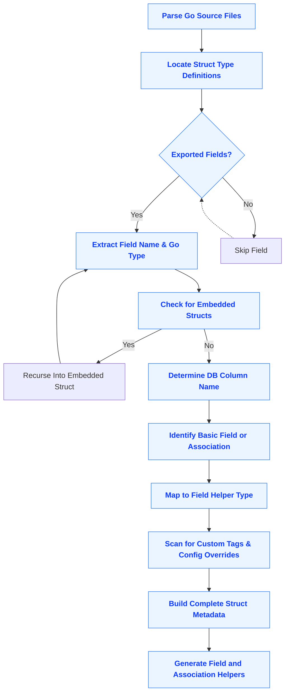

# Data Model Analysis

Understanding and working with your Go model structs is fundamental to leveraging GORM CLI’s powerful type-safe code generation capabilities. This guide delves into how GORM CLI analyzes your model types to extract relevant fields, associations, and metadata, shaping the generated APIs and field helpers that provide fluent, compile-time safe data access.

---

## Why Data Model Analysis Matters

Your Go struct models represent the shape, relationships, and semantics of your database entities. GORM CLI analyzes these models to:

- Identify **basic fields** such as strings, numbers, times, and nullable types for generating precise field predicates and setters.
- Discover **associations** (has one, has many, belongs to, many2many, polymorphic) to enable rich, safe association helpers.
- Extract **database metadata** like column names through struct tags or naming conventions to map Go fields to SQL columns accurately.
- Support **custom field helpers** based on field tags or type mappings (e.g., JSON field support).

By thoroughly analyzing models, GORM CLI generates APIs that are expressive, discoverable, and safe, directly reflecting your Go code’s intent and structure.

---

## How GORM CLI Analyzes Your Model Structs

### Struct Traversal and Field Extraction

When you run the generator, it parses your Go source files and locates all struct type definitions within the configured input path.

For each struct:

- GORM CLI enumerates **exported fields** only, ensuring the generated code matches the public API expected.
- Embedded structs (anonymous fields) are recursively analyzed, with their fields merged into the parent struct, flattening the hierarchy.
- Fields’ Go types are parsed carefully, supporting pointers, slices, and named types.

**Example:**

```go
// Model with embedded and basic fields
type User struct {
    gorm.Model          // embeds ID, CreatedAt, UpdatedAt, DeletedAt
    Name string         // basic string field
    Age  int            // basic int field
    Profile string `gen:"json"` // custom-typed field via tag
    Pets  []Pet         // has many association
    CompanyID *int      // foreign key field
    Company Company     // belongs to association
}
```

### Database Column Name Resolution

To accurately generate SQL and field helpers, GORM CLI determines your model’s column names:

- It checks for a `gorm:"column:name"` tag on the struct field.
- If absent, it applies the GORM naming strategy (camel-case to snake-case by default).

Example snippet:

```go
func generateDBName(fieldName, gormTag string) string {
  // if `gorm:"column:name"` tag exists, use that
  // else convert camel-case fieldName to snake_case
}
```

This ensures the generated code aligns precisely to the actual database schema.

### Supported Field Data Types

GORM CLI supports all common Go field types relevant for database interaction:

| Type Category                   | Examples                                      | Generated Helper Type             |
|--------------------------------|-----------------------------------------------|---------------------------------|
| Basic Fields                   | `int`, `float64`, `string`, `bool`, `time.Time`, `[]byte` | `field.Number[int]`, `field.String`, `field.Bool`, `field.Time`, `field.Bytes` |
| Nullable or Scanner/Valuer     | `sql.NullInt64`, user-defined implementing `Scanner`/`Valuer` | Custom mapped helpers (e.g., `field.Time` for `sql.NullTime`) |
| Pointer Types                 | `*string`, `*int`, `*time.Time`             | Wrapped underlying types       |
| Slice Types                   | `[]int`, `[]*Pet` (has-many/many-to-many associations)  | `field.Slice[T]`                   |
| Struct Types                  | `struct`, other model structs (belongs-to/has-one)     | `field.Struct[T]`                  |

### Support for Associations

Associations are a key mechanism in relational models. GORM CLI detects association fields and categorizes them based on their Go type signatures and GORM metadata if present:

- **Belongs To:** A struct field representing a parent (usually a pointer), paired often with a foreign key field.
- **Has One:** A single struct field related by foreign key in the child.
- **Has Many:** A slice of pointers or structs pointing to child records.
- **Many To Many:** A slice representing many-to-many relationships, often using a join table.
- **Polymorphic Associations:** Supported by identifying polymorphic keys and interface patterns.

**Example:**

```go
// belongs to User
type Pet struct {
    ID      uint
    OwnerID uint     // foreign key
    Owner   User     // belongs to
}

// user field `Pets` is has many
func (f Field) Type() string {
    // For slice => field.Slice[T]
}
```

The generator creates specific association helpers with methods like `Create()`, `Update()`, `Unlink()`, and `Delete()` to safely manage relations with compile-time checks.

---

## Custom Field Handling and Configuration

Beyond the default analysis, GORM CLI lets users customize how fields map to helper types via configuration and struct tags.

- The `genconfig.Config` supports `FieldTypeMap` and `FieldNameMap` to override types globally or by tag.
- For example, if you want to treat fields tagged `gen:"json"` using a custom JSON helper, configure this in your package:

```go
var _ = genconfig.Config{
  FieldNameMap: map[string]any{"json": JSON{}},
}
```

- The generator will then use that custom helper when generating code for those fields.

This extensibility is critical for supporting database-specific types or advanced serialization behaviors.

---

## Common Patterns and Best Practices

- **Exported fields only:** Only exported struct fields appear in generated field helpers.
- **Consistent naming:** Use GORM’s column naming conventions or explicit tags to avoid mismatches.
- **Flatten embedded structs thoughtfully:** Embed only related fields to avoid naming conflicts.
- **Use tags for custom helpers:** Leverage `gen:"name"` tags for specialized field support.
- **Declare associations clearly:** Define associations using GORM tagging for accurate code generation.

---

## Troubleshooting Common Issues

<Tip>
If you notice fields missing from generated code, verify that:

- The field is exported (uppercase first letter).
- The containing struct is included by your generation configuration.
- Embedded structs are being analyzed correctly; potentially flatten manually if ambiguous.

</Tip>

<Warning>
Incorrect or missing `gorm:"column"` tags can cause misalignment between your model and database columns, leading to SQL errors or unexpected behavior.
</Warning>

<Info>
If you modify struct fields or tags, regenerate your code to keep everything in sync.
</Info>

---

## Visualizing Data Model Analysis Workflow



This diagram demonstrates how GORM CLI progressively inspects each struct to accumulate detailed metadata used for high-fidelity code generation.

---

## Summary

The rigorous analysis of your Go model structs empowers GORM CLI to produce a seamless developer experience by generating:

- Type-safe query fields aligned to database columns
- Fluent association helpers that enforce correct relationship semantics
- Customizable behavior respecting your project’s unique data types and conventions

Taking the time to understand this process ensures you can maximize the type safety, discoverability, and reliability of your generated ORM layer.

---

## Related Documentation

- [Defining Models & Query Interfaces](../getting-started/your-first-code-generation/defining-models-interfaces) — Your first step to creating models and interfaces for code generation.
- [Field Helpers and Association Semantics](../gorm-cli-concepts/type-safety-data-models/field-helpers-and-associations) — Deep dive into generated field helpers and semantics by association type.
- [Configurable Generation](../gorm-cli-concepts/configuration-and-integration/generation-configuration) — Learn how to customize field mappings and generation scope.
- [Code Generation Workflow](../gorm-cli-concepts/core-architecture/code-generation-workflow) — Understand how the entire generate-run cycle works including input parsing.

---

## Next Steps

1. Define your Go model structs following best practices and leveraging GORM tags.
2. Use `genconfig.Config` to adjust field mappings for any special types.
3. Run the GORM CLI generator and explore the generated field helpers and association APIs.
4. Consult association handling guides to manage model relationships safely.

Harnessing the power of data model analysis will unlock concise, safe, and maintainable database interactions for your Go applications with GORM CLI.
