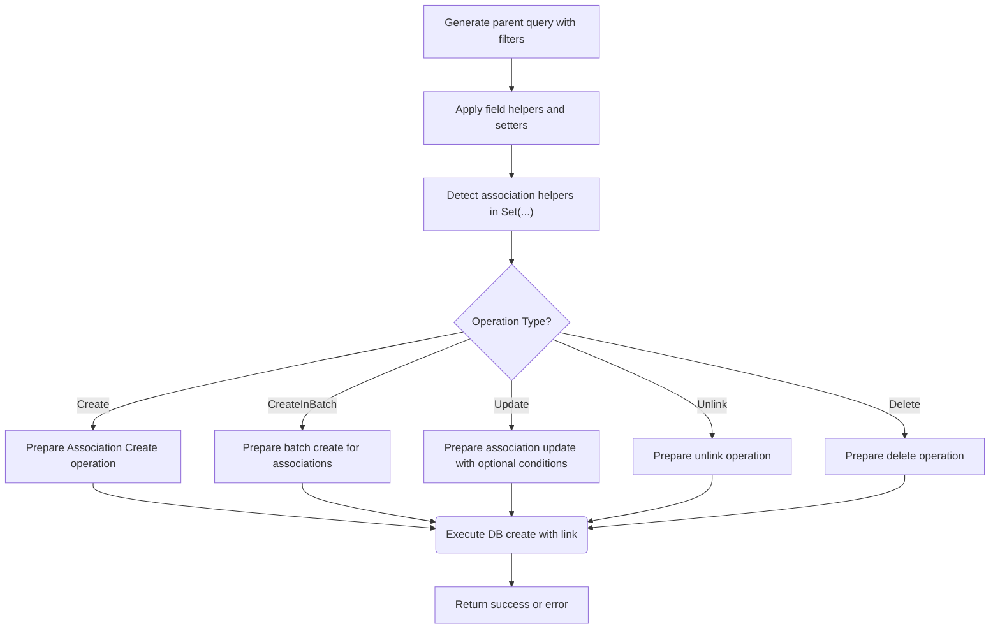

# Field Helpers and Association Semantics

This document unpacks the core logic behind the generated **field helpers** and **association operators** in GORM CLI. It explains how the system constructs **predicates** (filters), **setters** (updates/creates), and **relationship helpers** to make database operations not only fluent but **type-safe** at compile time. Users will learn how these constructs facilitate common operations such as filtering, updating, and manipulating associations with confidence and precision.

---

## Understanding Field Helpers

GORM CLI generates **field helpers** from your Go model structs, transforming each field into a strongly-typed construct that enables expressive and compile-checked query and update statements. These helpers align with your database columns, encapsulating SQL predicate and assignment logic.

### Types of Field Helpers

- **Basic fields** correspond to scalar types like `int`, `string`, `bool`, `time.Time`, nullable types and custom types mapped through configuration.
- **Association fields** represent relationships and use two specialized flavors:
  - `field.Struct[T]` for single (one-to-one or belongs-to) associations.
  - `field.Slice[T]` for multi-record collections (one-to-many or many-to-many).

### Predicates (Filtering)

Every field helper provides methods to build SQL conditions safely. For example:

```go
// Predicate example: generate WHERE conditions
generated.User.Name.Eq("alice")      // WHERE name = 'alice'
generated.User.Age.Gt(18)              // WHERE age > 18
generated.User.Score.IsNull()          // WHERE score IS NULL
```

These predicates are type-safe and prevent common errors like mismatched types or invalid column names.

### Setters (Updates and Creates)

Field helpers also define setters for building updates or insertions through `Set(...)`. For example:

```go
// Setters example: generate SET assignments
generated.User.Name.Set("bob")       // SET name = 'bob'
generated.User.Age.Incr(1)             // SET age = age + 1
```

Combined with GORM's `Set(...).Update(ctx)` or `Set(...).Create(ctx)`, these helpers allow elegant and safe data modifications.

### Handling Zero and Null Values

The generated setters correctly support zero values (e.g., empty strings, false booleans) and nullable types (e.g., `sql.NullInt64`) to express `NULL` assignments seamlessly.

---

## Association Helpers and Operators

Associations represent relationships between models and require specialized helpers that can act on related rows safely and efficiently. GORM CLI generates **association helpers** as:

- `field.Struct[T]` — for associations involving exactly one related record (e.g., has one, belongs to).
- `field.Slice[T]` — for associations representing collections (e.g., has many, many-to-many).

### Core Operations

Association helpers provide the following key operation builders, which are designed to be passed into `Set(...).Update(ctx)` or `Set(...).Create(ctx)` calls:

| Operation   | Description                                                    | Use Case Example                                       |
|-------------|----------------------------------------------------------------|--------------------------------------------------------|
| `Create`    | Create a new associated record per matched parent             | Creating a pet when creating a user                     |
| `CreateInBatch` | Batch create multiple associated records per matched parent | Batch linking languages when updating a user            |
| `Update`    | Update associated records matching optional conditions        | Updating pet names with a condition                      |
| `Unlink`    | Remove association link without deleting associated records   | Clearing user’s pets association without deleting pets  |
| `Delete`    | Delete associated records (or join rows for m2m)              | Removing pets or join rows permanently                    |

### Condition Filtering on Associations

For multi-record associations (and single ones to some extent), you can apply `Where(...)` conditions to target specific associated rows before `Update`, `Unlink`, or `Delete` operations:

```go
generated.User.Pets.Where(generated.Pet.Name.Eq("fido")).Update(
    generated.Pet.Name.Set("rex"),
)
```

This targets the user's associated pets named "fido" to update their names.

### Unlink Semantics by Association Type

- **belongs to:** sets the parent foreign key (FK) to NULL without deleting
- **has one/has many:** sets the child FK to NULL
- **many2many:** removes entries from join tables only

Unlink clears links but preserves associated records.

### Delete Semantics by Association Type

- Deletes associated rows or join records (for many2many). The records themselves in base tables are deleted only if applicable.

### Examples

Create + associate a new record:

```go
gorm.G[User](db).
  Set(
    generated.User.Name.Set("alice"),
    generated.User.Pets.Create(generated.Pet.Name.Set("fido")),
  ).
  Create(ctx)
```

Batch create many-to-many relations:

```go
gorm.G[User](db).
  Where(generated.User.ID.Eq(1)).
  Set(
    generated.User.Languages.CreateInBatch([]models.Language{{Code: "EN"}, {Code: "FR"}}),
  ).
  Update(ctx)
```

Delete associated records conditionally:

```go
gorm.G[User](db).
  Where(generated.User.ID.Eq(1)).
  Set(
    generated.User.Pets.Where(generated.Pet.Name.Eq("old")).Delete(),
  ).
  Update(ctx)
```

Unlink all pets:

```go
gorm.G[User](db).
  Where(generated.User.ID.Eq(1)).
  Set(generated.User.Pets.Unlink()).
  Update(ctx)
```

---

## Compile-Time Safety

The generated field and association helpers encode database columns and relationships as typed Go constructs. This design enforces compile-time constraints on:

- Field names and associated tables
- Predicate argument types
- Assignment types in update/create operations
- Valid chaining of queries and operations on associations

This eliminates a broad category of runtime errors caused by invalid field or association references, thus improving code reliability.

---

## Internal Representation of Association Helpers (Conceptual)

Under the hood, association helpers track:

- The **association name** (corresponding to the relationship field in the model)
- Optional **conditions** that filter the associated records

```go
// Simplified associationWithConditions example
associationWithConditions {
  name string             // e.g., "Pets"
  conditions []clause.Expression // e.g., generated.Pet.Name.Eq("fido")
}
```

Operations (`Create`, `Update`, `Delete`, `Unlink`, `CreateInBatch`) produce `clause.Association` structs encapsulating SQL update semantics, used by GORM internally when performing actual DB operations.

This design allows fluent composition and clear semantics of complex association interactions with parent records.

---

## Tips and Best Practices

- **Use association helpers for all create/update/delete of related models** to ensure foreign keys and join tables are managed safely.
- **Apply `Where(...)` filters on association helpers** when operations should only affect specific related records.
- **Understand unlink semantics** to avoid unintended deletes — unlinking removes association links only.
- **For bulk operations, prefer `CreateInBatch`** to reduce the number of database calls.
- **Check generated code** to understand how your model fields are represented with typed helpers.
- **Use the helpers in your queries and mutations for maximum type safety and discoverability.**

---

## Troubleshooting Common Scenarios

<AccordionGroup title="Troubleshooting Association Operations">
<Accordion title="No associated record created when using Create helper">
Check that the association helper is used with `Set(...).Create(ctx)` or `Update(ctx)` on the parent record. Association helpers generate the necessary clauses only when combined with these calls.
</Accordion>
<Accordion title="Update on association affects unintended records">
Ensure you apply the `Where(...)` method on the association helper to filter target rows precisely before calling `Update(...)`.
</Accordion>
<Accordion title="Unlinking does not set FK to NULL as expected">
Verify your association type; unlink semantics depend on the relationship type: has one/many sets child FK to NULL; belongs to sets parent FK to NULL; many2many deletes join rows.
</Accordion>
<Accordion title="Batch create fails or does not link properly">
`CreateInBatch` requires passing slices of model instances; ensure slices are correctly constructed and associated in the context of the parent.
</Accordion>
</AccordionGroup>

---

## Visual Overview of Association Helper Use Flow



---

## Further Reading and Related Documentation

- [Working with Field Helpers (Core Workflow)](/guides/core-workflows/field-helper-basics): Hands-on guide to using model-driven field helpers.
- [Handling Associations with Helpers (Core Workflow)](/guides/core-workflows/association-guides): Deep dive into managing associations effectively.
- [Defining Models & Query Interfaces (Getting Started)](/getting-started/your-first-code-generation/defining-models-interfaces): How to prepare your models for code generation.
- [Configuration with genconfig](https://gorm.io/cli/gorm/genconfig): Advanced customization of field mappings.

---

## Summary

This page details how GORM CLI generates the foundational field helpers and association operators that enable type-safe, fluent database operations. By leveraging generated predicates, setters, and relationship helpers, users can build complex filters, updates, and association manipulations confidently and correct at compile time. Understanding these semantics empowers developers to write precise, maintainable, and safe data access code using GORM CLI's generated APIs.

---

_For full practical examples and test coverage, refer to the generated code and example tests in the [examples/output/models_relations_test.go](https://github.com/go-gorm/cli/blob/main/examples/output/models_relations_test.go) and [examples/output/models_field_helpers_test.go](https://github.com/go-gorm/cli/blob/main/examples/output/models_field_helpers_test.go)._

---

<Source url="https://github.com/go-gorm/cli" paths='[{"path": "field/association.go", "range": "1-79"}]' />