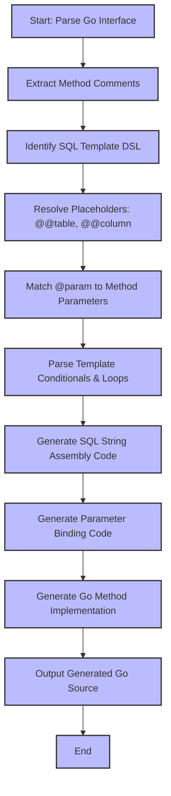

# Type-Safe Queries by Design

GORM CLI empowers you to write robust, type-safe database query APIs based entirely on Go interfaces with embedded SQL templates. This page explores how interface-driven query methods are parsed, parameter bindings are applied, and code is generated with compile-time guarantees—enabling you to express complex queries safely and fluently.

---

## Introduction to Interface-Driven Query APIs

At the heart of GORM CLI lies the conversion of Go interfaces into concrete query APIs that guarantee correctness and safety at compile time. You define interfaces with methods whose documentation comments contain SQL templates—these templates include special directives and placeholders that the generator parses and transforms into fully-typed, idiomatic Go methods.

Through this mechanism, you benefit from:

- **Automatic SQL construction** driven by your method comments
- **Safe parameter binding** directly tied to your Go method parameters
- **Dynamic query composition** via conditional, iterative, and templated SQL snippets
- **Strong method signatures** with context support and typed results

This structured approach empowers you to focus on the *what* of your queries without manually writing repetitive boilerplate.

---

## How Method Comments Drive Safe SQL Code Generation

### Writing SQL Templates in Interface Method Comments

Each interface method documents the SQL query it represents using GORM CLI's SQL template DSL. This DSL supports:

- **Table & column placeholders** like `@@table` and `@@column` that resolve dynamically
- **Parameter binding** with the `@param` syntax that ties SQL placeholders to Go method arguments
- **Conditional blocks** (`{{if}}`, `{{else}}`, `{{end}}`) to generate flexible SQL fragments based on parameter values
- **Iterative blocks** (`{{for}}`) for working with slices or collections in queries
- **Special clauses** like `{{where}}` and `{{set}}` to handle conditional filtering and updates cleanly

For example, a method declaring:

```go
// SELECT * FROM @@table WHERE id=@id
GetByID(id int) (T, error)
```

will generate code that safely replaces the `@@table` placeholder with the appropriate model table name and binds the `id` parameter to the SQL query, ensuring type safety and proper escaping.

### Code Generation Enforces Method Signatures and Parameter Bindings

The generator parses your interface, extracts method signatures, and uses method comments to emit Go code that:

- Accepts your defined arguments, injecting `context.Context` automatically when missing.
- Constructs the SQL query string dynamically based on the template directives.
- Binds each `@param` occurrence to the corresponding Go argument at the correct position.
- Uses `clause.Table` and `clause.Column` to represent dynamic table/column names.
- Returns the expected result types (e.g., `T`, `[]T`, or `error`), fully typed and compatible with your model.

This generation process eliminates runtime query errors caused by invalid SQL composition or parameter mismatches.

---

## Understanding Parameter Binding and Template Parsing

GORM CLI's strong safety model depends on rigorous parsing of your SQL templates inside method comments.

1. **Extraction**: The generator extracts raw SQL template strings from doc comments.

2. **Directive Detection**: It identifies template DSL directives like `@@table`, `@param`, `{{where}}`, and others.

3. **Parameter Mapping**: It maps every `@param` expression to a Go method parameter or struct field, supporting expressions like `@user.Name` when structs are passed.

4. **SQL String Assembly**: The generator builds strings with placeholder substitution spots (typically `?` for SQL parameters).

5. **Safe SQL Construction**: Using `strings.Builder` and parameter slice accumulation, it composes final SQL statements that GORM can execute safely.

6. **Conditional Logic**: Template conditions produce optional SQL fragments only when parameters meet the specified criteria.

7. **Iteration**: Loops over collections (e.g., `{{for _, user := range users}}`) generate composite SQL filters or inserts.

This model guarantees that generated queries accurately reflect interface intent and are immune to common SQL injection or parameter binding omissions.

---

## Typical Query Method Signatures and Return Types

The generator produces Go method implementations matching your interface signatures:

- **Input parameters**: including primary keys, filter structs, slices, or simple scalars.
- **Return types**: typically as `(T, error)` for single records, `([]T, error)` for multiple results, or `error` for update/delete operations.
- **Context injection**: methods automatically support `context.Context` for cancellation and deadlines.

Example interfaces:

```go
// GetByID returns a single entity matching the given ID
GetByID(id int) (T, error)

// FilterWithColumn supports dynamic column filtering
FilterWithColumn(column string, value string) (T, error)

// QueryWith demonstrates conditional filtering on user struct
QueryWith(user User) (T, error)

// UpdateInfo shows templated dynamic SET clause
UpdateInfo(user User, id int) error

// Filter supports filtering over a slice with iteration
Filter(users []User) ([]T, error)
```

---

## Real-World Example of SQL Template and Generated Method

Consider the following interface snippet from `examples/query.go`:

```go
// GetByID query data by id and return it as struct
//
// SELECT * FROM @@table WHERE id=@id AND name = "\@name"
GetByID(id int) (T, error)
```

The generator produces an implementation roughly as:

```go
func (e QueryImpl[T]) GetByID(ctx context.Context, id int) (T, error) {
  var sb strings.Builder
  params := make([]any, 0, 2)

  sb.WriteString("SELECT * FROM ? WHERE id=? AND name = \"@name\"")
  params = append(params, clause.Table{Name: clause.CurrentTable}, id)

  var result T
  err := e.Raw(sb.String(), params...).Scan(ctx, &result)
  return result, err
}
```

Notice how:

- `@@table` is replaced with `clause.Table{Name: clause.CurrentTable}`, referring to the underlying model's table.
- The method parameter `id` is securely appended to the parameters slice.
- Literal text like `"\@name"` is preserved (escaped `@` is treated literally).
- The query returns a typed result `T` with error support.

This mapping simplifies your data access code to simple method calls while preserving raw SQL expressiveness.

---

## Practical Tips and Best Practices

- **Always write clear, concise SQL templates** in your method comments—these drive generated code behavior.
- Use **placeholders like `@@table` and `@@column`** for flexibility and automatic binding.
- Leverage the **template DSL** (`{{where}}`, `{{set}}`, `{{if}}`) to handle optional filters and partial updates.
- Bind parameters explicitly with `@param` syntax to avoid query injection and ensure clarity.
- When passing structs as parameters, refer to fields with `@struct.Field` for intuitive binding.
- Use iterable constructs for batch filters: `{{for _, user := range users}}`.
- Remember that the generator will **add `context.Context`** as the first parameter in methods that omit it.

---

## Troubleshooting Common Issues

<AccordionGroup title="Troubleshooting Common Issues">
<Accordion title="Empty or Missing SQL Annotations">
Ensure your interface method has a properly formatted SQL template comment. Without it, the method will not generate meaningful code.
</Accordion>
<Accordion title="Parameter Binding Errors">
Check that every `@param` in the template matches a method parameter by name and type. Misspelled or mismatched parameters cause generation failures.
</Accordion>
<Accordion title="Context Not Propagated">
If your method lacks a `context.Context` parameter, the generated code inserts one automatically. Ensure your calls provide a context.
</Accordion>
<Accordion title="Unintended Literal `@` in SQL">
To write a literal `@` character in SQL, escape it as `\@` in the comment.
</Accordion>
<Accordion title="Complex Conditions Not Rendering">
Validate your template conditional logic syntax and parameter types. Improper conditions or unexported struct fields may cause missing SQL parts.
</Accordion>
</AccordionGroup>

---

## Visual Workflow of Template Parsing and Code Generation



---

## Related Topics and Next Steps

- For foundational concepts on interface design and SQL templating, see [Defining Models & Query Interfaces](/getting-started/your-first-code-generation/defining-models-interfaces).
- To understand the full process from interface to generated code, review the [Code Generation Workflow](/gorm-cli-concepts/core-architecture/code-generation-workflow).
- Once you have generated APIs, learn how to use them effectively in your application with [Using the Generated APIs](/guides/core-workflows/using-generated-apis).
- For customizing generation behaviors, refer to [Customizing Code Generation with genconfig](/guides/advanced-usage/customizing-generation).

---

This page ensures you grasp the pivotal concepts behind interface-driven, type-safe query generation—crucial to unlocking GORM CLI’s power for your Go projects.


---

<Check>
Remember: Your SQL template comments are the source of truth. Clear, precise annotations lead to elegant, safe, and maintainable generated query APIs.
</Check>
