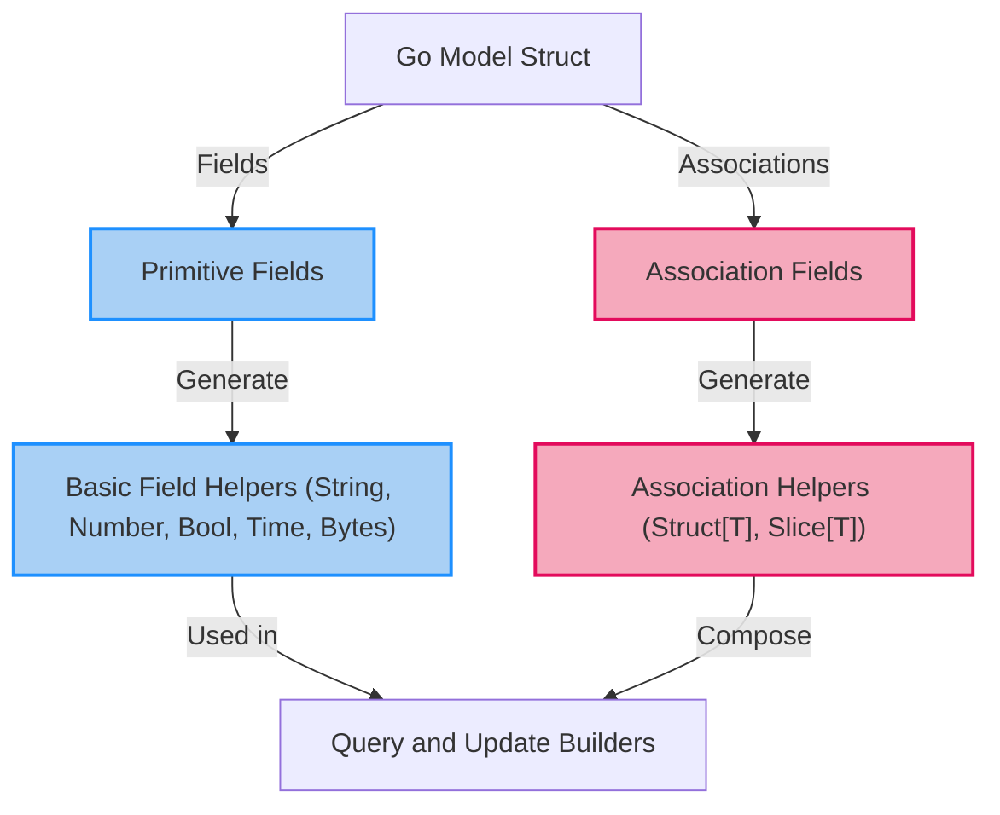

# Field Helpers and Strong Typing

## Understanding Field Helpers in GORM CLI

Field helpers in GORM CLI are automatically generated accessor objects that provide a strongly typed, fluent interface for safely filtering, assigning, and manipulating your model fields in your database queries and mutations. They act as the bridge between your Go structs (models) and your database operations, enabling you to build expressive, chainable, and type-safe queries without manually writing SQL or risking common errors like column name mismatches or unsafe assignments.

This page unpacks the concepts behind these field helpers, how they are created for both primitive fields and associations, and how you can leverage them to write concise, readable, and correct database code.

---

## Why Use Field Helpers?

Imagine writing queries and updates for a model with dozens of fields. Without field helpers, you'd write raw strings for columns or repetitive helper functions—prone to typos and lacking compile-time checks.

Field helpers solve these pain points by:

- **Enforcing strong typing:** Each field exposes methods tailored to its type (e.g., strings have `.Like()`, numbers have `.Gt()`, times have `.Before()`).
- **Enabling safe column references:** The underlying column or association name is embedded automatically, so you never mistype a DB column.
- **Providing expressive, chainable APIs:** You can fluently build complex expressions without losing clarity.

---

## Generation of Field Helpers

GORM CLI generates field helpers based on your Go model structs. This happens during code generation alongside the generation of query interfaces.

### For Primitive Fields

Fields such as `int`, `string`, `bool`, `time.Time`, `[]byte`, and types implementing database scanner/valuer or serializer interfaces are detected and mapped to corresponding field helper types.

For example, a `string` field generates a `field.String` helper, exposing predicates like `.Eq()`, `.Like()`, `.In()`, and setters like `.Set()`:

```go
// Model example

type User struct {
    ID    uint
    Name  string
    Age   int
    Email string
}

// Generated field helpers
var User = struct {
    ID   field.Number[uint]
    Name field.String
    Age  field.Number[int]
    Email field.String
}{
    ID: User.ID{}.WithColumn("id"),
    Name: User.Name{}.WithColumn("name"),
    Age: User.Age{}.WithColumn("age"),
    Email: User.Email{}.WithColumn("email"),
}
```

Here each field helper is preconfigured with the validated column name, so your query code can use it effortlessly.

### For Associations

Associations like `has one`, `has many`, `belongs to`, and `many2many` generate specialized helpers leveraging `field.Struct[T]` (for single structs) or `field.Slice[T]` (for slices). These helpers allow you to write association-aware operations with type safety:

```go
// For single association (has one, belongs to)
User.Account.Struct[Account]{}.WithName("Account")

// For multiple associations (has many, many2many)
User.Pets.Slice[Pet]{}.WithName("Pets")

// Using association helpers
gorm.G[User](db).
  Set(
    User.Name.Set("alice"),
    User.Pets.Create(User.Pet.Name.Set("fido")),  // Create and link one pet
  ).
  Create(ctx)
```

The generated association helpers support core operations:

- `Create`: create and associate new records
- `CreateInBatch`: batch creation for multiple records
- `Update`: update associated records
- `Unlink`: remove association without deleting records
- `Delete`: delete associated records

This encapsulates complex association logic in clear, compile-time safe methods.

---

## Core Field Helper Types

### Basic Primitives

The generator maps field Go types to helpers as follows:

| Go Type          | Field Helper Type              | Notes                                |
| ---------------- | ----------------------------- | ------------------------------------ |
| `string`         | `field.String`                | String predicates like `.Eq()`, `.Like()` |
| `bool`           | `field.Bool`                  | Boolean predicates like `.IsTrue()`|
| `[]byte`         | `field.Bytes`                 | Byte slice predicates               |
| `time.Time`      | `field.Time`                  | Time predicates like `.Before()`, `.After()` |
| Numeric types    | `field.Number[T]`             | Generic number predicates e.g., `.Gt()`, `.Between()` |
| Other custom types | `field.Field[T]`             | Generic fallback to wrap custom types |

### Associations

- **Single struct association:** `field.Struct[T]`
- **Slice association:** `field.Slice[T]`

These types provide methods to express conditional operations on related tables.

---

## Example: Using Field Helpers in Queries and Updates

```go
// Query users whose name contains "john" and age is greater than 30
users, err := gorm.G[User](db).
  Where(
    User.Name.Like("%john%"),
    User.Age.Gt(30),
  ).
  Find(ctx)

// Update a user's email and increment age by 1
err := gorm.G[User](db).
  Where(User.ID.Eq(42)).
  Set(
    User.Email.Set("john@example.com"),
    User.Age.Incr(1),
  ).
  Update(ctx)

// Create a user with an associated pet
err := gorm.G[User](db).
  Set(
    User.Name.Set("alice"),
    User.Pets.Create(User.Pet.Name.Set("fido")),
  ).
  Create(ctx)
```

This example illustrates how the generated helpers give you concise, readable code that reflects exactly what happens in the database.

---

## Practical Tips and Best Practices

- **Always use generated field helpers for predicates and updates** to prevent subtle bugs from misspelled column names.
- **Use association helpers for related data manipulations** to ensure your association semantics are correctly expressed and type-safe.
- **Consult your generated code** to understand the available predicates and setters for your fields.
- **Customize field mappings** via `genconfig.Config` if you want to override default helper types or handle special cases like JSON.

---

## Common Pitfalls

- Forgetting to regenerate code after changing your models leads to stale or missing helpers.
- Using raw strings instead of field helpers may cause silent runtime errors due to typos.
- Misunderstanding association operations—e.g., using `Unlink` vs. `Delete`—could lead to unexpected deletions or dangling references.

---

## Advanced: Custom Field Helpers

You can extend field helpers by declaring custom helper types and mapping them in `genconfig.Config` using the `FieldNameMap` or `FieldTypeMap` fields. For example, to map a JSON field:

```go
var _ = genconfig.Config{
  FieldNameMap: map[string]any{
    "json": JSON{},
  },
}
```

Your custom helper implements methods to generate database-specific SQL expressions, enabling powerful, type-safe, and expressive query capabilities beyond primitives.


---

## Summary

Field helpers serve as the core foundation of GORM CLI's type-safety and fluent API experience for database queries and updates. Understanding how they are generated, categorized, and used empowers you to write safer, cleaner, and more maintainable data access code with full compile-time guarantees.

For more detailed examples, refer to the [Using Field Helpers for Queries and Updates](../core-usage-patterns/using-field-helpers.md) guide.

---

## See Also

- [Using Field Helpers for Queries and Updates](../core-usage-patterns/using-field-helpers.md)
- [Working with Associations: Create, Update, Unlink, Delete](../core-usage-patterns/association-operations.md)
- [Configuring Code Generation](../../customization-advanced/generator-configuration.md)
- [Your First Code Generation](../../getting-started/onboarding-core/first-code-generation.md)

---

## Diagram: Field Helper Types and Their Relationships



This diagram shows how your Go struct fields feed into the generation of field helpers for both primitive types and associations, which are then used to build queries and perform updates.

---

## Troubleshooting

<AccordionGroup title="Common Issues with Field Helpers">
<Accordion title="Field helpers missing after code generation">
Ensure you've saved your model struct files and rerun the generator pointing at the correct directories or packages. Check generation logs and output path to confirm generated files.
</Accordion>
<Accordion title="Type errors using field helpers in queries">
Verify that your model fields and their types are correctly declared and supported. If using custom types, confirm you have provided appropriate mappings in `genconfig.Config`.
</Accordion>
<Accordion title="Association helpers not appearing or malfunctioning">
Check that your associations are properly declared in your Go structs using standard GORM tags. Confirm you are using the correct helper type (`Struct[T]` for single, `Slice[T]` for multiples).
</Accordion>
</AccordionGroup>


---

This concludes the conceptual overview of Field Helpers and Strong Typing in GORM CLI.

---