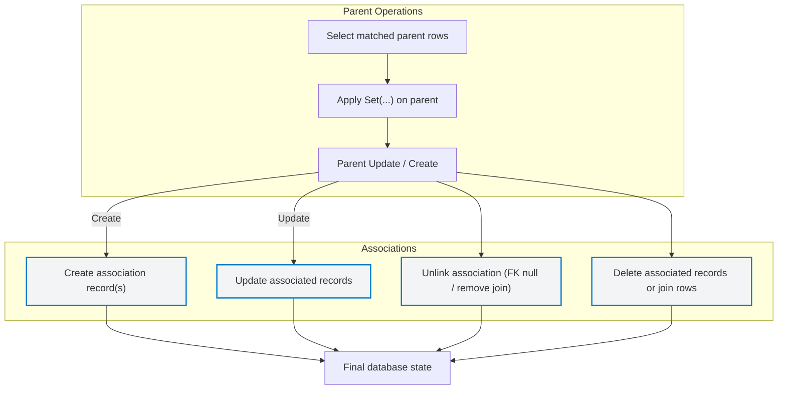

# Associations and Relationship Handling

GORM CLI generates powerful, type-safe field helpers to manage associations between your Go model structs and the underlying SQL database schema. This guide explains how GORM CLI models common relational association types—such as has one, has many, belongs to, many2many, and polymorphic—as typed field helpers. It also covers the semantics of association operations like create, update, unlink, and delete, illustrating how the API design reflects underlying database relationships for composability and safety.

---

## Understanding Association Types

GORM CLI captures common ORM relationships as typed field helpers: either as `field.Struct[T]` for single (struct) associations or `field.Slice[T]` for multiple (slice) associations. These helpers give you strongly typed, fluent APIs to manipulate related data safely and expressively.

| Association Type | Typical Cardinality  | Field Helper Type   | Example in User Model          |
|------------------|---------------------|--------------------|-------------------------------|
| Has One          | One-to-one          | `field.Struct[T]`   | `User.Account`                |
| Has Many         | One-to-many         | `field.Slice[T]`    | `User.Pets`                   |
| Belongs To       | Many-to-one         | `field.Struct[T]`   | `User.Company`                |
| Many2Many        | Many-to-many        | `field.Slice[T]`    | `User.Languages`, `User.Friends` |
| Polymorphic Has One | One-to-one polymorphic | `field.Struct[T]`   | `Pet.Toy`                    |

### Model Example Snippet

```go
// User has many Pets and one Account
User struct {
  Account Account   // has one
  Pets    []*Pet    // has many
  Languages []Language `gorm:"many2many:UserSpeak"` // many2many
  Friends []*User   `gorm:"many2many:user_friends"` // many2many single-table
}
```

---

## Association Operations

Association field helpers come with built-in methods to handle CRUD and link/unlink operations safely and composably.

- **Create:** Creates and associates new records to matched parent(s).
- **CreateInBatch:** Batch create multiple associated records.
- **Update:** Updates existing associated records matching optional conditions.
- **Unlink:** Removes the association link without deleting records.
- **Delete:** Deletes associated records or join rows.

### Semantics by Association Type

| Association | Create                         | Update                   | Unlink                                    | Delete                                   |
|-------------|--------------------------------|--------------------------|------------------------------------------|------------------------------------------|
| Has One     | Insert associated record per parent | Update associated record(s) | Set child foreign key to NULL               | Delete associated record                  |
| Has Many    | Insert one or batch associated per parent | Update associated records, optional where filter | Set child's foreign key(s) to NULL       | Delete child records                      |
| Belongs To  | Insert linked parent records  | Update parent record(s)    | Set parent's foreign key in child to NULL | Delete parent row                        |
| Many2Many   | Create join table rows linking | Update associated records via where       | Remove join table rows only                 | Remove join table rows only (associated rows remain) |
| Polymorphic Has One | Create child with polymorphic keys | Update child matching conditions           | Zero out polymorphic foreign keys on child | Delete child record                      |

### Usage Example: Creating and Associating

```go
// Create a new user and create one pet associated
gorm.G[User](db).
  Set(
    generated.User.Name.Set("alice"),
    generated.User.Pets.Create(generated.Pet.Name.Set("fido")),
  ).
  Create(ctx)

// Link existing languages batch to an existing user
gorm.G[User](db).
  Where(generated.User.ID.Eq(1)).
  Set(generated.User.Languages.CreateInBatch([]models.Language{{Code: "EN"}, {Code: "FR"}})).
  Update(ctx)
```

### Usage Example: Update and Unlink

```go
// Update a user's pet where name='fido'
gorm.G[User](db).
  Where(generated.User.ID.Eq(1)).
  Set(
    generated.User.Pets.Where(generated.Pet.Name.Eq("fido")).
      Update(generated.Pet.Name.Set("rex")),
  ).
  Update(ctx)

// Unlink pets (sets pet.UserID to NULL) from user
gorm.G[User](db).
  Where(generated.User.ID.Eq(1)).
  Set(generated.User.Pets.Unlink()).
  Update(ctx)
```

### Usage Example: Delete

```go
// Delete pets associated with a user matching condition
gorm.G[User](db).
  Where(generated.User.ID.Eq(1)).
  Set(generated.User.Pets.Where(generated.Pet.Name.Eq("old")).Delete()).
  Update(ctx)

// Delete join table rows for many2many association (friend removed from user)
gorm.G[User](db).
  Where(generated.User.ID.Eq(1)).
  Set(generated.User.Friends.Where(generated.User.Name.Eq("friend-a")).Delete()).
  Update(ctx)
```

---

## API Design Reflecting SQL Semantics

GORM CLI’s association helpers mirror the underlying SQL relationship semantics, ensuring safe composability:

- **Unlink operations** adjust foreign keys to NULL or delete join rows only without removing actual records.
- **Delete operations** remove actual associated records (or join table rows in many2many).
- Association operations are designed to be invoked in `Set(...).Update(ctx)` or `Set(...).Create(ctx)` flows, where parent filters apply first, then association changes apply within matched parents.

This design minimizes accidental cascading deletes and gives fine control over related records, a critical safety aspect in complex relational schemas.

---

## Detailed Examples from Real Tests

The `examples/output/models_relations_test.go` file contains comprehensive tests demonstrating full scenarios:

- Creating associated records per matched parent
- Batch association linking via `CreateInBatch`
- Updating associated child records with conditions
- Unlinking associations safely without deleting
- Deleting associated child records or join rows
- Handling polymorphic associations with expected foreign key resets

These tests validate the type-safe field helpers, their correct underlying clause construction, and end-to-end database effects.

---

## Example: Has One Association (`User.Account`)

```go
// Create an Account associated with a User
gorm.G[User](db).
  Set(
    generated.User.Name.Set("alice"),
    generated.User.Account.Create(generated.Account.Number.Set("A-001")),
  ).
  Create(ctx)

// Update Account where number='A-001'
gorm.G[User](db).
  Where(generated.User.ID.Eq(userID)).
  Set(
    generated.User.Account.Where(generated.Account.Number.Eq("A-001")).Update(
      generated.Account.Number.Set("A-002"),
    ),
  ).
  Update(ctx)

// Unlink Account: set Account.UserID to NULL
gorm.G[User](db).
  Where(generated.User.ID.Eq(userID)).
  Set(generated.User.Account.Unlink()).
  Update(ctx)

// Delete Account entirely
gorm.G[User](db).
  Where(generated.User.ID.Eq(userID)).
  Set(generated.User.Account.Delete()).
  Update(ctx)
```

## Example: Many2Many Association (`User.Languages`)

```go
// Create and link a language to a user
gorm.G[User](db).
  Where(generated.User.ID.Eq(userID)).
  Set(
    generated.User.Languages.Create(
      generated.Language.Code.Set("EN"),
      generated.Language.Name.Set("English"),
    ),
  ).
  Update(ctx)

// Unlink a language (remove from join table, keep language row)
gorm.G[User](db).
  Where(generated.User.ID.Eq(userID)).
  Set(generated.User.Languages.Where(generated.Language.Code.Eq("EN")).Unlink()).
  Update(ctx)

// Delete join rows (Unlink is same for many2many, deletion removes join rows only)
gorm.G[User](db).
  Where(generated.User.ID.Eq(userID)).
  Set(generated.User.Languages.Where(generated.Language.Code.Eq("EN")).Delete()).
  Update(ctx)
```

---

## Polymorphic Associations

GORM CLI also generates helpers for polymorphic associations.

Example: `Pet.Toy` is a polymorphic has-one relationship.

- The helper provides `Create`, `Update`, `Unlink`, and `Delete` capabilities.
- Unlink sets polymorphic fields (owner ID and type) to zero values but preserves the record.

```go
// Update the polymorphic toy for a pet
gorm.G[Pet](db).
  Where(generated.Pet.ID.Eq(petID)).
  Set(
    generated.Pet.Toy.Where(generated.Toy.Name.Eq("ball")).Update(
      generated.Toy.Name.Set("cube"),
    ),
  ).
  Update(ctx)

// Unlink polymorphic toy - zeroes owner references
gorm.G[Pet](db).
  Where(generated.Pet.ID.Eq(petID)).
  Set(generated.Pet.Toy.Unlink()).
  Update(ctx)

// Delete polymorphic toy
gorm.G[Pet](db).
  Where(generated.Pet.ID.Eq(petID)).
  Set(generated.Pet.Toy.Delete()).
  Update(ctx)
```

---

## Best Practices & Tips

- **Compose with Conditions:** Use `.Where(...)` on association helpers to target specific associated rows safely.
- **Unlink When Needed:** Prefer `Unlink()` over `Delete()` when you want to preserve records and only remove associations (e.g., foreign keys or join rows).
- **Batch Create:** Use `CreateInBatch` for many records to improve performance and atomicity.
- **Be Aware of Semantics:** Understand unlink vs delete differences per association type to avoid unintentional data loss.

---

## Troubleshooting Common Scenarios

- **No effect on associations after Update:** Ensure conditions on both parent and association sides match the rows you expect.
- **Foreign key not null after Unlink:** Confirm the association helper matches the foreign key field semantics and that the database constraints allow null.
- **Deleting associated records unintentionally:** Confirm that you are using `Delete()` on associations only when removal of records is desired; otherwise use `Unlink()`.

If issues arise, consult example tests in `examples/output/models_relations_test.go` for comprehensive use cases.

---

## Diagram: Association Operation Flow



---

## Summary

GORM CLI’s association field helpers provide a clean, type-safe, and semantically faithful API to manage complex relational data through the Go ORM. By aligning create, update, unlink, and delete operations with the underlying SQL foreign key relationships and join tables, the framework empowers developers to write concise, readable, and safe code for ORM association handling.

For comprehensive examples, advanced customization, and troubleshooting, see the related guides and example tests referenced below.

---

## See Also

- [Field Helpers and Strong Typing](./field-helper-architecture)
- [Working With Associations: Create, Update, Unlink, Delete](./core-usage-patterns/association-operations)
- [Using Generated APIs](./getting-started/onboarding-core/using-generated-apis)
- [Models and Query Interfaces](./core-architecture-overview/models-and-query-interfaces)
- [Examples: models_relations_test.go in GitHub](https://github.com/go-gorm/cli/blob/main/examples/output/models_relations_test.go)

---