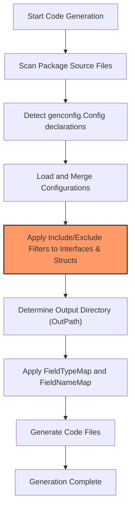

# Customizing Generation with genconfig.Config

Tailoring GORM CLI's code generation to fit your project's unique structure and requirements is straightforward using the `genconfig.Config` configuration. This guide walks you through customizing output directories, mapping Go types and field tags to specialized field helpers, and leveraging include/exclude rules for interfaces and structs. These capabilities enable scalable, maintainable generation setups — especially valuable in larger projects with complex domains.

---

## What You Will Achieve

By the end of this guide, you will understand how to:

- Override default code generation output paths on a per-package or per-file basis.
- Customize field helper generation by mapping Go types or `gen` tags to specific helpers.
- Include or exclude query interfaces and structs selectively using flexible pattern matching.
- Implement best practices for structuring your configurations for maintainability and clarity.

---

## Prerequisites

- Familiarity with Go, including basic understanding of structs, interfaces, and Go modules.
- A working GORM CLI setup with models and interfaces ready for code generation.
- Basic knowledge of how to run the generator CLI command `gorm gen`.

---

## Time Estimate

Approximately 20-30 minutes, depending on project complexity and familiarity.

---

## Configuring genconfig.Config Step-by-Step

### 1. Declaring a genconfig.Config

The configuration is declared as a package-level variable in any Go source file within the package whose code you want to customize. It uses composite literals and requires import of `gorm.io/cli/gorm/genconfig`.

```go
package example

import "gorm.io/cli/gorm/genconfig"

var _ = genconfig.Config{
    // customization entries go here
}
```

This variable is automatically discovered by the generator when it scans the source files.

---

### 2. Overriding Output Directory

By default, generated files are output to `./g` relative to your CLI execution directory. To change this per-package, set the `OutPath` field:

```go
var _ = genconfig.Config{
    OutPath: "custom/generated",
}
```

**Effect:** All generated files from the package where this config is declared output to `custom/generated` instead of the default.

<Info>
Note that this applies at the package or file level depending on `FileLevel` (explained below). Multiple `genconfig.Config` declarations in your project can set outputs per package.
</Info>

---

### 3. Custom Field Helper Mappings

`FieldTypeMap` and `FieldNameMap` provide two ways to map Go types or struct tag names to custom field helpers, allowing you to tailor how fields are represented in generated helpers.

- **FieldTypeMap**: Keyed by Go type instances (e.g., `sql.NullTime{}`), values are wrapper helper instances (e.g., `field.Time{}`).
- **FieldNameMap**: Keyed by the string name used in struct `gen` tags, mapping to wrapper helper instances.

#### Example: Mapping a Go Type

```go
import (
    "database/sql"
    "gorm.io/cli/gorm/field"
    "gorm.io/cli/gorm/genconfig"
)

var _ = genconfig.Config{
    FieldTypeMap: map[any]any{
        sql.NullTime{}: field.Time{},
    },
}
```

This instructs the generator to treat fields of type `sql.NullTime` as the specialized `field.Time` helper.

#### Example: Mapping by gen Tag Name

```go
var _ = genconfig.Config{
    FieldNameMap: map[string]any{
        "json": JSON{}, // JSON is a custom defined helper type
    },
}
```

Use this if you want to map based on explicit `gen:"json"` tags on your struct fields.

<Warning>
FieldNameMap takes priority over FieldTypeMap when both apply.
</Warning>

---

### 4. Inclusion and Exclusion Patterns

You can fine-tune which interfaces and structs get generated using these four fields:

- `IncludeInterfaces` (optional whitelist)
- `ExcludeInterfaces` (optional blacklist)
- `IncludeStructs` (optional whitelist)
- `ExcludeStructs` (optional blacklist)

These fields take slices of selectors expressed as:

- Shell-style string patterns (e.g., "Query*", "*Repo", "pkg.Query")
- Type conversion expressions (e.g., `models.Query(nil)`)

#### Example: Include only interfaces starting with "Query"

```go
var _ = genconfig.Config{
    IncludeInterfaces: []any{"Query*"},
}
```

#### Example: Include specific interface and struct

```go
import "myapp/models"

var _ = genconfig.Config{
    IncludeInterfaces: []any{"I1", models.Query(nil)},
    IncludeStructs:    []any{"S1", models.User{}},
}
```

#### Exclusion Example

```go
var _ = genconfig.Config{
    ExcludeInterfaces: []any{"*Deprecated*"},
}
```

**Priority Rule:**
If `Include*` fields are non-empty, only those items matching will be generated; exclusions do not apply.
If `Include*` is empty but `Exclude*` is defined, those items are removed from generation.

<Note>
Both interfaces and structs are filtered independently. Use this to manage complex selective generation across large codebases and nested package hierarchies.
</Note>

---

### 5. File-Level Scope

The `FileLevel` boolean controls whether this configuration applies only to the single file it is declared in or to the entire package:

- `true`: Applies only to the current file.
- `false` (default): Applies to the whole package.

This is useful for segmented projects or when you want different configs for parts of the same package.

### Best Practice

**For most use cases, set `FileLevel` to `false` and declare one config per package to maintain clarity and avoid scattered configs.**

---

### 6. Practical Example Combining Features

```go
package examples

import (
    "database/sql"
    "gorm.io/cli/gorm/field"
    "gorm.io/cli/gorm/genconfig"
)

var _ = genconfig.Config{
    OutPath:          "generated_code",
    FileLevel:        false,
    FieldTypeMap:     map[any]any{sql.NullTime{}: field.Time{}},
    FieldNameMap:     map[string]any{"json": JSON{}},
    IncludeInterfaces: []any{"Query*"},
    ExcludeInterfaces: []any{"*Deprecated*"},
    IncludeStructs:    []any{"User", "Account*"},
    ExcludeStructs:    []any{"*DTO"},
}
```

This config sets output directory, custom field mappings, selectively generates only interfaces starting with `Query` (excluding deprecated ones), and includes only certain structs.

---

## Tips and Common Pitfalls

- **Consistent Package Paths:** When specifying selectors, use correct package paths and names as recognized by the generator (`pkg.Interface` or `pkg.Struct{}`).
- **Avoid Conflicts:** Don't declare multiple configs with conflicting inclusion/exclusion rules in the same package unless using `FileLevel: true` for scoped effect.
- **Test Iteratively:** After configuring, generate the code and verify generated files match intended scope and customizations.
- **Use Whitelists Over Blacklists:** Whitelisting is more predictable in complex projects; blacklists are better for quick excludes.
- **Custom Field Helpers:** When mapping custom helpers (like JSON), ensure the helper's code is properly implemented and imported in your project.

---

## Troubleshooting

- **Config Not Detected:** Make sure the config variable is at package level and named as `var _ = genconfig.Config{...}`.
- **No Generated Output:** Confirm `IncludeInterfaces` and `IncludeStructs` aren't filtering out everything.
- **Unexpected Output Path:** Check for multiple configs in parent directories or overlapping packages that may override output paths.

For deeper debugging, enable verbose CLI output or check the generation logs.

---

## Next Steps & Related Documentation

- **Running the Generator with Custom Config:** See [Run Generator CLI Guide](https://docs.example.com/getting-started/project-initialization/run-generator) for usage details.
- **Working with Field Helpers:** Learn more on [Model-driven Field Helpers](https://docs.example.com/guides/advanced-features-patterns/working-with-field-helpers) to extend your custom mappings.
- **Writing SQL Template Queries:** Enhance interfaces with [Template Queries Quickstart](https://docs.example.com/guides/core-workflows/template-queries-quickstart).
- **Association Operations:** Manage relations with [Association Semantics Guide](https://docs.example.com/guides/advanced-features-patterns/association-operations).

---

## Summary Diagram: Generation Configuration Flow



This flow illustrates how the generator incorporates your `genconfig.Config` settings to guide filtering, field mapping, and output placement.

---

By customizing `genconfig.Config`, you unlock fine control over GORM CLI's powerful generation capabilities, enabling tailored, efficient, and maintainable code tailored to your project's scale and complexity.

---