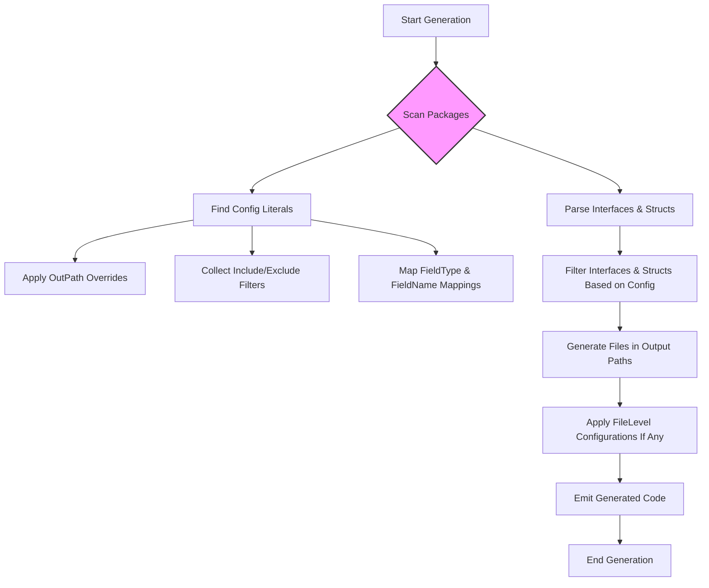

# Customizing Code Generation with genconfig

This guide walks you through fine-tuning your GORM CLI code generation using the powerful `genconfig.Config` configuration. Learn how to customize output paths, whitelist or blacklist interfaces and structs for generation, customize type mappings for fields, and apply file-level overrides—granting you granular control over your generated code.

---

## 1. What This Guide Covers

**Purpose:** Enable you to tailor GORM CLI’s code generation to your exact project needs using `genconfig.Config`.

**Focus:** Configuring output directories per package, controlling which interfaces and structs are included or excluded from generation, customizing how field types are wrapped by model helpers, and applying configurations at the file or package level.

**Outcome:** By the end of this guide, you will confidently apply `genconfig.Config` in your codebase to streamline generation structure, reduce noise, and extend support for custom field types.


## 2. Prerequisites

- Familiarity with basic GORM CLI usage and code generation.
- Go project with existing models and/or raw SQL interfaces prepared.
- Installed `gorm` CLI tool (see [installation guide](https://gorm.io/docs/gorm-cli.html#Installation) for help).
- Understanding of Go generics and struct tags.

## 3. Expected Outcome

- Customized code generation output directory per package or file.
- Controlled interface and struct filtering for generation.
- Custom field helpers applied to selected Go types or tagged fields.
- Ability to specify file-level versus package-level configuration.

## 4. Time Estimate

Setting up and applying a basic `genconfig.Config` takes 10–15 minutes.
Fine-tuning complex configurations with type mappings and filters may take longer depending on project size.

## 5. Difficulty Level

Intermediate: requires working knowledge of Go code structure and GORM CLI.

---

# Step-by-Step Instructions

### Step 1: Declare a Package-Level `genconfig.Config`

Create or edit a Go source file in the package you want to customize. Import the `genconfig` package and declare a `var _ = genconfig.Config{}` literal.

```go
package yourpackage

import "gorm.io/cli/gorm/genconfig"

var _ = genconfig.Config{
    // Configuration fields go here
}
```

The generator will automatically discover this configuration when scanning the package.


### Step 2: Customize Output Path With `OutPath`

Override the output directory for generated code originating from this package.

```go
var _ = genconfig.Config{
    OutPath: "generated/yourpackage",
}
```

This causes generated files for this package to be placed under your custom path instead of the global CLI `-o` flag directory.


### Step 3: Map Go Types to Custom Field Helpers with `FieldTypeMap`

You can control which field helper wrappers the generator uses for certain Go types. This is especially useful for wrapping types like `sql.NullTime` with a helper like `field.Time{}`.

```go
import (
    "database/sql"
    "gorm.io/cli/gorm/field"
    "gorm.io/cli/gorm/genconfig"
)

var _ = genconfig.Config{
    FieldTypeMap: map[any]any{
        sql.NullTime{}: field.Time{},
    },
}
```

The generator inspects the AST for these mappings and applies them when generating the corresponding field helpers.


### Step 4: Map Field Names to Custom Helpers Using `FieldNameMap`

Customize based on struct field tags specified with `gen:"name"` to apply custom wrappers.

```go
var _ = genconfig.Config{
    FieldNameMap: map[string]any{
        "json": JSON{}, // assuming JSON is a defined field helper struct
    },
}
```

Then on your model:

```go
// User model with json-tagged field
type User struct {
    Profile string `gen:"json"`
}
```

The generator applies the `JSON` helper to the `Profile` field.


### Step 5: Fine-Grain Control with `IncludeInterfaces` and `ExcludeInterfaces`

Control which interfaces are included or excluded from generation. This can be done via shell-style string patterns or type-conversion syntax.

```go
var _ = genconfig.Config{
    IncludeInterfaces: []any{"Query*", models.Query(nil)},
    ExcludeInterfaces: []any{"*Deprecated*"},
}
```

- **Whitelist Takes Priority**: If `IncludeInterfaces` is non-empty, only matched interfaces are generated.
- **Blacklist Applies Otherwise**: If whitelist empty, blacklist filters apply to exclude certain interfaces.


### Step 6: Control Struct Generation Using `IncludeStructs` and `ExcludeStructs`

Similar to interfaces, specify which structs get helpers generated.

```go
var _ = genconfig.Config{
    IncludeStructs: []any{"User", "Account*", models.User{}},
    ExcludeStructs: []any{"*DTO"},
}
```

Use shell patterns or type literals.


### Step 7: Apply `FileLevel` for Per-File Configuration

Set `FileLevel: true` if you want the config to only apply to the source file where this literal is declared rather than the entire package.

This is useful when you want more granular control in nested directory structures or mixed configurations.

```go
var _ = genconfig.Config{
    OutPath: "nested/output",
    FileLevel: true,
}
```


---

# Real-World Examples

### Example 1: Basic Output Path Override

```go
package examples

import "gorm.io/cli/gorm/genconfig"

var _ = genconfig.Config{
    OutPath: "examples/generated",
}
```

Generates code into `examples/generated` instead of the default output.


### Example 2: Exclude Some Interfaces and Structs

```go
package pattern

import "gorm.io/cli/gorm/genconfig"

var _ = genconfig.Config{
    IncludeInterfaces: []any{"Query*"},
}
```

Only interfaces starting with `Query` are generated.


### Example 3: Nested Directory Filtering

Nested directory config excluding `I3` and `S3`:

```go
package nested

import "gorm.io/cli/gorm/genconfig"

var _ = genconfig.Config{
    FileLevel: false,
    ExcludeInterfaces: []any{"I3"},
    ExcludeStructs: []any{"S3"},
}
```

---

# Best Practices and Tips

- **Use Whitelists (`Include*`) Sparingly:** Whitelists override exclusion filters, so only use if you want precise generation.
- **Define Type Mappings with Typed Instances:** Always use zero-value instances of types as keys and values in `FieldTypeMap` and `FieldNameMap` to ensure the generator resolves correct import paths.
- **Apply `FileLevel` Judiciously:** Use for per-file overrides especially in nested package directory layouts.
- **Avoid Overlapping Filters:** Combine include/exclude filters carefully to prevent accidentally excluding required code.


---

# Troubleshooting

### Issue: Config Not Applying?

- Ensure the `genconfig.Config` literal is declared at the package level, not inside functions.
- Confirm your config file is part of the scanned input directory.
- If `FileLevel:true` is set, verify you are generating code precisely for that file.


### Issue: Types Not Mapped Correctly?

- Use typed zero-value instances as keys in `FieldTypeMap`:

```go
FieldTypeMap: map[any]any{
    sql.NullTime{}: field.Time{},
}
```

- Make sure the packages are imported in your config file.
- Use fully qualified names if ambiguous.


### Issue: Interfaces Are Getting Filtered Out?

- Review your include and exclude interface filters.
- Remember whitelist (`IncludeInterfaces`) takes precedence over blacklist (`ExcludeInterfaces`).


---

# Next Steps & Related Content

- Proceed to the [Interface-Driven Queries Guide](https://gorm.io/docs/guides/core-workflows/interface-driven-queries) for applying generation in real-world query patterns.
- Explore [Model-Driven Helpers](https://gorm.io/docs/guides/core-workflows/model-driven-helpers) to deepen your use of generated field helpers.
- Learn about [Handling Associations](https://gorm.io/docs/guides/core-workflows/working-with-associations) to manage relational data.
- For deeper customization, visit [JSON Fields: Custom Mapping and Cross-Database SQL](https://gorm.io/docs/guides/advanced-features/json-field-helpers).

---

# Summary Diagram: How `genconfig.Config` Affects Generation



---