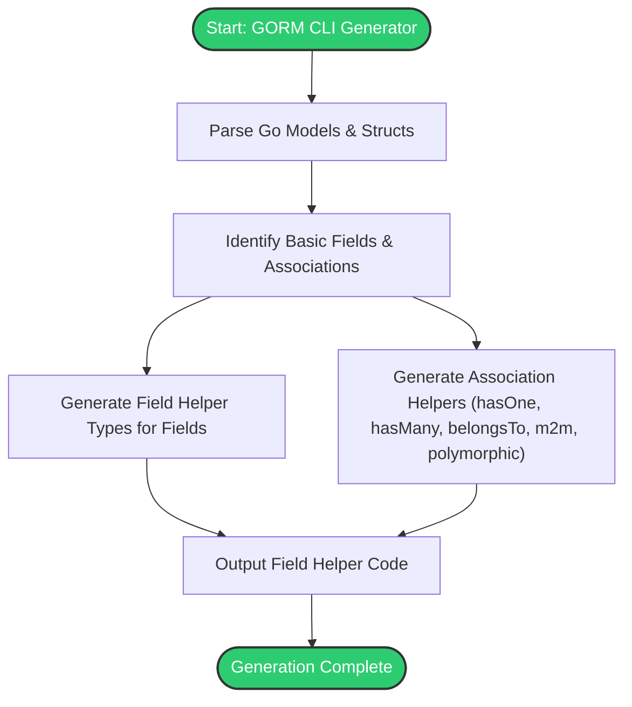

# Advanced Field and Association Helpers

Discover how GORM CLI empowers you to move beyond basic CRUD operations by generating powerful, type-safe helpers for filters, ordering, updates, and complex associations. This guide walks you through the practical use of advanced field helpers and association patterns—including has-many, belongs-to, many-to-many, and polymorphic relationships—enabling you to write concise, expressive, and maintainable database code.

---

## 1. Introduction

This guide explains how the code generator transforms your Go model structs into rich, fluent APIs that help you build robust queries and updates with minimal effort. Leveraging GORM's underlying capabilities, the generated helpers ensure compile-time type safety and support sophisticated association management.

You'll explore:
- Advanced field predicates and setters
- Managing has-many, has-one, belongs-to, many-to-many, and polymorphic relations
- Practical usage patterns with concrete examples

---

## 2. Advanced Field Helpers: Filters, Ordering, and Updates

### 2.1. Purpose and Benefits

Beyond basic field predicates like `Eq` and `Neq`, the generator creates helpers tailored for filtering, sorting, and updating various data types—ints, strings, times, nullable fields, and even custom types like JSON.

These helpers guarantee:
- Type safety on query construction
- Expressive, chainable methods for complex conditions
- Support for SQL expressions and zero-value updates

### 2.2. Common Advanced Predicates and Examples

- **Range Filtering:** Use `Between(start, end)` for inclusive value ranges.
- **Null Checks:** `IsNull()` and `IsNotNull()` allow concise filtering on SQL nullable columns.
- **Pattern Matching:** Use string methods like `Like()`, `NotLike()`, and case-insensitive variations.
- **Set Operations:** `In()` and `NotIn()` enable filtering against specific value sets.

```go
// Filter users aged between 18 and 30
users, err := gorm.G[models.User](db).
    Where(generated.User.Age.Between(18, 30)).
    Find(ctx)

// Find users with a null last login
usersWithNoLogin, err := gorm.G[models.User](db).
    Where(generated.User.LastLogin.IsNull()).
    Find(ctx)

// Search for users with role like “admin”
admins, err := gorm.G[models.User](db).
    Where(generated.User.Role.Like("%admin%"))
    .Find(ctx)
```

### 2.3. Updating Fields With Expression Support

The generated setters support:
- Zero-value assignments (explicitly setting a field to zero, empty, or null)
- Increment/decrement expressions using `Incr()` and `Decr()`
- Custom SQL expressions with `SetExpr()`

```go
// Increment Age by 1 for user named “bob”
rows, err := gorm.G[models.User](db).
    Where(generated.User.Name.Eq("bob")).
    Set(generated.User.Age.Incr(1)).
    Update(ctx)

// Set a user’s role to empty string
gorm.G[models.User](db).
    Where(generated.User.ID.Eq(123)).
    Set(generated.User.Role.Set("")).
    Update(ctx)
```

### 2.4. Using Custom Field Types (e.g., JSON)

When you define a custom helper type (like JSON) with corresponding struct tags and genconfig mappings, the generator integrates these with advanced filter helpers that emit DB-specific JSON queries.

```go
// Filter users whose Profile JSON field contains {"vip":true}
got, err := gorm.G[models.User](db).
    Where(generated.User.Profile.Equal("$.vip", true)).
    Take(ctx)
```

---

## 3. Association Helpers: Managing Complex Relationships

GORM CLI generates expressive helpers for your model’s associations, enabling you to perform creation, updates, unlinking, deletion, and batch creation of related records with full type safety.

### 3.1. Supported Association Types

| Association Type | Helper Type          | Key Features                             |
|------------------|---------------------|-----------------------------------------|
| Has One          | `field.Struct[T]`    | Access sub-object, create/update child  |
| Has Many         | `field.Slice[T]`     | Access slice, batch create/update       |
| Belongs To       | `field.Struct[T]`    | Manage parent relations, FK clearing    |
| Many To Many     | `field.Slice[T]`     | Create, unlink, delete join rows         |
| Polymorphic      | `field.Slice[T]` or `field.Struct[T]` | Support polymorphic ownership            |

### 3.2. Creating and Linking Associations

Use `Create`, `CreateInBatch` on association helpers to create and link related records in a single operation.

```go
// Create a new user and associate one pet
err := gorm.G[models.User](db).
    Set(
        generated.User.Name.Set("alice"),
        generated.User.Pets.Create(generated.Pet.Name.Set("fido")),
    ).
    Create(ctx)

// Create a user with multiple languages linked (many-to-many)
err := gorm.G[models.User](db).
    Set(
        generated.User.Name.Set("polyglot"),
        generated.User.Languages.CreateInBatch([]models.Language{{Code: "EN"}, {Code: "FR"}}),
    ).
    Create(ctx)
```

### 3.3. Updating Associations With Conditions

You can update associated records with filters to target specific children.

```go
// Update ‘fido’ pet name to ‘rex’ for user with ID 1
gorm.G[models.User](db).
    Where(generated.User.ID.Eq(1)).
    Set(
        generated.User.Pets.Where(generated.Pet.Name.Eq("fido")).
            Update(generated.Pet.Name.Set("rex")),
    ).
    Update(ctx)
```

### 3.4. Unlinking and Deleting Associations

- **Unlink**: Removes association links without deleting parent/child records (clears FKs or removes join table rows).
- **Delete**: Deletes related records or join rows.

Example unlink and delete:

```go
// Unlink pets from a user
gorm.G[models.User](db).
    Where(generated.User.ID.Eq(1)).
    Set(generated.User.Pets.Unlink()).
    Update(ctx)

// Delete pets named ‘old’ linked to user 1
gorm.G[models.User](db).
    Where(generated.User.ID.Eq(1)).
    Set(generated.User.Pets.Where(generated.Pet.Name.Eq("old")).Delete()).
    Update(ctx)
```

### 3.5. Semantics by Association Type

| Association Type | Unlink Behavior           | Delete Behavior                    |
|------------------|---------------------------|----------------------------------|
| Belongs To       | Sets FK on parent to NULL | Deletes associated rows           |
| Has One/Has Many | Sets FK on child to NULL  | Deletes child rows                |
| Many To Many     | Removes join rows only    | Removes join rows only            |

### 3.6. Using Association Helpers in Parent Operations

- **Create(ctx)**: Inserts parent records and applies nested association creates.
- **Update(ctx)**: Updates matched parent rows and applies nested association operations.

```go
// Create a user with pets and languages in one call
gorm.G[models.User](db).
    Set(
        generated.User.Name.Set("bob"),
        generated.User.Pets.Create(generated.Pet.Name.Set("spot")),
        generated.User.Languages.CreateInBatch([]models.Language{{Code: "ES"}}),
    ).
    Create(ctx)

// Update user and their associated pets
gorm.G[models.User](db).
    Where(generated.User.ID.Eq(1)).
    Set(
        generated.User.Name.Set("bobby"),
        generated.User.Pets.Where(generated.Pet.Name.Eq("spot")).Update(generated.Pet.Name.Set("rex")),
    ).
    Update(ctx)
```

---

## 4. Association Patterns by Real-World Scenarios

Understanding how each association type maps to your data model is crucial for effective usage.

### 4.1. Has Many Relationship (Example: User → Pets)
- Access via `field.Slice[T]`
- Supports batch create and conditional update

### 4.2. Belongs To Relationship (Example: User → Company)
- Access via `field.Struct[T]`
- Unlink clears foreign key on parent

### 4.3. Many To Many Relationship (Example: User ↔ Languages)
- Access via `field.Slice[T]`
- Unlink/Delete remove join table rows, preserving main records

### 4.4. Polymorphic Associations (Example: Pet → Toy)
- Support special DSL tags like `gorm:"polymorphic:Owner"`
- Generate helpers with polymorphic awareness

---

## 5. Best Practices & Tips

- **Always use generated helpers for predicates and setters** to avoid SQL injection and benefit from type safety.
- **Chain conditions using GORM’s `.Where()`** combined with generated predicates for powerful filtering.
- **Use association helpers to manage related data** in a declarative way, avoiding manual FK updates.
- **Apply batch operations with `CreateInBatch`** for efficient multi-record creation.
- **Employ conditional updates using `Where()` on associations** to target precise related rows.
- **Utilize JSON/custom field types** when your model has special column types; configure `genconfig.Config` accordingly.

---

## 6. Troubleshooting

### 6.1. Common Issues

- **No generated helpers for an association:** Check your struct tags and model definitions to ensure associations are declared correctly.
- **Type mismatches during updates:** Ensure you provide values consistent with the generated types and avoid raw SQL assignment outside the allowed setters.
- **Unintended deletion/unlinking:** Review your `.Unlink()` and `.Delete()` calls carefully as they affect data relations.

### 6.2. Tips for Debugging

- Use logging or debugging in GORM to inspect generated SQL.
- Confirm your model tags (`gorm`, `gen`) are accurate and consistent.
- Validate your configuration in `genconfig.Config` for custom mappings.

---

## 7. Next Steps & Further Learning

- Explore [Using the Generated APIs](/guides/getting-started/using-generated-apis) to see how to integrate these helpers in your application logic.
- Review [Template-Based Query Interfaces](/guides/advanced-generation/template-sql-workflows) to combine association helpers with custom SQL templates.
- Learn about [Using JSON Fields and Custom Helper Types](/guides/advanced-generation/json-fields) to handle complex column types.
- Deepen understanding with real-world integration examples in [Integrating Generated Code into Your Project](/guides/real-world-patterns/integration-examples).

---

<CardGroup cols={2}>
<Card title="See Also: Template-Based Query Interfaces">
Learn how to write SQL templates for dynamic queries that leverage field and association helpers.
</Card>
<Card title="See Also: Generation Configuration">
Customize code generation to fit your project structure and field mapping needs.
</Card>
</CardGroup>

---

## 8. Diagram: Association Helper Workflow


