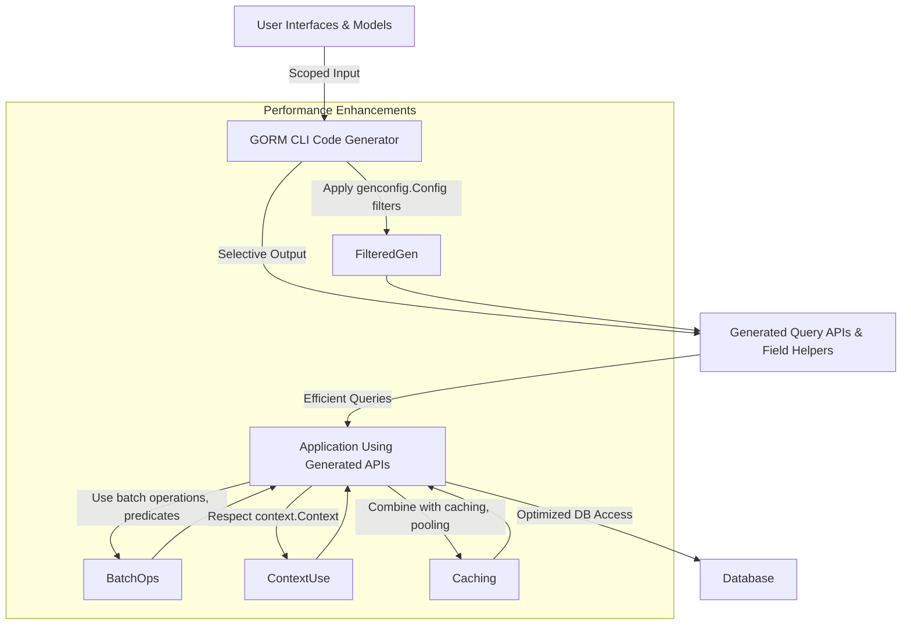

# Performance and Scalability: Getting the Most from GORM CLI

Optimize your GORM CLI workflow to achieve fast code generation, minimize runtime overhead, and scale efficiently with large schemas. This guide presents actionable strategies and best practices for customizing code output, tuning the generator, and leveraging type-safe APIs in high-load, production-grade Go applications.

---

## 1. Understanding Performance Factors

### 1.1 Code Generation Overhead
GORM CLI performs static analysis on your Go codebase to generate type-safe query APIs and field helpers. For large projects with many models and interfaces, this step can grow in runtime and memory usage.

### 1.2 Generated Code Runtime Efficiency
The generated code uses fluent, type-safe builders designed for idiomatic GORM queries with minimal abstraction overhead. Still, its structure can impact compilation time, binary size, and runtime performance.

### 1.3 API Usage in High-Load Scenarios
Using generated APIs efficiently is key to maintaining low latency and resource use in production. Best practices in querying, caching, and associations directly influence scalability.

---

## 2. Tuning Code Generation

### 2.1 Use `genconfig.Config` to Scope Generation
Limit the scope of generation by including only necessary structs and interfaces to reduce generation time and code size.

```go
var _ = genconfig.Config{
  IncludeInterfaces: []any{"Query*"},        // Generate only interfaces starting with "Query"
  IncludeStructs:    []any{"User", "Order"}, // Include only User and Order structs
  OutPath:           "generated/api",          // Custom output directory
}
```

**Benefit:** 
- Smaller generated codebase reduces build time and binary size.

### 2.2 Enable File-Level Configuration
Use the `FileLevel` option in package-level configs to apply settings only to specific files instead of entire packages.

```go
var _ = genconfig.Config{
  FileLevel: true,
  OutPath:  "generated/special",
}
```

**Tip:** This is useful for mixed project layouts where only certain files need generation.

### 2.3 Exclude Deprecated or Unused APIs
Exclude interfaces or structs you no longer need using `ExcludeInterfaces` and `ExcludeStructs` with glob patterns.

```go
var _ = genconfig.Config{
  ExcludeInterfaces: []any{"*Deprecated*"},
  ExcludeStructs:    []any{"*DTO"},
}
```

### 2.4 Custom Field Type Mappings
Map specific Go field types or tags to efficient field helper implementations to optimize generated code and queries.

```go
var _ = genconfig.Config{
  FieldTypeMap: map[any]any{
    sql.NullTime{}: field.Time{},
  },
  FieldNameMap: map[string]any{
    "json": JSON{}, // Use custom JSON field helper
  },
}
```

---

## 3. Improving Runtime Efficiency of Generated Code

### 3.1 Leverage Type-Safe Predicates and Expressions
Use the fluent, generated model field helpers (`Eq`, `Incr`, `SetExpr`, etc.) for precise SQL generation that avoids unnecessary runtime computation.

```go
// Efficient predicate checks
db.Where(generated.User.Age.Gt(18)).Find(ctx)

// Atomic increment with expression
db.Set(generated.User.Score.Incr(1)).Update(ctx)
```

### 3.2 Minimize Unnecessary Queries
Use generated query interfaces to build concise queries with conditional SQL templates to reduce data transferred and round-trips.

```go
// Using conditional SQL to skip empty filters
query.FilterByNameAndAge(ctx, "alice", 20) // Avoids SQL when filters are empty
```

### 3.3 Batch Operations
Use batch creation and update helpers for associations, such as `CreateInBatch`, to optimize inserts and updates in fewer transactions.

```go
// Batch create pets linked to a user
db.Set(generated.User.Pets.CreateInBatch(petsSlice)).Update(ctx)
```

### 3.4 Avoid Over-Nesting Associations
While association helpers are powerful, deep or recursive loads may impact query complexity; use `Preload` wisely and apply filters.

### 3.5 Use Context Cancellation
All generated methods support `context.Context`; propagate cancellation to improve responsiveness under load.

```go
ctx, cancel := context.WithTimeout(context.Background(), time.Second*5)
defer cancel()
user, err := query.GetByID(ctx, id)
```

---

## 4. Handling Large Schemas with Many Models

### 4.1 Split Generation Targets
Divide your models and query interfaces into logical packages and run separate generation commands to keep output manageable.

```bash
gorm gen -i ./pkg/users -o ./generated/users
gorm gen -i ./pkg/orders -o ./generated/orders
```

### 4.2 Generate Incrementally
Perform generation only on changed files or modules during CI/CD or local development by scoping inputs.

### 4.3 Use Whitelists and Blacklists
Apply `Include*` and `Exclude*` patterns to control what is generated, preventing unnecessary code for rarely used or external models.

### 4.4 Customize Output Paths
Organize output to avoid large monolithic directories that slow down IDEs and tooling.

---

## 5. Best Practices in High-Load Applications

### 5.1 Combine with GORM’s Native Features
Use the generated APIs alongside GORM features like statement caching, prepared statements, connection pooling, and transaction management.

### 5.2 Benchmark and Profile
Measure the impact of generated code in your application to detect bottlenecks and optimize query patterns.

### 5.3 Cache Frequent Queries
Use your application cache or third-party caching with the generated query methods to avoid repeated database hits.

### 5.4 Use Read Replicas and Sharding
Generated APIs are agnostic to your database topology; route `*gorm.DB` connections accordingly to scale out reads and writes.

---

## 6. Troubleshooting Performance Issues

### Common Pitfalls
- **Generating entire large codebase without filtering**: Leads to long generation times and bloated binaries.
- **Using unfiltered association loads**: Causes complex queries and slow response times.
- **Ignoring context deadlines**: Long-running queries affect scalability.

### Efficient Solutions
- Use `IncludeInterfaces` and `IncludeStructs` carefully.
- Apply filters or `WHERE` conditions in generated queries.
- Respect Go's `context.Context` in all calls.

<Tip>
Regularly update GORM CLI to benefit from ongoing improvements in generation speed and runtime performance.
</Tip>

---

## 7. Summary Diagram: GORM CLI Performance Workflow



---

## 8. Next Steps & Related Guides

- Review [Basic Configuration](https://pkg.go.dev/gorm.io/cli/gorm/genconfig) to customize generation.
- Explore [Quick Start Workflow](overview/quickstart-features/quickstart-workflow) to integrate generated APIs.
- Dive into [Interface-Driven Query APIs](guides/query-and-model-helpers/interface-driven-queries) for advanced query patterns.
- Consult [Troubleshooting Installation & Validation](getting-started/troubleshooting-and-common-issues/troubleshooting-install-validate) for resolving generation bottlenecks.


---

Optimize your GORM CLI usage with these strategies to streamline development, improve runtime execution, and scale smoothly as your application grows.


---

_For any complex tuning, consider analyzing your queries and generated code with Go profiling tools and database explain plans to identify hotspots beyond code generation._

---