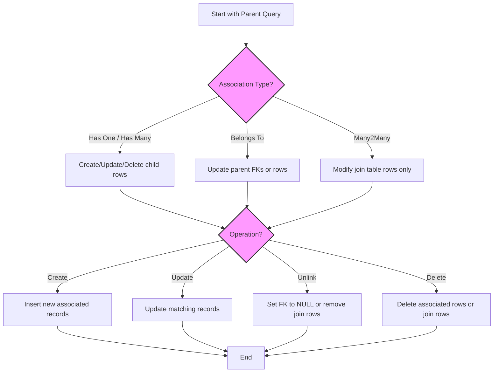

# Managing Associations: Best Practices & Scenarios

Master creation, updating, unlinking, and deletion of associations across all major relationship types in GORM CLI. This guide focuses on practical, user-centric workflows to help you effectively manage `has one`, `has many`, `belongs to`, and `many2many` associations using the generated field helpers and APIs. You will find nuanced examples, semantic explanations, and actionable recipes to implement and troubleshoot typical scenarios.

---

## 1. Understanding Association Types and Semantics

Before diving into operations, it’s critical to understand the semantics of each association type with respect to GORM CLI's generated helpers.

| Association Type | Direction                     | Unlink Semantics                           | Delete Semantics                          |
|------------------|-------------------------------|--------------------------------------------|------------------------------------------|
| Has One          | Parent has one Child           | Sets child's FK to NULL                     | Deletes child row(s)                      |
| Has Many         | Parent has many Child entities | Sets child's FK(s) to NULL                  | Deletes child row(s)                      |
| Belongs To       | Child belongs to Parent       | Sets parent's FK to NULL                    | Deletes parent row(s)                     |
| Many2Many        | Both sides many, join table   | Removes join table rows only (keeps entities) | Removes join table rows only (keeps entities) |

### Key Concept: `Unlink` vs `Delete`
- **Unlink** removes the association link but does not delete any records.
- **Delete** physically deletes the associated records (except in many2many where only the link is removed).

<Tip>
Always use `Unlink` if you want to keep associated rows but remove their association. Use `Delete` carefully when removal of actual records is intended.
</Tip>


## 2. Workflow Overview

### Task Description
Use GORM CLI’s generated association helpers to create, update, unlink, and delete associated records for various relationship types with compile-time safety.

### Prerequisites
- Generated field helpers for your models (e.g., `generated.User.Pets`, `generated.User.Languages`).
- A configured `*gorm.DB` connection.
- Understanding of the Go models and their association directions.

### Expected Outcome
You will be able to manage associations effectively in your code, using meaningful, type-safe operations that match your data model.

### Time Estimate
Depends on familiarity, but each scenario typically takes 5-10 minutes to implement and verify.

### Difficulty Level
Intermediate (assumes basic familiarity with GORM CLI and model generation)


## 3. Step-by-Step Instructions

### Creating Associated Records

#### Has One and Belongs To Associations
Creating a single child and associating it with a parent:

```go
// Create a User and an associated Account (has one)
gorm.G[User](db).
  Set(
    generated.User.Name.Set("alice"),
    generated.User.Account.Create(generated.Account.Number.Set("A-001")),
  ).
  Create(ctx)
```

For an existing parent, create and link a child:

```go
// Create a Pet associated to all matched Users with matching criteria
gorm.G[User](db).
  Where(generated.User.ID.Eq(someUserID)).
  Set(
    generated.User.Pets.Create(
      generated.Pet.Name.Set("fido"),
    ),
  ).
  Update(ctx)
```

#### Has Many & Many2Many Associations

Create multiple associated records in batch:

```go
// Batch create several Languages and associate to the User
gorm.G[User](db).
  Where(generated.User.ID.Eq(userID)).
  Set(
    generated.User.Languages.CreateInBatch([]models.Language{{Code: "EN"}, {Code: "FR"}}),
  ).
  Update(ctx)
```

<Tip>
Use `CreateInBatch` to efficiently associate multiple records per parent in one operation.
</Tip>


### Updating Associated Records With Conditions

You may want to update records associated with a parent but only those that match certain filters.

```go
// Update associated Pet named 'old' to 'new'
gorm.G[User](db).
  Where(generated.User.ID.Eq(userID)).
  Set(
    generated.User.Pets.Where(generated.Pet.Name.Eq("old")).Update(
      generated.Pet.Name.Set("new"),
    ),
  ).
  Update(ctx)
```

This pattern ensures only the filtered associated records are updated.

### Unlinking Associations

Unlinking removes only the foreign key or join records while preserving the associated rows.

```go
// Unlink all Pets from a User (sets Pet.UserID to NULL)
gorm.G[User](db).
  Where(generated.User.ID.Eq(userID)).
  Set(generated.User.Pets.Unlink()).
  Update(ctx)
```

```go
// Unlink specific Language from User by filtering
gorm.G[User](db).
  Where(generated.User.ID.Eq(userID)).
  Set(generated.User.Languages.Where(generated.Language.Code.Eq("EN")).Unlink()).
  Update(ctx)
```

<Tip>
Unlink on "belongs to" association sets the foreign key on the parent to NULL.
On "has one" or "has many" associations, it sets the foreign key on the child to NULL.
In "many2many", it deletes only the join table entries.
</Tip>

### Deleting Associated Records

To delete associated rows, use the `Delete()` operation optionally with filtering:

```go
// Delete pet named 'old' associated with User
gorm.G[User](db).
  Where(generated.User.ID.Eq(userID)).
  Set(generated.User.Pets.Where(generated.Pet.Name.Eq("old")).Delete()).
  Update(ctx)
```

Note for many2many:
- `Delete()` removes only join table records, not the linked entities.


### Combined Example

```go
// Update User's Pets: create a pet, update a pet's name, unlink others
gorm.G[User](db).
  Where(generated.User.ID.Eq(userID)).
  Set(
    generated.User.Pets.Create(generated.Pet.Name.Set("new-pet")),
    generated.User.Pets.Where(generated.Pet.Name.Eq("old-pet")).Update(generated.Pet.Name.Set("renamed-pet")),
    generated.User.Pets.Where(generated.Pet.Name.Eq("unlink-pet")).Unlink(),
  ).
  Update(ctx)
```


## 4. Examples & Real-World Scenarios

### Example: Create a Pet for Each Matched User
```go
ctx := context.Background()
db := setupTestDB()

// Creates a pet named 'multi-pet' for every user matched
_, err := gorm.G[User](db).
  Where(generated.User.Name.In("alice", "bob")).
  Set(
    generated.User.Pets.Create(generated.Pet.Name.Set("multi-pet")),
  ).
  Update(ctx)

if err != nil {
  // handle error
}
```

### Example: Unlink and Delete Many2Many Associations
```go
// Unlink languages (removes join records, keeps languages)
gorm.G[User](db).
  Where(generated.User.ID.Eq(userID)).
  Set(generated.User.Languages.Unlink()).
  Update(ctx)

// Delete associated join records only, languages remain intact
gorm.G[User](db).
  Where(generated.User.ID.Eq(userID)).
  Set(generated.User.Languages.Delete()).
  Update(ctx)
```

### Example: Manage Polymorphic Associations

For polymorphic associations, unlinking sets foreign keys to zero or NULL but keeps child rows.

```go
// Unlink Toy from a Pet (polymorphic)
gorm.G[Pet](db).
  Where(generated.Pet.ID.Eq(petID)).
  Set(generated.Pet.Toy.Unlink()).
  Update(ctx)
```

---

## 5. Troubleshooting & Tips

### Common Issues
- **Associations not linked as expected:** Verify you are using the correct association helper (`field.Struct` for single, `field.Slice` for multiple).
- **Foreign key fields not nullable for Unlink:** Ensure your database schema allows NULL for FK fields to support unlinking.
- **Unintended deletion of parent or associated rows:** Double-check the difference between `Unlink` and `Delete` operations.
- **Batch Create errors:** Confirm that your database dialect supports batch operations, and that IDs or unique constraints are properly managed.

### Best Practices
- Use precise filtering (`Where`) on associations to avoid unintended mass updates or deletes.
- Prefer `Unlink` when you want to disassociate without data loss.
- When creating associations, set all mandatory fields on child records to satisfy database constraints.
- Test your association operations on a staging environment to verify FK constraints and cascade behaviors.

### Performance Considerations
- Batch creates reduce the number of queries but ensure associated IDs are managed correctly.
- When updating associations with conditions, adding indexes on filtered columns can improve query speed.

### Alternative Approaches
- For complex scenarios, consider combining field helpers with raw SQL or GORM callbacks for additional control.


## 6. Diagram: Association Operation Flow




## 7. Next Steps & Related Content

- **First Code Generation:** Learn how to generate your initial query APIs and field helpers from models and interfaces ([Guide](../guides/getting-started-workflows/first-generation)).
- **Using Generated APIs:** Explore how to use generated query and update helpers in your Go code effectively ([Guide](../guides/getting-started-workflows/using-generated-apis)).
- **Field Helpers:** Deep dive into filtering, updating, and expressions with the field helpers ([Guide](../guides/getting-started-workflows/field-helpers-basics)).
- **Association Management:** Continue exploring advanced association workflows and edge cases ([Guide](./associations-in-depth)).
- **SQL Template DSL:** Expand your skills with dynamic, type-safe SQL templating ([Guide](../guides/advanced-patterns-integration/template-sql-dsl)).
- **Customization:** Configure and customize generation rules and mappings for tailored workflows ([Guide](../guides/advanced-patterns-integration/customization-configs)).


<Tip>
Mastering associations with GORM CLI empowers efficient and safe handling of complex relational data in your Go applications. Use this guide alongside generated code examples in `examples/output/models_relations_test.go` for hands-on learning.
</Tip>

---