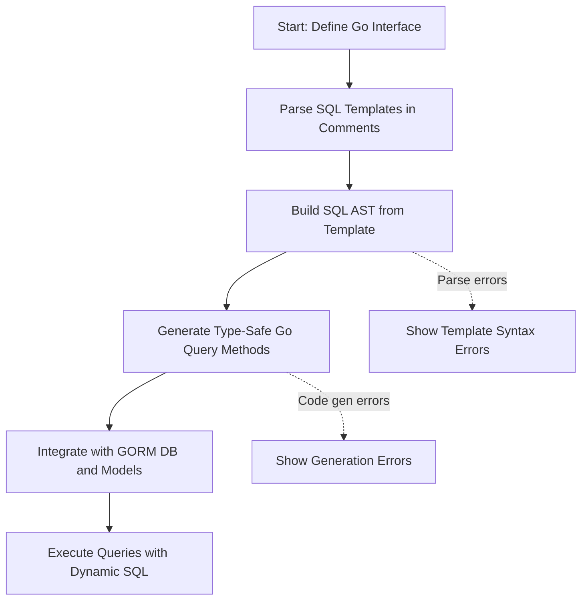

# SQL Template DSL: Writing Dynamic, Type-Safe Queries

Unlock the power of GORM CLI’s SQL Template DSL to write expressive, maintainable, and highly dynamic SQL queries directly within Go interface comments. This guide helps you master the syntax, understand directives, and apply common patterns for building flexible, type-safe queries that integrate seamlessly with your Go models.

---

## 1. What This Page Covers

This page focuses exclusively on the SQL Template DSL feature of GORM CLI. It explains how to write SQL templates in your Go interface comments, use placeholders and directives for dynamic queries, and integrate these patterns into the generated query APIs.

You will learn how to:

- Use built-in directives like `@@table`, `{{where}}`, `{{set}}`, and conditional blocks.
- Bind Go parameters safely with `@param` syntax.
- Write complex dynamic SQL involving loops, conditional logic, and dynamic columns.
- Understand the syntax that supports type safety and parameterization.

---

## 2. Key Concepts and Workflow Overview

### Task Description
Create dynamic, type-safe SQL queries embedded in Go interface method comments, leveraging the GORM CLI SQL Template DSL to generate robust query methods.

### Prerequisites
- You have Go interfaces defined with methods you want to build SQL for.
- Model structs corresponding to your database tables exist in your code.
- GORM CLI is installed and set up to generate code from your annotated interfaces.

### Expected Outcome
After writing SQL template comments on your interface methods and running GORM CLI generation, you will have:
- Go methods implementing the queries with full compile-time type safety.
- Seamless integration with GORM’s DB instance, supporting expressions, parameters, and conditional logic.

### Time Estimate
About 15-30 minutes to write and test a set of interface methods with dynamic SQL templates.

### Difficulty Level
Intermediate. Requires familiarity with Go interfaces, basic templating concepts, and SQL.

---

## 3. Writing SQL Templates with GORM CLI’s DSL

The SQL Template DSL allows you to embed SQL with dynamic placeholders and control structures inside Go interface method comments. The generator parses these templates and produces concrete, type-safe Go methods.

### 3.1 Placeholders and Syntax

| Placeholder       | Purpose                                    | Usage Example                                  |
|-------------------|--------------------------------------------|-----------------------------------------------|
| `@@table`         | Resolves to the model's table name          | `SELECT * FROM @@table WHERE id=@id`          |
| `@@column`        | Dynamic column binding                       | `WHERE @@column=@value`                        |
| `@param`          | Maps Go method parameters to SQL parameters | `WHERE name=@user.Name`                        |

### 3.2 Directive Blocks

You can embed templating directives enclosed by `{{` and `}}` that control SQL generation logic. These directives support conditional SQL, loops, and scoped fragments.

| Directive        | Usage                                   | Description                                  |
|------------------|-----------------------------------------|----------------------------------------------|
| `{{where}} ... {{end}}` | Encloses dynamic WHERE clause content      | Conditionally build WHERE clauses safely     |
| `{{set}} ... {{end}}`   | Encloses dynamic SET clause content        | Used in UPDATE statements for conditional fields |
| `{{if condition}} ... {{else if condition}} ... {{else}} ... {{end}}` | Conditional SQL fragments for complex logic |
| `{{for range}} ... {{end}}`   | Iterate over collections to generate multiple SQL snippets |

### 3.3 Escaping '@'

To write a literal '@' in the SQL template, escape it with a backslash `\@`. The generator replaces these back to literal '@' symbols in the final SQL.

```go
// Example literal @ in SQL comment
// SELECT * FROM @@table WHERE email LIKE '%\@domain.com'
```

### 3.4 Common Logical Patterns

- Use `{{where}}` when your query needs optional filtering conditions.
- Use `{{set}}` for dynamically setting columns when updating rows.
- Combine `{{if}}`, `{{else if}}`, and `{{else}}` for complex conditional SQL logic.
- Use `{{for _, item := range collection}} ... {{end}}` to construct queries handling arrays or slices.

---

## 4. Practical Examples

### 4.1 Basic Select with Dynamic WHERE

```go
// UserQuery interface with SQL template method
//
// SELECT * FROM @@table
// {{where}}
//   {{if user.Name != ""}} name=@user.Name {{end}}
//   {{if user.Age > 0}} AND age=@user.Age {{end}}
// {{end}}
SearchUsers(user User) ([]User, error)
```

**What Happens:** 
- The `{{where}}` block generates a WHERE clause only if at least one condition is included.
- The `{{if}}` directives conditionally insert SQL snippets based on Go parameter values.

**Result:** The generated code safely binds parameters and executes a query with an optional WHERE clause matching the provided filter.

### 4.2 Dynamic UPDATE with Conditional SET

```go
// Update a user selectively
//
// UPDATE @@table
// {{set}}
//   {{if user.Name != ""}} name=@user.Name, {{end}}
//   {{if user.Age > 0}} age=@user.Age, {{end}}
//   {{if user.Age >= 18}} is_adult=1 {{else}} is_adult=0 {{end}}
// {{end}}
// WHERE id=@id
UpdateUser(user User, id int) error
```

**Key Takeaways:**
- Only non-empty updates are included.
- The `{{set}}` block trims trailing commas and writes the SQL SET clause.
- Conditional logic within `{{if}}`/`{{else}}` adjusts flags based on field values.

### 4.3 Dynamic Filtering Over a Slice

```go
// Filter users by multiple sets of conditions
//
// SELECT * FROM @@table
// {{where}}
//   {{for _, user := range users}}
//     {{if user.Name != "" && user.Age > 0}}
//       (name = @user.Name AND age=@user.Age) OR
//     {{end}}
//   {{end}}
// {{end}}
Filter(users []User) ([]User, error)
```

**Insights:**
- Using `{{for}}`, the query generates OR conditions for each user in the input slice.
- Conditions inside the loop appear only for valid user entries.
- The `{{where}}` block ensures a valid WHERE clause or omits it if no items matched.

### 4.4 Dynamic Column and Parameter Binding

```go
// Filter with dynamic column binding
//
// SELECT * FROM @@table WHERE @@column=@value
FilterWithColumn(column string, value string) (User, error)
```

This allows using dynamic column names rather than hard-coded ones, with safety ensured by the generator invoking GORM clause.Column properly.

---

## 5. Template DSL Summary Table

| Directive / Placeholder | Purpose                          | Notes and Behavior                                                      |
|-------------------------|---------------------------------|------------------------------------------------------------------------|
| `@@table`               | Table name binding               | Resolved dynamically to model’s table name                             |
| `@@column`              | Dynamic column                  | Must be bound to a valid column name                                  |
| `@param`                | Go parameter to SQL param       | Parameter names map to method signature parameters                    |
| `{{where}}`             | Conditional WHERE clause         | Builds WHERE only if content inside is non-empty and trims connectors |
| `{{set}}`               | Conditional SET clause           | For UPDATE statements, trims trailing commas                          |
| `{{if condition}} ... {{else if condition}} ... {{else}} ... {{end}}` | Conditional logic                                 | Supports nested conditions and alternate branches                      |
| `{{for ...}} ... {{end}}` | Iterate over collections         | Generates repeated SQL fragments for slice elements                   |

---

## 6. Best Practices & Tips

- **Always use `@@table` to avoid hardcoding table names.** This ensures compatibility with GORM naming strategies.
- **Parameter names in SQL must match Go method parameters exactly.** Use `@param` binding consistently.
- **Escape any literal `@` symbols with `\@` to avoid confusion in parsing.**
- **Use `{{where}}` for optional filtering:** it automatically handles omitting the WHERE clause if no filters are provided.
- **Use `{{set}}` for conditional updates:** it cleans trailing commas and prevents invalid SQL.
- **Keep expressions in `{{if}}` directives simple and side-effect free.**
- **Test generated methods by running queries against your database to verify parameter binding and SQL correctness.**

---

## 7. Troubleshooting Common Issues

<AccordionGroup title="Troubleshooting SQL Template DSL Issues">
<Accordion title="Missing or incorrect WHERE clause generation">
Ensure you wrap conditional WHERE fragments inside a `{{where}}` block to generate correct SQL.

Also confirm all parameters used in `@param` placeholders are defined and passed correctly.
</Accordion>
<Accordion title="Escaped at signs \@ not working">
Check you use two backslashes (`\\@`) in Go comments if necessary, as Go source interprets backslashes first.

Remember that the DSL expects `\@` to render literal `@` in the final SQL.
</Accordion>
<Accordion title="Compilation errors in generated code">
Verify that the SQL template syntax is correct with matching `{{end}}` directives and properly formatted conditions.

Check that method parameters and template placeholders correspond exactly.
</Accordion>
<Accordion title="Unclosed or unmatched directive errors during generation">
Confirm every `{{if}}`, `{{for}}`, and `{{where}}` has a matching `{{end}}` directive.

Maintain nesting consistency to avoid parser errors.
</Accordion>
</AccordionGroup>

---

## 8. Next Steps & Related Documentation

- **[First Code Generation](../getting-started/first-usage/first-code-generation)**: Learn how to prepare your interfaces and models and run the GORM CLI generation.
- **[Using Generated APIs](../getting-started/first-usage/using-generated-apis)**: Practical examples for integrating generated query APIs into your applications.
- **[Field Helpers: Filtering, Updates, and Expressions](../guides/getting-started-workflows/field-helpers-basics)**: Deep dive into filtering and update expressions using generated helpers.
- **[Managing Associations](../guides/advanced-patterns-integration/associations-in-depth)**: Work with relational data through generated association helpers.
- **[Customization Configs](../guides/advanced-patterns-integration/customization-configs)**: Advanced configuration for mapping and generation.

Explore the [GORM CLI GitHub repository](https://github.com/go-gorm/cli) for source code, examples, and community support.

---

### Visual Overview of Query Generation Flow



---