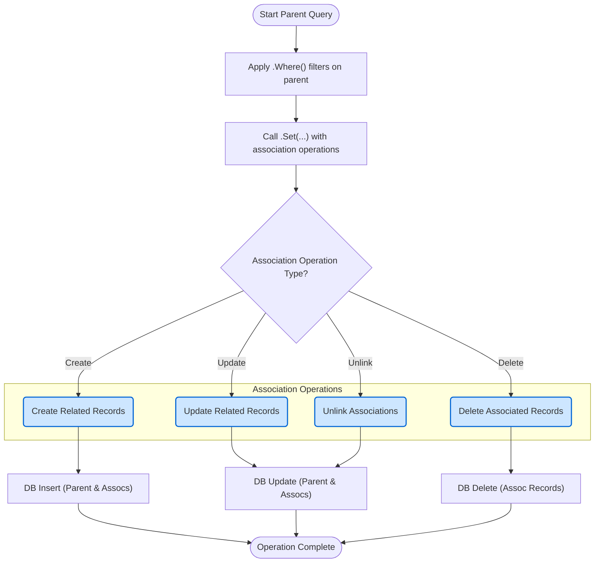

# Working with Associations

Hands-on walkthrough of association helpers for has one, has many, belongs to, and many-to-many relationships. Covers usage for create, update, unlink, and delete across parent/child models, including transactional patterns.

---

## 1. Introduction to Association Helpers

GORM CLI generates strongly typed association helpers corresponding to your model relationships. These helpers allow you to perform operations like creating, updating, unlinking (detaching), and deleting related data with compile-time safety and fluent APIs.

### What You Will Gain
- Precise control over related records using generated association helpers
- Clear and safe mutation of associations (has one, has many, belongs to, many-to-many)
- Expressive, readable code via field helpers and association method chaining
- Seamless transactional updates on parent and associated child models

### Key Association Types Supported
- **Has One**: Single related record (e.g., User → Account)
- **Has Many**: Multiple related records (e.g., User → Pets)
- **Belongs To**: Parent record reference (e.g., User → Company)
- **Many to Many**: Multiple interconnected records via join tables (e.g., User → Languages, User → Friends)

---

## 2. Prerequisites

Before working with associations in GORM CLI, ensure you have:

- Defined your Go model structs with appropriate GORM tags for associations.
- Run the GORM CLI code generator to produce typed field and association helpers.
- Incorporated the generated code package into your application.

Example model associations are defined in the `User` struct and related types:

```go
// Partial User model snippet with associations
type User struct {
  gorm.Model
  Account   Account    // has one
  Pets      []*Pet     // has many
  Company   Company    // belongs to
  Languages []Language `gorm:"many2many:UserSpeak"`  // many2many
  Friends   []*User    `gorm:"many2many:user_friends"` // many2many
}
```

---

## 3. Using Association Helpers

Association helpers appear in the generated model code as typed fields you can use for CRUD operations on related data.

Here’s the general pattern:

- Start a query on the parent model: `gorm.G[Parent](db)`
- Use `.Where(...)` to filter parent records
- Call `.Set(...)` with one or more association operations on generated association helpers
- Call `.Update(ctx)` or `.Create(ctx)` to perform bulk or transactional updates/inserts

### Association Helper Types
- **field.Struct[T]** for single associations (has one, belongs to)
- **field.Slice[T]** for multi-record associations (has many, many2many)


---

### 3.1 Creating Associations

You can create related records and link them to a parent in one step using `.Create(...)` or `.CreateInBatch(...)`.

#### Single (Has One / Belongs To) Create Example

```go
// Create a new User and a related Account
err := gorm.G[User](db).
  Set(
    generated.User.Name.Set("alice"),
    generated.User.Account.Create(
      generated.Account.Number.Set("AC-123"),
    ),
  ).
  Create(ctx)
```

#### Multiple (Has Many / Many2Many) CreateInBatch Example

```go
// Create user and associate multiple languages in batch (many2many)
err := gorm.G[User](db).
  Set(
    generated.User.Name.Set("polyglot"),
    generated.User.Languages.CreateInBatch([]models.Language{{Code: "EN"}, {Code: "FR"}}),
  ).
  Create(ctx)
```

#### Batch Create / Link for Existing Parents

Create multiple associated records for already existing parents:

```go
// For matched users, create one pet each
rows, err := gorm.G[User](db).
  Where(generated.User.ID.In(1, 2, 3)).
  Set(
    generated.User.Pets.Create(
      generated.Pet.Name.Set("fido"),
    ),
  ).
  Update(ctx)
```

---

### 3.2 Updating Associated Records

Use `.Update(...)` on `Where`-filtered association helpers to update related rows.

```go
// Update User's Pet named 'fido' to new name 'rex'
_, err := gorm.G[User](db).
  Where(generated.User.ID.Eq(1)).
  Set(
    generated.User.Pets.Where(generated.Pet.Name.Eq("fido")).
      Update(generated.Pet.Name.Set("rex")),
  ).
  Update(ctx)
```

For belongs to associations:

```go
// Update Company name for User's company
_, err := gorm.G[User](db).
  Where(generated.User.ID.Eq(1)).
  Set(generated.User.Company.Where(generated.Company.Name.Eq("Acme")).Update(generated.Company.Name.Set("NewCo"))).
  Update(ctx)
```

---

### 3.3 Unlink (Detach) Associations

Unlinking disassociates the related records without deleting database rows. This is handled according to semantics based on association type:

- **belongs to**: Set parent foreign key to NULL
- **has one / has many**: Set child foreign key to NULL
- **many2many**: Remove join table rows

Example unlink usage:

```go
// Unlink all pets from user (remove association)
_, err := gorm.G[User](db).
  Where(generated.User.ID.Eq(1)).
  Set(generated.User.Pets.Unlink()).
  Update(ctx)
```

Unlink with conditions:

```go
// Unlink pet named "fido" only
_, err := gorm.G[User](db).
  Where(generated.User.ID.Eq(1)).
  Set(generated.User.Pets.Where(generated.Pet.Name.Eq("fido")).Unlink()).
  Update(ctx)
```

---

### 3.4 Deleting Associated Records

Deletes remove associated child rows (except for many2many, which delete only join rows). Use `.Delete()` to delete records matching optional conditions.

```go
// Delete pets named "old"
_, err := gorm.G[User](db).
  Where(generated.User.ID.Eq(1)).
  Set(generated.User.Pets.Where(generated.Pet.Name.Eq("old")).Delete()).
  Update(ctx)
```

For many2many, delete removes join rows but keeps the related entities:

```go
// Delete language association (removes join row only)
_, err := gorm.G[User](db).
  Where(generated.User.ID.Eq(1)).
  Set(generated.User.Languages.Where(generated.Language.Code.Eq("EN")).Delete()).
  Update(ctx)
```

---

## 4. Practical Use Cases

### 4.1 Create and Link Has Many Association

Create new user and link pets at the same time:

```go
err := gorm.G[User](db).
  Set(
    generated.User.Name.Set("newuser"),
    generated.User.Pets.Create(
      generated.Pet.Name.Set("fluffy"),
      generated.Pet.Name.Set("spot"),
    ),
  ).
  Create(ctx)
```

### 4.2 Update Related Rows Conditionally

Update the role of user's friends with a particular name:

```go
_, err := gorm.G[User](db).
  Where(generated.User.ID.Eq(1)).
  Set(
    generated.User.Friends.Where(generated.User.Name.Eq("buddy")).Update(
      generated.User.Role.Set("active"),
    ),
  ).
  Update(ctx)
```

### 4.3 Unlink Belongs To Association

Detach user from company without deleting company record:

```go
_, err := gorm.G[User](db).
  Where(generated.User.ID.Eq(1)).
  Set(generated.User.Company.Unlink()).
  Update(ctx)
```

---

## 5. Best Practices & Tips

- **Set vs Update:** Use `Set(...).Create(ctx)` to create new parents with associations, and `Set(...).Update(ctx)` to mutate existing parents and their related records.

- **Filtering:** Always filter parent records with `.Where()` before applying association operations.

- **Detailed Conditions:** Use `.Where()` on associations before calling `.Update()`, `.Delete()`, `.Unlink()` to limit impact.

- **Batch Operations:** Use `.CreateInBatch(...)` with slices for bulk association creations efficiently.

- **Polymorphic Associations:** Helpers work consistently with polymorphic relations (e.g., Pet → Toy). Use the generated helper fields.

- **Transactions:** These operations are designed to work inside transactional GORM sessions if needed.

- **Error Handling:** Always check errors when calling `.Create()` or `.Update()`.

- **Check Affected Rows:** Use returned row count (if available) to confirm operation success.

---

## 6. Common Pitfalls & Troubleshooting

<AccordionGroup title="Troubleshooting Association Helpers">
<Accordion title="No foreign key update occurs after unlink">
Make sure:
- You called `.Update(ctx)` after `.Set(Assoc.Unlink())`.
- The association is properly declared with GORM tags.
- The generated helper is actually being used for that association.
</Accordion>
<Accordion title="Associated records not created">
Verify:
- You call `.Create(ctx)` on the parent after `.Set(Assoc.Create(...))`.
- The association is properly matched to the model with correct names.
- The assignments passed to `.Create()` use generated field helpers for the associated model.
</Accordion>
<Accordion title="Updates unexpectedly affect too many rows">
Ensure:
- You applied `.Where(...)` filters on associations when necessary.
- The parent `.Where()` narrowing is precise to avoid broad updates.
- Use transaction wrappers to avoid partial updates.
</Accordion>
<Accordion title="Batch Create In Batch warnings or failures">
Confirm:
- You pass slice values of the supported model type.
- Your database supports batch insert operations.
- The generated code matches your model and association definitions.
</Accordion>
</AccordionGroup>

---

## 7. Summary Diagram of Association Helper Workflow



---

## 8. Additional Resources

- [GORM CLI README](https://github.com/go-gorm/cli#readme): Full feature overview and examples
- [Using the Generated Code](https://pkg.go.dev/gorm.io/cli/gorm#section-documentation-guides-core-workflows-using-generated-code) (Guide)
- [Mastering the SQL Template DSL](https://pkg.go.dev/gorm.io/cli/gorm#section-documentation-guides-advanced-patterns-templating-dsl)
- [Custom Field Helpers and JSON Mapping](https://pkg.go.dev/gorm.io/cli/gorm#section-documentation-guides-advanced-patterns-custom-fields)

---

With these practical patterns, you can confidently manage your data model relationships using GORM CLI's generated association helpers, unlocking type-safe, expressive, and maintainable database interactions within your Go projects.
