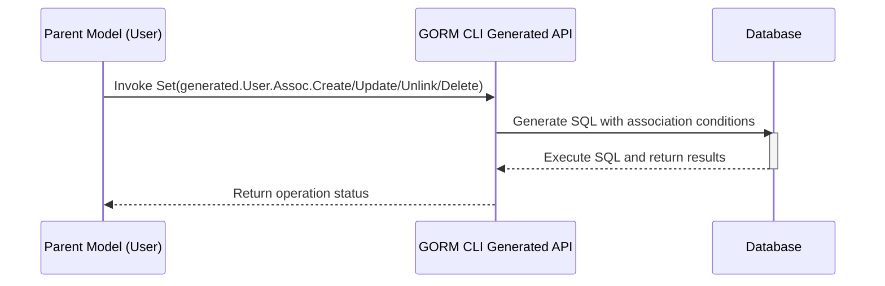

# Working with Associations: Patterns and Examples

This guide provides detailed walkthroughs for setting up and using association helpers generated by GORM CLI. You will learn how to handle different relationship types such as has one, has many, belongs to, and many2many, along with best practices for create, update, unlink, and delete operations within associations.

---

## 1. Overview

### What You'll Accomplish
You will master managing database associations using GORM CLI's generated field helpers for your models. This includes performing CRUD operations on associated records safely and fluently with compile-time guarantees.

### Prerequisites
- A working Go environment (1.18+).
- GORM CLI installed and configured.
- Defined models with associations (e.g., `User` with related `Pet`, `Account`, `Company`, etc.).
- Generated code for your models using GORM CLI.

### Expected Outcome
After following this guide, you will confidently:
- Create and link related records for single and multiple parents.
- Update associated records conditionally.
- Unlink associations without deleting data.
- Delete associated records when needed.
- Handle batch operations on associations.

### Estimated Time
15-30 minutes depending on your familiarity with GORM and associations.

### Difficulty Level
Intermediate — assumes knowledge of Go, GORM, and relational data modeling.

---

## 2. Association Basics

GORM CLI generates **association helpers** attached to your model field helpers. These allow you to perform association operations safely and fluently.

- **Struct[T]**: For single associations (`has one`, `belongs to`).
- **Slice[T]**: For multiple associations (`has many`, `many2many`).

Supported operations include:
- `Create` — create and link new associated record(s).
- `Update` — update one or more associated records, optionally filtered.
- `Unlink` — detach associations without deleting data (zeroes foreign keys or removes join rows).
- `Delete` — delete associated rows (physical removal).
- `CreateInBatch` — batch create/link multiple associated records.

---

## 3. Step-by-Step Usage Patterns

### 3.1. Creating and Linking Associations

#### Has Many Example: Create One Pet per Matched User
```go
_, err := gorm.G[User](db).
  Where(generated.User.ID.Eq(1)).
  Set(
    generated.User.Pets.Create(generated.Pet.Name.Set("fido")),
  ).
  Update(ctx)
```
*Outcome*: Each user matched by the `Where` gets a new pet named "fido" linked.

#### Many2Many Example: Create and Link Multiple Languages
```go
_, err := gorm.G[User](db).
  Where(generated.User.ID.Eq(1)).
  Set(
    generated.User.Languages.CreateInBatch([]models.Language{{Code: "EN"}, {Code: "FR"}}),
  ).
  Update(ctx)
```
*Outcome*: New language rows are created and linked to the user through the join table.

#### Has One Example: Create and Link an Account
```go
_, err := gorm.G[User](db).
  Set(
    generated.User.Name.Set("alice"),
    generated.User.Account.Create(generated.Account.Number.Set("A-001")),
  ).
  Create(ctx)
```
*Outcome*: Inserts a new user and creates a linked account with number "A-001".

---

### 3.2. Updating Associated Records

Apply updates filtered by conditions on the associated records.

Example: Update a user's pet name where the pet's name is 'fido'
```go
_, err := gorm.G[User](db).
  Where(generated.User.ID.Eq(1)).
  Set(
    generated.User.Pets.Where(generated.Pet.Name.Eq("fido")).Update(
      generated.Pet.Name.Set("rex"),
    ),
  ).
  Update(ctx)
```
*Outcome*: Only pets named 'fido' related to the user get their name changed to 'rex'.

---

### 3.3. Unlinking Associations

Unlink removes the association link without deleting any rows.

- **Has one / Has many:** Sets the foreign key on the associated record(s) to NULL.
- **Belongs to:** Sets parent foreign key to NULL.
- **Many2many:** Removes join table rows only, keeping related records intact.

Example: Unlink all pets from a user (keep pets but detach)
```go
_, err := gorm.G[User](db).
  Where(generated.User.ID.Eq(1)).
  Set(generated.User.Pets.Unlink()).
  Update(ctx)
```
*Outcome*: All pet `user_id` foreign keys are set to NULL; pet rows remain.

---

### 3.4. Deleting Associated Records

Deletes physically remove associated rows, or join rows in many2many associations.

Example: Delete a user's pet named 'old'
```go
_, err := gorm.G[User](db).
  Where(generated.User.ID.Eq(1)).
  Set(generated.User.Pets.Where(generated.Pet.Name.Eq("old")).Delete()).
  Update(ctx)
```
*Outcome*: The pet named 'old' linked to the user is deleted from the database.

Important: In many2many associations, Delete only removes the join rows, leaving associated records intact.

---

### 3.5. Batch Create and Link

For efficiency, batch operations create and link multiple associated records at once.

Example: Batch create pets linked to a user
```go
pets := []models.Pet{{Name: "pm1"}, {Name: "pm2"}}
_, err := gorm.G[User](db).
  Where(generated.User.ID.Eq(1)).
  Set(generated.User.Pets.CreateInBatch(pets)).
  Update(ctx)
```
*Outcome*: Multiple pet records created and linked to the user in a single batch.

---

## 4. Association Semantics by Type

| Association Type | Unlink Behavior                | Delete Behavior                       |
|------------------|-------------------------------|-------------------------------------|
| Belongs To       | Sets parent FK to NULL         | Deletes associated rows              |
| Has One / Many   | Sets child FK to NULL          | Deletes child rows                   |
| Many2Many        | Removes join rows only (detach)| Removes join rows only (association remains)

Note: Choose unlink when you want to keep data but remove the relationship.

---

## 5. Practical Examples

### Example: Has One Association
```go
// Create and link account to user
_, err := gorm.G[User](db).
  Set(
    generated.User.Account.Create(generated.Account.Number.Set("A-001")),
  ).
  Update(ctx)

// Update account
_, err = gorm.G[User](db).
  Where(generated.User.ID.Eq(1)).
  Set(generated.User.Account.Where(generated.Account.Number.Eq("A-001")).
    Update(generated.Account.Number.Set("A-002"))).
  Update(ctx)

// Unlink account (zero FK but keep row)
_, err = gorm.G[User](db).
  Where(generated.User.ID.Eq(1)).
  Set(generated.User.Account.Unlink()).
  Update(ctx)

// Delete account
_, err = gorm.G[User](db).
  Where(generated.User.ID.Eq(1)).
  Set(generated.User.Account.Delete()).
  Update(ctx)
```

### Example: Belongs To Association

```go
// Assume user already linked to company
// Update company info
_, err := gorm.G[User](db).
  Where(generated.User.ID.Eq(1)).
  Set(generated.User.Company.Where(generated.Company.Name.Eq("Acme")).
    Update(generated.Company.Name.Set("NewCo"))).
  Update(ctx)

// Unlink company (set CompanyID to NULL on user)
_, err = gorm.G[User](db).
  Where(generated.User.ID.Eq(1)).
  Set(generated.User.Company.Unlink()).
  Update(ctx)
```

### Example: Many2Many Association

```go
// Create new languages and link
_, err := gorm.G[User](db).
  Where(generated.User.ID.Eq(1)).
  Set(generated.User.Languages.Create(
    generated.Language.Code.Set("EN"),
    generated.Language.Name.Set("English"),
  )).
  Update(ctx)

// Update associated language
_, err = gorm.G[User](db).
  Where(generated.User.ID.Eq(1)).
  Set(generated.User.Languages.Where(generated.Language.Code.Eq("EN")).
    Update(generated.Language.Name.Set("English-US"))).
  Update(ctx)

// Unlink language (removes join row, language remains)
_, err = gorm.G[User](db).
  Where(generated.User.ID.Eq(1)).
  Set(generated.User.Languages.Where(generated.Language.Code.Eq("EN")).Unlink()).
  Update(ctx)

// Delete association's join row only (language remains)
_, err = gorm.G[User](db).
  Where(generated.User.ID.Eq(1)).
  Set(generated.User.Languages.Where(generated.Language.Code.Eq("EN")).Delete()).
  Update(ctx)
```

---

## 6. Best Practices & Tips

- **Always use conditions** with `Update`, `Unlink`, and `Delete` operations to avoid unintentionally modifying all related records.
- Use `Unlink` when you want to detach relationships but keep the related rows intact.
- For polymorphic associations, unlinking will zero out the polymorphic foreign keys but keep the associated record.
- Batch operations (`CreateInBatch`) optimize performance when linking multiple related records.
- Wrap association operations inside `Set(...)` combined with `Create(ctx)` or `Update(ctx)` on the parent model.

---

## 7. Troubleshooting

### Common Issues

- **No effect on associations:** Make sure your `Where` filters are correct on both parent and associated models.
- **Foreign keys not cleared on unlink:** Confirm the relationship type (e.g., belongs to or has many) and that the generated helpers are correctly used.
- **Delete affects more rows than expected:** Use precise `Where` conditions on the association helpers to constrain delete operations.

### Debugging Tips
- Enable GORM SQL logging to see generated SQL queries.
- Check that foreign keys and join tables exist and match your model definitions.
- Confirm that batch operations receive non-empty slices.

---

## 8. Next Steps & Resources

- Explore the [Template-based Queries](https://docs.gorm.io/guides/advanced-patterns/template-based-queries.html) guide to customize your SQL with templates.
- Customize your field helpers using [Field Helper Customization](https://docs.gorm.io/guides/advanced-patterns/field-helper-customization.html).
- Practice generating code and explore full [Generated API Usage](https://docs.gorm.io/guides/core-workflows/using-generated-apis.html).
- Review [Common Pitfalls and Troubleshooting](https://docs.gorm.io/guides/core-workflows/common-pitfalls.html) for quick problem resolution.

---

## 9. Visual Workflow: Association Operation Sequence



This sequence highlights the flow of an association operation from your Go code through GORM CLI generated methods to actual database execution.

---

## 10. Summary

Using GORM CLI’s generated association helpers, you can efficiently manage complex relational data in your Go applications with confidence and type safety. This guide walks you through the common patterns for create, update, unlink, and delete operations across all association types, alongside best practices to avoid errors.

For deeper exploration, consult the related advanced guides and developer documentation linked above.

---
