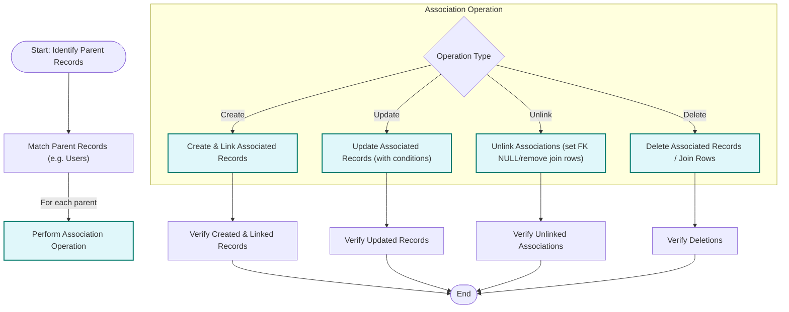

# Working with Associations: Create, Update, Unlink & Delete

GORM CLI generates powerful, type-safe field helpers for managing associations defined in your Go model structs. This guide walks you through practical workflows using these helpers to perform complex association operations like creating, updating, unlinking, and deleting related records. You'll learn how to handle various association types—`belongs to`, `has one`, `has many`, `many2many`, and polymorphic relationships—with concrete examples targeting real-world Go projects.

---

## 1. Understanding Association Helpers

When you generate code with GORM CLI, each association defined in your models gets a corresponding helper field under the generated `User`, `Pet`, `Account`, etc., structs. These helpers include methods that prepare association operations such as `Create`, `Update`, `Unlink`, `Delete`, and batch methods like `CreateInBatch`.

### Key Association Types and Their Helpers

| Association Type | Helper Kind         | Typical Use Cases                      |
| ---------------- | ------------------- | ------------------------------------ |
| belongs to       | `field.Struct[T]`   | User belongs to a `Company`          |
| has one          | `field.Struct[T]`   | User has one `Account`                |
| has many         | `field.Slice[T]`    | User has many `Pets`                  |
| many2many        | `field.Slice[T]`    | User speaks many `Languages`         |
| polymorphic      | `field.Struct[T]` or `field.Slice[T]` | Pet has one polymorphic `Toy` |

Each helper supports composable operations through `Set(...).Update(ctx)` or `Set(...).Create(ctx)` on the parent records.

---

## 2. Preparing Your Environment

Before diving into association operations:

- **Prerequisites:**
  - Have your Go project setup with GORM ORM.
  - Define your models with associations, e.g., the `User` and related structs.
  - Generate the code using GORM CLI to produce your association helpers (see the [Getting Started Guide](/guides/core-workflows/getting-started)).
  - Have a working GORM database connection `db` and context `ctx` ready.

- **Expected Outcome:**
  - Create, update, unlink, and delete associated records using generated typed helpers.
  - Understand unlink vs delete semantics in different association contexts.
  - Manage batch operations efficiently.

- **Estimated Time:** 20-30 minutes
- **Difficulty Level:** Intermediate

---

## 3. Practical Association Operations

### 3.1 Creating Associated Records

Use the `.Create()` method on the association helper to add and link a related record for each matched parent.

#### Example: Create a Pet for a User (has many)
```go
_, err := gorm.G[models.User](db).
    Where(generated.User.ID.Eq(userID)).
    Set(
        generated.User.Pets.Create(generated.Pet.Name.Set("Fido")),
    ).
    Update(ctx)
if err != nil {
    // handle error
}
```

*Outcome:* A new pet named "Fido" is created and linked to the user with `userID`.

#### Example: Create Multiple Pets in Batch
```go
pets := []models.Pet{{Name: "Cat"}, {Name: "Dog"}}
_, err := gorm.G[models.User](db).
    Where(generated.User.ID.Eq(userID)).
    Set(
        generated.User.Pets.CreateInBatch(pets),
    ).
    Update(ctx)
```

*Outcome:* Multiple pets created and associated with the user.

#### Example: Create and Link Many2Many Associations
```go
langs := []models.Language{{Code: "EN"}, {Code: "FR"}}
_, err := gorm.G[models.User](db).
    Where(generated.User.ID.Eq(userID)).
    Set(
        generated.User.Languages.CreateInBatch(langs),
    ).
    Update(ctx)
```

*Outcome:* Languages `EN` and `FR` linked in the join table.

---

### 3.2 Updating Associated Records

Update allows scoped updates to records in associations, optionally filtered by conditions on the child records using `.Where()`.

#### Example: Update a User’s Pet Name
```go
_, err := gorm.G[models.User](db).
    Where(generated.User.ID.Eq(userID)).
    Set(
        generated.User.Pets.Where(generated.Pet.Name.Eq("old-name")).
            Update(generated.Pet.Name.Set("new-name")),
    ).
    Update(ctx)
```

*Outcome:* Pet with name "old-name" linked to the user is renamed "new-name".

#### Example: Update a HasOne Account Number
```go
_, err := gorm.G[models.User](db).
    Where(generated.User.ID.Eq(userID)).
    Set(
        generated.User.Account.Where(generated.Account.Number.Eq("A-001")).
            Update(generated.Account.Number.Set("A-002")),
    ).
    Update(ctx)
```

*Outcome:* User’s account number updated from "A-001" to "A-002".

---

### 3.3 Unlinking Associations

Unlinking removes the association link without deleting associated records:
- For `belongs to`, parent FK is set to NULL.
- For `has one` or `has many`, child FK is set to NULL.
- For `many2many`, join table rows are deleted.

#### Example: Unlink Pets from a User (has many)
```go
_, err := gorm.G[models.User](db).
    Where(generated.User.ID.Eq(userID)).
    Set(
        generated.User.Pets.Unlink(),
    ).
    Update(ctx)
```

*Outcome:* Pets remain in the database but their `UserID` FK is set to NULL.

#### Example: Unlink User from Company (belongs to)
```go
_, err := gorm.G[models.User](db).
    Where(generated.User.ID.Eq(userID)).
    Set(
        generated.User.Company.Unlink(),
    ).
    Update(ctx)
```

*Outcome:* User `CompanyID` set to NULL. Company record remains.

#### Example: Unlink a Language from User (many2many)
```go
_, err := gorm.G[models.User](db).
    Where(generated.User.ID.Eq(userID)).
    Set(
        generated.User.Languages.Where(generated.Language.Code.Eq("EN")).Unlink(),
    ).
    Update(ctx)
```

*Outcome:* Language association removed, but language record remains.

---

### 3.4 Deleting Associated Records

Delete removes records from the associated tables (note: for many2many, only the join rows are deleted; the associated records remain).

#### Example: Delete a User’s Pet
```go
_, err := gorm.G[models.User](db).
    Where(generated.User.ID.Eq(userID)).
    Set(
        generated.User.Pets.Where(generated.Pet.Name.Eq("old-pet")).Delete(),
    ).
    Update(ctx)
```

*Outcome:* Pet named "old-pet" is deleted from the database.

#### Example: Delete a Many2Many Join (Friend Relationship)
```go
_, err := gorm.G[models.User](db).
    Where(generated.User.ID.Eq(userID)).
    Set(
        generated.User.Friends.Where(generated.User.Name.Eq("friend-a")).Delete(),
    ).
    Update(ctx)
```

*Outcome:* The association with "friend-a" is removed but the friend user record remains.

---

## 4. Polymorphic Associations

Polymorphic associations like `Pet.Toy` have special handling but support the same operations.

### Create a Toy linked to a Pet
```go
_, err := gorm.G[models.Pet](db).
    Where(generated.Pet.ID.Eq(petID)).
    Set(
        generated.Pet.Toy.Create(generated.Toy.Name.Set("ball")),
    ).
    Update(ctx)
```

### Update Toy's Name
```go
_, err := gorm.G[models.Pet](db).
    Where(generated.Pet.ID.Eq(petID)).
    Set(
        generated.Pet.Toy.Where(generated.Toy.Name.Eq("ball")).Update(generated.Toy.Name.Set("cube")),
    ).
    Update(ctx)
```

### Unlink Toy from Pet
```go
_, err := gorm.G[models.Pet](db).
    Where(generated.Pet.ID.Eq(petID)).
    Set(
        generated.Pet.Toy.Unlink(),
    ).
    Update(ctx)
```

### Delete Toy
```go
_, err := gorm.G[models.Pet](db).
    Where(generated.Pet.ID.Eq(petID)).
    Set(
        generated.Pet.Toy.Delete(),
    ).
    Update(ctx)
```

*Outcome:* Create, update, unlink, or delete the polymorphic `Toy` records associated with a Pet.

---

## 5. Best Practices and Pitfalls

- Always use conditions with `Update`, `Unlink`, and `Delete` to avoid unintentional changes to multiple records.
- Unlink is preferred when you want to preserve related records but remove only the association.
- Delete is destructive; for many2many relationships, it only removes join rows, preserving records.
- Use batch operations (`CreateInBatch`) for efficient bulk insertions in has-many and many2many scenarios.
- Verify foreign key setup in your models to ensure unlink behaves as expected.

<Tip>
Batch create (`CreateInBatch`) vastly improves performance when handling multiple associations at once.
Use it whenever adding multiple related entities.
</Tip>

<Tip>
When unlinking or deleting, always test carefully in a development environment to avoid data loss.
</Tip>

---

## 6. Troubleshooting Common Issues

<AccordionGroup title="Troubleshooting Association Operations">
<Accordion title="Errors When Using Association Helpers">
- Ensure generated code is up to date by re-running the CLI after model changes.
- Confirm your `gorm.DB` instance is correctly initialized and accessible.
- Validate association names match your model struct field names.
- Use the `.Where()` clause on associations to scope operations safely.
</Accordion>
<Accordion title="Unlinking Does Not Remove Expected Links">
- Check if foreign keys allow NULL values.
- Confirm that association type aligns with expected unlink semantics.
- For many2many, make sure join tables are configured correctly.
</Accordion>
<Accordion title="Delete Removes More Data Than Expected">
- Always add filtering conditions to `.Delete()` to target precise rows.
- Avoid calling `.Delete()` without a `.Where()` filter on associations that contain multiple records.
</Accordion>
</AccordionGroup>

---

## 7. Summary Diagram: Association Operation Workflow



---

## 8. Next Steps & Related Content

- Dive deeper into association operations with the [Template-Based Queries Guide](/guides/advanced-patterns/template-sql-workflows) to combine templated SQL with associations.
- Customize generation of field helpers via `genconfig.Config` as explained in [Customizing Code Generation](/guides/advanced-patterns/customizing-generation).
- Learn about advanced JSON field helpers in [Creating and Using Custom Field Helpers](/guides/advanced-patterns/json-field-helpers).
- Start integrating generated code into your projects by following [Integrating Generated Code](/guides/core-workflows/integrating-into-projects).

---

## References

- [GORM CLI README](https://github.com/go-gorm/cli/blob/main/README.md)
- Example tests demonstrating association usage in `/examples/output/models_relations_test.go`
- Model definitions in `/examples/models/user.go`

