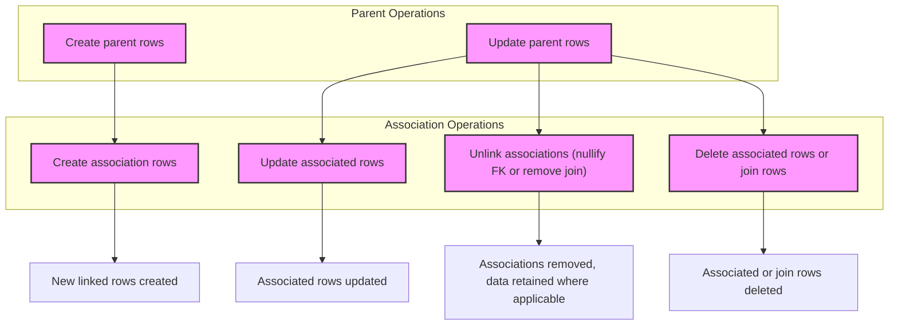

# Working with Associations

A practical guide to generating and using association helpers (has-one, has-many, belongs-to, many2many, polymorphic). This guide covers core semantics, example workflows, and best practices for CRUD operations on related models using GORM CLI generated helpers.

---

## 1. Understanding Associations in GORM CLI

GORM CLI generates **association helpers** for related models, enabling type-safe, fluent operations on your model associations. These helpers reflect your Go model relationships such as `has-one`, `has-many`, `belongs-to`, `many2many`, and polymorphic associations.

### What You Can Do Using Association Helpers

- **Create:** Create and link related records during parent creation or update
- **Update:** Modify associated records with optional filtering conditions
- **Unlink:** Remove links between records without deleting data
- **Delete:** Remove associated rows or join records based on association type
- **Batch Create:** Efficiently create and link multiple associations at once

### Key Association Types and Their Semantics

| Association Type | Unlink Behavior                    | Delete Behavior                                  |
|------------------|----------------------------------|-------------------------------------------------|
| belongs to       | Nullify parent's foreign key     | Deletes associated parent records               |
| has one / has many | Nullify child's foreign key     | Deletes child rows                               |
| many2many        | Remove join table record(s) only | Remove join table record(s), associated rows remain |

<Note>
Association operations are applied in the context of parent rows matched by your current query builder's conditions.
</Note>

---

## 2. Prerequisites

Before using association helpers:

- You have defined your models with associations using GORM struct tags
- You have generated code with GORM CLI (`gorm gen`) to produce the association helpers
- Your Go environment supports generics (Go 1.18+)
- You have basic knowledge of GORM query building and context-aware execution

---

## 3. How to Use Association Helpers: Step-by-Step

Association helpers are available on generated model fields as either `field.Struct[T]` for single associations or `field.Slice[T]` for collections. You compose operations inside `Set(...)` along with parent model fields.

### 3.1 Creating and Linking Associated Records

```go
// Create a new User with one Pet (has many)
gorm.G[User](db).
  Set(
    generated.User.Name.Set("alice"),
    generated.User.Pets.Create(
      generated.Pet.Name.Set("fido"),
    ),
  ).
  Create(ctx)

// Create a User and batch link languages (many2many)
gorm.G[User](db).
  Set(
    generated.User.Name.Set("polyglot"),
    generated.User.Languages.CreateInBatch([]models.Language{{Code: "EN"}, {Code: "FR"}}),
  ).
  Create(ctx)
```

**Outcome:** Parent and associated records are created and linked in a single transaction.

### 3.2 Updating Associated Records with Conditions

You can target specific associated records using `Where` filters:

```go
// Update a User's Pet where pet name = 'old'
gorm.G[User](db).
  Where(generated.User.ID.Eq(1)).
  Set(
    generated.User.Pets.Where(generated.Pet.Name.Eq("old")).Update(
      generated.Pet.Name.Set("new"),
    ),
  ).
  Update(ctx)
```

**Outcome:** Only matching associated rows are updated.

### 3.3 Unlinking Associations (Remove Link Only)

Unlink disassociates related rows without deleting them:

```go
// Unlink all Pets of a User (set child FK to NULL)
gorm.G[User](db).
  Where(generated.User.ID.Eq(1)).
  Set(generated.User.Pets.Unlink()).
  Update(ctx)

// Unlink belongs-to association (sets parent FK NULL)
gorm.G[User](db).
  Where(generated.User.ID.Eq(1)).
  Set(generated.User.Company.Unlink()).
  Update(ctx)
```

**Outcome:** Foreign keys are nulled or join rows removed, preserving data.

### 3.4 Deleting Associated Records

Delete removes associated rows or join rows based on association type:

```go
// Delete all Pets with name = 'old' linked to User
gorm.G[User](db).
  Where(generated.User.ID.Eq(1)).
  Set(generated.User.Pets.Where(generated.Pet.Name.Eq("old")).Delete()).
  Update(ctx)

// Delete many2many association join rows (language link), keeps language rows
gorm.G[User](db).
  Where(generated.User.ID.Eq(1)).
  Set(generated.User.Languages.Where(generated.Language.Code.Eq("EN")).Delete()).
  Update(ctx)
```

**Outcome:** Associated records or join rows matching conditions are deleted.

### 3.5 Batch Create Associations

Batch creation can efficiently link multiple associated records:

```go
// Has-many batch create
gorm.G[User](db).
  Where(generated.User.ID.Eq(1)).
  Set(generated.User.Pets.CreateInBatch([]models.Pet{{Name: "bm1"}, {Name: "bm2"}})).
  Update(ctx)

// Many2many batch create
gorm.G[User](db).
  Where(generated.User.ID.Eq(1)).
  Set(generated.User.Languages.CreateInBatch([]models.Language{{Code: "B1"}, {Code: "B2"}})).
  Update(ctx)
```

**Outcome:** Multiple association rows are created and linked efficiently with fewer queries.

---

## 4. Best Practices & Tips

- Use explicit `Where` filters on associations to avoid unintended updates or deletes.
- Prefer `Unlink()` over `Delete()` if you wish to keep associated data intact.
- Leverage batch methods (`CreateInBatch`) when creating multiple related records to improve performance.
- Understand associations’ unlink and delete semantics to prevent data loss.
- Verify association names (field names) from generated code to avoid runtime errors.
- Use context (`ctx`) appropriately for cancellation and tracing.

---

## 5. Common Pitfalls & Troubleshooting

<AccordionGroup title="Troubleshooting Association Issues">
<Accordion title="Why do create association operations fail?">
- Ensure the `Set(...)` method includes both parent fields and association operations within the same call.
- Verify generated association helper field names.
- Check that the association foreign keys and GORM tags are correctly declared in your models.
</Accordion>
<Accordion title="Updating associations does nothing">
- Confirm that your `Where` filters on associations match the existing related rows.
- Check for typos in field or column references.
- Ensure the parent query builder is correctly scoped (e.g., matching primary keys).
</Accordion>
<Accordion title="Unlink/Delete removes unintended rows">
- Double-check the `Where` conditions on the association to scope operations precisely.
- Review the association type and understand its unlink/delete semantics.
- Use transactions during mass updates to allow rollback if needed.
</Accordion>
</AccordionGroup>

---

## 6. Example Workflows

### 6.1 Creating a User with Associated Pets and Languages

```go
ctx := context.Background()
db := getYourDB()

_, err := gorm.G[User](db).
  Set(
    generated.User.Name.Set("alice"),
    generated.User.Pets.Create(generated.Pet.Name.Set("fido")),
    generated.User.Languages.CreateInBatch([]models.Language{{Code: "EN"}, {Code: "FR"}}),
  ).
  Create(ctx)
if err != nil {
  panic(err)
}
```

### 6.2 Updating a Pet's Name Based on Condition

```go
_, err := gorm.G[User](db).
  Where(generated.User.ID.Eq(1)).
  Set(
    generated.User.Pets.Where(generated.Pet.Name.Eq("old")).Update(generated.Pet.Name.Set("rex")),
  ).
  Update(ctx)
if err != nil {
  panic(err)
}
```

### 6.3 Unlinking a User's Company (Belongs-To)

```go
_, err := gorm.G[User](db).
  Where(generated.User.ID.Eq(1)).
  Set(generated.User.Company.Unlink()).
  Update(ctx)
if err != nil {
  panic(err)
}
```

### 6.4 Deleting Specific Pet Records

```go
_, err := gorm.G[User](db).
  Where(generated.User.ID.Eq(1)).
  Set(generated.User.Pets.Where(generated.Pet.Name.Eq("oldpet")).Delete()).
  Update(ctx)
if err != nil {
  panic(err)
}
```

---

## 7. Deep Dive: Polymorphic Associations

Polymorphic associations (e.g., Pet.Toy) are also supported with the same CRUD semantics:

- `Create`, `Update`, `Unlink`, and `Delete` operations affect the polymorphic association.
- `Unlink` typically zeroes out foreign keys on polymorphic traits (e.g., OwnerID, OwnerType) without deleting the associated row.

Example:

```go
// Update Toy linked to a Pet
_, err := gorm.G[Pet](db).
  Where(generated.Pet.ID.Eq(petID)).
  Set(generated.Pet.Toy.Where(generated.Toy.Name.Eq("ball")).Update(generated.Toy.Name.Set("cube"))).
  Update(ctx)

// Unlink Toy from Pet (without deleting the Toy)
gorm.G[Pet](db).
  Where(generated.Pet.ID.Eq(petID)).
  Set(generated.Pet.Toy.Unlink()).
  Update(ctx)
```

---

## 8. Summary Diagram of Association Operation Flow



---

## 9. Additional Resources

- [Model Definition and Association Tags](https://gorm.io/docs/associations.html) — Understanding GORM model relationships
- [Using Generated Code](https://docs.gorm.io/guides/core-workflows/using-generated-code) — Integration with generated helpers
- [Template-Driven Queries: SQL Template DSL](https://docs.gorm.io/guides/advanced-patterns/template-dsl) — Extend query capabilities
- [Configuration and JSON Field Mapping](https://docs.gorm.io/guides/advanced-patterns/customization) — Custom generation
- Example tests demonstrating association operations: `examples/output/models_relations_test.go`

---

<Check>This guide empowers you to confidently perform create, update, unlink, delete, and batch operations on model associations generated by GORM CLI, integrating powerful, compile-time safe ORM workflows into your Go projects.</Check>

---

