# Best Practices and Troubleshooting

Learn proven patterns to maintain sustainable and robust code generation with GORM CLI. This guide helps you navigate common pitfalls in versioning, configuration, integration, and automating workflows, ensuring you can safely adopt and extend GORM CLI in real-world projects.

---

## 1. Sustainable Code Generation

### Understand the Dual-Generator Architecture

GORM CLI produces two complementary code sets:
- Type-safe query APIs from Go interfaces with embedded SQL templates.
- Model-driven field helpers for filters, updates, and associations.

**Tip:** Treat these outputs as distinct but synergistic layers. Changes in your models or interfaces should trigger regeneration to keep both layers consistent.

### Version Control Best Practices

- **Commit generated code or ignore?**
  - Recommended to commit generated code inside your repository for ease of consumption by other developers and CI processes.
  - Use a well-defined output directory (default `./g`) or customize via `genconfig.Config` to segregate generated files.

- **Track config files explicitly.**
  - Changes to `genconfig.Config` representations affect generation; version control these config declarations alongside your source.

- **Regenerate after model or interface changes.**
  - Avoid partial or stale outputs by always running `gorm gen` fully when your interfaces or models evolve.

### Isolate Generated Code

- Use output paths distinct from source to avoid cyclical imports and contamination.
- Leverage the `OutPath` property in `genconfig.Config` to direct output.


## 2. Versioning and Compatibility

### Go Version Requirements

- GORM CLI requires Go 1.18 or later due to extensive use of generics.
- Validate your Go environment before installing or updating GORM CLI.

### GORM CLI Version Management

- Stay current with the latest **stable** releases to benefit from bug fixes and new features.
- Prefer `go install gorm.io/cli/gorm@latest` for installation or updates.

### Handling Breaking Changes

- Read changelogs to understand API and template changes affecting generation.
- Test generated output whenever upgrading GORM CLI.


## 3. Working Safely in Real Projects

### Incremental Adoption Strategy

- Start generating code for limited interfaces or structs using the `IncludeInterfaces` and `IncludeStructs` filters.
- Gradually expand coverage as confidence in generator stability grows.

### Use Configuration Filters

- Use `IncludeInterfaces`, `ExcludeInterfaces`, `IncludeStructs`, and `ExcludeStructs` with shell-style patterns to precisely control generation scope.
- Example to generate only interfaces starting with `Query`:

```go
var _ = genconfig.Config{
  IncludeInterfaces: []any{"Query*"},
}
```

### Custom Type Mappings

- Leverage `FieldTypeMap` and `FieldNameMap` to support custom or complex field types such as JSON or SQL nullable types.
- Define custom helpers following examples like the JSON field mapping guide.

### File-Level vs Package-Level Configurations

- Use `FileLevel: true` to apply config only to the current file, helpful in complex multi-package projects.
- Use package-level config for consistent settings across multiple files.


## 4. Common Pitfalls and Solutions

### Generated Code Not Updating

- **Cause:** Running `gorm gen` with incorrect `-i` or `-o` flags or caching issues.
- **Solution:** Confirm input path points to updated source files; clean output directory if needed.
- Verify that configuration filters are not excluding your interfaces or structs unintentionally.

### Conflicting Package Imports

- **Cause:** Generated files import the same package with conflicting aliases or paths.
- **Solution:** Ensure package import paths are consistent; avoid mixing relative and absolute imports.
- Use `goimports` formatting (automatically run by generation pipeline) to catch conflicts.

### Missing Context Parameter in Query Methods

- Generated methods automatically inject `context.Context` if it's missing from interface signature.
- Make sure your interface method parameters do not duplicate `ctx` to avoid signature conflicts.

### Errors in SQL Templates

- Pay special attention to syntax in method comment SQL templates; invalid templates cause generation errors.
- Use conditional blocks (`{{if}}`, `{{where}}`, `{{set}}`) correctly to avoid invalid SQL.
- Escape literal `@` as `\@` to avoid placeholder conflict.

### Association Handling Mistakes

- Understand semantic differences of `Unlink` vs `Delete` in associations.
- Use conditional filters on association helpers to safely unlink or delete subsets.


## 5. Extending and Automating the Workflow

### Integration with CI/CD

- Add `gorm gen` commands in build or generation pipelines.
- Validate generated code for syntax and test usage in pull requests before merge.

### Automation Tips

- Use watch scripts or file-change hooks to trigger automatic regeneration on source updates.
- Use consistent folder structure and config declarations to limit scope and speed up generation.

### Debugging Generation Issues

- Add verbose logs (future CLI feature) or manually inspect input files for correct config declarations.
- Review generated code directly to diagnose missing fields or interface methods.


## 6. Troubleshooting Quick Reference

<AccordionGroup title="Common Issues & Resolutions">
<Accordion title="Code Not Generating for Interfaces or Structs">
Verify your `genconfig.Config` include/exclude filters. Remember whitelist patterns override blacklists. Confirm the interface or struct names match patterns exactly including package prefixes if used.
</Accordion>
<Accordion title="Go Version or Environment Problems">
Ensure Go 1.18+ is installed and configured in your environment. Run `go version` and check `GOPATH` and `GOROOT`. Reinstall GORM CLI if version mismatch is detected.
</Accordion>
<Accordion title="Compilation Errors in Generated Code">
Inspect your model or interface definitions for unsupported types or incorrect SQL template syntax. Validate schema changes and regenerate code.
</Accordion>
<Accordion title="Association Updates Not Working as Expected">
Confirm you use the correct association operations (`Create`, `Update`, `Unlink`, `Delete`). Check filters in association helpers to target the intended records.
</Accordion>
<Accordion title="Template Parsing Errors During Generation">
Review SQL templates in interface method comments for syntax errors or unsupported constructs. Use escapes for reserved characters.
</Accordion>
</AccordionGroup>


## 7. Practical Tips for Best Results

- **Consistently name and document your interfaces and methods.** Clear method comments help maintain accurate SQL templates.
- **Use code generation as a build step.** Avoid manual edits to generated files to prevent merges conflicts.
- **Regularly update configurations** to incorporate custom helper mappings and field behaviors.
- **Leverage examples** in the repository — the `examples/query.go` and `examples/models/user.go` files demonstrate idiomatic usage.


## 8. Summary Flow Diagram

```mermaid
flowchart TD
    Start([Start: Prepare Models & Interfaces]) --> PrepareCode[Define Go structs and interfaces with SQL templates]
    PrepareCode --> Configure[Optionally declare genconfig.Config]
    Configure --> RunGen[Run `gorm gen -i <input> -o <output>`]
    RunGen --> Checks[Inspect generated files & fix errors]
    Checks --> UseCode[Import & use generated code in project]
    UseCode --> Test[Write & run tests]
    Test --> End([End: Incremental development & regenerate as needed])
```




---

## Related Resources

- [Getting Started with GORM CLI](https://gorm.io/docs/cli/getting-started.html)
- [Configuring GORM CLI Generator](https://gorm.io/docs/cli/configuring-generator.html)
- [Handling JSON Fields with Custom Helpers](https://gorm.io/docs/cli/handling-json.html)
- [Mastering Associations Guide](https://gorm.io/docs/cli/mastering-associations.html)
- [Common Issues Troubleshooting](https://gorm.io/docs/cli/troubleshooting.html)


## Next Steps

- Experiment with incremental interface filtering to manage complex projects.
- Automate code generation in your CI pipeline.
- Explore advanced customization patterns with `genconfig.Config`.
- Dive into association management for more powerful ORM interactions.


<Check>
Following these best practices will safeguard your projects, reduce maintenance overhead, and empower your Go development with GORM CLI’s type-safe and fluent query generation.
</Check>

---

*This documentation page is part of the GORM CLI user guides. For installation and first-run tutorials, please refer to the Getting Started section.*
