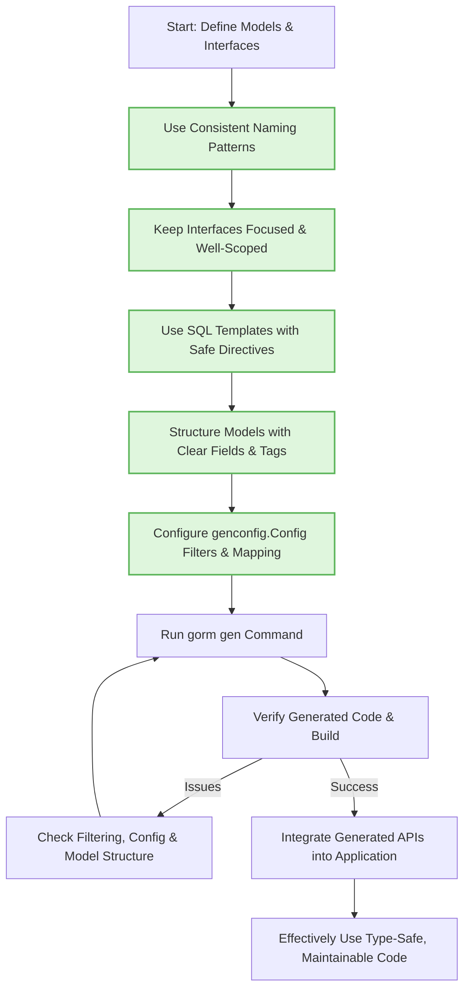

# Best Practices & Common Patterns

## Overview

This guide provides curated recommendations for structuring your interfaces, models, and generator configuration when using GORM CLI. It focuses on ensuring maintainable code generation, maximizing type safety, optimizing query performance, and effectively leveraging GORM CLI features especially in team environments. You will find best practices, anti-patterns to avoid, and troubleshooting tips to help you produce clean, correct, and efficient generated code.

---

## Why Focus on Best Practices?

GORM CLI’s power lies in generating type-safe, fluent, and customizable database query APIs and field helpers. However, to realize its full benefits, your input source code and configuration must be thoughtfully organized. Poor structure or improperly scoped configurations can lead to bloated generated code, confusing APIs, build errors, or runtime inefficiencies.

This guide aims to help you:

- Write clear, maintainable query interfaces and models
- Configure the generator for selective and modular output
- Avoid common pitfalls that cause generation issues or API misuse
- Optimize performance and team collaboration with GORM CLI

---

## 1. Designing Query Interfaces

### 1.1 Use Clear and Consistent Interface Naming Patterns

- **Use prefix or suffix patterns** like `Query*` or `*Query` to indicate interfaces intended for generation.
- This allows your configuration to selectively generate only desired interfaces, improving build performance and reducing noise.

```go
var _ = genconfig.Config{
  IncludeInterfaces: []any{"Query*"},
}
```

### 1.2 Keep Interfaces Focused

- Define cohesive responsibilities in each interface.
- Avoid overly large interfaces mixing unrelated query methods.
- Smaller, focused interfaces simplify testing, generation, and readability.

### 1.3 Use SQL Template Comments Judiciously

- Employ inline SQL templates for complex or custom queries.
- Use directives like `@@table`, `@param`, `{{where}}`, and `{{set}}` for readable, maintainable templates.
- Avoid embedding raw SQL logic that cannot be parameterized safely or is hard to test.

### 1.4 Stay Explicit About Context

- Although GORM CLI adds `context.Context` automatically if missing, consider adding it explicitly in method signatures for clarity and control.

### 1.5 Return Types

- Return one or two values only: data (or interface) and an error.
- Keep return types simple to maximize utility of generated code.

---

## 2. Structuring Model Structs

### 2.1 Use Explicit Field Tags for Customization

- Use `gen:"<tag>"` on model fields to customize field helper mapping.
- This enables type mapping, e.g., JSON helpers, time parsing, or custom wrappers.

```go
type User struct {
  Profile string `gen:"json"`
}
```

### 2.2 Favor Composition Over Embedding for Clarity

- Although anonymous field embedding is supported, use it sparingly to avoid merging unrelated fields unintentionally.
- Explicit fields aid readability and help the generator map fields correctly.

### 2.3 Use Consistent Naming and Keep Models Clean

- Avoid complex inline struct types or deeply nested anonymous structs that complicate generation.
- Maintain one model per file or logical grouping for easier navigation.

---

## 3. Leveraging genconfig.Config Effectively

### 3.1 Output Path Management

- Use `OutPath` to direct generated code to dedicated folders per package.
- Consider layered or nested output folders if your project structure warrants it.

### 3.2 Filter Interfaces and Structs Precisely

- Use `IncludeInterfaces` and `IncludeStructs` with shell-style patterns (`*` wildcards) to whitelist what should be generated.
- Avoid generating everything if not needed, to keep output focused and fast.

```go
var _ = genconfig.Config{
  IncludeInterfaces: []any{"Query*"},
  IncludeStructs: []any{"User", "Account*"},
}
```

- If you must exclude specific items, use `ExcludeInterfaces` and `ExcludeStructs`, but note whitelist takes precedence.

### 3.3 Field Type and Name Mapping

- Use `FieldTypeMap` to map Go types to specific field helper types.
- Use `FieldNameMap` to map fields with specific `gen:""` tags to custom helpers.

Example:

```go
var _ = genconfig.Config{
  FieldTypeMap: map[any]any{
    sql.NullTime{}: field.Time{},
  },
  FieldNameMap: map[string]any{
    "json": JSON{},
  },
}
```

### 3.4 File-Level Configuration

- Enable `FileLevel: true` if you want a config to apply only to the generating file rather than the whole package.
- Useful in monorepos or multi-module projects.

### 3.5 Nested and Multi-Level Configurations

- Parent configurations cascade down to nested directories.
- Child configs can override or narrow generation scope.
- Plan hierarchy to avoid conflicts or duplicated generation.

---

## 4. Patterns to Avoid (Anti-Patterns)

### 4.1 Avoid Generating Everything Without Filtering

- Generating all interfaces and structs in large projects leads to code bloat and increased build time.
- Use filtering to generate only what is necessary for each module or package.

### 4.2 Avoid Complex Inline SQL Without Parameterization

- Inline SQL should be safe and type-checked.
- Avoid unescaped raw SQL concatenation or dynamic code in templates.

### 4.3 Avoid Over-Embedding Structures That Obfuscate Fields

- Extensive use of anonymous struct embedding can confuse field helper generation and lead to incorrect DB column mappings.

### 4.4 Avoid Mixing Generation Responsibilities in One Package

- Prefer separation of query interfaces and models into distinct, clear packages.
- This encourages cleaner generation targets and easier maintenance.

---

## 5. Troubleshooting Tips

### 5.1 No Generated Files Appearing

- Confirm your `IncludeInterfaces` and `IncludeStructs` filters match the intended types.
- Check the `OutPath` — by default it writes to `./g` if not set.
- Verify input path points properly to your source files.

### 5.2 Unexpected Generated Methods or Types

- Use explicit whitelist patterns to tightly control generation.
- Check for name collisions or similar named types causing confusion.

### 5.3 Build Errors After Generation

- Confirm field helper type mappings cover custom or complex Go types.
- Ensure embedded anonymous structs are flattened correctly, or simplify models.

### 5.4 Performance Issues in Generation

- Limit input scope with `-i` flag and config inclusion filters.
- Avoid overly large or complex inline SQL templates.

---

## 6. Practical Example of Config Usage

```go
package examples

import (
  "database/sql"
  "gorm.io/cli/gorm/field"
  "gorm.io/cli/gorm/genconfig"
)

var _ = genconfig.Config{
  OutPath: "examples/output",

  FieldTypeMap: map[any]any{
    sql.NullTime{}: field.Time{},
  },

  FieldNameMap: map[string]any{
    "json": JSON{},
  },

  IncludeInterfaces: []any{"Query*"},
  IncludeStructs:    []any{"User", "Account*"},
}
```

This config causes generation only for interfaces starting with `Query` and structs named `User` and `Account*`, mapping `sql.NullTime` fields to time helpers and fields tagged with `gen:"json"` to the custom JSON helper.

---

## 7. Summary Diagram of Best Practices Workflow



---

## 8. Next Steps & Related Documentation

- Explore the [Minimal Project Setup](../getting-started/config-gen-first-run/minimal-setup) guide to structure your project for first generation.
- Consult [Generate Code: Your First Run](../getting-started/config-gen-first-run/run-generator) to run the generator with your config.
- Use [Using the Generated APIs](../getting-started/config-gen-first-run/using-generated) to start integrating generated APIs.
- Review [Advanced Patterns & Associations](../guides/advanced-patterns/association-workflows) for managing relationships.
- For customizing generation behaviors in depth, see [Customizing Code Generation with genconfig.Config](../guides/customization-integration/generation-config).

---

## 9. Additional Tips

- Keep your source code and generator config under version control to track evolving code generation rules.
- Regularly regenerate and review generated code after interface or model changes to catch breaking changes early.
- Share configuration standards across your development team to maintain consistency.
- Write clear, expressive SQL templates and document them extensively.

---

By following these best practices and patterns, you will harness the full power of GORM CLI to produce safe, maintainable, and high-performance database query code tailored to your project’s needs.


---