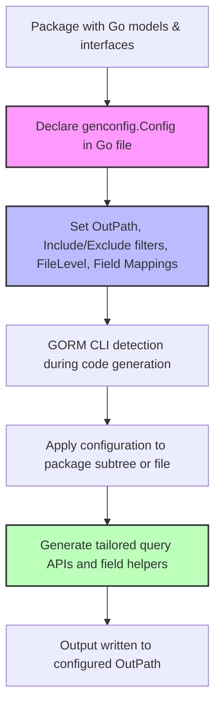

# Tailoring Code Generation with genconfig.Config

## Overview

`genconfig.Config` allows you to finely control the code generation process in GORM CLI at the package or file level. This guide provides practical instructions to customize output directories, apply whitelist and blacklist rules for including or excluding interfaces and structs, set file-level versus package-level options, and define custom field mappings. You'll learn how to incrementally adopt these configurations as your project grows, enabling precise, maintainable generation workflows.

By the end of this guide, you'll confidently configure GORM CLI to generate exactly the code you need, organized and tailored for your project structure.

---

## Prerequisites

- Basic familiarity with Go and GORM CLI code generation concepts.
- Existing Go packages with models and interfaces annotated for GORM CLI.
- Installed GORM CLI tool (go install gorm.io/cli/gorm@latest).

---

## Expected Outcome

- Ability to specify output paths for generated code at the package-level.
- Control over which interfaces and structs get generated using inclusive or exclusive patterns.
- Understand the impact of `FileLevel` on configuration scope.
- Define custom mappings from Go types and field tags to field helpers.

---

## Time Estimate

10-15 minutes to understand and apply configuration examples effectively.

---

# How to Use genconfig.Config

`genconfig.Config` is declared as a package-level variable in any Go source file within the package you want to configure. GORM CLI discovers it automatically and applies its settings when generating code for that package's files.

### 1. Setting Output Paths

Control where generated files are placed with the `OutPath` configuration:

```go
var _ = genconfig.Config{
    OutPath: "path/to/generated/code",
}
```

This directs the generator to write all generated files relative to the given path instead of defaulting to `./g`.

### 2. Controlling Which Interfaces and Structs Are Generated

You can restrict generation with inclusive (`Include*`) or exclusive (`Exclude*`) rules:

- **IncludeInterfaces / ExcludeInterfaces**: Specify interfaces to generate or skip.
- **IncludeStructs / ExcludeStructs**: Specify structs to include or omit.

**Important:** An inclusive list acts as a whitelist and takes precedence over exclusions.

```go
var _ = genconfig.Config{
    IncludeInterfaces: []any{"Query*"},           // Only generate interfaces starting with 'Query'
    ExcludeInterfaces: []any{"*Deprecated*"},    // Exclude any interfaces matching '*Deprecated*'

    IncludeStructs: []any{"User", "Account*"},  // Allow only User and Account-prefixed structs
    ExcludeStructs: []any{"*DTO"},                // Exclude DTO suffixed structs
}
```

Patterns support shell-style matching and also support type literals like `models.User{}` for precision.

### 3. File-Level versus Package-Level Configurations

- **FileLevel = false (default):** Configuration applies to the entire package subtree, affecting all files under the directory where the config is found.
- **FileLevel = true:** Configuration applies only to the current file.

Use `FileLevel: true` to have per-file granular overrides when needed:

```go
var _ = genconfig.Config{
    FileLevel: true,
    ExcludeInterfaces: []any{"I3"},
    ExcludeStructs: []any{"S3"},
}
```

### 4. Custom Field Mappings

You can map specific Go types or field tags to custom field helpers to extend generated APIs:

- **FieldTypeMap:** maps Go type instances to field helper instances.
- **FieldNameMap:** maps the `gen` struct tag names to field helper types.

The generator prioritizes `FieldNameMap` over `FieldTypeMap`.

```go
var _ = genconfig.Config{
    FieldTypeMap: map[any]any{
        sql.NullTime{}: field.Time{},
    },
    FieldNameMap: map[string]any{
        "json": JSON{},    // For fields tagged with `gen:"json"`, use the custom JSON helper
    },
}
```

### 5. Combining Options for Incremental Adoption

As your project grows, incrementally introduce configuration files per package or per file, using whitelists or blacklists to limit generation scope and applying custom mappings only where needed.

<AccordionGroup title="Example: Incremental Configuration Adoption">
<Accordion title="Root Package Config - General Setup">
```go
package examples

import (
    "database/sql"
    "gorm.io/cli/gorm/field"
    "gorm.io/cli/gorm/genconfig"
)

var _ = genconfig.Config{
    OutPath: "examples/output",
    FieldTypeMap: map[any]any{
        sql.NullTime{}: field.Time{},
    },
    FieldNameMap: map[string]any{
        "date": field.Time{},
        "json": JSON{},
    },
}
```
</Accordion>
<Accordion title="File-Level Exclusion of Nested Package Items">
```go
package nested

import "gorm.io/cli/gorm/genconfig"

// This file-level config excludes interface I3 and struct S3 in nested package only
var _ = genconfig.Config{
    FileLevel: true,
    ExcludeInterfaces: []any{"I3"},
    ExcludeStructs: []any{"S3"},
}
```
</Accordion>
</AccordionGroup>

---

# Step-by-Step Configuration Workflow

<Steps>
<Step title="Create a config.go in your target package">
<p>Place a Go file declaring a package-level variable with type <code>genconfig.Config</code>. Import <code>gorm.io/cli/gorm/genconfig</code> and define your desired settings.</p>
</Step>
<Step title="Set Output Path (optional)">
<p>Use <code>OutPath</code> to redirect generated files from the CLI <code>-o</code> flag default.</p>
</Step>
<Step title="Define Inclusion or Exclusion Patterns">
<p>Specify <code>IncludeInterfaces</code> or <code>ExcludeInterfaces</code> to control interface generation. Do the same for structs with <code>IncludeStructs</code>/<code>ExcludeStructs</code>.</p>
<p>Patterns support shell style and Go type literals for precise control.</p>
</Step>
<Step title="Apply FileLevel to scope configuration">
<p>Decide if configuration applies per file (<code>FileLevel: true</code>) or to the entire package subtree (<code>FileLevel: false</code>, default).</p>
</Step>
<Step title="Add custom field helper mappings (optional)">
<p>Map Go types or <code>gen</code> tags on struct fields to specialized helpers to extend generated code capabilities.</p>
</Step>
<Step title="Run generator and verify results">
<p>Run <code>gorm gen -i ./your/package/path -o ./generated</code> and check generated files reflect your configuration.</p>
</Step>
</Steps>

---

# Practical Examples

### Basic config limiting interfaces to those starting with "Query"

```go
package pattern

import "gorm.io/cli/gorm/genconfig"

var _ = genconfig.Config{
    IncludeInterfaces: []any{"Query*"},
}
```

### Config excluding nested package items globally across subtree

```go
package twolevel

import (
    s "gorm.io/cli/gorm/examples/filters/twolevel/nested"
    "gorm.io/cli/gorm/genconfig"
)

var _ = genconfig.Config{
    ExcludeInterfaces: []any{s.I2[any](nil), I3[any](nil)},
    ExcludeStructs:    []any{s.S2{}, S3{}},
}
```

### File-level exclusion example

```go
package nested

import "gorm.io/cli/gorm/genconfig"

var _ = genconfig.Config{
    FileLevel: true,
    ExcludeInterfaces: []any{"I3"},
    ExcludeStructs: []any{"S3"},
}
```

### Custom JSON field helper for fields tagged with `gen:"json"`

```go
package examples

import "gorm.io/cli/gorm/genconfig"

var _ = genconfig.Config{
    OutPath: "examples/output",
    FieldNameMap: map[string]any{
        "json": JSON{},
    },
}
```

On model:

```go
package models

type User struct {
    Profile string `gen:"json"`
}
```

---

# Troubleshooting & Best Practices

<AccordionGroup title="Common Issues and Solutions">
<Accordion title="Configuration Not Being Picked Up">
- Ensure `genconfig.Config` is declared as a **package-level variable** (not inside a function).
- File must be under the directory scanned by the generator.
- Confirm the file is not skipped by the generator (`shouldSkipFile` logic excludes generated files).
- Use fully qualified package imports if your types are from external packages.
</Accordion>
<Accordion title="Patterns Don’t Match Expected Interfaces/Structs">
- Use shell-style wildcard patterns (e.g., `Query*`, `*Repo`).
- For explicit matching, use proper Go type literals such as `models.User{}` or `pkg.Query(nil)`.
- Check the package path prefix combined with type name when matching.
</Accordion>
<Accordion title="Confusion About FileLevel Option">
- Remember: `FileLevel: false` (default) means config applies to the entire package subtree.
- `FileLevel: true` restricts config to this single Go file only.
- Use file-level for overrides or exclusions only applying to specific files.
</Accordion>
<Accordion title="Custom Field Helpers Not Generated Properly">
- Confirm your type mapping is declared with *typed instances*, e.g., `sql.NullTime{}` -> `field.Time{}`.
- Make sure the custom field helper types are imported or defined in your package.
- FieldNameMap keys must match the `gen` tag string exactly.
</Accordion>
</AccordionGroup>

### Best Practices

- Start with package-level configuration and narrow scope incrementally.
- Prefer inclusive whitelist (`IncludeInterfaces`/`IncludeStructs`) for explicit control.
- Use `Exclude*` lists carefully to avoid accidentally omitting necessary code.
- Combine `FieldTypeMap` and `FieldNameMap` to handle complex type mappings transparently.
- Document your configuration files clearly for your team’s maintainability.

---

# Next Steps & Related Content

- After setting up `genconfig.Config`, utilize the [Generating Code with GORM CLI](https://docs.gorm.io/getting-started/first-steps-usage/generating-code) guide to run codegen smoothly.
- Explore [Using Generated APIs in Your Project](https://docs.gorm.io/guides/core-workflows/using-generated-apis) for applying generated code.
- For advanced customizations, see [Customizing Field Helpers](https://docs.gorm.io/guides/advanced-patterns/field-helper-customization) and [Template-based Queries](https://docs.gorm.io/guides/advanced-patterns/template-based-queries).

---

# Summary Diagram




---

*Use this guide to make your GORM CLI generation process precise, efficient, and customized, empowering your Go projects with clean, type-safe database APIs.*


---

*Note: This page focuses exclusively on `genconfig.Config` usage. For broader context on GORM CLI, consult core workflow and advanced pattern guides.*

---

<p align="center">--- End of Guide ---</p>
