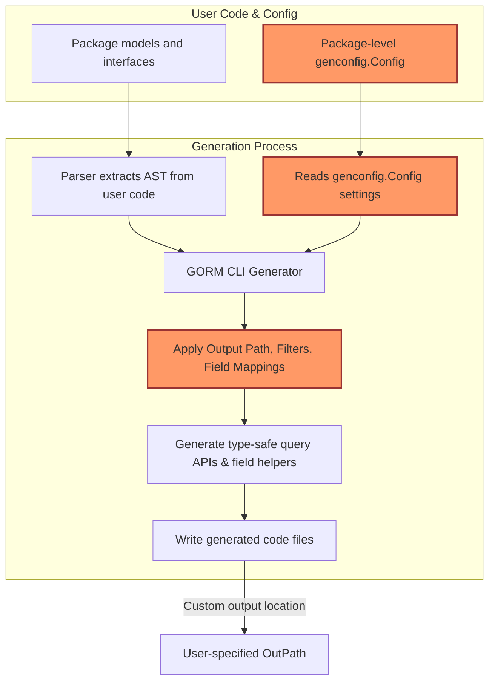

# Custom Configuration & Field Mapping

Unlock the full flexibility of the GORM CLI generator by customizing output paths, mapping Go types to field helpers, and controlling which interfaces and structs to include or exclude during code generation. This guide leads you step-by-step through setting up package-level configurations, applying advanced field mapping strategies—including JSON fields—and using whitelists/blacklists to tailor your generated code precisely to your project needs.

---

## Workflow Overview

### What You Will Achieve
This guide helps you customize the behavior of GORM CLI’s code generator by:

- Overriding default output paths for generated files per package
- Mapping complex or custom Go types to appropriate field helper wrappers
- Using `genconfig.Config` to include or exclude specific interfaces and structs via whitelists and blacklists
- Handling advanced scenarios such as JSON field mapping with type-specific helpers

### Prerequisites

- You have a working Go project with GORM CLI installed and basic code generation setup (see [Installation & Setup](/overview/integration-getting-started/installation-setup))
- Familiarity with Go models and query interfaces
- Basic understanding of generated code and field helpers

### Expected Outcome

By following this guide, you will be able to control and refine which parts of your code get generated and customize the generated field helpers for specific Go types and field tags, enabling you to extend GORM CLI’s generator for your unique domain needs.

### Time Estimate
30–45 minutes depending on your familiarity with Go and GORM CLI

### Difficulty Level
Intermediate

---

## Step-by-Step Instructions

### 1. Declare a Package-Level `genconfig.Config`

Create a Go source file in the package you want to customize. Declare a variable of type `genconfig.Config` with settings that override defaults for that package.

Example:
```go
package examples

import (
    "database/sql"
    "gorm.io/cli/gorm/field"
    "gorm.io/cli/gorm/genconfig"
)

var _ = genconfig.Config{
    // Override output folder for generated files in this package
    OutPath: "examples/output",

    // Map Go types (key) to field helper types (value)
    FieldTypeMap: map[any]any{
        sql.NullTime{}: field.Time{},
    },

    // Map fields by `gen` tag name to custom field helpers
    FieldNameMap: map[string]any{
        "date": field.Time{},  // fields with `gen:"date"` use Time helper
        "json": JSON{},       // fields with `gen:"json"` use custom JSON helper
    },

    // Whitelist interfaces and structs by pattern or type literal
    IncludeInterfaces: []any{"Query*"},
    IncludeStructs:    []any{"User", "Account*"},

    // Optionally exclude deprecated items
    ExcludeInterfaces: []any{"*Deprecated*"},
}
```

### 2. Understand Configuration Fields

- `OutPath`: Defines the output directory for generated files from this package.
- `FieldTypeMap`: Maps specific Go type instances (e.g., `sql.NullTime{}`) to the field helper to generate.
- `FieldNameMap`: Overrides mapping by matching the `gen` struct tag value on fields.
- `IncludeInterfaces` & `IncludeStructs`: Whitelist specific interfaces or structs by patterns (e.g., `Query*`) or type literals (e.g., `models.User{}`). Only these will be generated.
- `ExcludeInterfaces` & `ExcludeStructs`: Blacklists interfaces or structs by patterns or type literals, applied after includes.
- `FileLevel`: When true, applies config only to the declaring file, else applies to entire package.

### 3. Map Custom Field Helpers for Special Types (e.g., JSON)

To customize how fields are generated, especially for special JSON types, do the following:

#### a) Define a Custom Field Helper Type
```go
// JSON is a custom field helper that generates dialect-specific JSON SQL expressions
// Define this type in your project or generated code package
package examples

import (
    "encoding/json"
    "gorm.io/gorm"
    "gorm.io/gorm/clause"
)

type JSON struct { column clause.Column }

func (j JSON) WithColumn(name string) JSON {
    c := j.column
    c.Name = name
    return JSON{column: c}
}

func (j JSON) Equal(path string, value any) clause.Expression {
    return jsonEqualExpr{col: j.column, path: path, val: value}
}

type jsonEqualExpr struct {
    col  clause.Column
    path string
    val  any
}

func (e jsonEqualExpr) Build(builder clause.Builder) {
    if stmt, ok := builder.(*gorm.Statement); ok {
        switch stmt.Dialector.Name() {
        case "mysql":
            v, _ := json.Marshal(e.val)
            clause.Expr{SQL: "JSON_EXTRACT(?, ?) = CAST(? AS JSON)", Vars: []any{e.col, e.path, string(v)}}.Build(builder)
        case "sqlite":
            clause.Expr{SQL: "json_valid(?) AND json_extract(?, ?) = ?", Vars: []any{e.col, e.col, e.path, e.val}}.Build(builder)
        default:
            clause.Expr{SQL: "jsonb_extract_path_text(?, ?) = ?", Vars: []any{e.col, e.path[2:], e.val}}.Build(builder)
        }
    }
}
```

#### b) Annotate Your Model Fields With `gen` Tags
```go
package models

type User struct {
    // ... other fields ...
    Profile string `gen:"json"` // Use JSON helper for this field
}
```

#### c) Register the Custom Helper in Your `genconfig.Config`
```go
var _ = genconfig.Config{
    OutPath: "examples/output",
    FieldNameMap: map[string]any{
        "json": JSON{},
    },
}
```

### 4. Use Whitelists and Blacklists to Control Generation Scope

Control precisely which interfaces and structs are generated using include and exclude lists:

- **Include* lists** take priority; if non-empty, only matched items are generated.
- **Exclude* lists** remove matched items only if no includes are specified.

Examples:
```go
var _ = genconfig.Config{
    IncludeInterfaces: []any{"Query*", models.Query(nil)},
    ExcludeInterfaces: []any{"*Deprecated*"},
    IncludeStructs:    []any{"User", models.Account{}},
    ExcludeStructs:    []any{"*DTO"},
}
```

### 5. Organizing Multi-Level or File-Level Configurations

- Set `FileLevel: true` in `genconfig.Config` to apply config only to the declaring source file.
- Without it, config applies package-wide, including all files recursively within.

Example:
```go
var _ = genconfig.Config{
    FileLevel: true,
    // other fields...
}
```

### 6. Run the Generator Normally

Use the CLI as usual:
```bash
gorm gen -i ./your/package/path -o ./generated/output
```
The generator automatically picks up these package-level `genconfig.Config` declarations and applies your customizations.

---

## Examples & Code Samples

### Example: Basic Custom Config with JSON Field Mapping
```go
package examples

import (
    "database/sql"
    "gorm.io/cli/gorm/field"
    "gorm.io/cli/gorm/genconfig"
)

var _ = genconfig.Config{
    OutPath: "examples/output",
    FieldTypeMap: map[any]any{
        sql.NullTime{}: field.Time{},
    },
    FieldNameMap: map[string]any{
        "date": field.Time{},
        "json": JSON{},
    },
    IncludeInterfaces: []any{"Query*"},
    IncludeStructs: []any{"User"},
}
```

### Example: Model With JSON Field Tag
```go
package models

type User struct {
    ID      uint
    Name    string
    Profile string `gen:"json"` // will use JSON field helper
}
```

### Example: Custom JSON Helper Type
```go
package examples

import (
    "encoding/json"
    "gorm.io/gorm"
    "gorm.io/gorm/clause"
)

type JSON struct { column clause.Column }

func (j JSON) WithColumn(name string) JSON {
    c := j.column
    c.Name = name
    return JSON{column: c}
}

func (j JSON) Equal(path string, value any) clause.Expression {
    return jsonEqualExpr{col: j.column, path: path, val: value}
}

type jsonEqualExpr struct {
    col  clause.Column
    path string
    val  any
}

func (e jsonEqualExpr) Build(builder clause.Builder) {
    if stmt, ok := builder.(*gorm.Statement); ok {
        switch stmt.Dialector.Name() {
        case "mysql":
            v, _ := json.Marshal(e.val)
            clause.Expr{SQL: "JSON_EXTRACT(?, ?) = CAST(? AS JSON)", Vars: []any{e.col, e.path, string(v)}}.Build(builder)
        case "sqlite":
            clause.Expr{SQL: "json_valid(?) AND json_extract(?, ?) = ?", Vars: []any{e.col, e.col, e.path, e.val}}.Build(builder)
        default:
            clause.Expr{SQL: "jsonb_extract_path_text(?, ?) = ?", Vars: []any{e.col, e.path[2:], e.val}}.Build(builder)
        }
    }
}
```

### Example: White/Blacklisting Interfaces and Structs
```go
var _ = genconfig.Config{
    IncludeInterfaces: []any{"Query*"},        // Only generate interfaces starting with "Query"
    ExcludeInterfaces: []any{"*Deprecated*"},  // Except those containing "Deprecated"
    IncludeStructs:    []any{"User", "Account*"},
    ExcludeStructs:    []any{"*DTO"},           // Exclude all ending with "DTO"
}
```

---

## Troubleshooting & Tips

### 1. Generator Not Applying Your Config?
- Ensure your `genconfig.Config` declaration is at the **package level** (ideally in the same package where your models and interfaces are defined).
- Avoid placing the config inside a function or block.
- Confirm the file with your config is included in the input path (`-i`) given to `gorm gen`.

### 2. Custom Field Mapping Not Working
- Confirm that the key types in `FieldTypeMap` are **instances**, not just types (e.g., `sql.NullTime{}`, not `sql.NullTime`).
- Check that the mapped value is an instance of the field helper (e.g., `field.Time{}`).
- For `FieldNameMap`, use the exact string value of the `gen` tag from model fields.

### 3. Unexpected Generated Files Location
- Verify your `OutPath` uses a relative path that exists or will be created during generation.
- If multiple config files exist, the last config's `OutPath` detected in the directory hierarchy takes precedence.

### 4. Filtering Not Working as Expected
- Whitelists (`Include*`) override blacklists (`Exclude*`). If you have any includes set, excludes are ignored for that type (interface or struct).
- Shell-style patterns support basic wildcards "*" only: e.g., "Query*", "*Repo".
- For fine-grained control, use type literals such as `models.User{}`.

### Tips
- Use `FileLevel: true` for experimental or file-specific config to avoid unintended effects package-wide.
- Start with broad includes, then narrow down with excludes as needed.
- Leverage field tags paired with `FieldNameMap` to customize only specific columns without rewriting the entire field type map.

---

## Next Steps & Related Content

- Explore the [Configuring the Generator](/getting-started/configuration/generator-configuration) guide for a broader overview of generation options.
- Use [Building Type-Safe Queries with Interfaces](/guides/core-workflows/type-safe-queries) to learn how interface filtering improves your query API generation.
- Extend your understanding of [Using Model-Driven Field Helpers](/guides/core-workflows/field-helpers) for advanced field operations.
- If you encounter issues, consult [Troubleshooting Common Issues](/getting-started/validation/troubleshooting) for practical debugging advice.

---

## Summary Diagram: How Custom Configuration Integrates in Code Generation



---
