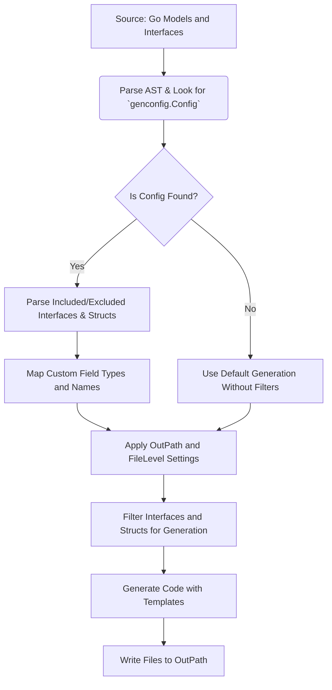

# Customizing Code Generation with Config

Learn how to control and fine-tune generated code using the `genconfig.Config` structure. This guide covers configuring output directories, applying inclusion and exclusion filters, and defining custom field mapping rules to align the generated GORM CLI output precisely with your team’s project conventions and workflow.

---

## 1. Overview

### What You Will Learn
This page shows you how to leverage `genconfig.Config` to customize code generation behavior. You'll learn to:

- Set custom output paths for generated code.
- Include or exclude specific interfaces and structs from generation using patterns or type literals.
- Map Go types and struct tags to custom field helpers.
- Control whether configuration applies at the file or package level.

### Prerequisites
- Basic familiarity with GORM CLI and its code generation process.
- Your Go models and query interfaces are defined and organized.
- GORM CLI installed and accessible.

### Expected Outcome
By following this guide, you will be able to tailor your generated query APIs and field helpers, ensuring they:
- Are output exactly where your project expects.
- Include only the relevant interfaces and structs.
- Use appropriate field helpers, including custom ones like JSON.

### Time Estimate
Around 15–30 minutes, depending on familiarity with Go and your project structure.

### Difficulty Level
Intermediate

---

## 2. Configuring Code Generation: Step-by-Step

The `genconfig.Config` type is a composite literal you declare at the package level inside your source directories. The generator automatically discovers and applies these settings during code generation.

### Step 1: Define a `genconfig.Config` Variable

Create a variable named with an anonymous assignment (`var _ = genconfig.Config{}`) in a Go source file within the package you want to customize.

```go
package examples

import (
    "database/sql"
    "gorm.io/cli/gorm/field"
    "gorm.io/cli/gorm/genconfig"
)

var _ = genconfig.Config{
    OutPath: "examples/output",
    FieldTypeMap: map[any]any{
        sql.NullTime{}: field.Time{},
    },
    FieldNameMap: map[string]any{
        "json": JSON{}, // Maps fields with `gen:"json"` tag to a JSON helper
    },
    IncludeInterfaces: []any{"Query*"},
    ExcludeInterfaces: []any{"*Deprecated*"},
    IncludeStructs: []any{"User", "Account*"},
    ExcludeStructs: []any{"*DTO"},
}
```

### Explanation of Key Fields

| Field Name          | Purpose                                                                                             |
| ------------------- | ------------------------------------------------------------------------------------------------- |
| `OutPath`           | Defines the output directory for generated files containing this config’s package.                 |
| `FileLevel`         | If true, applies config only to the specific Go source file, not the entire package.               |
| `FieldTypeMap`      | Maps Go type instances (e.g., `sql.NullTime{}`) to custom field helper types (e.g., `field.Time{}`).|
| `FieldNameMap`      | Maps string tags from struct fields (e.g., `gen:"json"`) to custom field helper types.          |
| `IncludeInterfaces` | Whitelist of interface names or patterns (shell-style) to generate code for; overrides exclusions. |
| `ExcludeInterfaces` | Blacklist of interfaces to exclude from generation.                                                |
| `IncludeStructs`    | Whitelist of struct names/patterns for generation; overrides exclusions.                           |
| `ExcludeStructs`    | Blacklist of struct names or patterns to exclude.                                                  |

### Step 2: Customize Output Directory

Change the `OutPath` string to specify where generated files for this package will land. For example:

```go
var _ = genconfig.Config{
    OutPath: "custom/generated/code",
}
```

If you do not specify `OutPath`, generation defaults to `./g` or the CLI flag `-o` used.

### Step 3: Specify Interface and Struct Filters

You often only want to generate code for a subset of your interfaces or models.

- Use `IncludeInterfaces` and `IncludeStructs` to *whitelist* what to generate.
- Use `ExcludeInterfaces` and `ExcludeStructs` to exclude unwanted types by wildcard patterns or exact names.

**Important:** If **any** `Include*` lists are non-empty, exclusion lists for the same kind are ignored.

```go
IncludeInterfaces: []any{"Query*", models.Query(nil)},
ExcludeInterfaces: []any{"*Deprecated*"},
IncludeStructs: []any{"User", "Account*", models.User{}},
ExcludeStructs: []any{"*DTO"}
```

You can mix simple string patterns (`"User"`, `"Account*"`) with typed literals like `models.User{}` for precise matching.

### Step 4: Map Custom Field Helpers

By default, the generator maps standard Go types to built-in helpers (e.g., `int` → `field.Number[int]`). For special fields, configure mappings:

- `FieldTypeMap` maps Go type instances to custom field helper types.
- `FieldNameMap` maps struct tag names (from `gen:"tag"`) to custom helpers.

Example for JSON fields:

```go
FieldNameMap: map[string]any{
    "json": JSON{},
},
```

Then, use `gen:"json"` in your model:

```go
type User struct {
    Profile string `gen:"json"`
}
```

### Step 5: Control Config Scope with `FileLevel`

By default, configuration applies package-wide. Set `FileLevel: true` to apply only to the file where the config is declared.

```go
var _ = genconfig.Config{
    FileLevel: true,
    OutPath:  "file-specific-output",
}
```

This allows differentiated configuration for multiple files in the same package.

---

## 3. Real-World Usage Examples

### Example: Include Only Interfaces Starting with "Query"

```go
package pattern

import "gorm.io/cli/gorm/genconfig"

var _ = genconfig.Config{
    IncludeInterfaces: []any{"Query*"},
}
```

GORM CLI will generate code only for interfaces whose names start with `Query`.

### Example: Exclude Specific Interface and Struct

```go
package nested

import "gorm.io/cli/gorm/genconfig"

var _ = genconfig.Config{
    FileLevel: false, // Apply to whole package, not only this file
    ExcludeInterfaces: []any{"I3"},
    ExcludeStructs: []any{"S3"},
}
```

This config excludes interfaces named `I3` and structs named `S3` within the package.

### Example: JSON Field Helper Mapping

```go
package examples

import "gorm.io/cli/gorm/genconfig"

var _ = genconfig.Config{
    OutPath: "examples/output",
    FieldNameMap: map[string]any{
        "json": JSON{},
    },
}
```

This instructs the generator to map fields tagged with `gen:"json"` to a custom JSON field helper.

---

## 4. Tips and Best Practices

- **File vs Package Scope:** Use `FileLevel` to isolate config effects when multiple configs coexist in one package.
- **Pattern Matching Priority:** If inclusion lists are not empty, exclusion lists are ignored for that kind (interfaces or structs).
- **Type Safety:** When using type literals in filters (e.g., `models.User{}`), your models must be imported in the config file.
- **Custom Helpers:** Define custom field helpers like `JSON` in your project, then map them via `FieldNameMap` or `FieldTypeMap`.
- **Output Path:** Set `OutPath` carefully to organize your generated code logically and avoid accidental overwrites.
- **Use Patterns:** Wildcards such as `"Query*"` or `"*DTO"` allow flexible and powerful filtering without enumerating all names.

---

## 5. Troubleshooting

<AccordionGroup title="Common Configuration Issues">
<Accordion title="Generated Files Not Appearing in Expected Directory">
Verify `OutPath` is set correctly in your config and CLI flag `-o` is not overriding it unexpectedly. Also check `FileLevel` if multiple configs exist.
</Accordion>
<Accordion title="Some Interfaces or Structs Are Missing in Generation">
Check if your `Include*` or `Exclude*` filters are too restrictive. Remember inclusion lists take priority over exclusions. Also confirm patterns match the correct package-qualified or base names.
</Accordion>
<Accordion title="Custom Field Helpers Do Not Work As Expected">
Make sure the custom helper type implements expected interfaces and is properly referenced in `FieldNameMap` or `FieldTypeMap`. Confirm your struct tags match those mapped in config (e.g., `gen:"json"`).
</Accordion>
<Accordion title="Config Does Not Apply Across Files or Packages">
Use `FileLevel: false` to apply config package-wide. Set `FileLevel: true` only when the config must be file-scoped.
</Accordion>
</AccordionGroup>

---

## 6. Next Steps & Related Content

- Explore [Basic Generation Configuration](../../getting-started/configuration-troubleshooting/basic-configuration) to get foundational guidance.
- Dive into [Writing Template-Driven Queries](/guides/advanced-patterns/template-based-queries) to master query interface SQL templates.
- Use [Working with Model-Driven Field Helpers](/guides/core-workflows/using-field-helpers) for expanded querying and updates.
- Check [Troubleshooting Common Issues](../../getting-started/configuration-troubleshooting/troubleshooting-common-issues) for hands-on problem solving.
- Review the [Reference Architecture Diagram](/overview/features-overview/quick-architecture-diagram) to understand how config fits into the pipeline.

---

## 7. Further Reading and Resources

- [`genconfig.Config` Go source](https://github.com/go-gorm/cli/blob/main/examples/filters/pattern/config.go)
- [GORM CLI README](../../README.md#generation-config-optional)
- [Example JSON Field Helper Implementation](../../README.md#json-field-mapping-example)

---

## Diagram: Applying `genconfig.Config` in Code Generation Workflow



---

# Summary
This page equips you with concise, actionable knowledge to customize GORM CLI generated code through `genconfig.Config`. By configuring output paths, inclusion/exclusion filters, custom field mappings, and scope, you ensure the generated query interfaces and field helpers fit your project’s precise needs, reducing clutter and improving maintainability.

Continue your learning with the configuration basics guide, related template DSL documentation, and thorough troubleshooting resources.

---

_For detailed examples and integration guidance, visit the GORM CLI [GitHub repository](https://github.com/go-gorm/cli)._