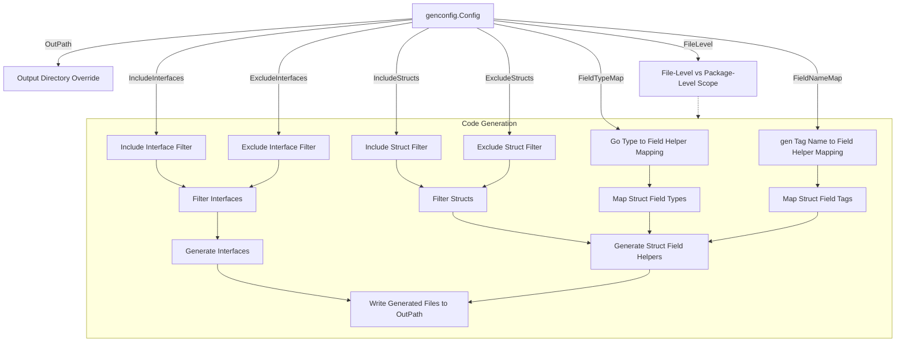

# Customizing Generation with genconfig.Config

Override generation behavior for maximum flexibility: set custom output paths, include/exclude interfaces or structs, and map custom Go types to generated helper types. This guide helps you leverage `genconfig.Config` to tailor code generation to your project needs.

---

## 1. Overview

### Purpose
This guide covers how to use the `genconfig.Config` struct to customize the GORM CLI code generation process. By providing configuration in your source code files, you can:

- Override output directories for generated files
- Include or exclude specific interfaces and structs based on patterns or type selectors
- Map Go types or `gen` tag names to custom field helper types
- Control whether configuration applies at the package or file level

### Prerequisites
- Basic familiarity with writing Go interfaces and structs for GORM CLI generation
- Installed GORM CLI tool (see [Installation Guide](/getting-started/introduction-setup/installation))
- Understanding of your package and project structure

### Expected Outcome
- Confidently control which code is generated and where
- Map complex types or special fields to your own helper types
- Achieve cleaner generated outputs suited for your architectural preferences

---

## 2. Declaring genconfig.Config

The configuration is declared as a package-level variable of type `genconfig.Config`. It must be imported as `gorm.io/cli/gorm/genconfig` and placed in a Go file within the package whose files you generate.

### Example Declaration

```go
package examples

import (
    "database/sql"
    "gorm.io/cli/gorm/field"
    "gorm.io/cli/gorm/genconfig"
)

var _ = genconfig.Config{
    OutPath: "examples/output",
    FieldTypeMap: map[any]any{
        sql.NullTime{}: field.Time{},
    },
    FieldNameMap: map[string]any{
        "date": field.Time{}, // map fields tagged `gen:"date"` to Time helper
        "json": JSON{},       // map fields tagged `gen:"json"` to custom JSON helper
    },
    FileLevel: false,
    IncludeInterfaces: []any{"Query*"},
    ExcludeInterfaces: []any{"*Deprecated*"},
    IncludeStructs: []any{"User", "Account*"},
    ExcludeStructs: []any{"*DTO"},
}
```

### Notes
- Use typed instance placeholders like `sql.NullTime{}` or `field.Time{}` to specify type mappings.
- String patterns in `Include*` or `Exclude*` support shell-style wildcards (e.g., `Query*`, `*Repo`).
- Type literals or type conversions can also be used for precise targeting (e.g., `models.User{}`, `models.Query(nil)`).

---

## 3. Configuration Options Explained

| Field             | Description                                                                                                                                                              |
|-------------------|--------------------------------------------------------------------------------------------------------------------------------------------------------------------------|
| `OutPath`         | Overrides the output directory path for generated files within the package where this variable is defined.                                                               |
| `FieldTypeMap`    | Maps Go type instances (as keys) to field helper types (as values). Applies globally within the package.                                                                |
| `FieldNameMap`    | Maps special `gen` tag names to field helper types. Overrides `FieldTypeMap` for matching fields.                                                                        |
| `FileLevel`       | When `true`, applies configuration only to the file containing this variable, not the whole package subtree. Useful for fine-grained per-file generation control.        |
| `IncludeInterfaces` | Optional whitelist of interface types to generate. Only interfaces matching these selectors will be processed if set.                                                   |
| `ExcludeInterfaces` | Optional blacklist of interface types to exclude after inclusion filtering.                                                                                             |
| `IncludeStructs`  | Optional whitelist of struct types to generate field helpers for.                                                                                                        |
| `ExcludeStructs`  | Optional blacklist of struct types to exclude after inclusion filtering.                                                                                                |

---

## 4. How to Use Inclusion and Exclusion Filters

Filtering lets you control which interfaces and structs are processed for code generation, enabling focused generation in large codebases.

- **Whitelists (`Include*`)** take priority. If set with values, only matching types will be generated.
- **Blacklists (`Exclude*`)** remove matching types after inclusion filtering or if no includes are set.
- Filters accept:
  - String patterns (shell-style matching, e.g., `Query*`, `*Repo`)
  - Type conversions (e.g., `models.Query(nil)`)
  - Struct literals (e.g., `models.User{}`)

### Example: Include Only Certain Interfaces

```go
var _ = genconfig.Config{
    IncludeInterfaces: []any{"Query*"}, // Only generate interfaces starting with "Query"
}
```

### Example: Exclude Deprecated Interfaces

```go
var _ = genconfig.Config{
    ExcludeInterfaces: []any{"*Deprecated*"}, // Skip interfaces with names containing "Deprecated"
}
```

### Combining Include and Exclude Filters

```go
var _ = genconfig.Config{
    IncludeStructs: []any{"User", "Account*"},
    ExcludeStructs: []any{"AccountTmp"},
}
```

This generates `User` and all structs starting with `Account` except `AccountTmp`.

---

## 5. Custom Field Helper Mapping with FieldTypeMap and FieldNameMap

Map your custom Go types or tag names to special field helper types for flexibility in generated filters and updates.

### FieldTypeMap
Maps Go types (keys as typed zero-values) to custom field helper types (values as typed zero-values).

```go
FieldTypeMap: map[any]any{
    sql.NullTime{}: field.Time{},     
    json.RawMessage{}: JSON{}, 
}
```

This tells the generator to emit field helpers using `field.Time` for `sql.NullTime` fields, and a custom `JSON` helper for JSON raw data.

### FieldNameMap
Overrides based on the `gen` struct tag value on a field.

```go
FieldNameMap: map[string]any{
    "date": field.Time{},
    "json": JSON{},
},
```

If your struct field is tagged `gen:"json"`, it gets mapped to the custom `JSON` helper.

### Practical Example

```go
// Model with gen-tag for JSON
package models

type User struct {
    Profile string `gen:"json"`
}

// Config declaration
var _ = genconfig.Config{
    FieldNameMap: map[string]any{
        "json": JSON{},
    },
}
```

Your `JSON` helper can implement custom SQL builder logic, as in the example below.

---

## 6. File-Level vs Package-Level Configuration

The `FileLevel` boolean controls whether the configuration applies only to the *current file* (`true`) or *the entire package subtree* (`false`).

- Use `FileLevel: true` when you want to scoping configuration narrowly, especially in mixed-package directories.
- Default is `false` to apply configuration broadly.

---

## 7. Example Configurations

### 7.1 Excluding Nested Interfaces and Structs (File Level)

```go
package nested

import "gorm.io/cli/gorm/genconfig"

var _ = genconfig.Config{
    FileLevel:         false,
    ExcludeInterfaces: []any{"I3"},
    ExcludeStructs:    []any{"S3"},
}
```

### 7.2 Including Only Interfaces Starting with "Query"

```go
var _ = genconfig.Config{
    IncludeInterfaces: []any{"Query*"},
}
```

### 7.3 Parent Config Including and Excluding Types Across Subtree

```go
package twolevel

import (
    s "gorm.io/cli/gorm/examples/filters/twolevel/nested"
    "gorm.io/cli/gorm/genconfig"
)

var _ = genconfig.Config{
    ExcludeInterfaces: []any{s.I2[any](nil), I3[any](nil)},
    ExcludeStructs:    []any{s.S2{}, S3{}},
}
```

---

## 8. Practical Tips and Best Practices

- **Place Config in Generated Package:** Always declare configuration inside the package you want to affect.
- **Use Typed Zero-Value Instances:** For type mappings, use instantiations like `sql.NullTime{}` or `models.User{}` instead of string names.
- **Review Include/Exclude Carefully:** Misconfiguration can cause expected types to be omitted silently.
- **Combine FileLevel for Granularity:** Use `FileLevel: true` for fine control in large, mixed directories.
- **Test Incrementally:** Generate outputs incrementally while tuning config.

---

## 9. Troubleshooting

<AccordionGroup title="Common genconfig.Config Issues">
<Accordion title="Generated Code Missing Expected Types">
Check your include/exclude filters for typos or mismatches in type patterns or literals. Remember whitelists take precedence.
</Accordion>
<Accordion title="Field Mapping Not Applying">
Ensure you use typed zero-value instances, not strings, and that you place the config in the correct package.
</Accordion>
<Accordion title="Confusing FileLevel Behavior">
Remember `FileLevel: true` applies config only to the file defining it. Use only when needing precise file control.
</Accordion>
</AccordionGroup>

---

## 10. Advanced Usage Example: JSON Field Mapping

### Step 1: Declare Configuration

```go
package examples

import "gorm.io/cli/gorm/genconfig"

var _ = genconfig.Config{
    OutPath: "examples/output",
    FieldNameMap: map[string]any{
        "json": JSON{},
    },
}
```

### Step 2: Define Model with gen:"json" tag

```go
package models

type User struct {
    Profile string `gen:"json"`
}
```

### Step 3: Define JSON Helper

```go
// JSON is a field helper for JSON columns providing database-specific SQL
// generation during queries.
type JSON struct{ column clause.Column }

func (j JSON) WithColumn(name string) JSON {
    c := j.column
    c.Name = name
    return JSON{column: c}
}

func (j JSON) Equal(path string, value any) clause.Expression {
    return jsonEqualExpr{col: j.column, path: path, val: value}
}

type jsonEqualExpr struct {
    col  clause.Column
    path string
    val  any
}

func (e jsonEqualExpr) Build(builder clause.Builder) {
    if stmt, ok := builder.(*gorm.Statement); ok {
        switch stmt.Dialector.Name() {
        case "mysql":
            v, _ := json.Marshal(e.val)
            clause.Expr{SQL: "JSON_EXTRACT(?, ?) = CAST(? AS JSON)", Vars: []any{e.col, e.path, string(v)}}.Build(builder)
        case "sqlite":
            clause.Expr{SQL: "json_valid(?) AND json_extract(?, ?) = ?", Vars: []any{e.col, e.col, e.path, e.val}}.Build(builder)
        default:
            clause.Expr{SQL: "jsonb_extract_path_text(?, ?) = ?", Vars: []any{e.col, e.path[2:], e.val}}.Build(builder)
        }
    }
}
```

### Step 4: Use It in Queries

```go
got, err := gorm.G[models.User](db).
    Where(generated.User.Profile.Equal("$.vip", true)).Take(ctx)
```

The generated SQL adapts per database, leveraging the custom JSON helper.

---

## 11. Next Steps & Related Content

- Explore [Quickstart: Generating Type-Safe Query APIs](/guides/core-workflows/guide-quickstart) for beginning workflows.
- See [Generating and Using Model Field Helpers](/guides/core-workflows/guide-field-helpers) for details on using generated helpers.
- Study [Template-Driven Query Interfaces](/guides/advanced-patterns/guide-sql-templates) to master SQL templating.
- Review [Working with Associations in Generated Code](/guides/advanced-patterns/guide-associations) for managing relationships.
- Check [Typical Workflow: From Models to Generated Code](/guides/core-workflows/guide-workflow-cli) to understand end-to-end generation flow.

---

For complete reference, see the [README.md](https://github.com/go-gorm/cli/blob/main/README.md) in the GORM CLI GitHub repository.

---

# Diagram: genconfig.Config Filtering and Mapping Workflow




