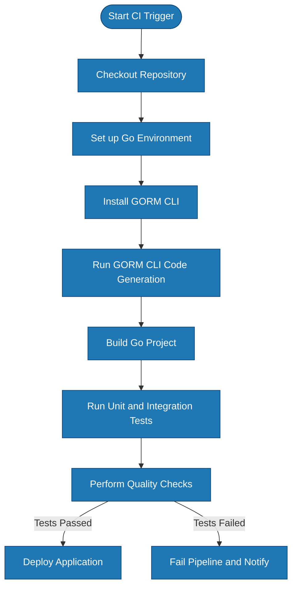

# Integration & Workflow Automation Guide

Automate your code generation workflow with GORM CLI by integrating it directly into your build or CI/CD pipelines. This guide walks you through seamlessly embedding GORM CLI into your project’s automation, ensuring your generated query APIs and field helpers are always in sync with your model and interface definitions. We also highlight best practices for integration with other development tools and maintaining clean, reliable codebases.

---

## 1. Workflow Overview

### Task Description
This guide helps you automate the process of generating GORM CLI code as part of your build and deployment workflows. It focuses on scripting the generator, integrating with continuous integration (CI) systems, and adhering to best practices for maintainability and tool interoperability.

### Prerequisites
- A Go project with query interfaces and model structs defined for code generation.
- GORM CLI installed in your development environment.
- Familiarity with running command-line tools and scripting in your build environment.
- Basic understanding of your CI/CD tooling (e.g., GitHub Actions, Jenkins, GitLab CI).

### Expected Outcome
By following this guide, you will have:
- Automated your code generation to run before your build/compile steps.
- Integrated GORM CLI invocation in CI/CD pipelines ensuring generated code is always current.
- Set up your environment and configuration so that generation respects your project structure and custom configurations.
- Adopted recommended practices to avoid common pitfalls in generation automation.

### Time Estimate
Approximately 30–60 minutes to set up automation in a CI/CD environment and test workflows.

### Difficulty Level
Intermediate: Requires proficiency with CLI tools, scripting, and CI/CD concepts.

---

## 2. Automating Code Generation

### Step 1: Prepare Your Project
Ensure your Go project contains your query interface files with SQL template annotations and your model structs in accessible packages. Confirm you have a configuration file (`genconfig.Config`) if you want custom output paths or filtering.

### Step 2: Install GORM CLI
If not already installed, install the CLI globally to enable automation:

```bash
go install gorm.io/cli/gorm@latest
```

Confirm installation:

```bash
gorm gen --help
```

### Step 3: Create a Generation Script
Add a shell script or simple command in your `Makefile` or equivalent that runs GORM CLI with proper flags.

Example `generate.sh` script:

```bash
#!/usr/bin/env bash

echo "Starting GORM CLI code generation..."

gorm gen -i ./path/to/your/interfaces -o ./path/to/generated

if [ $? -ne 0 ]; then
  echo "Code generation failed."
  exit 1
fi

echo "Code generation succeeded."
```

Make sure to adjust input (`-i`) and output (`-o`) paths to fit your project.

<Check>
Include this script as a pre-build step or a separate CI job.
</Check>

### Step 4: Integrate in CI/CD Pipeline
Add a step in your CI workflow configuration that runs your generation script before building or testing your project.

Example: GitHub Actions snippet

```yaml
jobs:
  build:
    runs-on: ubuntu-latest
    steps:
      - uses: actions/checkout@v3

      - name: Set up Go
        uses: actions/setup-go@v4
        with:
          go-version: '1.20'

      - name: Install GORM CLI
        run: go install gorm.io/cli/gorm@latest

      - name: Generate GORM code
        run: ./scripts/generate.sh

      - name: Build project
        run: go build ./...

      - name: Run tests
        run: go test -v ./...
```

Adjust paths and script locations according to your repository.

### Step 5: Use Generated Code Normally
Continue using your generated APIs and field helpers in your application code as usual. The automation ensures the generated code is fresh with every CI run.

---

## 3. Best Practices and Tips

### Keep Generation Idempotent and Fast
- Avoid unnecessary regeneration by only running the generator when changes are detected in query interface or model files.
- Consider caching strategies if supported by your CI platform.

### Version Pinning
- Pin GORM CLI to a specific version in the automation to avoid unexpected changes.

Example:

```bash
go install gorm.io/cli/gorm@v1.2.3
```

### Use Configuration for Predictable Output
- Employ `genconfig.Config` in your packages to define generation output locations, include/exclude filters, and custom field mappings.

Example configuration snippet:

```go
var _ = genconfig.Config{
  OutPath: "generated",
  IncludeInterfaces: []any{"Query*"},
  ExcludeStructs: []any{"DeprecatedModel"},
}
```

### Integrate with Your Build Tools
- Invoke generation as part of your build pipeline (e.g., `make generate`, `go generate` targets).
- Clearly document the generation step for your team.

### Commit or Ignore Generated Code
- Decide if generated code should be committed to source control or generated during CI builds only.
- Typically, commit generated code to avoid build failures due to missing files.

<Warning>
Automated generation workflows require coordination among your team to prevent out-of-sync generated code and avoid merge conflicts.
</Warning>

---

## 4. Common Issues & Troubleshooting

### Generation Command Fails
- Verify paths for input interfaces and output directories are correct.
- Check GORM CLI installation and version compatibility.

### Generated Code Not Updated
- Confirm the generation step runs in your CI/build.
- Check for caching that may prevent regeneration.

### Output Directory Is Wrong
- Use `OutPath` in `genconfig.Config` or `-o` flag consistently.

### Conflicts Between Multiple Config Files
- Ensure only one `genconfig.Config` applies to a given package or directory.
- Use the `FileLevel` option to scope config to specific files when needed.

### Errors Parsing SQL Templates
- Validate your interface method comments for proper SQL template syntax.
- Refer to the [SQL Template DSL & Best Practices](https://your-docs-link/guides/workflows-real-world-usage/sql-templates-and-dsl-best-practices) guide.

---

## 5. Next Steps & Related Content

- **[Generating Your First Query API](https://your-docs-link/guides/getting-started/generating-your-first-query-api)** — Write interfaces and run generation manually first.
- **[Configuring Generation](https://your-docs-link/getting-started/initial-usage/configuration-basics)** — Customize output paths and filters.
- **[Building Type-Safe Queries](https://your-docs-link/guides/workflows-real-world-usage/building-type-safe-queries)** — Learn about querying with generated APIs.
- **[Working With Associations](https://your-docs-link/guides/workflows-real-world-usage/working-with-associations)** — Manage relations.
- **[SQL Template DSL & Best Practices](https://your-docs-link/guides/workflows-real-world-usage/sql-templates-and-dsl-best-practices)** — Write safe and powerful templated queries.

---

## Diagram: Automated Workflow Integration



This flow showcases how integrating the code generation step early in your build process facilitates seamless, reliable delivery.

---

# Conclusion
Automating GORM CLI code generation ensures your data access layer stays consistent and type-safe without manual intervention. Embed the generator into your existing CI/CD to maintain alignment between your models, queries, and generated APIs effortlessly. By following best practices and monitoring outputs, you secure a robust workflow that scales with your project.

---