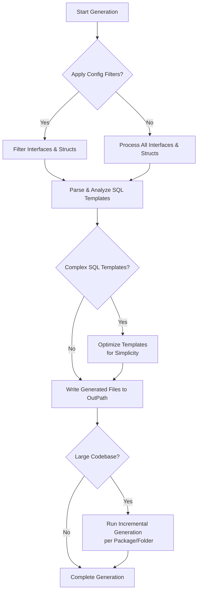

# Performance & Optimization Tips

Optimize your GORM CLI code generation and maintain high productivity even as your projects grow in size and complexity. This guide provides practical strategies to speed up generation, manage large codebases effectively, and address common performance bottlenecks that may arise during development.

---

## 1. Overview

### What You Will Achieve
By following this guide, you will learn how to optimize the GORM CLI generation process, reduce build time overhead, and troubleshoot typical slowdowns when scaling to complex or large Go projects.

### Prerequisites
- Basic familiarity with GORM CLI and the code generation workflow.
- A Go project with defined query interfaces and models.

### Expected Outcome
- Faster, more efficient generation runs.
- Better control over generated outputs.
- Strategies to isolate and fix performance issues.

### Time to Complete
10–20 minutes to implement key optimizations.

### Difficulty Level
Intermediate, aimed at developers working with growing or complex GORM CLI setups.

---

## 2. Common Performance Challenges

Recognizing common causes of sluggishness helps prioritize optimizations:

- **Large number of interfaces or models**: Generating all interfaces and structs in a big codebase can be slow.
- **Unfiltered generation scope**: Generating unnecessary interfaces or structs inflates processing time.
- **Repeated full scans on every generation**: Re-parsing the entire input directory each run without caching or filtering.
- **Complex SQL templates**: Very intricate templating logic can add CPU overhead during generation.
- **Output directory conflicts**: Writing files into the source directory without separation can cause unintended file scans or conflicts.

---

## 3. Step-by-Step Optimization Techniques

### Step 1: Use Include/Exclude Filters

Apply selective generation to restrict code generation to only needed interfaces and structs.

#### How to Use

In your package, declare a `genconfig.Config` variable with `IncludeInterfaces` and/or `IncludeStructs` to whitelist only relevant types.

```go
import "gorm.io/cli/gorm/genconfig"

var _ = genconfig.Config{
  IncludeInterfaces: []any{"Query*"}, // generate only interfaces starting with 'Query'
  IncludeStructs:    []any{"User", "Account*"}, // generate only specific structs
}
```

This avoids unnecessary processing and accelerates generation times by focusing on what your application actively uses.

### Step 2: Configure Output Paths Explicitly

Avoid generating output code into source directories that your generator scans. Use the `OutPath` to specify a dedicated folder for generated code.

```go
var _ = genconfig.Config{
  OutPath: "./generated",
}
```

This ensures clean separation and avoids unnecessary cycles scanning or rewriting files.

### Step 3: Generate Incrementally

When working with multiple packages or modules, run generation on smaller subsets rather than the entire project root at once. For example:

```bash
gorm gen -i ./pkg/models -o ./generated/models
```

This limits CPU and memory load per command and makes debugging faster.

### Step 4: Simplify SQL Templates When Possible

Complex conditional logic inside SQL templates can slow parsing and rendering during generation. Optimizing your SQL templates to remove unnecessary nested conditionals or repetitive code can improve generator performance.

Example:

```sql
-- Instead of multiple nested if statements,
-- combine conditions where feasible:
SELECT * FROM @@table
{{where}}
  name=@name OR role=@role
{{end}}
```

This reduces code complexity and speeds generation.

### Step 5: Use File-Level Configurations

When you have per-file customizations, mark config with `FileLevel: true` to scope generation only to a given file rather than the full package.

```go
var _ = genconfig.Config{
  FileLevel: true,
  IncludeInterfaces: []any{"UserRepo"},
}
```

This is effective for large packages with mixed interface usage.

### Step 6: Avoid Generating Unused Helpers

If you only consume query interfaces or field helpers, exclude unused types from generation with `ExcludeStructs` or `ExcludeInterfaces` to prevent extra processing.

---

## 4. Troubleshooting Common Performance Issues

<AccordionGroup title="Troubleshooting">
<Accordion title="Generation takes too long on large projects">
Run `gorm gen` with `--verbose` or watch console output to identify which files or directories are processed.

Use Include/Exclude filters to narrow scope. Consider running generation on subdirectories separately.

If patterns are not matching as expected, verify selector patterns (e.g., "Query*" or full path match) in `genconfig.Config`.
</Accordion>
<Accordion title="Files generated in source directories causing infinite loops">
Ensure `OutPath` is set to a directory outside your input code.

Avoid generating into directories that are scanned as input to prevent recursive re-processing.
</Accordion>
<Accordion title="Errors or slowdowns with complex SQL templates">
Simplify templates incrementally to isolate slow parts.

Minimize nested `{{if}}` and repeated `{{for}}` loops.

Use static filters and parameters where possible.
</Accordion>
<Accordion title="Config filtering not applied as expected">
Remember Include filters take precedence over Exclude.

Re-check patterns and confirm `FileLevel: true` flag when using per-file configs.
</Accordion>
</AccordionGroup>

---

## 5. Best Practices

- Keep interface and struct definitions concise and well-organized.
- Establish folder structures that separate models, interfaces, and generated code.
- Regularly update your `genconfig.Config` as your codebase evolves to avoid regenerating obsolete code.
- Use shell-style patterns in Include/Exclude to target types precisely.
- Leverage `FileLevel: true` when customization applies narrowly to minimize unnecessary parsing.

---

## 6. Additional Tips

- Monitor disk I/O and CPU while generating; on slow machines, consider incremental gen.
- Clear out stale generated code regularly to avoid clutter and confusion.
- Integrate generation into CI pipelines with caching to speed up builds.
- Profile your SQL template complexity if you observe unusually long parsing times.

---

## 7. Next Steps & Related Topics

- After optimizing performance, explore **[Integration & Workflow Automation](/guides/advanced-patterns/integration-and-workflow-automation)** to embed generation in CI/CD.
- Dig deeper into **[Customizing Generation with Config](/guides/workflows-real-world-usage/customizing-generation-with-config)** to tailor generation output precisely.
- Improve query power with **[SQL Template DSL & Best Practices](/guides/workflows-real-world-usage/sql-templates-and-dsl-best-practices)**.

---

## 8. Summary Diagram: Optimization Workflow



---

# Troubleshooting Quick Reference

| Problem                              | Solution                                    |
|------------------------------------|--------------------------------------------|
| Slow generation on large project   | Use Include/Exclude filters, split gen runs|
| Output files in source folder       | Set `OutPath` to dedicated folder          |
| Complex SQL slows generation        | Simplify templates, minimize nesting       |
| Config filtering not working        | Verify patterns, `FileLevel` setting       |

---

For more detailed troubleshooting, see [Solving Common Errors](/getting-started/troubleshooting/common-errors).

---