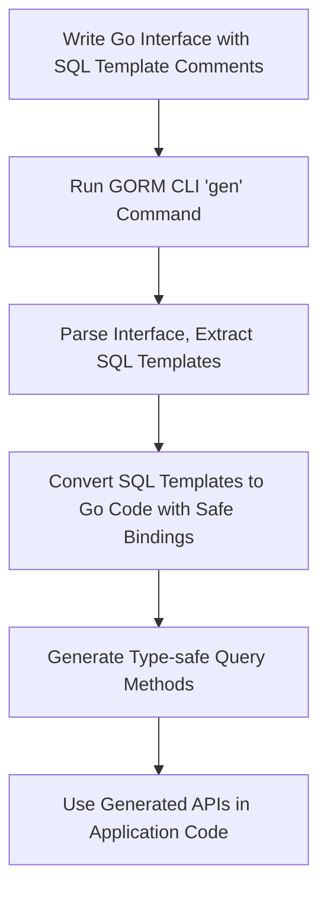

# Template-based Queries: Building Flexible and Type-safe Queries

## Workflow Overview

This guide empowers you to write interface-driven database queries using GORM CLI's powerful SQL template Domain-Specific Language (DSL). You'll learn how to create flexible, type-safe, and dynamically generated SQL statements embedded in Go interfaces, leveraging context injection and conditional SQL composition.

### Prerequisites
- Basic familiarity with Go interfaces and methods
- GORM CLI installed and configured in your environment
- Existing Go models reflecting your database schema
- Understanding of SQL and parameter binding basics

### Expected Outcome
After completing this guide, you will have the skills to:
- Write raw SQL queries with embedded templating inside interface method comments
- Use GORM CLI's DSL syntax to conditionally build WHERE, SET, and other SQL clauses
- Utilize dynamic SQL features like loops and conditionals for flexible query construction
- Generate type-safe query implementations automatically
- Integrate context.Context seamlessly into your query methods

### Time Estimate
30–45 minutes

### Difficulty Level
Intermediate

---

## Understanding Template-based Queries

GORM CLI supports writing raw SQL queries directly in interface method comments, augmented by an expressive templating DSL. This lets you define complex, dynamic SQL with compile-time safety and clear separation of SQL logic from business code.

```go
// Example interface with templated SQL
 type Query[T any] interface {
   // SELECT * FROM @@table WHERE id=@id
   GetByID(id int) (T, error)

   // UPDATE @@table
   // {{set}}
   //   {{if user.Name != ""}} name=@user.Name, {{end}}
   //   {{if user.Age > 0}} age=@user.Age, {{end}}
   // {{end}}
   // WHERE id=@id
   UpdateUser(user User, id int) error
 }
```

## Template DSL Constructs

| Directive    | Purpose                          | Example Usage                              |
| ------------ | --------------------------------|--------------------------------------------|
| `@@table`    | Model's table name               | `SELECT * FROM @@table WHERE id=@id`       |
| `@@column`   | Dynamic column placeholder       | `WHERE @@column=@value`                     |
| `@param`     | Maps Go function parameter       | `WHERE name=@user.Name`                     |
| `{{where}}`  | Conditional WHERE clause block   | `{{where}} age > 18 {{end}}`                |
| `{{set}}`    | Conditional SET clause block     | `{{set}} name=@name {{end}}`                |
| `{{if}}`     | Conditional SQL text             | `{{if age>0}} AND age=@age {{end}}`         |
| `{{for}}`    | Iteration over collections       | `{{for _, tag := range tags}} ... {{end}}`  |

> Use `{{where}}` and `{{set}}` for building dynamic SQL parts safely by trimming extraneous connectors.

---

## Step-by-Step Instructions

<Steps>
<Step title="Define Your Query Interface with SQL Templates">
Write Go interface methods with comments containing SQL and template directives to specify your queries. For example:

```go
// SELECT * FROM @@table WHERE id=@id
GetByID(id int) (T, error)

// UPDATE @@table
// {{set}}
//   {{if user.Name != ""}} name=@user.Name, {{end}}
//   {{if user.Age > 0}} age=@user.Age, {{end}}
// {{end}}
// WHERE id=@id
UpdateUser(user User, id int) error
```

Use `@@table` for the table name and `@param` for function parameters.
</Step>

<Step title="Use Template DSL Constructs for Conditional Logic">
Leverage `{{if}}`, `{{else if}}`, `{{else}}`, and `{{end}}` blocks inside `{{where}}` or `{{set}}` to conditionally add filter or update clauses.

Example:

```sql
SELECT * FROM @@table
{{where}}
  {{if user.ID > 0}}
     WHERE id=@user.ID
  {{else if user.Name != ""}}
     WHERE name=@user.Name
  {{end}}
{{end}}
```

This generates SQL filtering by id if present, else by name.
</Step>

<Step title="Iterate Over Collections with {{for}}">
For queries involving lists or batches, use `{{for}}` loops to iterate and build SQL fragments.

Example:

```sql
SELECT * FROM @@table
{{where}}
  {{for _, user := range users}}
    {{if user.Name != ""}}
      (name=@user.Name AND age=@user.Age) OR
    {{end}}
  {{end}}
{{end}}
```

This builds an OR clause dynamically based on user filters.
</Step>

<Step title="Generate Code and Verify Output">
Run the GORM CLI code generator pointing it to your interface source file.

```bash
gorm gen -i ./examples -o ./generated
```

Check the `generated` folder for the new type-safe implementations.
</Step>

<Step title="Invoke Generated Methods in Your Application">
Use the generated APIs in your Go code, passing a `*gorm.DB` instance and required parameters.

Example:

```go
user, err := generated.Query[User](db).GetByID(ctx, 123)
err := generated.Query[User](db).UpdateUser(ctx, User{Name: "jinzhu", Age: 20}, 1)
```

The generated methods handle SQL execution and bindings automatically.
</Step>
</Steps>

---

## Concrete Examples

### Defining a Query Interface with Conditional Filtering
```go
// examples/query.go
package examples

type Query[T any] interface {
  // SELECT * FROM @@table WHERE id=@id AND name = "\@name"
  GetByID(id int) (T, error)

  // SELECT * FROM @@table WHERE @@column=@value
  FilterWithColumn(column string, value string) (T, error)

  // SELECT * FROM @@table
  //   {{if user.ID > 0}}
  //       WHERE id=@user.ID
  //   {{else if user.Name != ""}}
  //       WHERE name=@user.Name
  //   {{end}}
  QueryWith(user User) (T, error)

  // UPDATE @@table
  //  {{set}}
  //    {{if user.Name != ""}} name=@user.Name, {{end}}
  //    {{if user.Age > 0}} age=@user.Age, {{end}}
  //    {{if user.Age >= 18}} is_adult=1 {{else}} is_adult=0 {{end}}
  //  {{end}}
  // WHERE id=@id
  UpdateInfo(user User, id int) error
}
```

### Usage Example in Application Code
```go
// Retrieve user by ID
user, err := generated.Query[User](db).GetByID(ctx, 101)

// Update user info
err = generated.Query[User](db).UpdateInfo(ctx, User{Name: "Alice", Age: 30}, 101)
```

This maintains type safety and hides raw SQL execution.

---

## Best Practices & Tips

- **Always use placeholders `@param`** to prevent SQL injection and bind params safely.
- **Use `{{where}}` blocks for conditional filtering clauses** to avoid dangling WHERE keywords.
- **Use `{{set}}` blocks in UPDATE methods** to generate correct SET clauses with dynamic columns.
- **Test incrementally:** start with simple queries and build complexity using conditionals and loops.
- **Name parameters and struct fields clearly** for intuitive, readable code and templates.
- **Handle context injection automatically** by not declaring `context.Context` in your interface methods; GORM CLI adds it for you.

---

## Troubleshooting

<AccordionGroup title="Common Issues and Solutions">
<Accordion title="Code generation errors related to template syntax">
Check for unclosed or misused template blocks `{{if}}`, `{{end}}`, `{{for}}`, `{{else if}}`.
Each opening must have a matching closing.

Use indentation and spacing carefully; the generator parses line by line.
</Accordion>

<Accordion title="Methods missing expected database context parameter">
GORM CLI auto-injects `context.Context` if missing in method signatures.
Avoid declaring context explicitly in your interface to prevent conflicts.
</Accordion>

<Accordion title="Dynamic column or table placeholders not replaced">
Ensure you use `@@table` to refer to the current model table and `@@column` for dynamic columns.
Incorrect placeholders or missing `@` symbols lead to compile errors.
</Accordion>

<Accordion title="Empty or malformed SQL statements in generated code">
Verify your comments contain valid SQL and the DSL directives are correct.
Avoid placing executable Go code or invalid syntax inside comments.
</Accordion>
</AccordionGroup>

---

## Next Steps & Further Learning

- Explore advanced templating techniques: complex nested conditionals, multi-level loops.
- Combine template-based queries with generated field helpers for fluent, safe updates and filters.
- Consult the [Writing Your First Models and Query Interfaces](../getting-started/first-steps-usage/writing-models-interfaces.html) guide for foundational model/interface design.
- Dive into [Using Generated APIs in Your Application](../getting-started/first-steps-usage/using-generated-apis.html) to master consuming generated code.
- Investigate [Advanced Patterns: Template-based Queries](./template-based-queries.html) for customization and DSL depth.

---

## Additional Resources

- Official GORM CLI repo: [github.com/go-gorm/cli](https://github.com/go-gorm/cli)
- SQL Template DSL implementation source: [`internal/gen/sqlparser.go`](https://github.com/go-gorm/cli/blob/main/internal/gen/sqlparser.go)
- Example interface file with queries: [`examples/query.go`](https://github.com/go-gorm/cli/blob/main/examples/query.go)

---

## Summary Diagram of the Query Generation Flow


