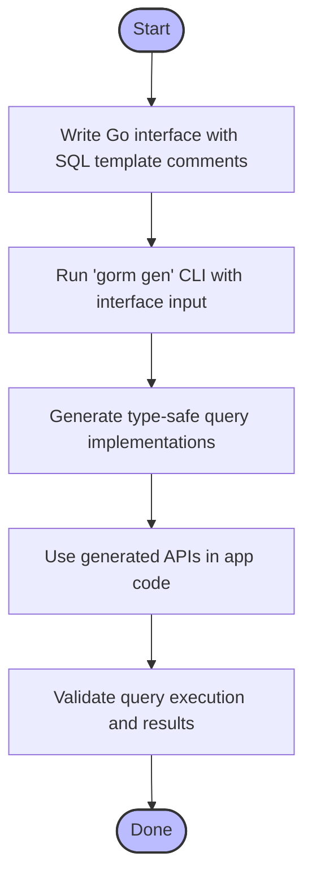

# Template-Based Query Generation

Master GORM CLI's powerful template DSL to write flexible, type-safe SQL queries directly within Go interfaces. This guide walks you through using placeholders, conditionals, loops, and dynamic column binding to automate complex SQL construction with strong typing and seamless integration.

---

## 1. Overview

### What This Guide Helps You Accomplish
Learn how to write raw SQL templates in your Go interface method comments that GORM CLI will transform into concrete, type-safe query APIs. Harness the full flexibility of the embedded DSL to handle dynamic columns, conditional clauses, loops, and more while ensuring compile-time safety and fluent usage.

### Prerequisites
- You have GORM CLI installed and accessible via the command line.
- Basic understanding of Go generics and interfaces.
- Familiarity with SQL and GORM query patterns.
- Your project includes Go model structs representing your database schema.

### Expected Outcome
By following this guide, you will:
- Write interface methods annotated with expressive SQL templates.
- Use placeholders to bind Go parameters safely and dynamically in SQL.
- Leverage conditionals and loops in templates for complex query logic.
- Generate clean, type-safe query implementations seamlessly with GORM CLI.

### Time Estimate
30–45 minutes to absorb the concepts and implement your first template-based query interface.

### Difficulty Level
Intermediate: assumes comfortable familiarity with Go and SQL.

---

## 2. Writing Template-Based Queries: Step-by-Step

### Step 1: Define a Generic Interface with SQL Template Comments
Write your query interface using Go generics and embed SQL queries as comments immediately above method declarations. Use placeholders and DSL syntax to describe query logic.

```go
// Query is a generic interface with templated SQL annotations.
type Query[T any] interface {

  // SELECT * FROM @@table WHERE id=@id
  GetByID(id int) (T, error)

  // SELECT * FROM @@table WHERE @@column=@value
  FilterWithColumn(column string, value string) (T, error)

  // SELECT * FROM users
  //   {{if user.ID > 0}}
  //       WHERE id=@user.ID
  //   {{else if user.Name != ""}}
  //       WHERE name=@user.Name
  //   {{end}}
  QueryWith(user models.User) (T, error)

  // UPDATE @@table
  //  {{set}}
  //    {{if user.Name != ""}} name=@user.Name, {{end}}
  //    {{if user.Age > 0}} age=@user.Age, {{end}}
  //    {{if user.Age >= 18}} is_adult=1 {{else}} is_adult=0 {{end}}
  //  {{end}}
  // WHERE id=@id
  UpdateInfo(user models.User, id int) error

  // SELECT * FROM @@table
  // {{where}}
  //   {{for _, user := range users}}
  //     {{if user.Name != "" && user.Age > 0}}
  //       (name = @user.Name AND age=@user.Age AND role LIKE concat("%",@user.Role,"%")) OR
  //     {{end}}
  //   {{end}}
  // {{end}}
  Filter(users []models.User) ([]T, error)

  // where("name=@name AND age=@age")
  FilterByNameAndAge(name string, age int)

  // SELECT * FROM @@table
  //  {{where}}
  //    {{if !start.IsZero()}}
  //      created_at > @start
  //    {{end}}
  //    {{if !end.IsZero()}}
  //      AND created_at < @end
  //    {{end}}
  //  {{end}}
  FilterWithTime(start, end time.Time) ([]T, error)
}
```

### Key Points:
- `@@table` resolves to the associated model's table name.
- `@@column` allows dynamic column substitution.
- `@param` binds Go method parameters or struct fields safely.
- DSL directives like `{{where}}`, `{{set}}`, `{{if}}`, and `{{for}}` control SQL generation flow.

---

### Step 2: Use Placeholders for Safe Parameter Binding
Use `@paramName` in your SQL to bind Go method parameters or struct fields. This ensures that parameters are passed to GORM's query builder securely avoiding injection.

Example:
```sql
SELECT * FROM @@table WHERE id=@id AND name=@name
```
If your method signature is:
```go
GetByID(id int, name string) (T, error)
```
`@id` and `@name` refer to the parameters named `id` and `name` respectively.

---

### Step 3: Use Conditional Blocks for Dynamic SQL
Employ `{{if}} ... {{else if}} ... {{end}}` blocks to include/exclude SQL parts based on parameter values.

Example:
```sql
SELECT * FROM users
{{where}}
  {{if user.ID > 0}} WHERE id=@user.ID {{end}}
  {{else if user.Name != ""}} WHERE name=@user.Name {{end}}
{{end}}
```
This generates the appropriate WHERE clause based on which field in `user` is populated.

---

### Step 4: Use `{{where}}` and `{{set}}` Blocks
- `{{where}} ... {{end}}` helps build WHERE clauses conditionally.
- `{{set}} ... {{end}}` builds SET clauses safely for UPDATE statements.

Example:
```sql
UPDATE @@table
{{set}}
  {{if user.Name != ""}} name=@user.Name, {{end}}
  {{if user.Email != ""}} email=@user.Email {{end}}
{{end}}
WHERE id=@id
```
Only non-empty fields get updated.

---

### Step 5: Use Loops for Collection Parameters
`{{for _, item := range items}} ... {{end}}` enables iterating over slices to build OR clauses or batch conditions.

Example:
```sql
SELECT * FROM @@table
{{where}}
  {{for _, tag := range tags}}
    {{if tag != ""}} tags LIKE concat('%',@tag,'%') OR {{end}}
  {{end}}
{{end}}
```
This builds a dynamic filter over multiple tags.

---

### Step 6: Generate Code via CLI
Save your interfaces under a Go package or directory. Then run:

```bash
gorm gen -i ./path/to/interfaces -o ./generated
```

This generates the implementations in the output directory, ready to use.

---

## 3. Practical Examples

### Basic Query with ID
```go
user, err := generated.Query[User](db).GetByID(ctx, 123)
```
Generates and executes:
```sql
SELECT * FROM users WHERE id = ?
```
with param `123`.

---

### Dynamic Column Filtering
```go
user, err := generated.Query[User](db).FilterWithColumn(ctx, "name", "alice")
```
Generates:
```sql
SELECT * FROM users WHERE name = ?
```

---

### Conditional Query
```go
user := User{Name: "alice"}
users, err := generated.Query[User](db).QueryWith(ctx, user)
```
Generates SQL that only filters by non-empty fields in `user`.

---

### Update with Conditional SET
```go
err := generated.Query[User](db).UpdateInfo(ctx, User{Name: "alice", Age: 20}, 1)
```
Produces SQL updating only fields that are set and correct `is_adult` flag.

---

### Filtering Multiple Users with Loop
```go
users := []User{{Name: "alice", Age: 20}, {Name: "bob", Age: 30}}
result, err := generated.Query[User](db).Filter(ctx, users)
```
Generates a WHERE clause dynamically OR-ing multiple user filters.

---

## 4. Troubleshooting & Tips

<AccordionGroup title="Common Issues and How to Fix Them">
<Accordion title="SQL Template Syntax Errors">
Ensure your SQL templates follow correct Go template syntax. Errors usually happen with missing closing `{{end}}` or incorrect placeholder names. Use simple queries first and gradually add complexity.
</Accordion>
<Accordion title="Parameter Binding Issues">
Confirm parameter names in your method signature exactly match placeholders in SQL comments. Case sensitivity matters. Use `@param` consistently.
</Accordion>
<Accordion title="Code Generation Fails or Outputs No Files">
Check your interface and struct filters in any `genconfig.Config`. If you have includes/excludes set, verify your interfaces and structs match those patterns exactly.
</Accordion>
<Accordion title="Unexpected SQL Generated">
Review the generated Go code in the output directory to understand how your templates were parsed. Adjust your template syntax or parameter usage accordingly.
</Accordion>
</AccordionGroup>

### Best Practices
- Start with simple SQL templates.
- Use conditional blocks to handle optional filters / updates.
- Use looping for batch filters but avoid very large slices.
- Prefer named method parameters for clarity.
- Keep DSL directives and Go logic separate.

### Performance Considerations
- Generated code leverages GORM query builders; avoid generating overly complex or deeply nested templates.
- Use indexes and optimized queries in your templates.

---

## 5. Next Steps & Related Content

- After mastering template queries, learn how to use the [Generated APIs guide](/guides/core-workflows/using-generated-apis) to work fluently with results.
- Explore [Model-Driven Field Helpers](/guides/core-workflows/field-helpers-basics) to compose queries programmatically.
- For handling complex relationships, see [Working with Associations](/guides/advanced-patterns/working-with-associations).
- Customize generator behavior via [Configuration & Extensibility](/overview/features-and-workflows/configuring-generation).

---

## Summary Diagram: Template-Based Query Generation Workflow


