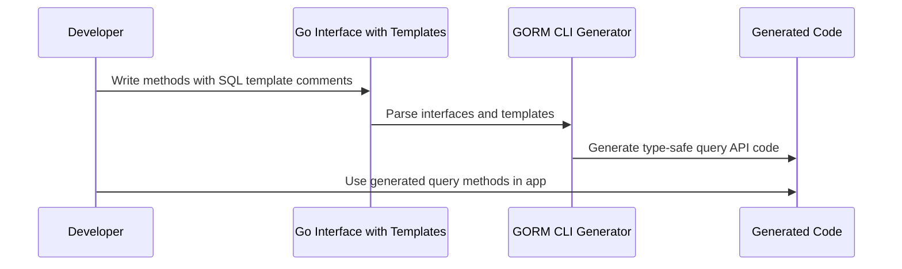

# Writing and Using Template-Based Queries

## Workflow Overview

This guide walks you through the process of writing SQL template comments within Go interfaces using GORM CLI's powerful SQL template DSL. It shows how to create dynamic, type-safe query methods by embedding SQL with template directives into interface method comments, which GORM CLI then automatically parses and generates code for.

### Prerequisites

- A Go project with GORM CLI installed and ready.
- Basic understanding of Go interfaces and GORM models.
- A Go interface file where you write your query interfaces.

### Expected Outcome

By following this guide, you will confidently write SQL queries with embedded GORM CLI DSL templates inside Go interfaces and generate type-safe query APIs automatically. Your generated methods will support dynamic SQL construction with parameters bound safely and conditionally included fragments.

### Time Estimate

15-30 minutes to understand sample syntax and write your first template-based query interface.

### Difficulty Level

Intermediate. Requires familiarity with Go and SQL basics.

---

## Step-by-Step Instructions

### 1. Define Your Generic Query Interface

Begin by declaring a Go interface with generic type parameter `T any`. This interface should include method signatures representing the queries you need. Above each method, write your SQL query using either a single-line comment with placeholders or multi-line comments using GORM CLI's template DSL.

Example:

```go
// Query interface with template annotations
// package examples

type Query[T any] interface {
    // SELECT * FROM @@table WHERE id=@id AND name = "\@name"
    GetByID(id int) (T, error)

    // SELECT * FROM @@table WHERE @@column=@value
    FilterWithColumn(column string, value string) (T, error)

    // SELECT * FROM users
    //   {{if user.ID > 0}}
    //       WHERE id=@user.ID
    //   {{else if user.Name != ""}}
    //       WHERE name=@user.Name
    //   {{end}}
    QueryWith(user User) (T, error)

    // UPDATE @@table
    //  {{set}}
    //    {{if user.Name != ""}} name=@user.Name, {{end}}
    //    {{if user.Age > 0}} age=@user.Age, {{end}}
    //    {{if user.Age >= 18}} is_adult=1 {{else}} is_adult=0 {{end}}
    //  {{end}}
    // WHERE id=@id
    UpdateInfo(user User, id int) error

    // SELECT * FROM @@table
    // {{where}}
    //   {{for _, user := range users}}
    //     {{if user.Name != "" && user.Age > 0}}
    //       (name = @user.Name AND age=@user.Age AND role LIKE concat("%",@user.Role,"%")) OR
    //     {{end}}
    //   {{end}}
    // {{end}}
    Filter(users []User) ([]T, error)

    // where("name=@name AND age=@age")
    FilterByNameAndAge(name string, age int)

    // SELECT * FROM @@table
    //  {{where}}
    //    {{if !start.IsZero()}}
    //      created_at > @start
    //    {{end}}
    //    {{if !end.IsZero()}}
    //      AND created_at < @end
    //    {{end}}
    //  {{end}}
    FilterWithTime(start, end time.Time) ([]T, error)
}
```

### 2. Use Template Placeholders

GORM CLI template DSL uses specific placeholders:

| Placeholder   | Purpose                                     | Example Usage                         |
|---------------|---------------------------------------------|-------------------------------------|
| `@@table`     | Resolves to the model's table name           | `SELECT * FROM @@table WHERE id=@id` |
| `@@column`    | Dynamic column name binding                   | `SELECT * FROM @@table WHERE @@column=@value` |
| `@param`      | Maps Go method parameters to SQL params      | `WHERE name=@user.Name`              |
| `{{where}}`   | Conditional WHERE clause block                 | See example in FilterWithTime method |
| `{{set}}`     | Conditional SET clause block (UPDATE queries) | See example in UpdateInfo method     |
| `{{if}}`      | Conditional SQL fragments inside blocks       | `{{if age > 0}}AND age=@age{{end}}` |
| `{{for}}`     | Iterate over slices or collections            | `{{for _, user := range users}}...{{end}}` |

### 3. Bind Go Parameters Safely

Within the template comments, refer to Go method parameters directly using `@param` syntax. This binds parameters safely without SQL injection risk.

Examples:

- Basic substitution: `@id`
- Access struct fields: `@user.Name`
- Use slice iteration: `{{for _, user := range users}}...@user.Name...{{end}}`

### 4. Apply Conditional Logic and Loops

Take advantage of `{{if}}`, `{{else if}}`, `{{else}}`, and `{{for}}` directives to build dynamic and complex SQL queries that only include relevant parts.

For example, in the `QueryWith` method:

```go
//   {{if user.ID > 0}}
//       WHERE id=@user.ID
//   {{else if user.Name != ""}}
//       WHERE name=@user.Name
//   {{end}}
```

This generates SQL conditionally based on the parameters passed.

### 5. Generate Your Code Using GORM CLI

Run the GORM CLI generator by passing your input Go interface path:

```bash
gorm gen -i ./examples/query.go -o ./generated
```

This command parses the interfaces, reads the SQL template comments, and generates type-safe implementations.

### 6. Use Generated APIs in Your Application

Use the generated interface implementations in your Go code as shown:

```go
// Get user by ID
user, err := generated.Query[User](db).GetByID(ctx, 123)

// Filter by name and age
users, err := generated.Query[User](db).FilterByNameAndAge("jinzhu", 25).Find(ctx)

// Update user info
err = generated.Query[User](db).UpdateInfo(ctx, User{Name: "jinzhu", Age: 20}, 1)
```

### 7. Verify and Troubleshoot

- Check that generated code compiles and that SQL generated corresponds to your template.
- Use testing with `sqlparser_test.go` (part of GORM CLI internals) as a reference for expected SQL generation patterns.

<Tip>
Always escape literal `@` characters in your SQL templates using a backslash (e.g., `\@name`) to avoid unintended parameter binding.
</Tip>

---

## Examples & Real-World Scenarios

### Example Interface Snippet with SQL Templates

```go
// SELECT * FROM @@table WHERE id=@id AND name = "\@name"
GetByID(id int) (T, error)

// UPDATE @@table
// {{set}}
//   {{if user.Name != ""}} name=@user.Name, {{end}}
//   {{if user.Age > 0}} age=@user.Age, {{end}}
//   {{if user.Age >= 18}} is_adult=1 {{else}} is_adult=0 {{end}}
// {{end}}
// WHERE id=@id
UpdateInfo(user User, id int) error
```

### Dynamic WHERE with Loops

```go
// SELECT * FROM @@table
// {{where}}
//   {{for _, user := range users}}
//     {{if user.Name != "" && user.Age > 0}}
//       (name = @user.Name AND age=@user.Age) OR
//     {{end}}
//   {{end}}
// {{end}}
Filter(users []User) ([]T, error)
```

This will generate a SQL WHERE clause that dynamically includes conditions for each user entry.

---

## Troubleshooting & Tips

### Common Issues
- **Missing `context.Context` parameter:** The generator automatically adds a `ctx context.Context` parameter if your methods don't include one.
- **Unclosed template blocks (`{{end}}` missing):** Ensure every `{{if}}`, `{{for}}`, or `{{set}}` block is properly closed with `{{end}}`.
- **Parameter binding errors:** Use `@` only in parameter positions. To include literal `@` in SQL (for emails etc.), escape with `\@`.
- **Compile errors in generated code:** Confirm all referenced Go types in method parameters and structs are imported and accessible.

### Best Practices
- Break complex queries into smaller methods for clarity.
- Leverage `{{where}}` and `{{set}}` blocks for conditional filtering and updates.
- Use interface method documentation to clearly explain query intent for maintainability.
- Escape literal `@` to prevent accidental parameter binding.

### Performance Considerations
- Keep iteration filters concise to avoid generating large SQL fragments.
- Use offset/limit clauses in templates when handling large slices if needed.

---

## Next Steps & Related Content

- Explore **Working with Field Helpers** to enhance your queries and updates with model-based, type-safe predicates.
- Learn about **Managing Associations with Generated Code** for handling relational data with GORM CLI.
- Customize generation via **genconfig.Config** to control inclusion/exclusion rules and field mappings.
- Deepen your understanding of the **Template DSL** in the [Template DSL Guide](https://gorm.io/cli/gorm/guides/advanced-patterns/template-dsl-guide).


---

## Summary

This guide showed you how to embed SQL template comments within Go interfaces for GORM CLI to generate type-safe query code. You learned to use placeholders, conditional blocks, loops, and parameter binding to create dynamic SQL methods. Following these best practices ensures clean, maintainable, and efficient database query APIs tailored for your Go applications.


---

<AccordionGroup title="Additional Reference">
<Accordion title="Key Template DSL Directives">
| Directive | Purpose                            | Example                         |
|-----------|----------------------------------|--------------------------------|
| @@table   | Table name of the model           | SELECT * FROM @@table           |
| @@column  | Dynamic column name               | WHERE @@column=@value           |
| @param    | Bind method param to SQL param    | WHERE id=@id                   |
| {{where}} | Conditional WHERE block           | {{where}} age > 18 {{end}}     |
| {{set}}   | Conditional SET block (for UPDATE)| {{set}} name=@name {{end}}      |
| {{if}}    | Conditional SQL snippet           | {{if age > 0}}AND age=@age{{end}}|
| {{for}}   | Iterate collections               | {{for _, u := range users}}...{{end}}|
</Accordion>
<Accordion title="Example SQL Comment for Method">
```sql
// UPDATE @@table
// {{set}}
//   {{if user.Name != ""}} name=@user.Name, {{end}}
//   {{if user.Age > 0}} age=@user.Age, {{end}}
//   {{if user.Age >= 18}} is_adult=1 {{else}} is_adult=0 {{end}}
// {{end}}
// WHERE id=@id
```
</Accordion>
</AccordionGroup>


---

## Diagram: Template Query Generation Flow



---

This is your actionable guide to get started writing and using GORM CLI's template-based queries efficiently and confidently.
