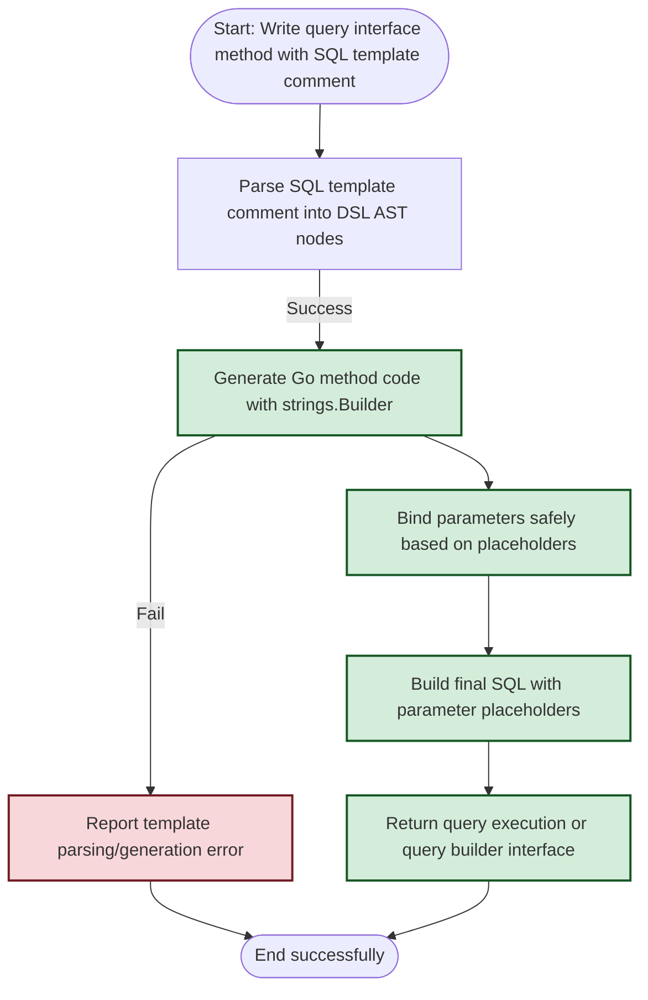

# Template-Driven Queries: SQL Template DSL

GORM CLI empowers you to write detailed, type-safe SQL query methods using Go interface comments enriched with an expressive SQL Template DSL. This guide takes you step-by-step through authoring interface methods leveraging directives, conditional logic, dynamic binding, and automatic parameterization, enabling you to build robust, maintainable queries effortlessly.

---

## Workflow Overview

### What You Will Achieve
By following this guide, you will learn how to author interface methods with SQL templates that:

- Use dynamic table and column bindings.
- Bind Go function parameters safely into SQL.
- Add conditional WHERE and SET clauses.
- Apply iteration and branching logic within SQL templates.
- Generate fully type-safe, parameterized query code automatically.

### Prerequisites

- Familiarity with Go interfaces and struct types.
- Installed GORM CLI tool and a basic understanding of the CLI code generation workflow.
- Go project with your GORM models and query interfaces.
- Recommended to have reviewed the Quickstart Guide and Core Concepts pages.

### Expected Outcome
You will be able to write declarative, flexible SQL methods like `GetByID`, `FilterWithColumn`, `UpdateInfo`, and `SearchUsers` using embedded SQL templates, which GORM CLI will transform into performant, type-safe Go code.

### Time Estimate
~20–30 minutes to internalize DSL directives and author initial methods.

### Difficulty Level
Intermediate — basic Go and SQL knowledge assumed, but no advanced template engine expertise required.

---

## Getting Started with the SQL Template DSL

### Key Directive Syntax

| Directive    | Purpose                                         | Example in SQL Template                                   |
|--------------|------------------------------------------------|----------------------------------------------------------|
| `@@table`    | Inserts the model's table name safely           | `SELECT * FROM @@table WHERE id=@id`                      |
| `@@column`   | Dynamic column identifier bind                   | `WHERE @@column=@value`                                   |
| `@param`     | Binds Go parameter into SQL with safe placeholders | `WHERE name=@name`                                      |
| `{{where}}`  | Start conditional WHERE clause block            | `{{where}} age > 18 {{end}}`                              |
| `{{set}}`    | Start conditional SET clause block for UPDATE   | `{{set}} name=@name {{end}}`                              |
| `{{if}}`     | Conditional SQL fragment inside a block          | `{{if age > 0}} AND age=@age {{end}}`                     |
| `{{for}}`    | Loop over collections or range for dynamic IN filters | `{{for _, tag := range tags}} ... {{end}}`          |


### Automatic Context Injection
If your interface method lacks a `context.Context` parameter, GORM CLI automatically injects it into the generated function signature for best practice support.

---

## Step-by-Step: Writing SQL Template Methods

<Steps>
<Step title="Define Interface Methods with SQL Templates">
Write each method in your query interface with a Go-style comment containing the SQL template. Use directives and placeholder syntax for parameter binding.

```go
// SELECT * FROM @@table WHERE id=@id AND name = "\@name"
GetByID(id int) (T, error)

// SELECT * FROM @@table WHERE @@column=@value
FilterWithColumn(column string, value string) (T, error)
```

The `@@table` expands to the underlying table name of the model automatically, while `@id` and `@value` bind method parameters.

Expected result:
- The generated method executes a parameterized SQL query, substituting parameters safely.
</Step>

<Step title="Use Conditional WHERE with {{where}} and {{if}}">
For methods that require dynamic queries depending on struct fields or other parameters, wrap conditions in a `{{where}}` block combined with `{{if}}` conditionals.

Example:

```sql
SELECT * FROM @@table
{{where}}
  {{if user.ID > 0}}
    WHERE id=@user.ID
  {{else if user.Name != ""}}
    WHERE name=@user.Name
  {{end}}
{{end}}
```

This syntax:
- Omits the WHERE clause entirely if no conditions apply.
- Generates a single WHERE clause with proper parameter binding.

Expected outcome:
- Query behaves differently at runtime based on parameter values with no risk of SQL injection.
</Step>

<Step title="Write Dynamic UPDATE Statements with {{set}}">
Encapsulate conditional update clauses within a `{{set}}` block.

Example:

```sql
UPDATE @@table
{{set}}
  {{if user.Name != ""}} name=@user.Name, {{end}}
  {{if user.Age > 0}} age=@user.Age, {{end}}
  {{if user.Age >= 18}} is_adult=1 {{else}} is_adult=0 {{end}}
{{end}}
WHERE id=@id
```

- The generated code trims trailing commas safely.
- Only non-empty fields are included in the SET clause.
- Complex expressions like `is_adult=1` or `=0` are supported.

Expected result:
- Efficient update statements reflecting only the fields that meet conditions.
</Step>

<Step title="Iterate Over Slices with {{for}}">
Use the `{{for}}` directive to dynamically build IN clauses or OR filters.

Example snippet:

```sql
SELECT * FROM @@table
{{where}}
  {{for _, user := range users}}
    {{if user.Name != "" && user.Age > 0}}
      (name = @user.Name AND age=@user.Age AND role LIKE concat("%",@user.Role,"%")) OR
    {{end}}
  {{end}}
{{end}}
```

- Loops over `users` slice parameter.
- Includes conditions for each user individually.

Expected result:
- Dynamically generated multi-condition WHERE clauses.
- Safe parameter binding with each iteration.
</Step>

<Step title="Handling Special Placeholder Escaping">
If you want to include a literal `@` symbol in your SQL (not as parameter), escape it as `\@`.

Example:

```sql
-- Name equals a literal string containing '@', e.g. user@example.com
SELECT * FROM @@table WHERE email="\@example.com"
```

Expect the generated code to leave `@` intact without adding a SQL parameter.
</Step>
</Steps>

---

## Practical Examples

### Example 1: Simple SELECT by ID

```go
// SELECT * FROM @@table WHERE id=@id
GetByID(id int) (T, error)
```

Generates Go method:

```go
var sb strings.Builder
params := make([]any, 0, 2)
sb.WriteString("SELECT * FROM ? WHERE id=?")
params = append(params, clause.Table{Name: clause.CurrentTable}, id)
return e.Exec(ctx, sb.String(), params...)
```

### Example 2: Filtering with Dynamic Column

```go
// SELECT * FROM @@table WHERE @@column=@value
FilterWithColumn(column string, value string) (T, error)
```

Generates:

```go
sb.WriteString("SELECT * FROM ? WHERE ?=?")
params = append(params, clause.Table{Name: clause.CurrentTable}, clause.Column{Name: column}, value)
```

### Example 3: Conditional Update

```go
// UPDATE @@table
// {{set}}
//   {{if user.Name != ""}} name=@user.Name, {{end}}
//   {{if user.Age > 0}} age=@user.Age, {{end}}
//   {{if user.Age >= 18}} is_adult=1 {{else}} is_adult=0 {{end}}
// {{end}}
// WHERE id=@id
UpdateInfo(user models.User, id int) error
```

Generates code that conditionally builds SET clause, binds params, and updates accordingly.

---

## Best Practices & Tips

- **Use clear parameter names**: Match Go parameter names to template placeholders for clarity.
- **Avoid complex SQL logic in templates**; prefer passing computed parameters from caller when possible.
- **Utilize `{{where}}` and `{{set}}` blocks** to conditionally include SQL clauses without worrying about dangling operators.
- **Escape `@` as `\@` when needed** to avoid unintended parameter binding.
- **Use `{{for}}` for slices or collections** when generating dynamic multi-value filters.
- **Test generated queries with representative input cases** to verify correctness.
- **Consistent interface comments format** ensures generator extracts templates without issues.

<Warning>
Malformed or incomplete template directives (e.g., missing `{{end}}`) lead to generation errors. Pay close attention to matching directives.
</Warning>

---

## Troubleshooting

<AccordionGroup title="Common Issues and Solutions">
<Accordion title="Unclosed Template Block Errors">
- **Problem:** Code generation fails with 'unclosed block(s) at EOF' or similar.
- **Solution:** Check every `{{if}}`, `{{for}}`, or `{{where}}` directive has a matching `{{end}}`. Nested blocks must be correctly closed.
</Accordion>
<Accordion title="Parameters Not Binding Correctly">
- **Problem:** Placeholder `@param` causes runtime errors or incorrect parameter mapping.
- **Solution:** Ensure parameter names in SQL templates exactly match method signature parameters. Avoid ambiguous names.
</Accordion>
<Accordion title="Literal '@' Sign Rendered as Placeholder">
- **Problem:** Query fails when your SQL contains literal `@`.
- **Solution:** Escape with `\@` to treat as literal in template.
</Accordion>
<Accordion title="Empty WHERE Clause Generated">
- **Problem:** Queries generate invalid SQL with dangling WHERE or AND without conditions.
- **Solution:** Wrap dynamic conditions inside `{{where}}` directive which smartly adds WHERE if conditions exist.
</Accordion>
</AccordionGroup>

---

## Next Steps & Related Documentation

- [Quickstart & Basic Workflow](/overview/feature-overview-workflows/quickstart-workflow): To learn how to create interfaces and run generation.
- [Configuring the Generator](/getting-started/configuration-troubleshooting/configuring-generator): Customize generation options including output paths and field mappings.
- [Working with Associations](/guides/advanced-patterns/associations): Learn to manage complex model associations with GORM CLI.
- [Using the Generated APIs in Your Project](/guides/core-workflows/using-generated-code): Apply your generated code with idiomatic Go and GORM patterns.

---

Explore these sections next to deepen your mastery of GORM CLI’s powerful query generation capabilities and building robust data access layers with ease.

---

## Summary Diagram of SQL Template Method Processing



---

Congratulations! You are now equipped to compose dynamic, safe, and maintainable SQL queries inside Go interfaces using the powerful GORM CLI SQL Template DSL.

Use this capability to minimize boilerplate, reduce runtime errors, and accelerate your development workflow.

---

For more examples and advanced usage, check [the official examples directory](https://github.com/go-gorm/cli/tree/main/examples).

---