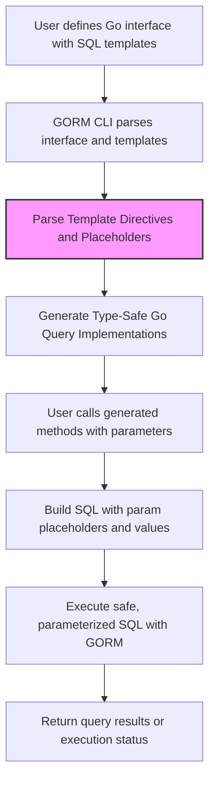

# Writing Safe, Dynamic Queries with Templates and DSL

Master the SQL template DSL for building parameterized, safe, and dynamic queries. This guide focuses exclusively on how to write flexible SQL queries using GORM CLI's templating DSL in your interface definitions to ensure type safety, security, and maintainability.

---

## Workflow Overview

### Task Description
Learn how to write SQL query templates within Go interface comments in GORM CLI to generate safe, dynamic, and parameterized queries. This includes using placeholders, conditionals, iterations, and contextual parameter bindings to create expressive and secure SQL logic.

### Prerequisites
- You have Go 1.18+ installed and properly configured.
- GORM CLI is installed and accessible in your environment.
- Your Go project includes model structs representing your database schema.
- Basic familiarity with SQL syntax and Go interfaces.
- Understanding of GORM's usage and its integration with Go.

### Expected Outcome
By following this guide, you will be able to:
- Write SQL templates using GORM CLI's DSL with placeholders like `@@table`, `@@column`, and `@param`.
- Use control flow constructs like `{{if}}`, `{{else}}`, `{{for}}`, `{{where}}`, and `{{set}}` for dynamic query generation.
- Compose safe parameterized queries that prevent SQL injection vulnerabilities.
- Understand how to bind Go method parameters contextually into SQL templates.

### Time Estimate
This guide can be completed in approximately 15-30 minutes, depending on familiarity with SQL templating.

### Difficulty Level
Intermediate (Requires SQL and Go interface knowledge, some understanding of templating concepts)

---

## Step-by-Step Instructions

### 1. Define Query Interfaces with SQL Templates
Create Go interfaces that represent your query APIs. Each method's comment includes a SQL template using the GORM CLI DSL.

Example:
```go
// Query interface in your package (examples/query.go)
type Query[T any] interface {
  // SELECT * FROM @@table WHERE id=@id
  GetByID(id int) (T, error)

  // Dynamic column filtering
  // SELECT * FROM @@table WHERE @@column=@value
  FilterWithColumn(column string, value string) (T, error)

  // Dynamic conditions using if/else
  // SELECT * FROM @@table
  // {{where}}
  //   {{if user.ID > 0}} WHERE id=@user.ID {{end}}
  //   {{else if user.Name != ""}} WHERE name=@user.Name {{end}}
  // {{end}}
  QueryWith(user models.User) (T, error)

  // Update query using conditional sets
  // UPDATE @@table
  // {{set}}
  //   {{if user.Name != ""}} name=@user.Name, {{end}}
  //   {{if user.Age > 0}} age=@user.Age, {{end}}
  //   {{if user.Age >= 18}} is_adult=1 {{else}} is_adult=0 {{end}}
  // {{end}}
  // WHERE id=@id
  UpdateInfo(user models.User, id int) error

  // Iterate over collections for complex filters
  // SELECT * FROM @@table
  // {{where}}
  //   {{for _, user := range users}}
  //     {{if user.Name != "" && user.Age > 0}}
  //       (name=@user.Name AND age=@user.Age AND role LIKE concat("%",@user.Role,"%")) OR
  //     {{end}}
  //   {{end}}
  // {{end}}
  Filter(users []models.User) ([]T, error)
}
```

### 2. Use Placeholders for Safe Parameter Binding
- `@@table`: Automatically resolves your model's database table name.
- `@@column`: Allows dynamic column binding, useful when filtering by variable columns.
- `@param`: Binds Go method parameters safely as placeholders.

These placeholders are internally converted into `?` placeholders with fully safe parameterization to prevent injection.

### 3. Apply Conditional Blocks
Wrap parts of your SQL in `{{if condition}} ... {{end}}` blocks to generate only relevant SQL segments based on Go parameter values.

Example conditional WHERE clause:
```sql
{{where}}
  {{if !start.IsZero()}} created_at > @start {{end}}
  {{if !end.IsZero()}} AND created_at < @end {{end}}
{{end}}
```
This generates the `WHERE` clause only if the `start` and/or `end` parameters are non-zero.

### 4. Use Iterations for Multiple Conditions
You can iterate collections using `{{for}}` blocks, combined with conditionals, to generate composite filters.

Example:
```sql
{{where}}
  {{for _, user := range users}}
    {{if user.Name != "" && user.Age > 0}}
      (name=@user.Name AND age=@user.Age AND role LIKE concat("%",@user.Role,"%")) OR
    {{end}}
  {{end}}
{{end}}
```
This dynamically builds an OR-filter based on the provided users slice.

### 5. Use `{{set}}` Directive for Safe, Dynamic UPDATE Statements
Wrap UPDATE SET clauses within `{{set}}` blocks to conditionally include columns based on parameters.

Example:
```sql
UPDATE @@table
{{set}}
  {{if user.Name != ""}} name=@user.Name, {{end}}
  {{if user.Age > 0}} age=@user.Age, {{end}}
  {{if user.Age >= 18}} is_adult=1 {{else}} is_adult=0 {{end}}
{{end}}
WHERE id=@id
```
Only the non-empty or relevant fields are included in the SET clause, ensuring clean, targeted updates.

### 6. Escaping and Literal '@' Characters
To include a literal '@' sign (not recognized as a parameter marker), escape it with a backslash (`\@`). The DSL treats `\@` as a literal `@` in the final SQL.

### 7. Generate and Use Code
After defining your interfaces with templates, run the GORM CLI generator:
```bash
gorm gen -i ./examples -o ./generated
```
This generates type-safe implementations that you can use in your application:
```go
user, err := generated.Query[User](db).GetByID(ctx, 123)
```

### 8. Verify Generated Results
GORM CLI generates secure code that appends parameters in binding-safe fashion. Verify generated code by inspecting the output files or running unit tests.

---

## Examples & Code Samples

### Example: Simple Select with Parameter Binding
```go
// Method comment with SQL template
// SELECT * FROM @@table WHERE id=@id
GetByID(id int) (T, error)
```
Generated Go code snippet:
```go
var sb strings.Builder
params := make([]any, 0, 2)
sb.WriteString("SELECT * FROM ? WHERE id=?")
params = append(params, clause.Table{Name: clause.CurrentTable}, id)

var result T
err := e.Raw(sb.String(), params...).Scan(ctx, &result)
return result, err
```

### Example: Conditional WHERE with If/Else
SQL Template:
```sql
SELECT * FROM @@table
{{where}}
  {{if user.ID > 0}} WHERE id=@user.ID {{end}}
  {{else if user.Name != ""}} WHERE name=@user.Name {{end}}
{{end}}
```

### Example: Iteration with For
SQL Template:
```sql
SELECT * FROM @@table
{{where}}
  {{for _, user := range users}}
    {{if user.Name != "" && user.Age > 0}}
      (name = @user.Name AND age=@user.Age) OR
    {{end}}
  {{end}}
{{end}}
```

### Example: Update with Set and Conditionals
SQL Template:
```sql
UPDATE @@table
{{set}}
  {{if user.Name != ""}} name=@user.Name, {{end}}
  {{if user.Age > 0}} age=@user.Age, {{end}}
  {{if user.Age >= 18}} is_adult=1 {{else}} is_adult=0 {{end}}
{{end}}
WHERE id=@id
```

---

## Troubleshooting & Tips

<AccordionGroup title="Common Issues and Insights">
<Accordion title="Unmatched or Missing {{end}} Statements">
Ensure all opened directives (such as `{{if}}`, `{{for}}`, `{{where}}`, `{{set}}`) have corresponding closing `{{end}}` directives. The template parser will fail on unclosed blocks.
</Accordion>
<Accordion title="Incorrect Placeholder Usage">
Use exactly `@@table`, `@@column`, or `@param` for placeholders. Avoid manual interpolation or embedding dynamic values inside strings, as they are replaced safely with `?` placeholders and parameters appended.
</Accordion>
<Accordion title="Unexpected Literal '@' in SQL">
Escape literal '@' characters as `\@` in templates to prevent misinterpretation as parameter markers.
</Accordion>
<Accordion title="Empty Conditional Blocks Resulting in Syntax Errors">
When using `{{where}}` or `{{set}}`, if the block evaluates to empty, the generated SQL omits these clauses. Make sure your conditions are correct and that you expect possible empty results.
</Accordion>
<Accordion title="Runtime Errors with Parameter Binding">
Verify that parameters referenced with `@name` exist in the method signature and are passed correctly. Mismatches can cause generation errors or runtime panics.
</Accordion>
</AccordionGroup>

<Tip>
Use the `{{where}}` and `{{set}}` directives generously to avoid manual trimming of SQL strings and to automatically include or omit the `WHERE` or `SET` keywords based on the content generated inside.
</Tip>

<Tip>
For iteration (`{{for}}`), ensure the loop variable is correctly scoped and referenced as `@loopVar.Field` for each element's parameter binding.
</Tip>

---

## Next Steps & Related Content

### What's Next
- Explore [Working with Associations: Create, Update, Unlink, Delete](/guides/advanced-patterns/working-with-associations) to complement your dynamic queries with association management.
- Dive into [Customizing Generation with genconfig.Config](/guides/advanced-patterns/customizing-generation) for advanced customization of generated code and mappings.
- Learn how to handle specialized data types using the [Advanced: Defining and Using Custom Field Helpers](/guides/advanced-patterns/json-field-helpers).

### Related Guides
- [Generating Type-Safe Query APIs and Field Helpers](/guides/getting-started/generating-type-safe-apis) - for initial setup and generation.
- [Using the Generated Code: Queries, Filters, and Updates](/guides/getting-started/using-generated-code) - practical API usage after generation.

### Resources
- Official GitHub Repository: [gorm.io/cli/gorm](https://github.com/go-gorm/cli)
- Detailed SQL DSL specification in [README.md](https://github.com/go-gorm/cli/blob/main/README.md#template-based-queries)

---

## Summary Diagram



---