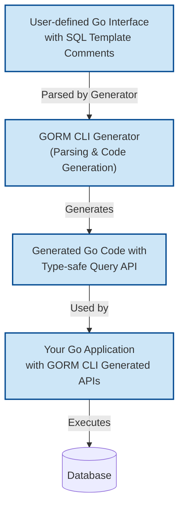

# Writing Custom Queries with SQL Templates

This guide provides a practical approach to defining custom, interface-driven queries using GORM CLI’s powerful SQL template DSL. Learn how to map Go method parameters safely to SQL, employ conditional logic, and create dynamic SQL fragments directly in your interface method comments. By following these instructions, you will write robust, type-safe queries that empower flexible and efficient data retrieval and modification.

---

## 1. Workflow Overview

- **Task Description**: Create advanced, type-safe query methods by embedding SQL templates within Go interface comments to generate concrete implementations automatically.
- **Prerequisites**:
  - Go 1.18+ installed with generics support
  - GORM CLI installed (`go install gorm.io/cli/gorm@latest`)
  - Existing Go model structs defined
  - Basic familiarity with GORM and SQL
- **Expected Outcome**:
  - Custom query interfaces with SQL templates parsed and converted to type-safe, fluent APIs
  - Runtime-safe parameter bindings that prevent SQL injection
  - Dynamic query logic supporting conditional filters and set clauses
- **Time Estimate**: 15–30 minutes to define queries and validate generation
- **Difficulty Level**: Intermediate

---

## 2. Step-by-Step Instructions

### Step 1: Define Your Query Interface with SQL Template Comments

Write your Go interface with method signatures that describe the queries you want to implement. Embed the raw SQL or templated SQL inside method documentation comments following a simple DSL pattern.

**Example:**
```go
// Query defines database queries for the User model
// containing SQL templates inside method comments
package examples

type Query[T any] interface {
  // SELECT * FROM @@table WHERE id=@id
  GetByID(id int) (T, error)

  // SELECT * FROM @@table WHERE @@column=@value
  FilterWithColumn(column string, value string) (T, error)

  // SELECT * FROM users
  //   {{if user.ID > 0}}
  //       WHERE id=@user.ID
  //   {{else if user.Name != ""}}
  //       WHERE name=@user.Name
  //   {{end}}
  QueryWith(user User) (T, error)

  // UPDATE @@table
  //  {{set}}
  //    {{if user.Name != ""}} name=@user.Name, {{end}}
  //    {{if user.Age > 0}} age=@user.Age, {{end}}
  //    {{if user.Age >= 18}} is_adult=1 {{else}} is_adult=0 {{end}}
  //  {{end}}
  // WHERE id=@id
  UpdateInfo(user User, id int) error
}
```

### Step 2: Use Special Placeholders for Dynamic Bindings

The SQL template DSL supports placeholders that map Go parameters to SQL with compile-time safety:

- `@@table`: Automatically expands to the table name of the model.
- `@@column`: Dynamically binds a column name passed as a Go string.
- `@param`: Maps Go method parameters to SQL parameters safely.
- `{{where}}` and `{{set}}`: Blocks for conditional WHERE and SET clauses.
- `{{if}}`, `{{else if}}`, `{{else}}`, `{{end}}`: Allow SQL conditionals based on parameter values.
- `{{for}}`: Loop over collections for building complex expressions.

This mapping ensures your parameters are always safely bound to SQL, preventing injection.

### Step 3: Run the GORM CLI Generator

Execute the CLI to generate your concrete implementations:

```bash
gorm gen -i ./examples -o ./generated
```

Replace `./examples` with the path of your interface and model files.

### Step 4: Use Generated Query APIs

The generated code provides fluent, type-safe methods matching your interface.

**Example:**
```go
// Select user by ID
user, err := generated.Query[User](db).GetByID(ctx, 123)

// Filter by dynamic column
user, err := generated.Query[User](db).FilterWithColumn(ctx, "name", "jinzhu")

// Query with conditional filtering
result, err := generated.Query[User](db).QueryWith(ctx, User{ID: 1})

// Update user info conditionally
err := generated.Query[User](db).UpdateInfo(ctx, User{Name: "jinzhu", Age: 20}, 1)
```

### Step 5: Verify Query Correctness

Check the generated code compiles and run your application tests to confirm your queries run as expected. Troubleshoot errors by:

- Confirming method comments follow the DSL syntax exactly
- Validating parameter names match placeholders
- Running unit tests that exercise generated methods

---

## 3. Real-World Examples

### Example: Safe Dynamic Column Filtering
```go
// SELECT * FROM @@table WHERE @@column=@value
FilterWithColumn(column string, value string) (T, error)
```
This allows filtering by any column dynamically while preserving SQL safety.

### Example: Conditional Update with Set Clause
```go
// UPDATE @@table
// {{set}}
//   {{if user.Name != ""}} name=@user.Name, {{end}}
//   {{if user.Age > 0}} age=@user.Age, {{end}}
//   {{if user.Age >= 18}} is_adult=1 {{else}} is_adult=0 {{end}}
// {{end}}
// WHERE id=@id
UpdateInfo(user User, id int) error
```
Generates an UPDATE that only sets columns provided, with conditional logic for computed fields.

### Example: Filtering with List and Loop
```go
// SELECT * FROM @@table
// {{where}}
//   {{for _, user := range users}}
//     {{if user.Name != "" && user.Age > 0}}
//       (name=@user.Name AND age=@user.Age AND role LIKE concat("%",@user.Role,"%")) OR
//     {{end}}
//   {{end}}
// {{end}}
Filter(users []User) ([]T, error)
```
Use loops and conditions to build complex, dynamic filters safely.

---

## 4. Troubleshooting & Best Practices

<AccordionGroup title="Common Issues and Tips">
<Accordion title="SQL Template Syntax Errors">
Ensure block directives like `{{if}}`, `{{else}}`, and `{{end}}` are balanced and correctly nested. Missing `{{end}}` is a frequent issue causing generation failure.
</Accordion>
<Accordion title="Parameter Binding Problems">
Parameter names in comments must exactly match method parameters. Use `@param` for direct bindings and remember to escape `\@` if needed.
</Accordion>
<Accordion title="Unintended Query Behavior">
Test queries interactively with meaningful inputs. For complex conditionals, explicitly test each branch to verify SQL correctness.
</Accordion>
<Accordion title="Best Practices">
- Keep SQL templates simple and readable; comment complex logic.
- Use named parameters instead of string concatenations.
- Prefer `{{where}}` and `{{set}}` blocks for conditional clauses.
- Leverage `@@table` and `@@column` placeholders for portability.
- Use loops (`{{for}}`) for collections rather than manual string join.
</Accordion>
</AccordionGroup>

---

## 5. Next Steps & Related Content

- **Explore:**
  - [Working with Associations: Create, Update, Unlink, and Delete](/guides/advanced-patterns/association-workflows) to manage relationships.
  - [Using Model-Driven Field Helpers](/guides/core-workflows/using-field-helpers) for type-safe filtering and updates.
  - [Customizing Code Generation](/guides/customization-integration/generation-config) with `genconfig.Config` for advanced scenarios.

- **Try:** Writing your own interfaces combining various SQL templates and running the generator to get immediate feedback.

- **Learn:** How to integrate generated APIs with your GORM-based applications for robust database layer code.

---

### Diagram: How SQL Templates Flow Through GORM CLI



---