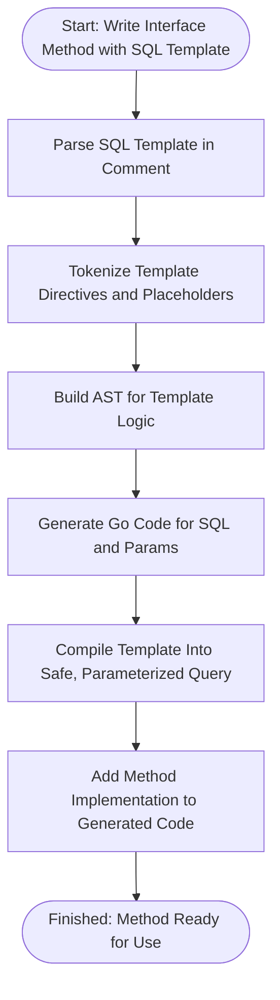

# Building Custom Queries with SQL Templates

Unlock the full expressiveness of GORM CLI’s SQL template DSL. This guide shows you how to craft advanced, dynamic queries directly in your query interfaces, using powerful SQL templates that support safe parameter binding, conditional logic, and iteration.

---

## Workflow Overview

### What You Will Achieve
By following this guide, you will learn to define interface methods with embedded SQL templates that:
- Use dynamic fragments and safe parameter bindings
- Include conditional WHERE and SET clauses
- Incorporate iterations and nested conditionals for complex filters
- Generate fully type-safe and executable query methods

### Prerequisites
- GORM CLI installed and configured
- Basic understanding of Go interfaces and GORM models
- Familiarity with running the code generator (`gorm gen`)
- Existing Go interfaces where you can embed SQL comments

### Expected Outcome
You will be able to write Go interfaces whose method comments encode complete SQL queries with embedded templating directives. Running the generator will create concrete, type-safe query APIs that implement your custom SQL logic with safety and convenience.

### Time Estimate
30-45 minutes to complete basic examples and grasp conditional templates.

### Difficulty Level
Intermediate: Requires comfort with Go interfaces, Go templating syntax in comments, and SQL.

---

## Step-by-Step Instructions

### 1. Define Query Interface Methods Using SQL Templates

Each method in your interface can include SQL templates directly in its comment, using GORM CLI's DSL that supports placeholders and control structures.

#### Key Syntax Elements:
- `@@table` — dynamically expands to your table name
- `@@column` — dynamic column placeholder bound to method params
- `@param` — safe binding of Go method parameters or struct fields
- `{{where}} ... {{end}}` — conditional, dynamically assembled WHERE clauses
- `{{set}} ... {{end}}` — conditional, dynamically generated SET clauses for updates
- `{{if condition}} ... {{else}} ... {{end}}` — conditional SQL fragments
- `{{for ...}} ... {{end}}` — loop over collections for repeated conditions

Example:
```go
// SELECT * FROM @@table WHERE id=@id
GetByID(id int) (T, error)

// UPDATE @@table
// {{set}}
//   {{if user.Name != ""}} name=@user.Name, {{end}}
//   {{if user.Age > 0}} age=@user.Age, {{end}}
// {{end}}
// WHERE id=@id
UpdateUser(user User, id int) error
```

### 2. Use Struct Fields Safely in Templates

You can reference fields from struct parameters by `@param.Field`, which safely binds the values to SQL parameters and prevents SQL injection.

Example:
```go
// SELECT * FROM @@table
// {{where}}
//   {{if user.Name != ""}} name=@user.Name {{end}}
//   {{if user.Age > 0}} AND age=@user.Age {{end}}
// {{end}}
FilterUsers(user User) ([]T, error)
```

### 3. Implement Dynamic Conditional Logic

Use `{{if}}` conditions to include/exclude SQL fragments based on parameters' values at runtime.

Example:
```go
// UPDATE @@table
// {{set}}
//   {{if user.Email != ""}} email=@user.Email, {{end}}
// {{end}}
// WHERE id=@id
UpdateEmail(user User, id int) error
```

### 4. Use `{{for}}` to Iterate Over Slices

For filtering on collections, iterate inside your WHERE clause to combine multiple dynamic OR or AND conditions.

Example:
```go
// SELECT * FROM @@table
// {{where}}
//   {{for _, tag := range tags}}
//     {{if tag != ""}} tags LIKE concat("%",@tag,"%") OR {{end}}
//   {{end}}
// {{end}}
SearchByTags(tags []string) ([]T, error)
```

### 5. Run GORM CLI Generator

After defining interfaces, run:
```bash
gorm gen -i path/to/your/interfaces -o path/to/generated
```
This generates concrete implementations with your SQL templates compiled into efficient Go code.

### 6. Use the Generated Methods in Your Application

Call generated methods as type-safe functions, passing context and parameters. The queries will execute your custom SQL with safe bindings.

Example:
```go
user, err := generated.Query[User](db).GetByID(ctx, 123)
users, err := generated.Query[User](db).FilterUsers(ctx, filterUser)
```

---

## Practical Examples

### Example: Simple Dynamic WHERE
```go
// SELECT * FROM @@table WHERE id=@id
GetByID(id int) (T, error)
```

### Example: Conditional Update SET
```go
// UPDATE @@table
// {{set}}
//   {{if user.Name != ""}} name=@user.Name, {{end}}
//   {{if user.Age > 0}} age=@user.Age {{end}}
// {{end}}
// WHERE id=@id
UpdateUser(user User, id int) error
```

### Example: Conditional WHERE With ElseIf
```go
// SELECT * FROM @@table
//   {{if user.ID > 0}}
//     WHERE id=@user.ID
//   {{else if user.Name != ""}}
//     WHERE name=@user.Name
//   {{end}}
QueryWith(user User) (T, error)
```

### Example: Looping Over Filters
```go
// SELECT * FROM @@table
// {{where}}
//   {{for _, user := range users}}
//     {{if user.Name != "" && user.Age > 0}}
//       (name = @user.Name AND age=@user.Age) OR
//     {{end}}
//   {{end}}
// {{end}}
Filter(users []User) ([]T, error)
```

---

## Tips & Best Practices

- Always use `@param` syntax for variable binding. **Never concatenate SQL strings manually**.
- Use `@@table` and `@@column` placeholders to avoid hardcoding table or column names.
- Ensure your struct fields have zero-appropriate defaults to manage template conditionals effectively.
- Use `{{where}}` and `{{set}}` blocks to build dynamic WHERE and SET clauses cleanly.
- When iterating over collections with `{{for}}`, guard with conditions to avoid trailing OR/AND.
- Run the GORM CLI generator regularly to validate your templates' syntax and method contracts.
- Use `ctx context.Context` in methods to support cancellation and timeouts.

---

## Troubleshooting

<AccordionGroup title="Common Issues and Solutions">
<Accordion title="My queries do not compile after generation">
Check your SQL template syntax, especially control blocks (`{{if}}`, `{{end}}`, `{{for}}`). Unmatched or malformed blocks cause errors.

- Ensure all opened blocks have matching `{{end}}`.
- Avoid misplaced nested `{{else if}}` or `{{else}}` without a preceding `{{if}}`.
</Accordion>

<Accordion title="Parameters do not bind correctly">
Use only `@param` style binding for all variables in templates.

- If binding struct fields, prefix with parameter name: e.g., `@user.Name`.
- Avoid manual string concatenations of SQL fragments inside templates.
</Accordion>

<Accordion title="Generated methods missing context parameter">
If your interface method lacks `ctx context.Context`, the generator will automatically insert it.

- To specify your own context variable name, include it explicitly in the interface method signature.
</Accordion>

<Accordion title="Dynamic placeholders not replaced">
Use `@@table` and `@@column` for table and column names.

- `@@table` resolves to your model’s table name.
- `@@column` can bind to method parameters representing column names.
</Accordion>
</AccordionGroup>

---

## Next Steps & Related Content

- [Getting Started: Generating Queries & Field Helpers](https://gorm.io/cli/guides/core-workflows/getting-started) — Learn the full generation workflow
- [Working with Generated APIs in Your Project](https://gorm.io/cli/guides/core-workflows/using-generated-apis) — Practical usage of generated code
- [Advanced Code Generation Configuration](https://gorm.io/cli/guides/core-workflows/configuring-generation) — Customize generation behaviors
- [Defining Query Interfaces & Models](https://gorm.io/cli/getting-started/project-bootstrapping/writing-query-interfaces) — How to define interfaces for generation

Use these guides to deepen your mastery of GORM CLI’s query generation features and integration.

---

## Diagram: Query Method Template Processing Flow



---

## Reference: SQL Template DSL Quick Syntax

| Directive   | Description                             | Example                               |
|-------------|---------------------------------------|-------------------------------------|
| `@@table`   | Model’s table name                     | `SELECT * FROM @@table WHERE id=@id`|
| `@@column`  | Dynamic column name from param        | `WHERE @@column=@value`              |
| `@param`    | Bind Go parameter or struct field     | `WHERE name=@user.Name`              |
| `{{where}}` | Conditional WHERE block                | `{{where}} age>@minAge {{end}}`     |
| `{{set}}`   | Conditional SET block for UPDATE       | `{{set}} name=@name {{end}}`         |
| `{{if}}`    | Conditionals for fragments             | `{{if user.Age>18}} is_adult=1 {{end}}`|
| `{{for}}`   | Loops over slices in filters          | `{{for _, t:= range tags}} ... {{end}}`|

---