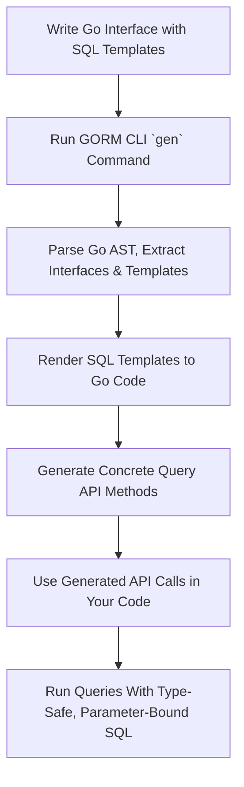

# Template-Based Queries: From Interface to Custom SQL

Harness the power of SQL templates embedded within Go interfaces to define sophisticated, reusable query APIs with GORM CLI. This guide walks you through crafting dynamic SQL statements using templating syntax, binding parameters securely, and generating advanced finders and updaters that elegantly handle complex conditional logic.

---

## 1. Workflow Overview

### What this guide helps you accomplish
Learn how to write Go interfaces with SQL annotations that define custom, type-safe query methods using GORM CLI's template-based system. Understand how to embed and organize SQL fragments with placeholders, conditional blocks, and loops directly within method comments.

### Prerequisites
- Familiarity with Go interfaces and struct types
- Basic understanding of SQL and GORM ORM usage
- GORM CLI installed and ready (see [Installation Guide](/getting-started/setup-and-installation/installation-guide))
- Defined model structs representing your database schema

### Expected outcome
By the end of this guide, you'll successfully define and generate query APIs from interfaces annotated with expressive SQL templates that support parameter binding, conditional SQL blocks, iteration, and dynamic query construction.

### Time estimate
Approximately 20–30 minutes to grasp concepts and apply examples

### Difficulty level
Intermediate — assumes basic Go and SQL knowledge

---

## 2. Defining Template-Based Query Interfaces

### Embedding SQL Templates in Interface Methods
Each method's behavior is defined using SQL templates inside Go comment blocks. These templates support:

- **Plain SQL with parameter placeholders**
- **Special placeholders for dynamic references** (e.g., table and column names)
- **Conditional logic** (`{{if}}`, `{{else if}}`, `{{else}}`, `{{end}}`)
- **Iteration loops** (`{{for}}`)
- **Special sections for `WHERE` and `SET` clauses** (`{{where}}`, `{{set}}`)

### Syntax Highlights and Parameter Binding
- Use `@@table` to refer to the model's associated DB table dynamically
- Use `@@column` for dynamic column names bound at runtime
- Use `@paramName` to bind Go method parameters safely as SQL parameters
- Escape literal `@` signs by prefixing with backslash (`\@`)

### Example Interface Snippet
```go
// Query interface with templated SQL annotations
// demonstrating various templating features
// such as dynamic conditions and loops
// All SQL is embedded as comments above each method

type Query[T any] interface {
  // SELECT * FROM @@table WHERE id=@id AND name = "\@name"
  GetByID(id int) (T, error)

  // SELECT * FROM @@table WHERE @@column=@value
  FilterWithColumn(column string, value string) (T, error)

  // SELECT * FROM users
  //   {{if user.ID > 0}}
  //       WHERE id=@user.ID
  //   {{else if user.Name != ""}}
  //       WHERE name=@user.Name
  //   {{end}}
  QueryWith(user models.User) (T, error)

  // UPDATE @@table
  //  {{set}}
  //    {{if user.Name != ""}} name=@user.Name, {{end}}
  //    {{if user.Age > 0}} age=@user.Age, {{end}}
  //    {{if user.Age >= 18}} is_adult=1 {{else}} is_adult=0 {{end}}
  //  {{end}}
  // WHERE id=@id
  UpdateInfo(user models.User, id int) error

  // SELECT * FROM @@table
  // {{where}}
  //   {{for _, user := range users}}
  //     {{if user.Name != "" && user.Age > 0}}
  //       (name = @user.Name AND age=@user.Age AND role LIKE concat("%",@user.Role,"%")) OR
  //     {{end}}
  //   {{end}}
  // {{end}}
  Filter(users []models.User) ([]T, error)

  // where("name=@name AND age=@age")
  FilterByNameAndAge(name string, age int)

  // SELECT * FROM @@table
  //  {{where}}
  //    {{if !start.IsZero}}
  //      created_at > @start
  //    {{end}}
  //    {{if !end.IsZero}}
  //      AND created_at < @end
  //    {{end}}
  //  {{end}}
  FilterWithTime(start, end time.Time) ([]T, error)
}
```

### How it works
1. **Parsing**: GORM CLI parses your Go interface methods and extracts SQL template comments.
2. **Template Rendering**: Your SQL templates are processed into Go code with dynamic string builders and parameter appends, maintaining compile-time safety and full parameter binding.
3. **Generation**: The generated code provides concrete methods you invoke with Go parameters to safely run your custom SQL.

---

## 3. Template DSL Directives and Features

| Directive  | Purpose                               | Description & Example                      |
|------------|-------------------------------------|-------------------------------------------|
| `@@table`  | Dynamic table reference              | Resolves to the mapped table name         |
| `@@column` | Dynamic column reference             | Used when column names are passed as params |
| `@param`   | Parameter binding                   | Binds Go method parameter securely to SQL|
| `{{where}}`| Conditional WHERE clause builder     | Only included if conditions generate content |
| `{{set}}`  | Conditional SET clause builder (UPDATE) | Builds SET clause based on field values  |
| `{{if}}`   | Conditional SQL section                | Include if condition is true               |
| `{{else if}}` | Else-if conditional              | Alternate condition branch                  |
| `{{else}}` | Else condition                      | Default block if previous conditions fail  |
| `{{for}}`  | Iteration over collections           | Loop over slices or arrays                   |
| `{{end}}`  | End of block                        | Marks end of control structure             |

### Practical usage tips
- Use `{{where}}` and `{{set}}` for clean dynamic queries without worrying about trailing connectors.
- Structure `{{if}}` and `{{else if}}` blocks carefully to handle multiple mutually exclusive query conditions.
- Escape literal `@` with `\@` to avoid accidental parameter parsing.
- Use `@@column` only with trusted column names to avoid SQL injection risk.

---

## 4. Step-by-Step: Creating and Using a Template-Based Query Method

<Steps>
<Step title="Step 1: Define your interface with SQL templates">
Write a Go interface method annotated with raw SQL templates as comments, using placeholders and directives.

```go
// SELECT * FROM @@table WHERE id=@id
GetByID(id int) (T, error)
```

Ensure your method returns the expected data and error.
</Step>

<Step title="Step 2: Run GORM CLI code generation">
Invoke the code generator pointing to your file/directory containing the interfaces.

```bash
gorm gen -i ./examples -o ./generated
```

This processes annotations and generates concrete query API methods.
</Step>

<Step title="Step 3: Use the generated query API in your code">
Import and instantiate the generated query interface implementations.

```go
user, err := generated.Query[User](db).GetByID(ctx, 123)
if err != nil {
    // handle error
}
fmt.Println(user.Name)
```

This runs the templated SQL with parameters bound safely.
</Step>

<Step title="Step 4: Creating complex queries using conditional blocks">
You can write richer interfaces with dynamic WHERE and SET clauses.

Example:
```go
// FilterWithTime(start, end time.Time) ([]T, error)
// SELECT * FROM @@table
// {{where}}
//   {{if !start.IsZero}}
//     created_at > @start
//   {{end}}
//   {{if !end.IsZero}}
//     AND created_at < @end
//   {{end}}
// {{end}}
```
This generates a query applying one or both time conditions if they are set.
</Step>
</Steps>

---

## 5. Examples & Real Scenarios

### Example: Dynamic Update with Conditional SET
```go
// UPDATE @@table
// {{set}}
//   {{if user.Name != ""}} name=@user.Name, {{end}}
//   {{if user.Age > 0}} age=@user.Age, {{end}}
//   {{if user.Age >= 18}} is_adult=1 {{else}} is_adult=0 {{end}}
// {{end}}
// WHERE id=@id
UpdateInfo(user models.User, id int) error
```

Generated code builds the SET clause by including only the non-empty and relevant fields dynamically.

### Example: Filtering by Multiple Users with OR Conditions
```go
// SELECT * FROM @@table
// {{where}}
//   {{for _, user := range users}}
//     {{if user.Name != "" && user.Age > 0}}
//       (name = @user.Name AND age=@user.Age AND role LIKE concat("%",@user.Role,"%")) OR
//     {{end}}
//   {{end}}
// {{end}}
Filter(users []models.User) ([]T, error)
```

This loops and includes criteria for each user in the slice if applicable.

---

## 6. Troubleshooting & Best Practices

<AccordionGroup title="Troubleshooting Common Issues">
<Accordion title="Unclosed or malformed template blocks">
Make sure every `{{if}}`, `{{for}}`, and `{{set}}` directive is paired with a matching `{{end}}`. Nested control flow must be balanced.
</Accordion>
<Accordion title="Parameter binding errors">
Verify that all `@param` placeholders correspond exactly to method parameter names. Use escape sequence `\@` for literal `@` usage.
</Accordion>
<Accordion title="Unsupported directives or syntax errors">
Only supported template directives as documented (`{{where}}`, `{{set}}`, `{{if}}`, `{{else if}}`, `{{else}}`, `{{for}}`, `{{end}}`) are allowed.
</Accordion>
<Accordion title="SQL injection risk with dynamic columns">
Only use `@@column` for trusted, static or validated column names. User input should never be injected directly into SQL identifiers.
</Accordion>
</AccordionGroup>

<Tip>
For complex logic, use nested `{{if}}` and `{{for}}` blocks judiciously to keep your templates clean and maintainable.
</Tip>

<Warning>
Avoid including complex business logic inside SQL templates. Use them strictly for dynamic SQL generation and parameter binding.
</Warning>

---

## 7. Next Steps & Related Documentation

- Explore the [Getting Started: Generate Your First Query API](/guides/core-workflows/getting-started) guide to begin generating basic query code
- Dive into [Model-Driven Field Helpers](/guides/core-workflows/field-helper-basics) to leverage generated type-safe filters and updates
- Customize generation using [genconfig.Config](/guides/advanced-patterns/customizing-generation) for tailored output
- For association management, see [Working with Associations](/guides/advanced-patterns/associations-deep-dive)
- Review [Template SQL DSL and Placeholders](/concepts/extensibility-templates-config/template-dsl-and-placeholders) for deep understanding of templating syntax

---

## 8. Additional Notes

- GORM CLI automatically injects `context.Context` as the first method parameter if not declared explicitly.
- Generated code uses `strings.Builder` and parameter slices for efficient, safe SQL construction.
- Template-based querying complements model-driven generated helpers to enable powerful type-safe querying.

---

## Diagram: Template-Based Query Processing Flow



---