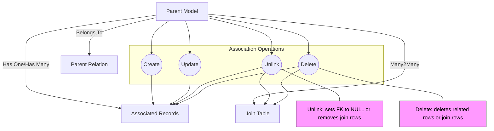

# Working with Associations

Learn how to effectively manage your GORM models’ relationships—whether has one, has many, belongs to, or many2many—using GORM CLI's association helpers. This guide walks you through performing create, update, unlink, and delete operations on associations with code-first, type-safe APIs and practical examples.

---

## 1. Understanding Association Types and Helpers

GORM CLI generates strongly typed association helpers that reflect your model relationships, enabling intuitive and safe operations:

- **Has One / Has Many:** Represented as `field.Struct[T]` and `field.Slice[T]` respectively. Examples: `User.Account` (has one), `User.Pets` (has many).
- **Belongs To:** A `field.Struct[T]` representing the parent entity with a foreign key field. Example: `User.Company`.
- **Many2Many:** Managed as `field.Slice[T]` with join tables. Example: `User.Languages`.
- **Polymorphic Associations:** Modeled similarly with `field.Struct` or `field.Slice` but use polymorphic keys internally. Example: `Pet.Toy`.

Each of these helpers supports the following operations:

| Operation | Description |
|-----------|-------------|
| Create    | Create and associate new records |
| CreateInBatch | Batch create/link many associated records |
| Update    | Update associated records with optional filter conditions |
| Unlink    | Remove associations without deleting data (e.g., nullify FKs or remove join rows) |
| Delete    | Delete associated records or join rows |

---

## 2. Core Workflows for Association Management

Follow these workflows to manipulate your associations clearly and safely.

### 2.1 Creating and Linking Associations

You can create and associate related records on parent insert or update by using the `Create` or `CreateInBatch` methods inside the `Set(...)` chain.

<Steps>
<Step title="Create a Single Associated Record">
Use `field.Struct[T].Create(...)` or `field.Slice[T].Create(...)` inside a `Set()` call when creating or updating parent records to add a related record.

```go
// Create a user and one pet together
err := gorm.G[User](db).
  Set(
    generated.User.Name.Set("alice"),
    generated.User.Pets.Create(generated.Pet.Name.Set("fido")),
  ).
  Create(ctx)
```

After the operation completes, the pet will be linked to the newly created user.
</Step>
<Step title="Batch Create Multiple Associated Records">
For has-many or many2many relations, use `CreateInBatch` to link multiple records efficiently.

```go
pets := []Pet{{Name: "cat"}, {Name: "dog"}}
err := gorm.G[User](db).
  Where(generated.User.ID.Eq(1)).
  Set(
    generated.User.Pets.CreateInBatch(pets),
  ).
  Update(ctx)
```

This creates and associates multiple pets for the matched user.
</Step>
</Steps>

---

### 2.2 Updating Associated Records

Update associated rows by filtering the association with `Where(...)` and passing the update assignments to `Update(...)`.

```go
_, err := gorm.G[User](db).
  Where(generated.User.ID.Eq(1)).
  Set(
    generated.User.Pets.Where(generated.Pet.Name.Eq("fido")).Update(
      generated.Pet.Name.Set("rex"),
    ),
  ).
  Update(ctx)
```

This example updates the name of the pet linked to the user where the pet’s name is "fido".

---

### 2.3 Unlinking Associations

Unlink operations dissociate related records without deleting them:

- For **belongs to**: sets the foreign key in the child (parent) to `NULL`.
- For **has one/has many**: sets the foreign key in the child to `NULL`.
- For **many2many**: removes join table entries only, preserving both sides.

```go
// Unlink all pets from user with ID=1
_, err := gorm.G[User](db).
  Where(generated.User.ID.Eq(1)).
  Set(
    generated.User.Pets.Unlink(),
  ).
  Update(ctx)
```

Unlinking preserves the associated rows but removes their linkage.

---

### 2.4 Deleting Associated Records

Deletes remove associated rows or join rows completely. Use `Delete()` optionally with filtering conditions.

```go
// Delete associated pets named "old"
_, err := gorm.G[User](db).
  Where(generated.User.ID.Eq(1)).
  Set(
    generated.User.Pets.Where(generated.Pet.Name.Eq("old")).Delete(),
  ).
  Update(ctx)
```

For many2many, `Delete()` deletes only join rows, not the related entities.

---

## 3. Practical Examples

### 3.1 Has Many - Pets

```go
// Create a user and link one pet
gorm.G[User](db).
  Set(
    generated.User.Name.Set("alice"),
    generated.User.Pets.Create(generated.Pet.Name.Set("fido")),
  ).
  Create(ctx)

// Update pet name where name is 'fido'
gorm.G[User](db).
  Where(generated.User.ID.Eq(1)).
  Set(generated.User.Pets.Where(generated.Pet.Name.Eq("fido")).Update(generated.Pet.Name.Set("rex"))).
  Update(ctx)

// Unlink pets from user
gorm.G[User](db).
  Where(generated.User.ID.Eq(1)).
  Set(generated.User.Pets.Unlink()).
  Update(ctx)

// Delete pets with specific filter
gorm.G[User](db).
  Where(generated.User.ID.Eq(1)).
  Set(generated.User.Pets.Where(generated.Pet.Name.Eq("oldpet")).Delete()).
  Update(ctx)
```

### 3.2 Has One - Account

```go
// Create or update account linked to user
gorm.G[User](db).
  Where(generated.User.ID.Eq(1)).
  Set(
    generated.User.Account.Create(generated.Account.Number.Set("A001")),
  ).
  Update(ctx)

// Update Account where Number matches
gorm.G[User](db).
  Where(generated.User.ID.Eq(1)).
  Set(
    generated.User.Account.Where(generated.Account.Number.Eq("A001")).Update(
      generated.Account.Number.Set("A002"),
    ),
  ).
  Update(ctx)

// Unlink account
gorm.G[User](db).
  Where(generated.User.ID.Eq(1)).
  Set(generated.User.Account.Unlink()).
  Update(ctx)

// Delete the account
gorm.G[User](db).
  Where(generated.User.ID.Eq(1)).
  Set(generated.User.Account.Delete()).
  Update(ctx)
```

### 3.3 Belongs To - Company

```go
// Update company's name via association
gorm.G[User](db).
  Where(generated.User.ID.Eq(1)).
  Set(
    generated.User.Company.Where(generated.Company.Name.Eq("Acme")).Update(generated.Company.Name.Set("NewCo")),
  ).
  Update(ctx)

// Unlink company (set company_id to null)
gorm.G[User](db).
  Where(generated.User.ID.Eq(1)).
  Set(generated.User.Company.Unlink()).
  Update(ctx)
```

### 3.4 Many2Many - Languages

```go
// Create and link languages
langs := []Language{{Code: "EN", Name: "English"}, {Code: "FR", Name: "French"}}
gorm.G[User](db).
  Where(generated.User.ID.Eq(1)).
  Set(generated.User.Languages.CreateInBatch(langs)).
  Update(ctx)

// Update linked language name
gorm.G[User](db).
  Where(generated.User.ID.Eq(1)).
  Set(generated.User.Languages.Where(generated.Language.Code.Eq("EN")).Update(generated.Language.Name.Set("English-US"))).
  Update(ctx)

// Unlink language by code
gorm.G[User](db).
  Where(generated.User.ID.Eq(1)).
  Set(generated.User.Languages.Where(generated.Language.Code.Eq("FR")).Unlink()).
  Update(ctx)

// Delete language join rows (language remains)
gorm.G[User](db).
  Where(generated.User.ID.Eq(1)).
  Set(generated.User.Languages.Where(generated.Language.Code.Eq("EN")).Delete()).
  Update(ctx)
```

### 3.5 Polymorphic Has One - Toy of Pet

```go
// Update toy linked to a pet
gorm.G[Pet](db).
  Where(generated.Pet.ID.Eq(petID)).
  Set(generated.Pet.Toy.Where(generated.Toy.Name.Eq("ball")).Update(generated.Toy.Name.Set("cube"))).
  Update(ctx)

// Unlink toy (nullify OwnerID and OwnerType)
gorm.G[Pet](db).
  Where(generated.Pet.ID.Eq(petID)).
  Set(generated.Pet.Toy.Unlink()).
  Update(ctx)

// Delete toy
gorm.G[Pet](db).
  Where(generated.Pet.ID.Eq(petID)).
  Set(generated.Pet.Toy.Delete()).
  Update(ctx)
```

---

## 4. Best Practices and Common Pitfalls

- **Always filter carefully:** Use `Where(...)` on association helpers before update, unlink, or delete to avoid unintended mass modifications.
- **Understand operation semantics:** `Unlink` removes links but keeps data; `Delete` removes data (or join rows). Use accordingly.
- **Batch operations:** Use `CreateInBatch` for performance when associating multiple records.
- **Polymorphic associations:** Unlinking sets polymorphic foreign keys to zero values, not null.
- **Nullable FKs:** Unlinking only works on nullable foreign keys; ensure your schema supports nulls when unlink is desired.
- **Many2many deletes:** Only remove join rows, never delete actual related entities to prevent data loss.

<Tip>
To ensure safe updates and deletes, always test your association filtering conditions carefully in development before running in production.
</Tip>

---

## 5. Troubleshooting

| Scenario                     | Issue                                              | Resolution                                    |
|------------------------------|--------------------------------------------------|-----------------------------------------------|
| No effect on Update/Delete    | Missing or incorrect `.Where(...)` on association | Add or correct conditions to scope operations |
| Foreign key not set to null on Unlink | FK not nullable or incorrect schema         | Make FK nullable in DB schema and GORM tags   |
| Associations not created or linked | Misuse of `Create` outside `Set()` or missing parent filter | Use `Create` only inside `Set(...)` and match parent correctly |
| Polymorphic unlink sets FK to zero but not null | Expected behavior for polymorphic keys         | Confirm with design; zero value indicates no link |

<Warning>
Unintended unlink or delete operations can cause data inconsistencies. Always back up your data and validate queries in a safe environment.
</Warning>

---

## 6. Next Steps

- Explore the [Field Helpers and Filters guide](/guides/core-workflows/field-helpers-and-filters) to build dynamic filters and updates using the generated model fields.
- Learn about [Generating Type-Safe Query APIs](/guides/core-workflows/generating-type-safe-queries) to combine association operations with custom queries.
- Delve into advanced [Customizing Code Generation](/guides/advanced-patterns/customizing-generation-output) for tailoring your association helpers.
- Review real end-to-end [Examples with Associations](https://github.com/go-gorm/cli/blob/main/examples/output/models_relations_test.go) in the repository tests for comprehensive scenarios.

---

## 7. Visual Overview of Association Operations



---

By following these association patterns with GORM CLI's generated helpers, you achieve clean, safe, and efficient management of your model relations while harnessing Go's type safety and GORM's ORM power.


---

# References

- [Using Field Helpers and Building Filters](/guides/core-workflows/field-helpers-and-filters)
- [Generating Type-Safe Query APIs](/guides/core-workflows/generating-type-safe-queries)
- [Customizing Code Generation](/guides/advanced-patterns/customizing-generation-output)
- [Examples – Models Relations Test](https://github.com/go-gorm/cli/blob/main/examples/output/models_relations_test.go)
- [GORM CLI README](https://github.com/go-gorm/cli/blob/main/README.md)

