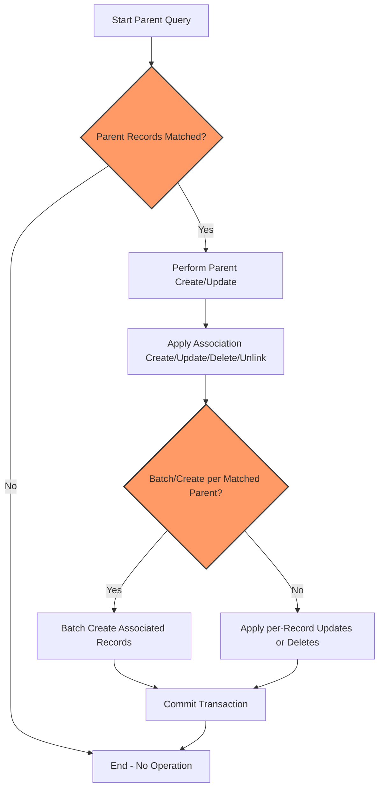

# Working with Associations: Patterns & Best Practices

## Overview
This guide empowers you to confidently manage associations in GORM CLI-generated code. Associations enable linking related records such as users and their pets, languages they speak, or company affiliations. By mastering Create, Update, Unlink, and Delete operations on associations, you will write clear, concise, and type-safe code that mirrors your domain logic while preserving database integrity.

### What This Guide Covers
- Practical patterns for working with different association types
- Parent operation semantics and how association operations run in batch
- Managing polymorphic and many-to-many relationships
- Real-world, actionable examples with expected results
- Troubleshooting and tips for common pitfalls

### Prerequisites
- Basic understanding of GORM models and associations
- Generated field helpers and query APIs from your models
- Familiarity with Go generics and context package
- GORM CLI installed and code generated for your models

### Expected Outcome
After completing this guide, you will be able to:
- Easily create and link records across associated tables
- Update associated records using conditions
- Unlink and delete associations with precise control
- Handle batch operations and complex polymorphic relations

### Time Estimate
Approximately 20-30 minutes to work through examples and integrate into your projects.

### Difficulty Level
Intermediate - Familiarity with Go, GORM, and database relationship concepts assumed.

---

## Understanding Association Helpers in GORM CLI

GORM CLI generates *association field helpers* on your models, exposed as either `Struct[T]` for singular associations (has one, belongs to) or `Slice[T]` for plural associations (has many, many-to-many). These helpers support operations:

- **Create:** Create and associate new records.
- **CreateInBatch:** Batch create multiple new associations.
- **Update:** Update associated records, optionally filtered by conditions.
- **Delete:** Delete associated records (with type-specific semantics).
- **Unlink:** Remove association without deleting records (e.g., clearing foreign keys or join rows).

All operations combine with `Set(...)` and are executed with `.Create(ctx)` or `.Update(ctx)` calls on the parent query.

---

## Core Association Types & Their Semantics

| Association Type | Helper Type     | Unlink Behavior                                        | Delete Behavior                                      |
|------------------|-----------------|-------------------------------------------------------|-----------------------------------------------------|
| Belongs To       | Struct[T]       | Sets parent's foreign key to NULL                      | Deletes the associated record                        |
| Has One / Has Many | Struct[T] or Slice[T] | Sets child's foreign key to NULL                       | Deletes the associated child rows                    |
| Many To Many     | Slice[T]        | Removes join table rows only                            | Removes join table rows only; associated rows kept  |
| Polymorphic      | Struct[T]/Slice[T] | Unlink clears polymorphic foreign keys (owner fields) | Deletes associated polymorphic rows                  |

---

## Step-by-Step: Common Association Operations

<Steps>
<Step title="Creating and Associating New Records">
To create a new associated record for each matched parent, use the `Create` helper.

```go
// Create one pet for a matched user
_, err := gorm.G[User](db).
  Where(generated.User.ID.Eq(userID)).
  Set(
    generated.User.Pets.Create(
      generated.Pet.Name.Set("fido"),
    ),
  ).
  Update(ctx)
if err != nil {
  // handle error
}
```

*Outcome:* One new `Pet` record is created and linked to the matched user.

For batch creation (has-many or many2many), use `CreateInBatch`:

```go
// Batch create multiple languages for user
langs := []Language{{Code: "EN"}, {Code: "FR"}}
_, err = gorm.G[User](db).
  Where(generated.User.ID.Eq(userID)).
  Set(
    generated.User.Languages.CreateInBatch(langs),
  ).
  Update(ctx)
```

*Outcome:* User linked to all new languages in the join table.
</Step>

<Step title="Updating Associated Records with Conditions">
Update can target associated records selectively by chaining a `Where` condition.

```go
// Update pet named "fido" to "rex" for matched user
_, err := gorm.G[User](db).
  Where(generated.User.ID.Eq(userID)).
  Set(
    generated.User.Pets.Where(generated.Pet.Name.Eq("fido")).
      Update(generated.Pet.Name.Set("rex")),
  ).
  Update(ctx)
```

*Outcome:* Only the pet named "fido" associated with the user is renamed "rex".
</Step>

<Step title="Unlinking Associations (Remove Links without Deletion)">
Unlink removes the association link only, preserving related records.

```go
// Unlink all pets for user - clears the foreign key
_, err := gorm.G[User](db).
  Where(generated.User.ID.Eq(userID)).
  Set(generated.User.Pets.Unlink()).
  Update(ctx)
```

*Outcome:* Pets remain but `user_id` foreign key is set to NULL.

For many2many:

```go
// Unlink language "EN" from user (remove join row only)
_, err := gorm.G[User](db).
  Where(generated.User.ID.Eq(userID)).
  Set(generated.User.Languages.Where(generated.Language.Code.Eq("EN")).Unlink()).
  Update(ctx)
```

*Outcome:* Language remains, but the linking join row is removed.
</Step>

<Step title="Deleting Associated Records">
Delete removes the associated rows according to association type.

```go
// Delete pets named "old" belonging to user
_, err := gorm.G[User](db).
  Where(generated.User.ID.Eq(userID)).
  Set(generated.User.Pets.Where(generated.Pet.Name.Eq("old")).Delete()).
  Update(ctx)
```

*Outcome:* Associated pet rows with name "old" are removed from the database.

For many2many, delete removes join rows only; the associated records themselves are not deleted:

```go
// Delete link to language "EN" (join row deleted, language remains)
_, err := gorm.G[User](db).
  Where(generated.User.ID.Eq(userID)).
  Set(generated.User.Languages.Where(generated.Language.Code.Eq("EN")).Delete()).
  Update(ctx)
```
</Step>
</Steps>

---

## Practical Examples

### Create a Has-Many Association

```go
// Create one Pet for user with ID 1
_, err := gorm.G[User](db).
  Where(generated.User.ID.Eq(1)).
  Set(
    generated.User.Pets.Create(
      generated.Pet.Name.Set("polly"),
    ),
  ).
  Update(ctx)
```

### Update with Filter

```go
// Update Account number for user where number='A-001'
_, err := gorm.G[User](db).
  Where(generated.User.ID.Eq(userID)).
  Set(
    generated.User.Account.Where(generated.Account.Number.Eq("A-001")).Update(
      generated.Account.Number.Set("A-002"),
    ),
  ).
  Update(ctx)
```

### Unlink a BelongsTo Association

```go
// Unlink user's company relationship (sets company_id to NULL)
_, err := gorm.G[User](db).
  Where(generated.User.ID.Eq(userID)).
  Set(generated.User.Company.Unlink()).
  Update(ctx)
```

### Many-to-Many: Create and Link Languages

```go
// Link multiple languages using batch create
langs := []Language{{Code: "EN"}, {Code: "FR"}}
_, err := gorm.G[User](db).
  Where(generated.User.ID.Eq(userID)).
  Set(generated.User.Languages.CreateInBatch(langs)).
  Update(ctx)
```

### Polymorphic Association Example (Pet has one Toy)

```go
// Create and link a Toy to a Pet
_, err := gorm.G[Pet](db).
  Where(generated.Pet.ID.Eq(petID)).
  Set(generated.Pet.Toy.Create(generated.Toy.Name.Set("ball"))).
  Update(ctx)

// Unlink Toy from Pet
_, err = gorm.G[Pet](db).
  Where(generated.Pet.ID.Eq(petID)).
  Set(generated.Pet.Toy.Unlink()).
  Update(ctx)
```

---

## Best Practices

- **Always Scope Your Updates:** Use `.Where()` on association helpers when updating, unlinking, or deleting to avoid accidental modification of unintended records.
- **Use CreateInBatch When Adding Multiple Links:** Batch operations are more efficient and maintain transactional consistency.
- **Understand Unlink vs Delete:** Unlink clears links but keeps associated data; Delete removes the associated rows or join rows based on relation type.
- **Use Association Helpers for Type Safety:** Prefer generated helpers to raw SQL or manual GORM calls for clear, maintainable code.
- **Handle Polymorphic Associations Carefully:** Polymorphic unlinking resets identifying foreign keys; ensure you understand the ownership model.

---

## Troubleshooting Common Issues

<AccordionGroup title="Association Operations Troubleshooting">
<Accordion title="Create fails with foreign key constraint error">
- Verify that the parent record exists and the foreign key is valid.
- Ensure you are not creating associations for unmatched parents.
- Confirm that Set(...) includes all required fields for the associated entity.
</Accordion>
<Accordion title="Update does not affect associated records">
- Check your `.Where()` conditions on the association helper; overly restrictive or missing filters can result in zero matched records.
- Validate that the matching parent query scope is correct.
- Confirm the correct usage of generated field helpers for predicates.
</Accordion>
<Accordion title="Unlink leaves foreign keys intact or raises error">
- Verify the association type; Unlink sets FKs to NULL for has/has-many and belongs-to, removes join table rows for many2many.
- For polymorphic relations, Unlink clears owner fields (OwnerID/OwnerType) but does not delete rows.
- Check database permissions and constraints preventing FK updates.
</Accordion>
<Accordion title="Delete removes more rows than expected">
- Always apply conditions with `.Where(...)` on the association helper to limit scope.
- Double-check that delete applies to the intended association.
- Review your GORM CLI-generated helpers for correct linked fields.
</Accordion>
</AccordionGroup>

---

## How Associations Work Under the Hood

1. **Parent Operation Execution:**
   - `.Create(ctx)` inserts new parent rows based on `Set(...)` assignments and then applies association operations.
   - `.Update(ctx)` updates matched parent rows and then applies association operations per matched parent.

2. **Association Operation Application:**
   - For each matched parent record, association helpers perform their operation respecting conditions and assignments.

3. **Batch Handling:**
   - Batch create operations create associated rows/links efficiently for all matched parents.

---

## Visualizing Association Operation Flow



---

## Next Steps & Related Guides

- Explore [Generating Model-driven Field Helpers](/guides/core-workflows/generate-field-helpers) for how to create and extend helpers.
- Dive into [Mastering the SQL Template DSL](/guides/advanced-usage-patterns/template-sql-dsl) to write custom queries that complement associations.
- Use [Validating Generated APIs](/getting-started/first-use-validation/validate-generated-code) to verify your association workflows.
- Learn [Customizing Code Generation](/guides/advanced-usage-patterns/customizing-generation) to adapt association helpers for edge cases.

---

## Summary
This guide detailed practical patterns and best practices for managing associations in your GORM CLI-generated code. By leveraging the generated field helpers, you achieve clear, type-safe database operations for creating, updating, unlinking, and deleting related records. Understanding the semantics by association type and how parent and association operations intertwine is critical for writing robust, maintainable Go database code.

For comprehensive examples and further clarification, refer to the `examples/output/models_relations_test.go` in the official repository.

---

## Reference Code Examples

```go
// Create a new Pet and associate with user
_, err := gorm.G[User](db).
  Where(generated.User.ID.Eq(1)).
  Set(
    generated.User.Pets.Create(generated.Pet.Name.Set("fido")),
  ).
  Update(ctx)

// Update associated Account record
_, err = gorm.G[User](db).
  Where(generated.User.ID.Eq(2)).
  Set(
    generated.User.Account.Where(generated.Account.Number.Eq("A-001")).Update(
      generated.Account.Number.Set("A-002"),
    ),
  ).
  Update(ctx)

// Unlink pets (set foreign keys NULL)
_, err = gorm.G[User](db).
  Where(generated.User.ID.Eq(1)).
  Set(
    generated.User.Pets.Unlink(),
  ).
  Update(ctx)

// Delete languages associations (remove join rows only)
_, err = gorm.G[User](db).
  Where(generated.User.ID.Eq(2)).
  Set(
    generated.User.Languages.Where(generated.Language.Code.Eq("EN")).Delete(),
  ).
  Update(ctx)
```

---

For more association examples, see the [examples/output/models_relations_test.go](https://github.com/go-gorm/cli/blob/main/examples/output/models_relations_test.go) file.

<Check>
Association operations are powerful but require precise use of filters and awareness of the relation type. Always test updates in a safe environment and leverage type-safe generated helpers for maximum reliability.
</Check>
