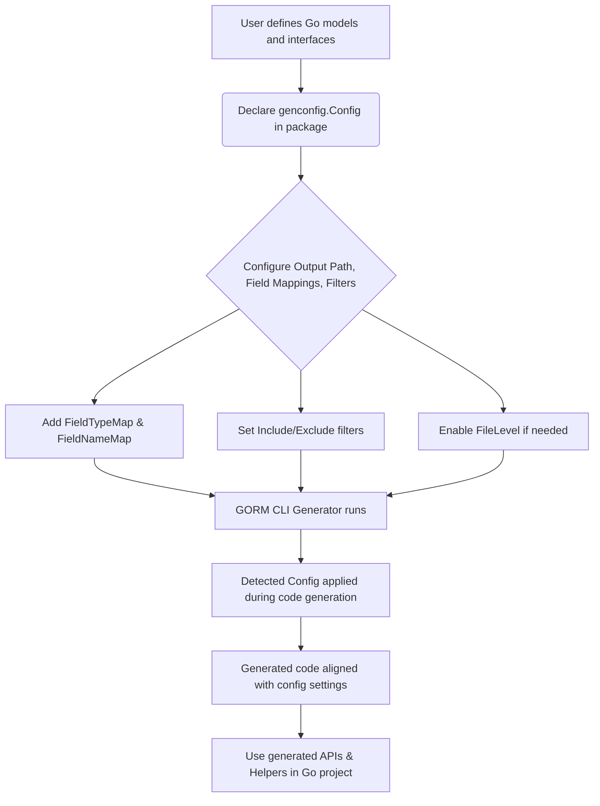

# Custom Field Helpers & Generator Configuration

This guide empowers you to tailor the GORM CLI code generation process precisely to your project's needs. Here, you will learn how to configure generation behavior, map custom field types—including JSON fields—and leverage the powerful, flexible `genconfig.Config` system. Mastering these configurations ensures the generated code aligns seamlessly with your models, database schema, and project conventions.

---

## 1. Understanding genconfig.Config

At the heart of customizing code generation lies the `genconfig.Config` struct, which you declare as a **package-level variable** in the same package as your models or query interfaces. The generator automatically detects and applies this configuration during code generation.

### Key Configuration Areas:

- **Output Path (`OutPath`)**: Customize where generated code files are written.
- **Field Type Mappings (`FieldTypeMap`)**: Map Go types to specific field helpers to control how fields are wrapped.
- **Field Name Mappings (`FieldNameMap`)**: Override field helper types based on struct tags.
- **Filtering (`IncludeInterfaces`, `ExcludeInterfaces`, `IncludeStructs`, `ExcludeStructs`)**: Control which interfaces and structs the generator processes.
- **File Level Scope (`FileLevel`)**: Restrict configuration to individual files versus entire packages.

<Callout>
Note: `FieldNameMap` takes precedence over `FieldTypeMap` when both can apply, allowing fine-grained control based on field tags.
</Callout>

### Example Config Declaration

```go
package examples

import (
    "database/sql"
    "gorm.io/cli/gorm/field"
    "gorm.io/cli/gorm/genconfig"
)

var _ = genconfig.Config{
    // Customize output directory for generated files
    OutPath: "examples/output",

    // Map Go types to custom field helpers
    FieldTypeMap: map[any]any{
        sql.NullTime{}: field.Time{},
    },

    // Map struct field tags (e.g., `gen:"json"`) to custom helpers
    FieldNameMap: map[string]any{
        "date": field.Time{},
        "json": JSON{}, // Custom JSON helper (explained below)
    },

    // Optional filtering
    IncludeInterfaces: []any{"Query*"},
    ExcludeInterfaces: []any{"*Deprecated*"},
    IncludeStructs:    []any{"User", "Account*"},
    ExcludeStructs:    []any{"*DTO"},

    // Apply config to the whole package (false) or just files that declare it (true)
    FileLevel: false,
}
```

---

## 2. Configuring Output Location

By setting the `OutPath` field, you control the output directory for all generated files from that package. This is useful for:

- Keeping generated code separate from handwritten code.
- Organizing outputs when generating from multiple packages.

```go
var _ = genconfig.Config{
    OutPath: "examples/output",
}
```

**After generation**, look for your generated models and query APIs inside `examples/output`.

---

## 3. Mapping Custom Field Types

### Why Map Field Types?

The generator turns each Go struct field into a strongly typed **field helper** that supports fluent queries and updates. By default, basic types like `int`, `string`, `bool`, and `time.Time` get mapped to standard helpers (`field.Number`, `field.String`, etc.).

If your project uses special types (e.g., `sql.NullTime`) or you want custom behavior for certain fields (e.g., JSON columns), you must map those Go types to a corresponding field helper.

### How to Map a Field Type

`FieldTypeMap` is a map from a Go **type instance** (not a type name string) to a **field helper instance**.

Example:

```go
FieldTypeMap: map[any]any{
    sql.NullTime{}: field.Time{},
},
```

This tells the generator that whenever it encounters a field of type `sql.NullTime`, it should generate a `field.Time` helper for it.

### Mapping by Field Name Tag

Alternatively, you can map *field helper types* by struct tag values using `FieldNameMap`. This is very useful for overriding behavior for specific fields, especially with generic Go types:

```go
FieldNameMap: map[string]any{
    "json": JSON{},  // Any field tagged with `gen:"json"` uses the JSON helper
    "date": field.Time{},
},
```

You apply the tag on your struct fields like so:

```go
type User struct {
    Profile string `gen:"json"`
}
```

This enables per-field control beyond the Go type alone.

---

## 4. Declaring and Using a Custom JSON Field Helper

Sometimes you want specialized queries for JSON columns. GORM CLI allows you to define custom field helpers and map them via `FieldNameMap` for full flexibility.

### Step-by-Step to Configure a JSON Helper

0. **Declare `genconfig.Config` to map the `json` tag**

```go
package examples

import "gorm.io/cli/gorm/genconfig"

var _ = genconfig.Config{
    OutPath: "examples/output",
    FieldNameMap: map[string]any{
        "json": JSON{},
    },
}
```

1. **Add the `gen:"json"` tag to your model field**

```go
package models

type User struct {
    // ... other fields ...
    Profile string `gen:"json"`
}
```

2. **Define the JSON field helper with SQL-aware methods**

```go
// JSON is a field helper for JSON columns that generates SQL code adapting to the database dialect.
type JSON struct{ column clause.Column }

func (j JSON) WithColumn(name string) JSON {
    c := j.column
    c.Name = name
    return JSON{column: c}
}

// Equal builds a JSON containment or equality expression using database-specific syntax.
func (j JSON) Equal(path string, value any) clause.Expression {
    return jsonEqualExpr{col: j.column, path: path, val: value}
}

type jsonEqualExpr struct {
    col  clause.Column
    path string
    val  any
}

func (e jsonEqualExpr) Build(builder clause.Builder) {
    if stmt, ok := builder.(*gorm.Statement); ok {
        switch stmt.Dialector.Name() {
        case "mysql":
            v, _ := json.Marshal(e.val)
            clause.Expr{SQL: "JSON_EXTRACT(?, ?) = CAST(? AS JSON)", Vars: []any{e.col, e.path, string(v)}}.Build(builder)
        case "sqlite":
            clause.Expr{SQL: "json_valid(?) AND json_extract(?, ?) = ?", Vars: []any{e.col, e.col, e.path, e.val}}.Build(builder)
        default: // e.g. Postgres
            clause.Expr{SQL: "jsonb_extract_path_text(?, ?) = ?", Vars: []any{e.col, e.path[2:], e.val}}.Build(builder)
        }
    }
}
```

3. **Use your JSON field helper in queries**

```go
// Queries the database, generating appropriate JSON extraction SQL per dialect
got, err := gorm.G[models.User](db).
    Where(generated.User.Profile.Equal("$.vip", true)).
    Take(ctx)
```

This generates SQL like:

- MySQL: `JSON_EXTRACT(`profile`, "$.vip") = CAST("true" AS JSON)`
- SQLite: `json_valid(`profile`) AND json_extract(`profile`, "$.vip") = 1`
- Postgres: `jsonb_extract_path_text(`profile`, 'vip') = 'true'`

<Check>
Using custom field helpers with `genconfig.Config` lets you seamlessly expand GORM CLI's generated query capabilities to your specialized database column types.
</Check>

---

## 5. Filtering Interfaces and Structs

Fine-grained control over which interfaces and structs get processed by GORM CLI is essential for large or legacy codebases.

### Filtering Options

- **`IncludeInterfaces`**: Whitelist of interface names or type selectors to generate APIs for. If specified, *only* these interfaces are processed.

- **`ExcludeInterfaces`**: Blacklist of interface names or type selectors to skip.

- **`IncludeStructs`**: Whitelist of struct names or types to generate field helpers for.

- **`ExcludeStructs`**: Blacklist of struct names or types to skip.

### Supported Selectors

- Shell-style patterns: e.g., `Query*`, `*Repo`, `models.User`
- Type-converted literals: e.g., `models.Query(nil)`, `models.User{}`

### Example: Only generate interfaces starting with `Query`, exclude deprecated ones

```go
var _ = genconfig.Config{
    IncludeInterfaces: []any{"Query*"},
    ExcludeInterfaces: []any{"*Deprecated*"},
}
```

### Example: Include specific structs only

```go
var _ = genconfig.Config{
    IncludeStructs: []any{"User", "Account*"},
    ExcludeStructs: []any{"*DTO"},
}
```

<Warning>
If `Include*` fields are non-empty, the corresponding `Exclude*` fields are ignored for that kind.
</Warning>

---

## 6. Using FileLevel Mode

By default, `genconfig.Config` applies to all files within the same package.

If you set `FileLevel: true`, the configuration is applied only to the file where it is declared. This is useful when different files or submodules within the same package require distinct generation behavior.

```go
var _ = genconfig.Config{
    FileLevel: true,
    // other settings...
}
```

---

## 7. Practical Example: Full Configuration for JSON Fields and Filtering

```go
package examples

import (
    "database/sql"
    "gorm.io/cli/gorm/field"
    "gorm.io/cli/gorm/genconfig"
)

var _ = genconfig.Config{
    OutPath: "examples/output",
    FieldTypeMap: map[any]any{
        sql.NullTime{}: field.Time{},
    },
    FieldNameMap: map[string]any{
        "date":  field.Time{},
        "json":  JSON{},
    },
    IncludeInterfaces: []any{"Query*"},
    ExcludeInterfaces: []any{"*Deprecated*"},
    IncludeStructs:    []any{"User", "Account*"},
    ExcludeStructs:    []any{"*DTO"},
    FileLevel:         false,
}
```

---

## 8. Troubleshooting Tips

- **Custom field helpers not applied?**
  - Verify your `genconfig.Config` declaration is in the same package as your models or interfaces.
  - Check that you are using the exact struct tag names declared in `FieldNameMap`.
  - Confirm your custom helper implements the necessary methods and imports.

- **Generation output path incorrect?**
  - Double-check the `OutPath` in your config is valid and writable.
  - Remember `-o` flag in CLI can override this; ensure no conflict.

- **Interfaces or structs unexpectedly missing?**
  - Confirm your inclusion/exclusion filters.
  - Use exact names or patterns; case sensitivity matters.

- **JSON helper SQL incompatible with your DB?**
  - Adjust the SQL generation logic within your custom helper's `Build` method.
  - Test generated queries directly in your database.

---

## 9. Next Steps & Related Documentation

- **Defining Query Interfaces & Models**: Start by defining your interfaces with SQL templates and models properly before configuring generation.
  - /guides/getting-started-workflows/defining-interfaces-models

- **Generating and Using Type-Safe APIs**: Learn the full code generation and usage workflow.
  - /guides/getting-started-workflows/generating-using-apis

- **Working with Associations**: Configure and use association helpers alongside field and query helpers.
  - /guides/advanced-usage-patterns/working-with-associations

- **Template-Based Queries & SQL DSL**: For advanced SQL templating and dynamic queries.
  - /guides/advanced-usage-patterns/template-based-queries

- **Integration into Go Projects**: How to import and leverage your generated helpers.
  - /getting-started/configure-and-generate/project-integration

<Check>
Mastering `genconfig.Config` is essential to align GORM CLI code generation with your project's nuances, enabling effective type-safe data access and mutation with tailored helpers.
</Check>

---

# Summary Diagram of Configuration Flow



---

<Callout>
By applying this guide, you will gain confidence and control over your generated GORM CLI code to suit sophisticated project requirements, especially when working with custom types and complex struct tagging schemes.
</Callout>