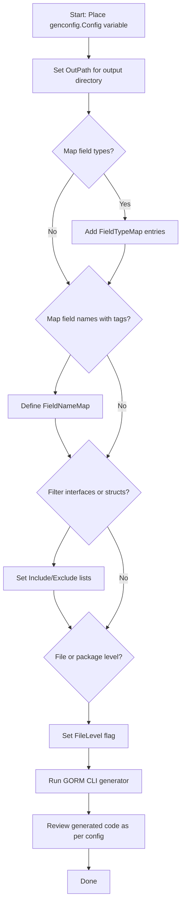

# Configuring Generation with genconfig.Config

## Overview

This guide helps you master the comprehensive customization options available via the package-level `genconfig.Config` object in GORM CLI. Here you will learn how to control output paths, selectively include or exclude interfaces and structs, map custom Go types and struct tag names to specific generated field helpers, and apply file-level overrides. The guide includes practical, real-world examples to empower tailored code generation workflows that precisely fit your project’s needs.

---

## 1. Workflow Overview

### What This Page Helps You Achieve

- Understand how to declare and use `genconfig.Config` to customize code generation
- Control where generated files are placed via output path overrides
- Whitelist or blacklist specific interfaces and structs using include/exclude filters
- Map Go native types or struct tag names to custom field helper types
- Apply configuration selectively at package or file level for granular control

### Prerequisites

- Familiarity with basic GORM CLI usage and code generation workflow
- Defined Go model structs and query interfaces in your project
- Installed GORM CLI tool

### Expected Outcome

After following this guide, you will be able to customize GORM CLI’s generation process to:

- Generate code only for selected interfaces or structs
- Override default field helpers with mappings to custom or standard wrappers
- Specify output directories per package or file
- Apply configuration selectively or globally

### Time Estimate

10–20 minutes to configure and validate your initial `genconfig.Config` setup

### Difficulty Level

Intermediate (requires understanding Go types, struct tags, and code generation concepts)

---

## 2. Configuring Your Generation: Step-by-Step

### Step 1: Declare a Package-Level `genconfig.Config`

Place a `var _ = genconfig.Config{...}` declaration at the package level in a `.go` source file that the generator will process.

```go
package yourpackage

import (
    "gorm.io/cli/gorm/genconfig"
    "gorm.io/cli/gorm/field"
    "database/sql"
)

var _ = genconfig.Config{
    // configuration options here
}
```

**Outcome:** GORM CLI automatically picks up this variable when generating code for this package.

---

### Step 2: Override Output Directory (`OutPath`)

Set `OutPath` to control where generated files will be placed for the current package or file.

```go
var _ = genconfig.Config{
    OutPath: "generated/models",
}
```

- This is useful for organizing output separate from source files.
- If multiple configs are found, the most specific applies (file-level overrides package-level).

---

### Step 3: Map Go Types to Custom Field Helper Types (`FieldTypeMap`)

You can specify explicit mappings from Go native or third-party types to desired GORM CLI field wrapper types. This ensures generated field helpers use your custom wrappers.

Example: map `sql.NullTime{}` to `field.Time{}`

```go
var _ = genconfig.Config{
    FieldTypeMap: map[any]any{
        sql.NullTime{}: field.Time{},
    },
}
```

- The keys are Go type instances (used here for import resolution).
- The values are wrapper instances from packages like `field` or your own custom helpers.
- Take care to import required packages to avoid compilation errors.

---

### Step 4: Map Struct Tag Names to Field Helpers (`FieldNameMap`)

This powerful option lets you assign a specific field helper by matching struct `gen` tags in your model.

Example: fields tagged with `gen:"json"` use a custom `JSON{}` field helper

```go
var _ = genconfig.Config{
    FieldNameMap: map[string]any{
        "json": JSON{}, // custom JSON field helper
    },
}
```

In your model:

```go
package models

type User struct {
   Profile string `gen:"json"`
}
```

**Result:** The generator uses the `JSON` helper methods for the `Profile` field.

---

### Step 5: Filter Interfaces and Structs to Generate

Use Include or Exclude filters to limit generated code for interfaces and structs based on names and patterns.

#### Include Interfaces

Generate only interfaces matching these selectors (patterns or type conversions):

```go
IncludeInterfaces: []any{"Query*", models.Query(nil)},
```

#### Exclude Interfaces

Exclude interfaces matching:

```go
ExcludeInterfaces: []any{"*Deprecated*"},
```

#### Include Structs

Generate structs whose name matches patterns or type literals:

```go
IncludeStructs: []any{"User", "Account*", models.User{}},
```

#### Exclude Structs

Exclude matching structs:

```go
ExcludeStructs: []any{"*DTO"},
```

Notes:

- If Include lists are non-empty, only those are generated, and Exclude lists are ignored.
- Matchers support shell-style wildcard patterns.
- Pattern matching is done fully qualified, e.g., `pkg.User`.

---

### Step 6: Selective Application with File-Level Overrides (`FileLevel`)

By default, configs apply to the whole package directory subtree (`FileLevel: false`). To limit application to only the current file, set:

```go
FileLevel: true,
```

This allows finer granularity when multiple configs coexist within the same package tree.

---

### Step 7: Validate and Run

Once your config is set, run the generator as usual:

```bash
gorM gen -i ./path/to/interfaces -o ./output/path
```

The generator applies your configuration automatically.

Check generated files to verify only expected interfaces and structs are included, output paths align with `OutPath`, and field types reflect your mappings.

---

## 3. Practical Examples

### Example 1: Whitelist Two Interfaces and One Struct

```go
package whitelist

import (
    "gorm.io/cli/gorm/genconfig"
)

var _ = genconfig.Config{
    IncludeInterfaces: []any{"I1"},
    IncludeStructs:    []any{"S1"},
}
```

### Example 2: Exclude Deprecated Interfaces Globally

```go
package pattern

import "gorm.io/cli/gorm/genconfig"

var _ = genconfig.Config{
    ExcludeInterfaces: []any{"*Deprecated*"},
}
```

### Example 3: Field Type Mapping and Output Override

```go
package examples

import (
    "database/sql"
    "gorm.io/cli/gorm/genconfig"
    "gorm.io/cli/gorm/field"
)

var _ = genconfig.Config{
    OutPath: "examples/generated",
    FieldTypeMap: map[any]any{
        sql.NullTime{}: field.Time{},
    },
    FieldNameMap: map[string]any{
        "json": JSON{},
    },
}
```

### Example 4: Two-Level Config Filtering

Root package excludes some nested interfaces and structs:

```go
package twolevel

import (
    s "gorm.io/cli/gorm/examples/filters/twolevel/nested"
    "gorm.io/cli/gorm/genconfig"
)

var _ = genconfig.Config{
    ExcludeInterfaces: []any{s.I2[any](nil), I3[any](nil)},
    ExcludeStructs:    []any{s.S2{}, S3{}},
}
```

Nested subpackage further restricts:

```go
package nested

import "gorm.io/cli/gorm/genconfig"

var _ = genconfig.Config{
    FileLevel:         false,
    ExcludeInterfaces: []any{"I3"},
    ExcludeStructs:    []any{"S3"},
}
```

---

## 4. Troubleshooting and Tips

<AccordionGroup title="Common Issues and Solutions">
<Accordion title="My config isn't applied as expected">
Verify the config variable is declared at the package level and included in a file scanned by the generator. File-level configs with `FileLevel: true` apply only to the file declaring them.
</Accordion>
<Accordion title="Filtered interfaces or structs still appear in output">
Check your Include and Exclude lists – if Include is non-empty, Exclude is ignored. Make sure patterns match full qualified names or use type literal form correctly.
</Accordion>
<Accordion title="FieldTypeMap or FieldNameMap mappings don't apply">
Confirm you have imported the necessary packages for both keys and values in your config. Use type instances (e.g., `sql.NullTime{}`) and wrapper instances (`field.Time{}`) precisely.
</Accordion>
<Accordion title="Generated output not in desired directory">
Use the `OutPath` field to set the output directory per package or file. Ensure you use consistent relative paths.
</Accordion>
<Accordion title="Multiple configs causing conflicts">
If multiple `genconfig.Config` declarations exist in overlapping directories, the most specific applicable config is chosen. Use `FileLevel: true` for file-scoped configs where needed.
</Accordion>
</AccordionGroup>

<Tip>
Remember that `FieldNameMap` takes priority over `FieldTypeMap` when both apply to the same field.
</Tip>

---

## 5. Next Steps & Related Information

- After configuring generation, proceed to the [Quickstart Workflow](/overview/feature-highlights-getting-started/quickstart-workflow) to apply your configuration in a real project.
- Explore the [Using and Defining Custom Field Helpers (JSON Fields Example)](/guides/advanced-usage/custom-field-helpers) to create advanced field mappings.
- Deepen your understanding of SQL Template DSL in the [Template DSL Cookbook](/guides/advanced-usage/template-dsl-cookbook).
- Cross-reference the [Core Concepts and Terminology](/overview/system-architecture-concepts/core-concepts-terminology) for a comprehensive understanding of generated APIs.

---

## Summary Diagram



---

# References
- [genconfig.Config Documentation](https://pkg.go.dev/gorm.io/cli/gorm/genconfig#Config)
- Example configurations: [examples/filters/whitelist/config.go](https://github.com/go-gorm/cli/blob/main/examples/filters/whitelist/config.go)
- JSON Field Mapping Example in [README.md](https://github.com/go-gorm/cli/blob/main/README.md#json-field-mapping-example)

---

Your customizations in `genconfig.Config` unleash the full power of GORM CLI to generate exactly what your project requires, cutting complexity and ensuring maintainable, type-safe database interactions.