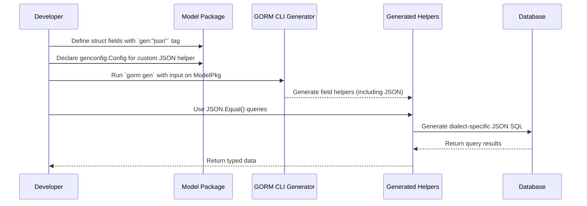

# Using and Defining Custom Field Helpers (JSON Fields Example)

## Overview

This guide walks you through the process of defining and using custom field helpers in your GORM CLI-generated code, focusing on JSON columns as a practical example. You will learn how to:

- Create a custom field helper for JSON columns that adapts to different database dialects
- Configure your package to recognize this custom field helper
- Use the custom helper in your query code with full type safety and expressive query building

This approach enhances your application by enabling database-specific JSON queries in a type-safe and maintainable manner.

---

## 1. Workflow Overview

### What You Will Accomplish
- Define a custom `JSON` field helper to support different SQL JSON querying functions per database
- Configure the generation to use this helper for JSON-typed fields using `genconfig.Config`
- Use generated helpers to build JSON queries safely and idiomatically in Go

### Prerequisites
- Familiarity with GORM CLI code generation and generated field helpers
- Basic understanding of your database’s JSON functions (e.g., MySQL’s JSON_EXTRACT, SQLite JSON1)
- Model structs and query interfaces defined in your project

### Expected Outcome
After completing this guide, your project will generate field helpers that support JSON column queries tailored to your database dialect. Your queries will be type-safe, readable, and maintainable.

### Time Estimate
About 15-30 minutes, depending on familiarity with GORM CLI and your project setup.

### Difficulty Level
Intermediate — requires understanding of code generation configuration and GORM query construction

---

## 2. Step-by-Step Instructions

### Step 1: Define the Custom JSON Field Helper

Create a new type in your project representing the JSON field helper with methods to generate dialect-specific SQL expressions.

```go
package examples

import (
	"database/sql"
	"encoding/json"
	"gorm.io/gorm"
	"gorm.io/gorm/clause"
)

// JSON is a field helper for JSON columns that generates different SQL expressions depending on the database dialect.
type JSON struct {
	column clause.Column
}

// WithColumn returns a copy of the JSON helper bound to a specific column name
func (j JSON) WithColumn(name string) JSON {
	c := j.column
	c.Name = name
	return JSON{column: c}
}

// Equal generates a SQL expression for JSON equality that varies by database dialect
func (j JSON) Equal(path string, value any) clause.Expression {
	return jsonEqualExpr{col: j.column, path: path, val: value}
}

type jsonEqualExpr struct {
	col  clause.Column
	path string
	val  any
}

func (e jsonEqualExpr) Build(builder clause.Builder) {
	// Access the current statement to check the Dialector in use
	if stmt, ok := builder.(*gorm.Statement); ok {
		switch stmt.Dialector.Name() {
		case "mysql":
			// MySQL JSON_EXTRACT(column, path) = CAST(value AS JSON)
			v, _ := json.Marshal(e.val)
			clause.Expr{SQL: "JSON_EXTRACT(?, ?) = CAST(? AS JSON)", Vars: []any{e.col, e.path, string(v)}}.Build(builder)

		case "sqlite":
			// SQLite json_valid(column) AND json_extract(column, path) = value
			clause.Expr{SQL: "json_valid(?) AND json_extract(?, ?) = ?", Vars: []any{e.col, e.col, e.path, e.val}}.Build(builder)

		default:
			// For PostgreSQL and others: jsonb_extract_path_text(column, path) = value
			// Strip leading $. from path if any
			exprPath := e.path
			if len(exprPath) > 0 && exprPath[0] == '$' {
				exprPath = exprPath[1:]
			}
			clause.Expr{SQL: "jsonb_extract_path_text(?, ?) = ?", Vars: []any{e.col, exprPath, e.val}}.Build(builder)
		}
	} else {
		// Fallback SQL using JSON_EXTRACT
		clause.Expr{SQL: "JSON_EXTRACT(?, ?) = ?", Vars: []any{e.col, e.path, e.val}}.Build(builder)
	}
}
```

This helper encapsulates JSON query logic, adapting the SQL expression based on the current database driver.

---

### Step 2: Configure Code Generation to Use the Custom Helper

Create or update a `genconfig.Config` variable in the same Go package that contains your models and query interfaces:

```go
package examples

import (
	"database/sql"
	"gorm.io/cli/gorm/field"
	"gorm.io/cli/gorm/genconfig"
)

var _ = genconfig.Config{
	OutPath: "examples/output",
	FieldNameMap: map[string]any{
		"json": JSON{},  // Map fields tagged `gen:"json"` to the custom JSON field helper
	},
	FieldTypeMap: map[any]any{
		sql.NullTime{}: field.Time{},  // Example type mapping you might have
	},
	IncludeStructs: []any{},
}
```

This tells the generator to produce the custom `JSON` field helper for any struct field tagged `gen:"json"`.

---

### Step 3: Tag Your Model Fields to Use the JSON Helper

In your model struct, tag JSON fields with the `gen:"json"` tag.

```go
package models

type User struct {
	ID      uint
	Name    string
	Profile string `gen:"json"`  // Use custom JSON field helper
}
```

This marks the `Profile` field to be generated with your custom `JSON` field helper.

---

### Step 4: Generate Your Code

Assuming your model and interface are ready and include the configuration above, run the generator:

```bash
gorm gen -i ./examples -o ./examples/output
```

This command will generate field helpers in `examples/output/models` that include your `JSON` helper for the `Profile` column.

---

### Step 5: Use the Custom Field Helper in Queries

With generated helpers, build JSON queries safely:

```go
import (
	"context"
	"gorm.io/gorm"
	generated "gorm.io/cli/gorm/examples/output/models"
	"gorm.io/gorm/clause"
)

func FindVipUsers(ctx context.Context, db *gorm.DB) ([]models.User, error) {
	return generated.G[models.User](db).
		Where(generated.User.Profile.Equal("$.vip", true)).
		Find(ctx)
}
```

This code dynamically generates SQL according to your database dialect, for example:

- MySQL: `JSON_EXTRACT(profile, "$.vip") = CAST(true AS JSON)`
- SQLite: `json_valid(profile) AND json_extract(profile, "$.vip") = 1`
- PostgreSQL: `jsonb_extract_path_text(profile, "vip") = true`

Assuring that your JSON filtering queries are correct without manual SQL writing.

---

## 3. Practical Tips & Best Practices

- Always tag your JSON-related struct fields with `gen:"json"` in your models to trigger usage of the custom helper.
- Ensure your database supports the JSON functions; extend the helper if your dialect requires specialized behavior.
- Test generated queries against your actual database during development, especially for JSON paths.
- Keep your mapping config in the same package as your models for automatic discovery and consistency.
- If you support multiple databases in one project, the helper logic ensures the correct dialect SQL, but verify edge cases.

---

## 4. Troubleshooting & Common Pitfalls

<Accordion title="Generated Code Fails to Recognize Custom Helper">
Ensure your `genconfig.Config` variable is declared at package level in the same package as your models. The generator discovers it via reflection and applies your mappings automatically.
</Accordion>

<Accordion title="JSON Path Queries Return No Results or Errors">
Check the path format; the default expects JSON path expressions starting with '$'. Depending on your dialect, you might need to adjust the path or extend the helper to accept different formats.
</Accordion>

<Accordion title="Database Does Not Support JSON Functions">
Confirm your database version supports the JSON functions used. For example, SQLite needs the JSON1 extension. If unsupported, adjust your queries or fallback logic accordingly.
</Accordion>

---

## 5. Next Steps & Related Content

- **Using Generated Field Helpers for Filtering and Updates**: Delve deeper into using generated helpers for other data types and predicates.
- **Defining Query Interfaces & SQL Templates**: Learn how to write your SQL-template interfaces that trigger code generation.
- **Configuring Generation with genconfig.Config**: Explore advanced configuration to customize your generation process.
- **Working with Associations: Create, Update, Unlink, Delete**: Understand how generated code helps manage associations efficiently.

You can find these sections under the Guides tab, especially:

- [Using Generated Field Helpers for Filtering and Updates](https://docs.gorm.io/guides/core-workflows/using-generated-field-helpers.html)
- [Defining Query Interfaces and SQL Templates](https://docs.gorm.io/guides/core-workflows/query-apis-and-templates.html)
- [Configuring Generation with genconfig.Config](https://docs.gorm.io/guides/advanced-usage/configuring-generation.html)

---

### Summary Diagram of the Custom Field Helper Workflow



---

## Summary

Through creating a custom JSON field helper and configuring the generator properly, you enhance GORM CLI to support sophisticated, database-aware JSON queries with type safety and ease of use. This unlocks powerful querying capabilities for applications relying on JSON columns in modern SQL databases.

---

## References

- See the [GORM CLI README JSON Example](https://github.com/go-gorm/cli/blob/main/README.md#json-field-mapping-example) for a complete conceptual overview.
- Review the [Model-Driven Field Helpers](https://docs.gorm.io/concepts/data-models-schemas/model-driven-field-helpers.html) for understanding the generated helpers as a whole.
- Explore the [Configuring Generation](https://docs.gorm.io/guides/advanced-usage/configuring-generation.html) page for advanced customization.
