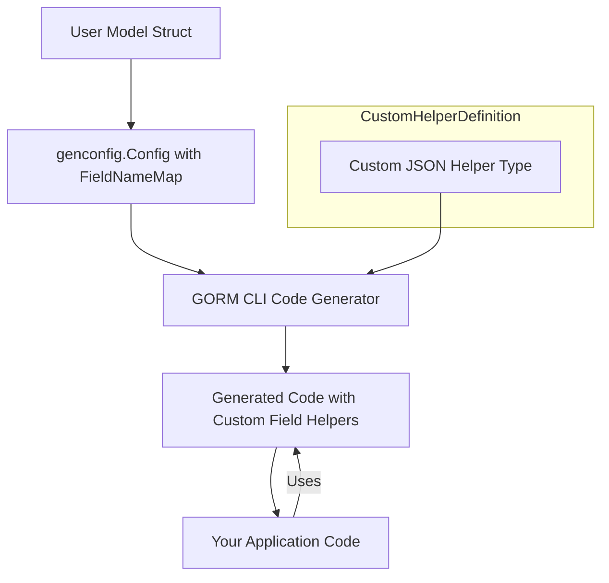

# Building and Integrating Custom Field Helpers

Extend your GORM CLI workflow by designing and registering custom field helpers, such as JSON column support. This guide walks through the process of mapping fields by tag, implementing custom helpers, and using them in queries—illustrated with real-world code.

---

## 1. Understanding Custom Field Helpers

GORM CLI generates model-driven field helpers automatically for common Go types. However, many applications require custom logic—such as JSON column support or other database-specific operations—to be integrated seamlessly into query conditions and update statements.

This guide helps you:

- Map model struct fields based on custom tags to your helper implementations.
- Implement custom field helper types with specific SQL behaviors.
- Use these helpers fluently in generated queries.

By achieving this, you enhance GORM CLI's value with tailored, type-safe database operations.

---

## 2. Prerequisites

Before proceeding, ensure you have:

- GORM CLI installed and configured in your Go project.
- Basic familiarity with using GORM CLI-generated query APIs and field helpers.
- A Go model with fields tagged for custom helper mapping.
- Basic knowledge of Go interfaces and structs.

If you need setup assistance, see the [Getting Started guides](/guides/getting-started/installation-and-setup) and [Writing Interfaces & Models](/getting-started/first-run-generation/configuration-basics).

---

## 3. Workflow Overview

### 3.1 What You Will Achieve

- Define a custom field helper type (e.g., `JSON`) with database-specific SQL generation.
- Configure GORM CLI to map struct fields tagged `gen:"json"` to your custom helper.
- Use the generated helper methods in type-safe query conditions.

### 3.2 Time Estimate

Approximately 20–30 minutes to implement, configure, and test.

### 3.3 Difficulty Level

Intermediate: requires coding a custom helper and basic SQL function knowledge.

---

## 4. Step-by-Step Instructions

### Step 1: Declare Your Custom Field Helper Type

Create a Go type (e.g., `JSON`) that implements the field helper pattern by embedding a `clause.Column` and exposing methods to build expressions reflecting your database's JSON query syntax.

```go
// JSON is a custom field helper for JSON columns.
type JSON struct { column clause.Column }

func (j JSON) WithColumn(name string) JSON {
    c := j.column
    c.Name = name
    return JSON{column: c}
}

// Equal builds a JSON-aware comparison expression for querying JSON paths.
func (j JSON) Equal(path string, value any) clause.Expression {
    return jsonEqualExpr{col: j.column, path: path, val: value}
}

// jsonEqualExpr generates SQL expressions depending on the database dialect.
type jsonEqualExpr struct {
    col  clause.Column
    path string
    val  any
}

func (e jsonEqualExpr) Build(builder clause.Builder) {
    if stmt, ok := builder.(*gorm.Statement); ok {
        switch stmt.Dialector.Name() {
        case "mysql":
            v, _ := json.Marshal(e.val)
            clause.Expr{SQL: "JSON_EXTRACT(?, ?) = CAST(? AS JSON)", Vars: []any{e.col, e.path, string(v)}}.Build(builder)
        case "sqlite":
            clause.Expr{SQL: "json_valid(?) AND json_extract(?, ?) = ?", Vars: []any{e.col, e.col, e.path, e.val}}.Build(builder)
        default: // postgres and others
            clause.Expr{SQL: "jsonb_extract_path_text(?, ?) = ?", Vars: []any{e.col, e.path[2:], e.val}}.Build(builder)
        }
    }
}
```

These methods enable GORM CLI to generate SQL that respects the differences in JSON handling across databases.

---

### Step 2: Map the Custom Helper to Your Field via Configuration

In your package, declare a `genconfig.Config` variable that maps field tags to your custom helper. For instance, map the `json` tag to your `JSON` helper type.

```go
package examples

import (
    "gorm.io/cli/gorm/genconfig"
)

var _ = genconfig.Config{
    OutPath: "examples/output",
    FieldNameMap: map[string]any{
        "json": JSON{}, // map all fields tagged with `gen:"json"` to the JSON helper
    },
}
```

This instructs the generator to recognize model fields tagged `gen:"json"` and generate code using your custom field helper.

---

### Step 3: Tag Your Model Fields

Add the tag `gen:"json"` to the relevant fields in your Go struct model.

```go
package models

type User struct {
    // ... other fields ...

    // Profile is stored as a JSON column
    Profile string `gen:"json"`
}
```

The generator maps `Profile` to use your `JSON` helper.

---

### Step 4: Generate Code with GORM CLI

Run the CLI with your interface and model files as inputs, specifying the output directory.

```bash
gorm gen -i ./examples -o ./generated
```

The generated code will expose `generated.User.Profile` as a `JSON` helper with your custom methods.

---

### Step 5: Use Your Custom Field Helper in Queries

Now you can write queries using the generated helpers and your custom methods.

```go
// Query users where the profile JSON path $.vip equals true
user, err := gorm.G[models.User](db).
    Where(generated.User.Profile.Equal("$.vip", true)).
    Take(ctx)

if err != nil {
    // handle error
}

fmt.Println(user)
```

This will generate different SQL depending on the connected database, utilizing your custom helper’s database-aware JSON expressions.

---

## 5. Best Practices and Tips

- **Prioritize Clear Mapping**: Use the `genconfig.Config` with `FieldNameMap` to map custom tags explicitly, ensuring generator consistency.
- **Implement Database Awareness**: Tailor your helper methods to output database-specific SQL expressions for portability.
- **Test Queries Thoroughly**: Run queries against each supported database dialect to ensure SQL correctness.
- **Keep Helpers Lightweight**: Focus your helper logic on SQL expression generation; delegate JSON marshaling/unmarshaling to your application code.
- **Leverage Existing Helpers**: Review GORM CLI’s built-in helpers like `field.Time` or `field.String` for design inspiration.

---

## 6. Troubleshooting Common Issues

<AccordionGroup title="Troubleshooting Custom Field Helpers">
<Accordion title="My custom helper’s SQL doesn’t generate correctly in some databases">
Ensure your Build method properly switches on `stmt.Dialector.Name()` and implements appropriate syntax per database. Validate escaping and parameter binding.
</Accordion>
<Accordion title="Fields are not using my custom helper after generation">
Verify your `genconfig.Config` declares the `FieldNameMap` mapping correctly, that your struct fields have the matching `gen` tag, and re-run code generation.
</Accordion>
<Accordion title="I get build errors referencing my custom helper type">
Make sure your helper struct and methods are in a package imported by your model or query package and the generator can resolve import paths.
</Accordion>
<Accordion title="Code generation output directory is unexpected">
Check your `OutPath` setting in `genconfig.Config` and the CLI --output parameter, which can override it.
</Accordion>
</AccordionGroup>

---

## 7. Next Steps & Related Content

- Explore [Customizing Code Generation with genconfig](/guides/advanced-usage/generation-configuration) for advanced mapping and filtering techniques.
- Learn about [Template-Based SQL for Complex Queries](/guides/advanced-usage/template-based-sql) to write expressive query interfaces leveraging custom helpers.
- Use [Using Model-Driven Field Helpers](/guides/core-workflows/field-helper-usage) to deepen your understanding of built-in field helpers alongside your custom ones.
- Check [Generating Code](/getting-started/first-run-generation/generating-code) for in-depth CLI usage and options.

---

## 8. Summary Diagram



This flow shows how your custom helper and configuration feed into the code generator to produce type-safe helpers used by your code.

---

By following these steps, you seamlessly extend GORM CLI’s power with your tailored field helpers for complex, real-world database interactions.


---

## Appendix: Complete JSON Field Helper Example

```go
package examples

import (
    "encoding/json"
    "gorm.io/gorm"
    "gorm.io/gorm/clause"
)

type JSON struct { column clause.Column }

func (j JSON) WithColumn(name string) JSON {
    c := j.column
    c.Name = name
    return JSON{column: c}
}

func (j JSON) Equal(path string, value any) clause.Expression {
    return jsonEqualExpr{col: j.column, path: path, val: value}
}

type jsonEqualExpr struct {
    col  clause.Column
    path string
    val  any
}

func (e jsonEqualExpr) Build(builder clause.Builder) {
    if stmt, ok := builder.(*gorm.Statement); ok {
        switch stmt.Dialector.Name() {
        case "mysql":
            v, _ := json.Marshal(e.val)
            clause.Expr{SQL: "JSON_EXTRACT(?, ?) = CAST(? AS JSON)", Vars: []any{e.col, e.path, string(v)}}.Build(builder)
        case "sqlite":
            clause.Expr{SQL: "json_valid(?) AND json_extract(?, ?) = ?", Vars: []any{e.col, e.col, e.path, e.val}}.Build(builder)
        default:
            clause.Expr{SQL: "jsonb_extract_path_text(?, ?) = ?", Vars: []any{e.col, e.path[2:], e.val}}.Build(builder)
        }
    }
}
```


---

# Reference

- [GORM CLI README](https://github.com/go-gorm/cli/blob/main/README.md#json-field-mapping-example)
- [genconfig.Config API](https://github.com/go-gorm/cli/blob/main/genconfig/config.go)
- [Using Generated Code](https://gorm.io/cli/docs/getting-started/first-run-generation/first-usage)


