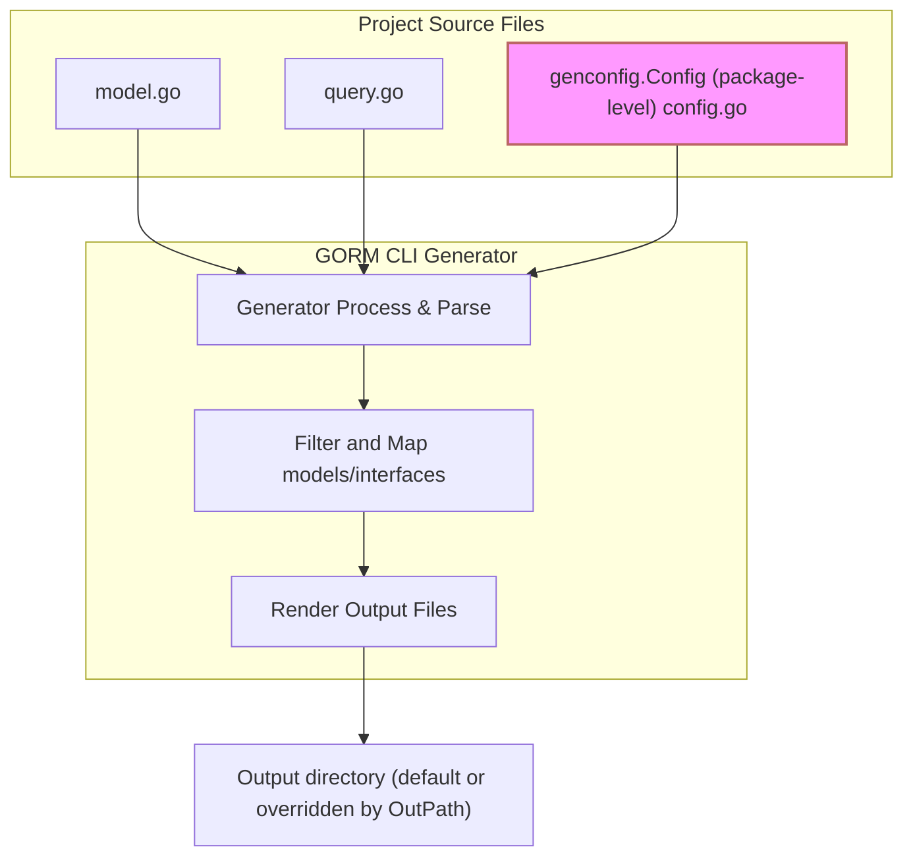

# Customizing Generation with genconfig


## Overview

This guide teaches you how to control and extend the code generation process of GORM CLI using **package-level configuration files** via the `genconfig.Config` object. By applying these configurations in your Go source package, you can:

- Specify **which models and interfaces** to include or exclude during generation
- Customize the **output directory structure** per package
- Map **custom field helpers** to Go types or struct tags for handling advanced scenarios

Mastering these configurations enables precise customization of your generated code, empowering you to maintain a clean, efficient, and tailored API surface for your application.

---

## 1. What is genconfig.Config?

The `genconfig.Config` struct is a **per-package** generator configuration type. When declared at the package level in your Go source files, the GORM CLI code generator automatically detects it and applies its settings during generation for that package.

```go
package examples

import (
    "database/sql"
    "gorm.io/cli/gorm/field"
    "gorm.io/cli/gorm/genconfig"
)

var _ = genconfig.Config{
    OutPath:       "examples/output",
    FieldTypeMap:  map[any]any{ sql.NullTime{}: field.Time{} },
    FieldNameMap:  map[string]any{"date": field.Time{}},
    IncludeInterfaces: []any{"Query*"},
    ExcludeStructs:    []any{"*DTO"},
}
```

### Key Configurable Properties

| Property            | Description                                                                                         |
|---------------------|-------------------------------------------------------------------------------------------------|
| `OutPath`           | Overrides the CLI `-o` output directory for generated files in this package or directory.         |
| `FieldTypeMap`      | Maps specific Go type instances to custom field helpers for enhanced predicate generation.        |
| `FieldNameMap`      | Maps struct tag names (e.g., `gen:"json"`) to custom field helpers for expressive SQL generation.|
| `FileLevel`         | When `true`, config applies only to the single file it's declared in; otherwise, applies to whole package/directory.|  
| `IncludeInterfaces` | Whitelist of interfaces to generate; supports shell patterns or type conversion forms for precise control.     |
| `ExcludeInterfaces` | Blacklist for interfaces to skip; applied after `IncludeInterfaces`.                             |
| `IncludeStructs`    | Whitelist of struct types to generate field helpers for.                                         |
| `ExcludeStructs`    | Blacklist of structs to exclude, applied after `IncludeStructs`.                                |

---

## 2. Common Usage Patterns

### a) Overriding Output Path Per Package

If you want to output generated code to a subdirectory different from the CLI flag `-o`, declare `OutPath` in a package-level config.

```go
var _ = genconfig.Config{
    OutPath: "examples/output",
}
```

This is useful when generating code for multiple packages with different output folders.

### b) Custom Field Helper Mappings

Map specific Go types to existing or custom field helpers to extend generated predicates and setters.

```go
var _ = genconfig.Config{
    FieldTypeMap: map[any]any{
        sql.NullTime{}: field.Time{},      // map sql.NullTime to field.Time helpers
    },
    FieldNameMap: map[string]any{
        "date": field.Time{},             // map fields tagged with `gen:"date"` to Time helper
        "json": JSON{},                   // tag-based mapping to custom JSON helper
    },
}
```

This lets you handle complex types correctly, customize SQL generation for JSON columns, timestamps, or other special fields.

### c) Interface and Struct Whitelisting/Blacklisting

Use include/exclude lists to precisely manage the scope of generation.

#### Example: Include only interfaces beginning with `Query` and exclude deprecated ones.
```go
var _ = genconfig.Config{
    IncludeInterfaces: []any{"Query*"},
    ExcludeInterfaces: []any{"*Deprecated*"},
}
```

#### Example: Include specific struct types like `User` and all with prefix `Account`, excluding DTO structs.
```go
var _ = genconfig.Config{
    IncludeStructs: []any{"User", "Account*"},
    ExcludeStructs: []any{"*DTO"},
}
```

These filters use shell-style (wildcard) pattern matching, and can also accept type literals to precisely target generation.

### d) File-Level Configurations

Set `FileLevel: true` if you want the config to apply only to the file it is declared in, instead of the entire package.

```go
var _ = genconfig.Config{
    FileLevel: true,
    IncludeInterfaces: []any{"Query*"},
}
```

This is valuable in monolithic packages to isolate generation behavior per file.

---

## 3. Declaring genconfig.Config: Step-by-Step

<Steps>
<Step title="Step 1: Create or Choose a Package">
Determine where you want the configuration to apply (a package or specific file directory).
</Step>
<Step title="Step 2: Import Required Packages">
Include `gorm.io/cli/gorm/genconfig` and any field helper packages used in your mappings.

```go
import (
    "gorm.io/cli/gorm/genconfig"
    "gorm.io/cli/gorm/field"
    "database/sql"
)
```
</Step>
<Step title="Step 3: Declare the Config Variable">
At package level, declare a variable using the blank identifier `_` to ensure it gets evaluated.

```go
var _ = genconfig.Config{
    OutPath: "examples/output",
    // ... other settings
}
```
</Step>
<Step title="Step 4: Customize as Needed">
Add fields such as `FieldTypeMap`, `IncludeInterfaces`, and others according to your requirements.
</Step>
</Steps>

---

## 4. Practical Examples

### Example 1: Minimal Config With Custom Output Path

```go
package examples

import "gorm.io/cli/gorm/genconfig"

var _ = genconfig.Config{
    OutPath: "examples/generated",
}
```

Generates code into `examples/generated` directory overriding the CLI default.

### Example 2: Mapping JSON Field Helper by Tag

```go
package examples

import (
    "gorm.io/cli/gorm/genconfig"
)

var _ = genconfig.Config{
    FieldNameMap: map[string]any{
        "json": JSON{},
    },
}
```

Use `gen:"json"` tag in your structs to enable JSON-specific SQL operations.

### Example 3: Filter Interfaces and Structures

```go
package filters

import "gorm.io/cli/gorm/genconfig"

var _ = genconfig.Config{
    IncludeInterfaces: []any{"I*"},
    ExcludeInterfaces: []any{"IDeprecated*"},
    IncludeStructs: []any{"User", "Account*"},
    ExcludeStructs: []any{"*DTO"},
}
```

This will generate code only for interfaces starting with 'I' except deprecated ones, and structs named `User` or starting with `Account`, skipping DTOs.

### Example 4: File-Level Configuration for Nested Directory

```go
package nested

import "gorm.io/cli/gorm/genconfig"

var _ = genconfig.Config{
    FileLevel: true,
    ExcludeInterfaces: []any{"I3"},
    ExcludeStructs:    []any{"S3"},
}
```

Only exclude `I3` and `S3` in this file; others remain unaffected elsewhere.

---

## 5. How genconfig.Config Fits In Your Workflow



Your custom configuration acts as an input influencing which interfaces and structs get code generated, how fields map to helpers, and where the files get written.

---

## 6. Troubleshooting & Best Practices

<AccordionGroup title="Common Issues and Solutions">
<Accordion title="My configuration doesn't seem to apply">
Ensure your `genconfig.Config` declaration:
- Is declared at package level (not inside functions).
- Uses the blank identifier (`var _ = genconfig.Config{}`) so the generator detects it.
- Is in the same package directory or a parent directory of your models/interfaces.
Check your CLI invocation `-i` flag covers this package.
</Accordion>
<Accordion title="Custom field helpers are not recognized correctly">
Verify:
- Your `FieldTypeMap` key is an instantiated type value (e.g., `sql.NullTime{}`), not a type name string.
- Your custom helper type implements the field helper interface expected.
- Import statements bring required packages into scope.
</Accordion>
<Accordion title="Interface/Struct filtering is not behaving as expected">
Remember:
- `Include*` filters have higher precedence than `Exclude*`.
- Use shell-style wildcard patterns correctly (`*` for any sequence).
- Fully qualified names include package prefixes, e.g., `models.User`.
</Accordion>
</AccordionGroup>

<Tip>
For large projects, organize multiple `genconfig.Config` files in different directories with tailored settings and use `FileLevel` mode for fine-grained control.
</Tip>

---

## 7. Next Steps & Further Reading

- Explore the [Getting Started Guides](/guides/getting-started) to see configuration in the context of your first generation workflow.
- Deepen your understanding with [Working with Field Helpers and Predicates](/guides/core-workflows/field-helpers-and-predicates) for designing custom helpers.
- Check out [Handling JSON Columns and Custom Helpers](/guides/advanced-usage/working-with-json-fields) for practical implementation of JSON and other advanced types.
- Review architectural insights in [Generation Architecture Overview](/gorm-cli-concepts/core-architecture/generation-architecture) to understand how configuration affects processing.

Use these resources to build a full mastery of GORM CLI’s powerful, extensible generation capabilities!

---

For official source and contribution, visit the GORM CLI repository:
[https://github.com/go-gorm/cli](https://github.com/go-gorm/cli)


---

## References

- [`genconfig.Config` Go source](https://github.com/go-gorm/cli/blob/main/genconfig/config.go)
- Example package configuration:
  - [examples/query.go](https://github.com/go-gorm/cli/blob/main/examples/query.go)
  - [examples/filters/whitelist/config.go](https://github.com/go-gorm/cli/blob/main/examples/filters/whitelist/config.go)
  - [examples/filters/twolevel/nested/config.go](https://github.com/go-gorm/cli/blob/main/examples/filters/twolevel/nested/config.go)


---

*Documentation generated from GORM CLI official references and source.*
