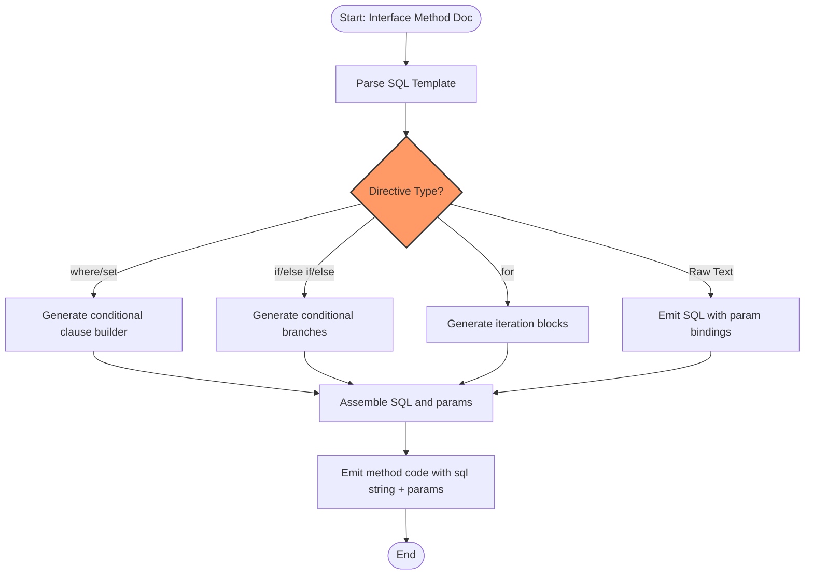

# SQL Template DSL Cookbook

Your practical reference for the GORM CLI SQL templating DSL. Explore key directives, control flow, dynamic columns, parameter bindings, and how to compose advanced queries using templated interfaces.

---

## 1. Introduction to SQL Template DSL

GORM CLI extends Go interfaces with embedded SQL template comments to generate type-safe queries seamlessly integrated with your models.

This DSL ($"Domain-Specific Language") allows you to write raw SQL snippets combined with Go-style conditional and iterative code, turning your interface methods into powerful, maintainable queries.

### Why use SQL Template DSL?

- Write expressive, dynamic SQL with complex conditions without losing static type safety.
- Use familiar Go syntax constructs (e.g., `if`, `for`) to compose conditional query parts.
- Automatically bind Go method parameters to SQL placeholders.
- Produce clean, readable, reusable query code backed by the type-safe generated API.

---

## 2. Core Directives & Syntax Overview

The DSL uses marked comment blocks and template directives inside interface method comments.

| Directive  | Purpose                                   | Example                                         |
| ---------- | ----------------------------------------- | ----------------------------------------------- |
| `@@table`  | Resolves to the table name of the model   | `SELECT * FROM @@table WHERE id=@id`           |
| `@@column` | Binds variable column names dynamically   | `WHERE @@column=@value`                         |
| `@param`   | Binds Go method parameters by name        | `WHERE name=@user.Name`                         |
| `{{where}}`| Wraps dynamic WHERE clauses conditionally | See Section 5                                   |
| `{{set}}`  | Wraps dynamic SET clauses for UPDATE      | See Section 6                                   |
| `{{if}}`   | Conditional SQL fragments                   | Used to include parts only when conditions met |
| `{{else if}}` / `{{else}}` | Control branches for conditionals    | For multi-branch logic inside templates          |
| `{{for}}`  | Iterates over collections                   | Dynamically build repeating SQL blocks           |
| `{{end}}`  | Ends control blocks                         | Ends `if`, `for`, `where`, `set` blocks          |

---

## 3. Binding Query Parameters

- Parameters prefixed with `@` map automatically to the named parameters in your method signature or fields of struct parameters.
- Escape `@` in literals with a backslash, e.g., `\@name` to avoid binding.
- Dynamic columns (`@@column`) allow flexible SQL column names to be set at runtime but should be used wisely to avoid SQL injection risks.


## 4. Writing Basic Queries

```go
// Interface example
// SELECT * FROM @@table WHERE id=@id
GetByID(id int) (T, error)
```

Generated Go code will bind `id` as a parameter and replace `@@table` with the table name inferred from the model.

### Example Usage

```go
user, err := generated.Query[User](db).GetByID(ctx, 123)
```

---

## 5. Dynamic WHERE Clauses with `{{where}}`

Use `{{where}}` block to conditionally include WHERE clauses, trimming unwanted leading/trailing conjunctions.

```go
// SELECT * FROM @@table
// {{where}}
//   {{if user.Name != ""}} name=@user.Name {{end}}
//   {{if user.Age > 0}} AND age=@user.Age {{end}}
// {{end}}
FilterByUser(user User) ([]T, error)
```

This compiles to SQL filtering only on the set fields.

### Behavior

- The combined WHERE conditions are trimmed for extra AND/OR connectors.
- Only non-empty conditions included.

---

## 6. Dynamic SET Clauses with `{{set}}`

Compose dynamic UPDATE set parts that respect conditional field inclusion.

```go
// UPDATE @@table
// {{set}}
//   {{if user.Name != ""}} name=@user.Name, {{end}}
//   {{if user.Age > 0}} age=@user.Age, {{end}}
//   {{if user.Age >= 18}} is_adult=1 {{else}} is_adult=0 {{end}}
// {{end}}
// WHERE id=@id
UpdateUser(user User, id int) error
```

### Key Points

- Commas and spaces are automatically trimmed off the final constructed SET clause.
- Conditional expressions allow complex logic to decide what fields update.

---

## 7. Conditional Logic: `{{if}}`, `{{else if}}`, `{{else}}`

You can compose expressive conditional logic inside your SQL templates:

```go
// SELECT * FROM users
// {{where}}
//   {{if user.ID > 0}}
//     id=@user.ID
//   {{else if user.Name != ""}}
//     name=@user.Name
//   {{else}}
//     status = "active"
//   {{end}}
// {{end}}
QueryWith(user User) (T, error)
```

This lets you dynamically select which filter applies based on input.

---

## 8. Iteration with `{{for}}`

Dynamic lists can be processed using `{{for}}`, useful for building OR clauses or multi-values.

```go
// SELECT * FROM @@table
// {{where}}
//   {{for _, user := range users}}
//     {{if user.Name != "" && user.Age > 0}}
//       (name=@user.Name AND age=@user.Age) OR
//     {{end}}
//   {{end}}
// {{end}}
FilterUsers(users []User) ([]T, error)
```

This produces a SQL condition grouping filters for each user in the slice.

---

## 9. Dynamic Columns with `@@column`

In some queries, column names need to be dynamic:

```go
// SELECT * FROM @@table WHERE @@column=@value
FilterWithColumn(column string, value string) (T, error)
```

At runtime, the column string is substituted safely as a SQL identifier.

> **Warning:** Avoid accepting raw user input here without verification to prevent SQL injection.

---

## 10. Escaping and Literal SQL

- To write a literal `@` sign (not a parameter), use `\@`.
- Regular SQL syntax works; only template directives enclosed in `{{}}` or placeholders with `@` are special.

---

## 11. Comprehensive Example

```go
// Define interface with templated SQL
// SELECT * FROM @@table
// {{where}}
//   {{if filter.Name != ""}} name LIKE concat("%",@filter.Name,"%") {{end}}
//   {{if filter.MinAge > 0}} AND age >= @filter.MinAge {{end}}
//   {{if filter.MaxAge > 0}} AND age <= @filter.MaxAge {{end}}
// {{end}}
SearchUsers(filter UserFilter) ([]T, error)
```

This query dynamically activates the filters set in the `UserFilter` struct.

---

## 12. Troubleshooting

<AccordionGroup title="Common Issues and Resolutions">
<Accordion title="Template Parsing Errors">
Check for missing or mismatched `{{end}}` tags.
Ensure directives (`{{if}}`, `{{for}}`, `{{where}}`, `{{set}}`) are properly closed.
</Accordion>
<Accordion title="Parameter Binding Failures">
Verify parameter names in SQL templates match method signature exactly.
Escape `@` when needed.
Ensure no Go variable used in template is nil unless handled.
</Accordion>
<Accordion title="Improper Generated SQL Syntax">
Make sure conjunction keywords (AND/OR) are used consistently.
Use `{{where}}` to handle trimming of leading/trailing conjunctions.
</Accordion>
</AccordionGroup>

---

## 13. Best Practices

- Use `{{where}}` and `{{set}}` blocks to keep your SQL clean and avoid syntax issues.
- Prefer strongly-typed parameters that map directly to struct fields.
- Avoid dynamic columns unless absolutely necessary and sanitize inputs.
- Leverage `{{if}}` and `{{for}}` for complex and iterative logic.
- Test generated queries with representative data.

---

## 14. Next Steps & Related Documentation

- Explore [Defining Query Interfaces & SQL Templates](https://docs.gorm.io/guides/core-workflows/query-apis-and-templates.html) for deeper interface design guidance.
- Learn how to use [Generated Field Helpers for Filtering and Updates](https://docs.gorm.io/guides/core-workflows/using-generated-field-helpers.html) to complement your template queries.
- Customize generation via [Configuring Generation with genconfig.Config](https://docs.gorm.io/guides/advanced-usage/configuring-generation.html).
- Master managing associations in [Working With Associations](https://docs.gorm.io/guides/core-workflows/associations-best-practices.html).

---

## 15. Visual Workflow of SQL Template Processing



This flow shows how the SQL template is parsed and transformed into Go code fragments that build SQL plus parameters dynamically at runtime.

---

## Summary
This cookbook equips you with actionable, pattern-based knowledge to write efficient, dynamic SQL templates using GORM CLI. With hands-on directives, control flows, and binding rules, you can craft powerful database query methods that remain type-safe and easy to maintain.

Apply these patterns confidently in your Go project to leverage the full power of GORM CLI's SQL templating capabilities.

---